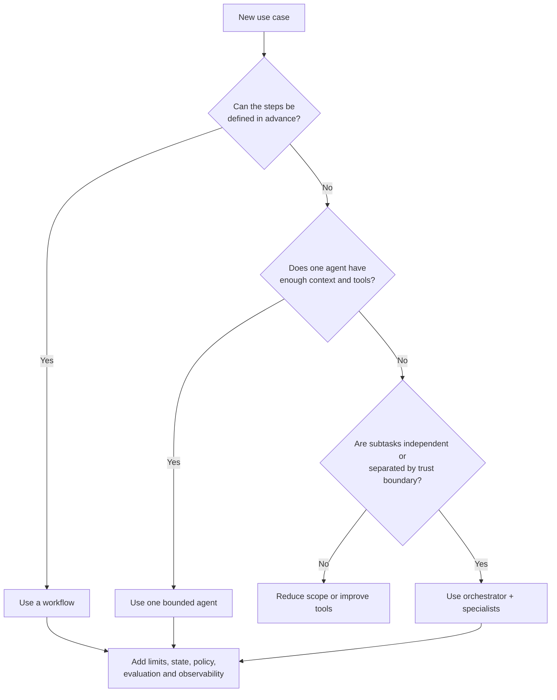

# Part A — What an agent is

Index: [Full Read-Through](01-full-read-through.md) · Next: [Part B — The agent loop and control plane](01b-part-b-agent-loop-and-control-plane.md) →

**Steps in this file**

- [Step 1 · What makes an AI system truly agentic](01a-part-a-what-an-agent-is.md#1-read-what-makes-an-ai-system-truly-agentic)
- [Step 2 · When is an agentic architecture the wrong solution](01a-part-a-what-an-agent-is.md#2-read-when-is-an-agentic-architecture-the-wrong-solution)
- [Step 3 · Choose workflows before agents](01a-part-a-what-an-agent-is.md#3-read-choose-workflows-before-agents)
- [Step 4 · Workflow, single agent, or multi-agent decision](01a-part-a-what-an-agent-is.md#4-study-the-diagram-workflow-single-agent-or-multi-agent-decision-redraw-it-from-memory)
- [Step 5 · Essential components of an agent beyond an LLM](01a-part-a-what-an-agent-is.md#5-read-essential-components-of-an-agent-beyond-an-llm)

---

## 1. Read: What makes an AI system truly agentic

*Source: agentic-ai-system-design-interview-guide-2026.md*

> **Why this step is here.** Everything in Parts A to F depends on a shared definition of "agent", and most interview answers go wrong because the candidate uses the word loosely. This step gives you a three-part test you can apply to any system, and a list of things that look agentic but are not. Read it for the three properties, then try each of the four "not agentic" examples against them and confirm which property each one lacks. Steps [2](01a-part-a-what-an-agent-is.md#2-read-when-is-an-agentic-architecture-the-wrong-solution) to [4](01a-part-a-what-an-agent-is.md#4-study-the-diagram-workflow-single-agent-or-multi-agent-decision-redraw-it-from-memory) use this definition to decide when *not* to build an agent.

### Step 1 · 1. What makes an AI system truly agentic, and what does not qualify?

Three properties: goal-directed autonomy (given an objective, picks its own path), environmental interaction (observe → act → adapt via feedback), and temporal extension (goals persist across steps). Not agentic: RAG pipelines, single-turn function calling, hardcoded workflow automation, personality chatbots. Key nuance — agency is a *spectrum*, and where you place a system on it is a design choice.

#### Going deeper (Step 1)

**The three properties, unpacked.**

- *Goal-directed autonomy* means the system is given an objective, not a procedure. A support bot told "resolve this refund request" and left to decide whether to look up the order, check the policy, or ask the customer a question is exercising autonomy. A bot that always runs "lookup → policy check → reply" is not, even if a model writes the reply.
- *Environmental interaction* is the observe → act → adapt loop. The system takes an action, sees the result, and that result changes what it does next. A tool call whose output is thrown away, or that only ever feeds a fixed next step, does not count. The test is: could step three be different depending on what step two returned?
- *Temporal extension* means the goal outlives a single model call. The system carries state across steps and remembers what it was trying to do. A single prompt that calls one function and returns has no time dimension; a loop that keeps a history and re-plans does.

**Why the four "not agentic" examples fail the test.** A RAG pipeline (retrieve → stuff into prompt → answer) has a fixed path, so no autonomy. Single-turn function calling has interaction but no temporal extension: it acts once and stops. Hardcoded workflow automation may run for hours, but every branch was written by a human, so there is no autonomy. A personality chatbot converses across turns but never acts on an environment, so there is no interaction loop. Each fails on a different property, which is why the three-part test is more useful than a gut feel.

**Agency is a spectrum, and you choose the point.** The same refund task can be built as a state machine with a model writing text at two nodes (low agency), a bounded loop that picks from five tools with a step cap (medium), or an open loop with shell access (high). None is "correct". The interview signal is that you name where you are placing the system and why. Typical framing: "I am giving the model autonomy over *which* of these five tools to call and in what order, but not over *whether* to refund; that decision stays in deterministic policy."

**Common misreading.** People hear "agent" and think "uses tools" or "calls an LLM in a loop". Tool use is necessary but not sufficient; a cron job that calls an LLM is a loop with no autonomy. The opposite error is thinking anything with a for-loop and a model is dangerous and must be gated like a fully autonomous system. Use the three properties to say precisely which kind of system you have.

**Connects to.** [Step 2 · When is an agentic architecture the wrong solution](01a-part-a-what-an-agent-is.md#2-read-when-is-an-agentic-architecture-the-wrong-solution) lists the situations where you should refuse to build an agent even though you could. [Step 3 · Choose workflows before agents](01a-part-a-what-an-agent-is.md#3-read-choose-workflows-before-agents) gives Anthropic's workflow-vs-agent split, which is this definition applied to control flow. [Step 5 · Essential components of an agent beyond an LLM](01a-part-a-what-an-agent-is.md#5-read-essential-components-of-an-agent-beyond-an-llm) lists the components that make the "spectrum" adjustable in practice.

**Check yourself.**
1. A nightly job asks a model to classify 10,000 tickets, then writes results to a table. Which property does it lack? *Autonomy and interaction: the path is fixed and the output does not change the next action.*
2. A coding assistant runs the tests, reads the failure, edits the file, and repeats until green with a cap of 10 tries. Agentic? *Yes on all three: it chooses edits, adapts to test output, and the goal persists across iterations.*
3. Why does calling agency a spectrum help you in a design interview? *It lets you state exactly which decisions the model owns and which stay deterministic, which is the decision interviewers are probing.*

---

## 2. Read: When is an agentic architecture the wrong solution

*Source: agentic-ai-system-design-interview-guide-2026.md*

> **Why this step is here.** [Step 1 · What makes an AI system truly agentic](01a-part-a-what-an-agent-is.md#1-read-what-makes-an-ai-system-truly-agentic) told you what an agent is; this step tells you when to refuse to build one, which is the answer interviewers most want to hear from a candidate who could build one. It gives five disqualifying conditions and one red flag. Read it as a checklist you run *before* any design: for each condition, ask what the conventional alternative is and why it wins. Steps [3](01a-part-a-what-an-agent-is.md#3-read-choose-workflows-before-agents) and [4](01a-part-a-what-an-agent-is.md#4-study-the-diagram-workflow-single-agent-or-multi-agent-decision-redraw-it-from-memory) turn this checklist into a decision procedure, and Steps [77](01m-part-g1-fde-interview-knowledge.md#77-read-the-fde-lens-the-one-difference-between-an-engineers-answer-and-an-fdes) and [80](01m-part-g1-fde-interview-knowledge.md#80-read-the-eight-decisions-they-will-probe-write-one-sentence-of-your-own-for-each) expect you to apply it to a customer's actual process in the FDE round.

### Step 2 · 2. When is an agentic architecture the wrong solution?

Use conventional software when the task is a drawable flowchart (use Temporal / Airflow / a state machine), when failures are irreversible and catastrophic, when latency SLAs are tight (each reasoning hop is ~1–3s), when accuracy must be 100%, or when "done" can't be defined. Red flag: choosing agents because they're exciting.

#### Going deeper (Step 2)

**The five conditions, one by one.**

- *The task is a drawable flowchart.* If you can sit with a domain expert and draw every branch on a whiteboard, the path is known. An agent would spend tokens rediscovering it on every run and would sometimes discover it wrong. Encode it in a workflow engine (Temporal, Airflow, Step Functions) or a plain state machine, and let a model fill in the steps that need language: summarize this document, draft this email, extract these fields. A claims pipeline with six policy states is the canonical example.
- *Failures are irreversible and catastrophic.* Wire transfers, production deletes, outbound customer emails, medication orders. An agent's error rate on a multi-step task compounds: at 95% per step, ten steps gives roughly a 60% chance of at least one mistake (typical illustration, not a benchmark). If one mistake cannot be undone, you either take the model out of the decision or put a human approval gate in front of it (Steps [50](01h-part-e2-long-running-agents.md#50-study-the-diagram-human-approval-for-consequential-actions) and [51](01h-part-e2-long-running-agents.md#51-read-human-in-the-loop-controls)).
- *Latency SLAs are tight.* Each reasoning hop is a model call, typically 1 to 3 seconds, sometimes more with large contexts. A five-hop agent is 5 to 15 seconds before any tool time. If the product needs a 500 ms response, no amount of prompt engineering fixes that; you need a precomputed or deterministic path.
- *Accuracy must be 100%.* Models are probabilistic. If the requirement is "never wrong" (tax calculation, regulatory reporting), the model may propose but a deterministic system must compute and verify. This is a stronger version of the "irreversible" condition: even reversible errors are unacceptable.
- *"Done" cannot be defined.* An agent loop needs a termination test ([Step 9 · Termination conditions](01b-part-b-agent-loop-and-control-plane.md#9-read-termination-conditions)). If nobody can say what a finished result looks like, the loop either runs until a cap or stops on the model's own say-so. Both are bad. Push back on the requirement until "done" is observable.

**The red flag.** "Because agents are exciting" shows up in disguise: "the customer asked for an agent", "leadership wants AI", "it would be more flexible". None of these is a task property. The FDE version of the correction is to ask discovery questions until you find the actual task shape, then match the architecture to it.

**A reasonable counterview.** Sometimes an agent is the fastest way to *discover* the flowchart: run it in a sandbox on real cases, watch the traces, then freeze the common paths into a workflow. That is a legitimate use of an agent as a prototyping tool, not as the production system.

**Common misreading.** Candidates treat this as "agents bad, workflows good" and then cannot explain when an agent *is* right. The correction: the five conditions are about task properties (known path, irreversibility, latency, exactness, undefined completion). When none apply, meaning the path is genuinely uncertain, mistakes are recoverable, latency is tolerant, and completion is checkable, an agent is the right tool and you should say so with the same confidence.

**Connects to.** [Step 3 · Choose workflows before agents](01a-part-a-what-an-agent-is.md#3-read-choose-workflows-before-agents) gives Anthropic's framing of the same rule and the sentence to say in interviews. [Step 4 · Workflow, single agent, or multi-agent decision](01a-part-a-what-an-agent-is.md#4-study-the-diagram-workflow-single-agent-or-multi-agent-decision-redraw-it-from-memory) is the decision tree that operationalizes it. [Step 74 · Tradeoffs most teams get wrong](01k-part-f3-production-operations.md#74-read-tradeoffs-most-teams-get-wrong) (tradeoffs teams get wrong) revisits the red flag from the other direction.

**Check yourself.**
1. A customer wants an agent to reconcile invoices against purchase orders with a fixed matching rule set. Which condition applies? *Drawable flowchart; use a workflow with a model only for fuzzy field extraction.*
2. Why does a 1 to 3 second hop matter more for agents than for a single LLM call? *Hops multiply: an agent takes several hops per task, so latency compounds while a single call does not.*
3. Your stakeholder says "we need it to be flexible". Is that a reason to build an agent? *Not by itself; ask what varies between runs. If the variation is enumerable, a workflow with branches is flexible enough.*

---

## 3. Read: Choose workflows before agents

*Source: anthropic-agent-systems-fde-notes-2025-present.md*

> **Why this step is here.** [Step 2 · When is an agentic architecture the wrong solution](01a-part-a-what-an-agent-is.md#2-read-when-is-an-agentic-architecture-the-wrong-solution) gave you reasons to avoid agents; this step gives you the vocabulary Anthropic uses for the alternative, which is the vocabulary most interviewers now use too. It defines "workflow" versus "agent" by who owns control flow, names five composable workflow patterns, and hands you one sentence to say in the room. Read it for the definition first, then make sure you can describe each of the five patterns in one line, because [Step 4 · Workflow, single agent, or multi-agent decision](01a-part-a-what-an-agent-is.md#4-study-the-diagram-workflow-single-agent-or-multi-agent-decision-redraw-it-from-memory) asks you to choose among them and Steps [41](01g-part-e1-multi-agent-coordination.md#41-read-when-multi-agent-beats-single-agent) to [45](01g-part-e1-multi-agent-coordination.md#45-study-the-diagram-multi-agent-execution-sequence) build the orchestrator-worker one out in full.

### Step 3 · 3.1 Choose workflows before agents

Anthropic's late-2024 foundation, repeatedly referenced in its 2025–2026 engineering posts, distinguishes:

- **Workflow:** LLMs and tools follow a predefined control path.
- **Agent:** the model dynamically decides how to use tools and directs its own process.

The practical rule is to begin with the least complex design that meets the requirement. Routing, prompt chaining, parallelization, orchestrator-worker, and evaluator-optimizer are composable patterns; a fully autonomous loop is not the starting point.

**FDE implication:** ask whether the customer's process is genuinely open-ended. A fixed claims process with six policy states is probably a state machine with model-powered steps. Open-ended incident investigation may justify an agent.

**Interview line:** “I would earn autonomy with task uncertainty. If I can draw the path reliably, I will encode it rather than pay an LLM to rediscover it on every run.”

Source: [Building effective agents](https://www.anthropic.com/research/building-effective-agents).

#### Going deeper (Step 3)

**The distinction is about who owns control flow.** In a workflow, a human wrote the graph and the model fills in nodes. In an agent, the model decides the next node at runtime. Both may use the same tools and the same model; the difference is where the `if` statements live. This is [Step 1 · What makes an AI system truly agentic](01a-part-a-what-an-agent-is.md#1-read-what-makes-an-ai-system-truly-agentic)'s "autonomy" property applied to one specific thing: the sequence of actions.

**The five patterns, in one line each.**

| Pattern | Shape | Typical use |
|---|---|---|
| Prompt chaining | A → B → C, each step's output is the next step's input | Draft, then critique, then revise |
| Routing | Classifier picks one of N downstream paths | Support triage to billing / technical / account |
| Parallelization | Same input to N calls, then merge (sectioning or voting) | Review a PR for security, style, and tests at once |
| Orchestrator-worker | One model decomposes the task and dispatches subtasks | Research across many documents |
| Evaluator-optimizer | Generator produces, evaluator scores, loop until pass | Translation or code that must meet a rubric |

Each is composable: routing can feed a chain, a chain step can be parallelized. "Start with the least complex design that meets the requirement" means: try a single call, then a chain, then routing, and only when the path genuinely cannot be fixed do you let the model choose steps.

**Why "earn autonomy with task uncertainty" is the right sentence.** It tells the interviewer you understand autonomy has a cost (tokens, latency, error compounding, harder debugging) and a benefit (handles paths you could not enumerate). You pay the cost only where the benefit exists. It also signals you will encode the known parts even inside an agentic system, which is exactly what [Step 18 · Move loops and data plumbing into code](01c-part-c1-tool-design.md#18-read-move-loops-and-data-plumbing-into-code) says about moving loops into code.

**Common misreading.** Reading "workflows before agents" as a maturity ladder, where agents are what you graduate to. It is not a ladder; it is a fit test. A team that runs a fixed six-state claims process for years should never graduate to an agent for it. The correction is to re-ask "can I draw the path?" every time requirements change, not to assume the answer drifts toward "no" over time.

**Connects to.** [Step 4 · Workflow, single agent, or multi-agent decision](01a-part-a-what-an-agent-is.md#4-study-the-diagram-workflow-single-agent-or-multi-agent-decision-redraw-it-from-memory) is this rule as a flowchart. [Step 18 · Move loops and data plumbing into code](01c-part-c1-tool-design.md#18-read-move-loops-and-data-plumbing-into-code) applies the same logic inside an agent (put loops in code, not prompts). Steps [41](01g-part-e1-multi-agent-coordination.md#41-read-when-multi-agent-beats-single-agent) and [42](01g-part-e1-multi-agent-coordination.md#42-read-use-multi-agent-only-where-parallel-context-is-valuable) give the conditions under which orchestrator-worker is worth its cost.

**Check yourself.**
1. A system classifies incoming emails, then runs one of four fixed handlers. Workflow or agent? *Workflow using the routing pattern; the model picks a branch, not the steps within it.*
2. Which pattern would you use when output quality must meet a checkable rubric? *Evaluator-optimizer: generate, score against the rubric, loop with a cap.*
3. Why does "I can draw the path" argue against an agent even if the agent would work? *Because the agent pays tokens and latency to rediscover a known path and may occasionally get it wrong, with no offsetting benefit.*

---

## 4. Study the diagram: Workflow, single agent, or multi-agent decision. Redraw it from memory.

*Source: production-llm-agent-rag-workflow-mermaid-atlas.md*

> **Why this step is here.** Steps [2](01a-part-a-what-an-agent-is.md#2-read-when-is-an-agentic-architecture-the-wrong-solution) and [3](01a-part-a-what-an-agent-is.md#3-read-choose-workflows-before-agents) gave you rules in prose; this diagram compresses them into three yes/no questions you can run on any use case in under a minute. Study it until you can redraw it from memory, because the FDE design round starts with exactly this triage and [Step 79 · Architecture from memory](01m-part-g1-fde-interview-knowledge.md#79-draw-architecture-from-memory-you-already-know-every-box-from-parts-b-to-f) asks you to draw the whole architecture without notes. Read it edge by edge, and pay particular attention to the two boxes people forget: "Reduce scope or improve tools" and the shared "Add limits, state, policy..." box that every path lands on.

### Step 4 · 2. Workflow, single agent, or multi-agent decision

#### Going deeper (Step 4)

**Walk the diagram.**

*New use case → "Can the steps be defined in advance?"* This is the [Step 2 · When is an agentic architecture the wrong solution](01a-part-a-what-an-agent-is.md#2-read-when-is-an-agentic-architecture-the-wrong-solution) and 3 test. It exists because it is the cheapest question with the largest consequence. Remove it and you default to agents for everything, paying autonomy costs on tasks with fixed paths. In practice this is a whiteboard session with the domain owner, and the artifact is a flowchart or its absence.

*Yes → "Use a workflow".* Real-world implementation: a workflow engine (Temporal, Airflow, Step Functions) or a state machine in your own code, with model calls at the nodes that need language. [Step 49 · Durable LLM workflow](01h-part-e2-long-running-agents.md#49-study-the-diagram-durable-llm-workflow)'s durable workflow diagram is this box drawn in detail.

*No → "Does one agent have enough context and tools?"* This guards against premature multi-agent design. A single bounded agent with a good tool set handles more than people expect, and every additional agent adds a coordination problem (Steps [43](01g-part-e1-multi-agent-coordination.md#43-read-coordination-without-conflicting-actions) and [47](01g-part-e1-multi-agent-coordination.md#47-read-debugging-failures-across-agents)). Remove this diamond and teams jump from "not a workflow" to "orchestrator plus specialists" with nothing in between. The practical test: can the goal, the relevant context, and the tool descriptions fit comfortably in one model's window, and does one identity have the permissions to do all of it?

*Yes → "Use one bounded agent".* The loop from Steps [6](01b-part-b-agent-loop-and-control-plane.md#6-read-a-production-ready-agent-architecture) to [9](01b-part-b-agent-loop-and-control-plane.md#9-read-termination-conditions), with a step cap, a budget, and named states. [Step 12 · Build a minimal agent loop from scratch](01b-part-b-agent-loop-and-control-plane.md#12-code-build-a-minimal-agent-loop-from-scratch-30-min-this-makes-part-b-concrete) is this box as code.

*No → "Are subtasks independent or separated by trust boundary?"* Two legitimate reasons to split. Independence means subtasks can run in parallel without sharing state, so parallel context is worth the coordination cost ([Step 42 · Use multi-agent only where parallel context is valuable](01g-part-e1-multi-agent-coordination.md#42-read-use-multi-agent-only-where-parallel-context-is-valuable)). Trust boundary means one part of the work must not see another part's data or hold its permissions, for example a customer-facing agent that must never hold a database write credential ([Step 57 · Multi-agent trust boundaries](01i-part-f1-security.md#57-study-the-diagram-multi-agent-trust-boundaries)). Remove this diamond and you get multi-agent systems split along org-chart lines instead of technical ones.

*No → "Reduce scope or improve tools".* The box everyone forgets. If one agent cannot do it and splitting does not help, the answer is not "add more agents", it is "shrink the task or give the agent better tools" ([Step 16 · Design tools for agents, not only developers](01c-part-c1-tool-design.md#16-read-design-tools-for-agents-not-only-developers)). This is a loop back to design, not a terminal state.

*Yes → "Use orchestrator + specialists".* Steps [44](01g-part-e1-multi-agent-coordination.md#44-study-the-diagram-orchestrator-and-workers-multi-agent-system) and [45](01g-part-e1-multi-agent-coordination.md#45-study-the-diagram-multi-agent-execution-sequence) draw this. The orchestrator owns decomposition and merging; specialists own narrow tools.

*All three → "Add limits, state, policy, evaluation and observability".* The convergence box. Every architecture, even the plain workflow, needs a budget, durable state, a policy check before consequential actions, an eval set, and traces. In practice these are Steps [7](01b-part-b-agent-loop-and-control-plane.md#7-read-what-belongs-in-the-orchestrator-vs-the-llm) to [9](01b-part-b-agent-loop-and-control-plane.md#9-read-termination-conditions) (limits and state), [Step 56 · Security should constrain capability structurally](01i-part-f1-security.md#56-read-security-should-constrain-capability-structurally) (policy), [Step 64 · Evals measure the whole system](01j-part-f2-evaluation-and-observability.md#64-read-evals-measure-the-whole-system) and 65 (evaluation), and [Step 66 · End-to-end observability](01j-part-f2-evaluation-and-observability.md#66-study-the-diagram-end-to-end-observability) (observability). Remove this box and you have a demo, not a system.

**How to redraw it.** Recall these anchors first, in this order:

1. The three diamonds as questions: *known steps? one agent enough? independent or trust-split?*
2. The three architecture outcomes: *workflow, one bounded agent, orchestrator + specialists.*
3. The "reduce scope or improve tools" escape hatch off the third diamond's "no".
4. The single convergence box at the bottom that all three outcomes feed.

Then add the edge labels (Yes/No) and the start node. If you can say the three questions aloud, the rest of the shape follows.

**Common misreading.** Treating the third diamond as "is the task big?" Size is not the criterion. A large task that shares state throughout belongs in one agent with better tools, or in a workflow. Only independence (parallel value) or a trust boundary (security value) justifies the coordination cost of multiple agents.

**Connects to.** [Step 3 · Choose workflows before agents](01a-part-a-what-an-agent-is.md#3-read-choose-workflows-before-agents) is the prose behind the first diamond. [Step 42 · Use multi-agent only where parallel context is valuable](01g-part-e1-multi-agent-coordination.md#42-read-use-multi-agent-only-where-parallel-context-is-valuable) is the argument behind the third. [Step 79 · Architecture from memory](01m-part-g1-fde-interview-knowledge.md#79-draw-architecture-from-memory-you-already-know-every-box-from-parts-b-to-f) asks you to redraw this and the [Step 11 · Complete production LLM platform](01b-part-b-agent-loop-and-control-plane.md#11-study-the-diagram-complete-production-llm-platform-name-every-box-out-loud) platform from memory in the FDE round.

**Check yourself.**
1. A research assistant must search ten independent document sets and merge findings. Which leaf? *Orchestrator + specialists, because the subtasks are independent and parallel context has value.*
2. A single agent cannot complete a task because its tool for the core operation returns a 500-line dump. Which box? *Reduce scope or improve tools: fix the tool's response shape before considering more agents.*
3. Why does the workflow path also flow into the guard box? *Because workflows still call models and tools, so they need budgets, durable state, policy checks, evals, and traces.*

---

## 5. Read: Essential components of an agent beyond an LLM

*Source: agentic-ai-system-design-interview-guide-2026.md*

> **Why this step is here.** [Step 1 · What makes an AI system truly agentic](01a-part-a-what-an-agent-is.md#1-read-what-makes-an-ai-system-truly-agentic) defined an agent by behavior; this step lists the parts you have to build to get that behavior, and makes the point that the model is a small fraction of them. Read it as the table of contents for Parts B through F: each of the seven components becomes at least one full step later. Your job here is to be able to name all seven without prompting and say in one line what each protects against. [Step 6 · A production-ready agent architecture](01b-part-b-agent-loop-and-control-plane.md#6-read-a-production-ready-agent-architecture) arranges them into a request path, and [Step 11 · Complete production LLM platform](01b-part-b-agent-loop-and-control-plane.md#11-study-the-diagram-complete-production-llm-platform-name-every-box-out-loud) shows them as a platform.

### Step 5 · 4. What are the essential components of an agent beyond an LLM?

(the model is ~20% of the system): orchestrator/control loop, tool interface layer, memory (working / episodic / semantic), policy & guardrails engine, state management with checkpointing, observability stack, human interface.

#### Going deeper (Step 5)

**"The model is ~20%" is a budgeting claim, not a measurement.** It says: when you estimate the work to ship an agent, most of the engineering is in the parts around the model. Teams that treat "pick a model, write a prompt" as 80% of the job ship demos that fail in production. Treat the figure as a rule of thumb about effort, not a line count.

**The seven components, and what each protects against.**

- *Orchestrator / control loop.* Owns the step loop, the termination decision, and dispatch. Protects against the model deciding when to stop ([Step 7 · What belongs in the orchestrator vs the LLM](01b-part-b-agent-loop-and-control-plane.md#7-read-what-belongs-in-the-orchestrator-vs-the-llm)) and against unbounded runs ([Step 9 · Termination conditions](01b-part-b-agent-loop-and-control-plane.md#9-read-termination-conditions)). In practice: a Python service or a workflow engine activity. [Step 12 · Build a minimal agent loop from scratch](01b-part-b-agent-loop-and-control-plane.md#12-code-build-a-minimal-agent-loop-from-scratch-30-min-this-makes-part-b-concrete) is a minimal one.
- *Tool interface layer.* Typed schemas, validation before execution, a registry that maps names to callables. Protects against hallucinated arguments and calls to tools the agent should not see (Steps [14](01c-part-c1-tool-design.md#14-read-how-agents-decide-which-tool-to-use), [15](01c-part-c1-tool-design.md#15-read-tool-schemas-that-reduce-hallucinated-actions), [24](01d-part-c2-tool-failures-sandboxing-cost.md#24-code-tool-registry-with-schema-validation)). In practice: a registry object plus JSON Schema validation, often fronted by a tool gateway service.
- *Memory: working / episodic / semantic.* Working memory is the current context window. Episodic is what happened in past sessions (a log or event store). Semantic is facts and documents (a vector index or database). Protects against the agent forgetting its goal mid-task or re-learning what it already knows. [Step 28 · Types of memory agents need](01e-part-d1-context-and-memory.md#28-read-types-of-memory-agents-need) unpacks the three kinds.
- *Policy and guardrails engine.* Sits between "model proposes" and "system executes". Classifies actions by risk, enforces allowlists, routes high-risk actions to approval. Protects against the model exceeding its authority even when prompted to. In practice: a policy service or an OPA-style rules evaluator ([Step 56 · Security should constrain capability structurally](01i-part-f1-security.md#56-read-security-should-constrain-capability-structurally)).
- *State management with checkpointing.* Durable, externally stored task state so any orchestrator instance can resume any task after a crash. Protects against losing a 40-minute job at minute 39. In practice: a Postgres table or an append-only event log (Steps [10](01b-part-b-agent-loop-and-control-plane.md#10-read-separate-brain-session-and-hands), [48](01h-part-e2-long-running-agents.md#48-read-long-running-agents-need-durable-artifacts-and-explicit-completion), [49](01h-part-e2-long-running-agents.md#49-study-the-diagram-durable-llm-workflow)).
- *Observability stack.* Traces per step with the full context the model saw, logs with the state name on every line, metrics on cost and latency. Protects against undebuggable failures. [Step 66 · End-to-end observability](01j-part-f2-evaluation-and-observability.md#66-study-the-diagram-end-to-end-observability) draws it.
- *Human interface.* Approval prompts, escalation channels, a way to inspect and correct. Protects against the system acting alone on decisions it should not own (Steps [50](01h-part-e2-long-running-agents.md#50-study-the-diagram-human-approval-for-consequential-actions), [51](01h-part-e2-long-running-agents.md#51-read-human-in-the-loop-controls)).

**A support-bot example.** The model drafts replies and picks tools. The orchestrator runs at most eight steps. The tool layer exposes `lookup_order`, `check_policy`, `issue_refund`. Memory holds the ticket thread (working), prior tickets from this customer (episodic), and the refund policy doc (semantic). Policy blocks `issue_refund` above 200 dollars without approval. State is checkpointed after every tool call. Traces record each model call. The human interface is a Slack approval message. Six of seven components are code you write; the model is the one you rent.

**Common misreading.** Listing the components as boxes without saying what each one prevents. Interviewers hear the list from every candidate; the differentiator is "the policy engine exists because prompting the model to respect limits enforces nothing." Attach a failure to every component.

**Connects to.** [Step 6 · A production-ready agent architecture](01b-part-b-agent-loop-and-control-plane.md#6-read-a-production-ready-agent-architecture) wires these into a request path. [Step 7 · What belongs in the orchestrator vs the LLM](01b-part-b-agent-loop-and-control-plane.md#7-read-what-belongs-in-the-orchestrator-vs-the-llm) says which decisions the orchestrator must own. [Step 11 · Complete production LLM platform](01b-part-b-agent-loop-and-control-plane.md#11-study-the-diagram-complete-production-llm-platform-name-every-box-out-loud) shows them as a platform with the routing and gateway layers added.

**Check yourself.**
1. Which component decides that a refund over a threshold needs a human? *The policy engine, sitting between the model's proposal and execution.*
2. An agent crashes at step 12 of 15 and restarts from step 1. Which component was missing? *State management with checkpointing to an external store.*
3. Why is memory split three ways instead of "just the context window"? *Because the window is bounded and ephemeral; episodic and semantic stores let the agent carry history and facts across sessions without stuffing them all into every prompt.*

---

Index: [Full Read-Through](01-full-read-through.md) · Next: [Part B — The agent loop and control plane](01b-part-b-agent-loop-and-control-plane.md) →
