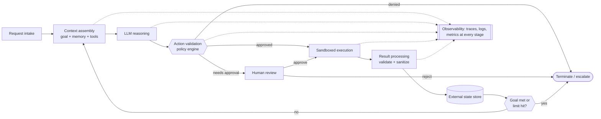
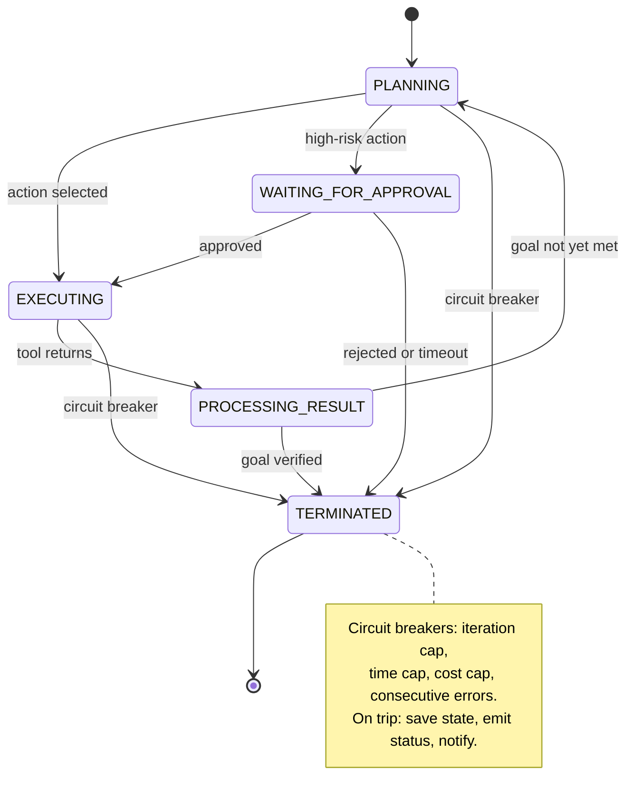
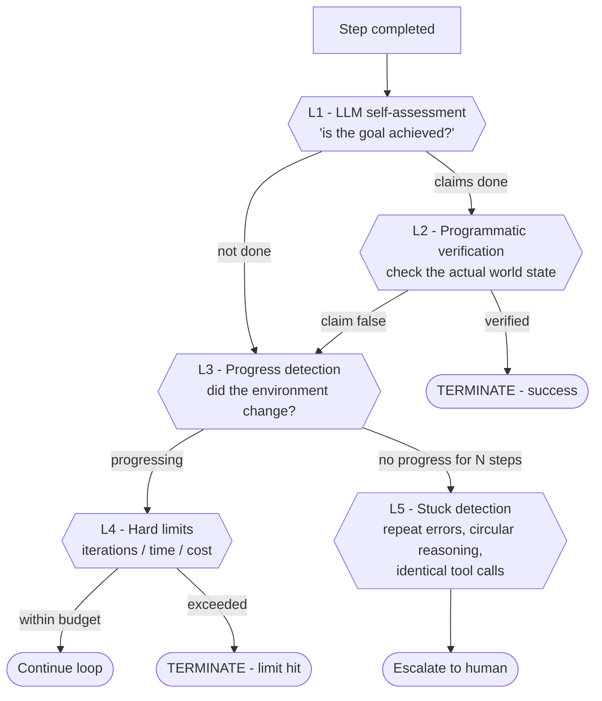
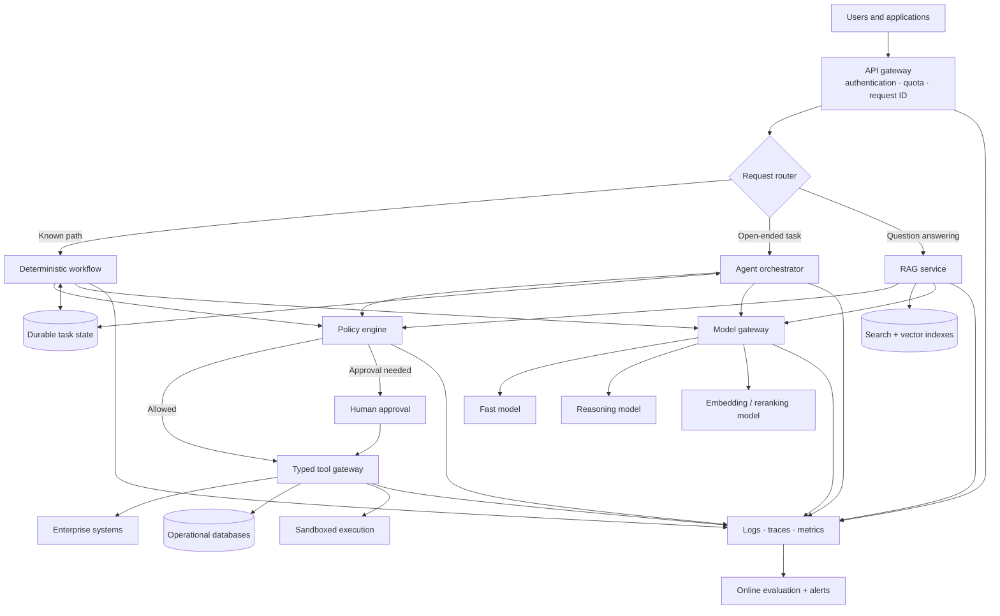
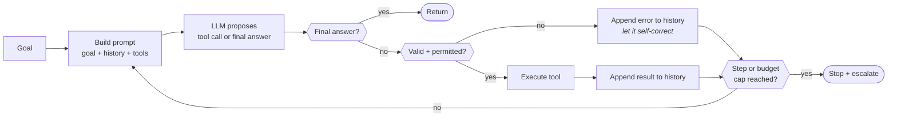

# Part B — The agent loop and control plane

← Previous: [Part A — What an agent is](01a-part-a-what-an-agent-is.md) · Index: [Full Read-Through](01-full-read-through.md) · Next: [Part C (1 of 2) — Tool design](01c-part-c1-tool-design.md) →

**Steps in this file**

- [Step 6 · A production-ready agent architecture](01b-part-b-agent-loop-and-control-plane.md#6-read-a-production-ready-agent-architecture)
- [Step 7 · What belongs in the orchestrator vs the LLM](01b-part-b-agent-loop-and-control-plane.md#7-read-what-belongs-in-the-orchestrator-vs-the-llm)
- [Step 8 · A safe and debuggable agent loop](01b-part-b-agent-loop-and-control-plane.md#8-read-a-safe-and-debuggable-agent-loop)
- [Step 9 · Termination conditions](01b-part-b-agent-loop-and-control-plane.md#9-read-termination-conditions)
- [Step 10 · Separate brain, session, and hands](01b-part-b-agent-loop-and-control-plane.md#10-read-separate-brain-session-and-hands)
- [Step 11 · Complete production LLM platform](01b-part-b-agent-loop-and-control-plane.md#11-study-the-diagram-complete-production-llm-platform-name-every-box-out-loud)
- [Step 12 · Build a minimal agent loop from scratch](01b-part-b-agent-loop-and-control-plane.md#12-code-build-a-minimal-agent-loop-from-scratch-30-min-this-makes-part-b-concrete)
- [Step 13 · Detect a stuck agent loop](01b-part-b-agent-loop-and-control-plane.md#13-code-detect-a-stuck-agent-loop)

---

## 6. Read: A production-ready agent architecture

*Source: agentic-ai-system-design-interview-guide-2026.md*

> **Why this step is here.** [Step 5 · Essential components of an agent beyond an LLM](01a-part-a-what-an-agent-is.md#5-read-essential-components-of-an-agent-beyond-an-llm) listed the components; this step puts them in execution order so you can narrate one request from intake to termination, which is the single most common design-round prompt. Read the eight-stage pipeline first and say it aloud, then trace the diagram and notice where the loop closes (state store back to context assembly) and where the three exits from validation go. Steps [7](01b-part-b-agent-loop-and-control-plane.md#7-read-what-belongs-in-the-orchestrator-vs-the-llm) to [9](01b-part-b-agent-loop-and-control-plane.md#9-read-termination-conditions) each zoom into one stage of this path, and [Step 79 · Architecture from memory](01m-part-g1-fde-interview-knowledge.md#79-draw-architecture-from-memory-you-already-know-every-box-from-parts-b-to-f) asks you to draw it from memory.

### Step 6 · 7. Walk through a production-ready agent architecture.

Request intake → context assembly → LLM reasoning → action validation → sandboxed execution → result processing → state update → loop or terminate, with tracing at each stage. Principles: separation of concerns (LLM reasons, orchestrator controls, policy governs, sandbox executes), fail-safe defaults, complete observability, stateless orchestrator with state in external storage.



#### Going deeper (Step 6)

**The eight stages as a sentence.** Take the request, assemble what the model needs to see, let the model propose, check the proposal against policy, execute it somewhere it cannot do damage, clean the result, persist state, then decide whether to go around again. Everything in Part B is a refinement of one of those clauses.

**What each stage actually does.**

- *Request intake* authenticates, assigns a request ID that follows the task through every trace, and normalizes the goal. Without the ID you cannot correlate a failure at step six with the request that caused it.
- *Context assembly* is where [Step 27 · Context engineering replaces prompt-only thinking](01e-part-d1-context-and-memory.md#27-read-context-engineering-replaces-prompt-only-thinking)'s context engineering lives. It pulls the goal, the relevant memory, the tool descriptions for this context, and the history so far into one prompt, under a token budget ([Step 38 · Fit conversation history into a token budget](01f-part-d2-rag-pipelines.md#38-code-fit-conversation-history-into-a-token-budget) is the budgeting code). This is also where the loop re-enters, so every iteration rebuilds the prompt from state rather than appending forever.
- *LLM reasoning* is the only nondeterministic box. It returns a proposal: a tool call with arguments, or a final answer.
- *Action validation* is the policy engine. Three exits: approved, needs approval, denied. Denied goes straight to terminate or escalate; the model does not get to argue. Needs approval parks the task in a waiting state ([Step 8 · A safe and debuggable agent loop](01b-part-b-agent-loop-and-control-plane.md#8-read-a-safe-and-debuggable-agent-loop)'s `WAITING_FOR_APPROVAL`) and a human decides.
- *Sandboxed execution* runs the tool with the minimum permissions it needs, in an environment where a bad call cannot reach anything else (Steps [21](01d-part-c2-tool-failures-sandboxing-cost.md#21-read-sandboxing-tool-execution) and [22](01d-part-c2-tool-failures-sandboxing-cost.md#22-study-the-diagram-sandboxed-generated-code-execution)).
- *Result processing* validates and sanitizes what came back. Tool output is untrusted input: it may be huge, malformed, or contain injected instructions ([Step 58 · Prompt-injection-resistant RAG and tools](01i-part-f1-security.md#58-study-the-diagram-prompt-injection-resistant-rag-and-tools)). Truncate, validate schema, strip anything that looks like a directive before it goes into the next prompt.
- *External state store* persists the step. It sits *before* the loop decision, so a crash between steps loses nothing.
- *Goal met or limit hit* is [Step 9 · Termination conditions](01b-part-b-agent-loop-and-control-plane.md#9-read-termination-conditions)'s termination ladder in one diamond.

**The four principles, and why each is there.** *Separation of concerns* means each box has one job and one owner, so you can change the model without touching policy, or swap the sandbox without touching the loop. *Fail-safe defaults* means an unknown tool, an unparseable proposal, or a policy timeout resolves to "do not execute", never to "probably fine". *Complete observability* means the dotted lines to the observability box are not optional; every stage emits a span. *Stateless orchestrator with external state* means any instance can pick up any task, which is what lets you scale horizontally and survive crashes ([Step 10 · Separate brain, session, and hands](01b-part-b-agent-loop-and-control-plane.md#10-read-separate-brain-session-and-hands) takes this further).

**Common misreading.** Drawing the loop as "LLM → tool → LLM → tool" with policy and state as afterthoughts. In the real path, the model's output never touches a tool directly: it passes through validation, and the result never touches the model directly: it passes through processing and state. Those two intermediaries are where safety and debuggability come from.

**Connects to.** [Step 7 · What belongs in the orchestrator vs the LLM](01b-part-b-agent-loop-and-control-plane.md#7-read-what-belongs-in-the-orchestrator-vs-the-llm) assigns each box to orchestrator or model. [Step 8 · A safe and debuggable agent loop](01b-part-b-agent-loop-and-control-plane.md#8-read-a-safe-and-debuggable-agent-loop) gives the named states this loop moves through. [Step 9 · Termination conditions](01b-part-b-agent-loop-and-control-plane.md#9-read-termination-conditions) expands the termination diamond. [Step 66 · End-to-end observability](01j-part-f2-evaluation-and-observability.md#66-study-the-diagram-end-to-end-observability) is the observability box drawn in detail.

**Check yourself.**
1. Why does the state store sit before the loop decision rather than after? *So a crash during the decision or the next context assembly loses no completed work.*
2. A tool returns a 30,000-token JSON blob. Which stage handles that, and how? *Result processing: truncate or summarize it, validate the shape, and store the full payload externally with a reference.*
3. What does "fail-safe default" mean for a proposal that names a tool not in the registry? *Do not execute; append an error to history or terminate, never guess a similar tool.*

---

## 7. Read: What belongs in the orchestrator vs the LLM

*Source: agentic-ai-system-design-interview-guide-2026.md*

> **Why this step is here.** [Step 6 · A production-ready agent architecture](01b-part-b-agent-loop-and-control-plane.md#6-read-a-production-ready-agent-architecture) drew the pipeline; this step answers the question interviewers ask right after you draw it: "which of these does the model decide and which does your code decide?" It gives a two-column split and one rule that generates the split. Read the rule first ("anything that must be guaranteed lives in the orchestrator"), then check that you can derive each table row from it rather than memorizing the table. [Step 12 · Build a minimal agent loop from scratch](01b-part-b-agent-loop-and-control-plane.md#12-code-build-a-minimal-agent-loop-from-scratch-30-min-this-makes-part-b-concrete)'s code is this table made executable, and [Step 18 · Move loops and data plumbing into code](01c-part-c1-tool-design.md#18-read-move-loops-and-data-plumbing-into-code) extends the same rule to loops and data plumbing.

### Step 7 · 8. What logic belongs in the orchestrator vs the LLM?

| Orchestrator (guarantees) | LLM (judgment) |
|---|---|
| Loop control, timeouts | Understanding the goal |
| Budget tracking/enforcement | Planning the approach |
| State persistence & recovery | Tool selection and arguments |
| Tool dispatch, retries | Interpreting results |
| Approval routing, logging | Judging completion |

Rule of thumb: anything that must be *guaranteed* lives in the orchestrator. The LLM may say "I think I'm done"; the orchestrator decides whether to accept it. Anti-pattern: encoding control flow in prompts.

#### Going deeper (Step 7)

**The generating rule.** A model is a probabilistic component. Anything you need to hold with certainty, meaning "this will never run more than 10 steps", "this will never spend more than 5 dollars", "this state will survive a crash", cannot depend on a probabilistic component honoring an instruction. So it lives in code. Anything that benefits from judgment and where being occasionally wrong is recoverable can go to the model. Every row in the table follows from that.

**Each row, derived.**

- *Loop control and timeouts* must be guaranteed, so the orchestrator owns the `for` loop and the wall-clock check. A prompt saying "stop after 10 steps" enforces nothing; the model may lose count or decide the instruction does not apply.
- *Budget tracking* is a number that must be exact. The orchestrator meters every call and refuses the next one when the budget is gone ([Step 68 · Track and enforce a cost budget across an agent session](01j-part-f2-evaluation-and-observability.md#68-code-track-and-enforce-a-cost-budget-across-an-agent-session) is the code).
- *State persistence and recovery* must be reliable. The model cannot write to a database on its own; the orchestrator checkpoints after each step.
- *Tool dispatch and retries* must be idempotent and bounded (Steps [19](01d-part-c2-tool-failures-sandboxing-cost.md#19-read-tool-failures-retries-and-idempotency), [25](01d-part-c2-tool-failures-sandboxing-cost.md#25-code-retry-with-exponential-backoff-and-jitter), [26](01d-part-c2-tool-failures-sandboxing-cost.md#26-code-make-a-create-resource-call-idempotent)). The model proposes the call; the orchestrator decides whether to retry, how many times, and with what key.
- *Approval routing and logging* are compliance concerns. If the model could skip approval by phrasing the action differently, the gate is not a gate.
- *Understanding the goal, planning, tool selection, interpreting results, judging completion* all require reading language and weighing options. That is what the model is for, and errors here are recoverable because the orchestrator checks the output.

**"The LLM may say I think I'm done; the orchestrator decides whether to accept it."** This sentence is the whole design in miniature. The model produces a claim; the orchestrator verifies it against the world ([Step 9 · Termination conditions](01b-part-b-agent-loop-and-control-plane.md#9-read-termination-conditions)'s L2) before returning success. In a coding agent: the model says the bug is fixed; the orchestrator runs the tests. In a claims pipeline: the model says the claim is complete; the orchestrator checks that every required field is populated.

**The anti-pattern, concretely.** Encoding control flow in prompts looks like: "First call search. If results are empty, call broader_search. After three tries, give up." This is a flowchart written in English and handed to a component that may or may not follow it. Move it to code ([Step 18 · Move loops and data plumbing into code](01c-part-c1-tool-design.md#18-read-move-loops-and-data-plumbing-into-code)) and give the model only the judgment calls: which query to try, how to interpret the results.

**Common misreading.** Reading the table as "the model is dumb, the orchestrator is smart." The model is doing the hard cognitive work; the orchestrator is doing the guaranteeing work. Candidates who under-trust the model wrap every decision in hand-written rules and end up with a workflow pretending to be an agent. Candidates who over-trust it put budgets in prompts. Say the split in terms of guarantees versus judgment, not smart versus dumb.

**Connects to.** [Step 8 · A safe and debuggable agent loop](01b-part-b-agent-loop-and-control-plane.md#8-read-a-safe-and-debuggable-agent-loop) lists the orchestrator's named states. [Step 9 · Termination conditions](01b-part-b-agent-loop-and-control-plane.md#9-read-termination-conditions) is the completion-check column in detail. [Step 12 · Build a minimal agent loop from scratch](01b-part-b-agent-loop-and-control-plane.md#12-code-build-a-minimal-agent-loop-from-scratch-30-min-this-makes-part-b-concrete) shows the split as code; notice `max_steps` and `budget` are constructor arguments, not prompt text. [Step 18 · Move loops and data plumbing into code](01c-part-c1-tool-design.md#18-read-move-loops-and-data-plumbing-into-code) extends the rule to loops.

**Check yourself.**
1. Where does "retry a failed API call up to three times" live, and why? *Orchestrator, because retry count must be bounded and idempotent regardless of what the model thinks.*
2. The model returns `{"type": "final"}` after one step on a task that clearly needs five. What should happen? *The orchestrator runs programmatic verification before accepting; if the goal state is not met, it continues the loop or escalates.*
3. Give one thing that legitimately belongs to the model and would be a mistake to hard-code. *Choosing which of several search tools fits an ambiguous question, since that requires reading the question.*

---

## 8. Read: A safe and debuggable agent loop

*Source: agentic-ai-system-design-interview-guide-2026.md*

> **Why this step is here.** Steps [6](01b-part-b-agent-loop-and-control-plane.md#6-read-a-production-ready-agent-architecture) and [7](01b-part-b-agent-loop-and-control-plane.md#7-read-what-belongs-in-the-orchestrator-vs-the-llm) said the orchestrator owns control; this step says how to build that control so a 3 a.m. incident is debuggable. It gives five properties and a state diagram with five named states. Read the bullets first, then trace every arrow in the state diagram and ask which bullet it implements. The states reappear as log fields in [Step 66 · End-to-end observability](01j-part-f2-evaluation-and-observability.md#66-study-the-diagram-end-to-end-observability), the reproducibility requirement becomes code in [Step 67 · Deterministic replay of an agent trace](01j-part-f2-evaluation-and-observability.md#67-code-deterministic-replay-of-an-agent-trace), and the circuit breakers become [Step 68 · Track and enforce a cost budget across an agent session](01j-part-f2-evaluation-and-observability.md#68-code-track-and-enforce-a-cost-budget-across-an-agent-session).

### Step 8 · 9. How do you design a safe and debuggable agent loop?

- **Explicit named states** — `PLANNING` / `EXECUTING` / `WAITING_FOR_APPROVAL` / `PROCESSING_RESULT` / `TERMINATED`, with the current state on every log line
- **Decision-point logging** — the inputs the model saw, the output it generated, and how that output was interpreted as an action
- **Reproducibility** — same state snapshot + temperature 0 should yield the same action, which means logging the complete context of each call
- **Circuit breakers** — on iteration count, elapsed time, cost, and consecutive errors
- **Graceful degradation** — on a trip, save state and notify for review rather than crashing silently or corrupting state



#### Going deeper (Step 8)

**Why named states.** Without them, an agent's status is "somewhere in the loop", and a hung task tells you nothing. With `WAITING_FOR_APPROVAL` on every log line you can query "how many tasks have been waiting more than an hour" and page the right team. The states also make the loop testable: you can assert that `EXECUTING` is never entered without a validated action. Implementation is a single enum field on the task row and a string on every log record.

**Decision-point logging is three things, not one.** The inputs the model saw (the full assembled prompt, or a content hash plus a pointer to the stored prompt), the raw output it returned, and the parsed action you derived from it. Most teams log only the third. Then a bad action cannot be traced to a bad prompt or a parsing bug. Storing the full context per call is expensive at scale (tens of KB per step); the typical compromise is full storage for a sampled fraction plus every failure, and hashes for the rest.

**Reproducibility is what the logging buys you.** If you saved the exact context and the model runs at temperature 0, replaying the call should give the same action, and you can bisect a failure to the step where it went wrong ([Step 67 · Deterministic replay of an agent trace](01j-part-f2-evaluation-and-observability.md#67-code-deterministic-replay-of-an-agent-trace) is the replay code). This is not perfectly reliable across model versions or even across provider infrastructure changes, so pin model versions (the source design guide covers versioning and rollback) and treat reproducibility as "high probability", not a guarantee.

**Circuit breakers, four kinds.** Iteration count catches loops. Elapsed time catches slow tools and stuck approvals. Cost catches runaway context growth. Consecutive errors catches a broken tool before the agent burns its whole step budget retrying it. Typical starting values: 10 to 20 steps, 10 to 30 minutes, a few dollars per task, 3 consecutive errors. Tune per task class.

**Graceful degradation.** The trip path in the diagram goes to `TERMINATED` with a note: save state, emit status, notify. The alternatives, crashing with nothing saved or half-writing a state row, are what make incidents unrecoverable.

**Common misreading.** Treating the state diagram as documentation rather than code. If the states exist only in a design doc and the actual loop is a `while True` with flags, you have none of the benefits. The states must be a real field that the loop transitions explicitly and logs on every line.

**Connects to.** [Step 9 · Termination conditions](01b-part-b-agent-loop-and-control-plane.md#9-read-termination-conditions) details the `PROCESSING_RESULT → TERMINATED` edge (goal verified). [Step 50 · Human approval for consequential actions](01h-part-e2-long-running-agents.md#50-study-the-diagram-human-approval-for-consequential-actions) is the `WAITING_FOR_APPROVAL` state as a full diagram. Steps [66](01j-part-f2-evaluation-and-observability.md#66-study-the-diagram-end-to-end-observability), [67](01j-part-f2-evaluation-and-observability.md#67-code-deterministic-replay-of-an-agent-trace), and [68](01j-part-f2-evaluation-and-observability.md#68-code-track-and-enforce-a-cost-budget-across-an-agent-session) are the observability, replay, and cost-breaker implementations.

**Check yourself.**
1. Which of the five properties lets you answer "why did the agent call `delete_file` at step 7?" *Decision-point logging, specifically the saved input context and raw output for that step.*
2. Why is "consecutive errors" a separate breaker from "iteration count"? *A broken tool can burn the iteration budget slowly; three consecutive failures is a faster and more specific signal.*
3. What must a circuit-breaker trip do before the process exits? *Persist current state and emit a status so the task can be inspected and resumed, not silently disappear.*

---

## 9. Read: Termination conditions

*Source: agentic-ai-system-design-interview-guide-2026.md*

> **Why this step is here.** [Step 7 · What belongs in the orchestrator vs the LLM](01b-part-b-agent-loop-and-control-plane.md#7-read-what-belongs-in-the-orchestrator-vs-the-llm) said the orchestrator decides whether to accept "I'm done"; this step gives the five-layer ladder it uses to decide. Read the paragraph for the order of the layers, then trace the diagram and notice that the model's claim is only the entry point, never the verdict. The core sentence is "measure environment changes, not agent activity", and [Step 13 · Detect a stuck agent loop](01b-part-b-agent-loop-and-control-plane.md#13-code-detect-a-stuck-agent-loop)'s loop detector and [Step 63 · Detecting goal drift](01j-part-f2-evaluation-and-observability.md#63-read-detecting-goal-drift)'s goal-drift detection are both applications of it. [Step 12 · Build a minimal agent loop from scratch](01b-part-b-agent-loop-and-control-plane.md#12-code-build-a-minimal-agent-loop-from-scratch-30-min-this-makes-part-b-concrete)'s `max_steps` is L4 in code.

### Step 9 · 10. How do you implement termination conditions in long-running agents?

LLM self-assessment → programmatic verification of the goal state → progress detection → hard limits → stuck detection (repeated errors, circular reasoning, identical tool calls). The nastiest failure is an agent that *believes* it's progressing; measure environment changes, not agent activity.



#### Going deeper (Step 9)

**The ladder, layer by layer.**

- *L1, LLM self-assessment.* Cheap and available on every step: ask the model whether the goal is achieved. It is useful as a trigger for verification, and useless as a verdict, because models are confidently wrong about completion at a rate that varies by task and is never zero.
- *L2, programmatic verification.* When the model claims done, check the world: does the file exist, do the tests pass, does the API return the expected state, is the confirmation number present. This is where success is actually declared. If verification fails, do not terminate; fall through to progress detection, because a false claim is itself a warning sign.
- *L3, progress detection.* Compare the environment before and after the last N steps. Did any file change, any record update, any new information enter the history? If the agent has taken five steps and nothing observable is different, it is spinning. Implementation: hash the relevant state (working directory tree, set of touched records, tool result set) and compare.
- *L4, hard limits.* Iterations, time, cost. Always present, checked every step, enforced in code. [Step 12 · Build a minimal agent loop from scratch](01b-part-b-agent-loop-and-control-plane.md#12-code-build-a-minimal-agent-loop-from-scratch-30-min-this-makes-part-b-concrete)'s `max_steps` and `budget` are this layer.
- *L5, stuck detection.* Specific patterns: the same tool call with the same arguments repeated, the same error three times, two actions alternating. [Step 13 · Detect a stuck agent loop](01b-part-b-agent-loop-and-control-plane.md#13-code-detect-a-stuck-agent-loop) is this as code. Detection escalates to a human rather than simply stopping, because a stuck agent usually means a missing tool or a wrong goal, which a human can fix and resume.

**"Measure environment changes, not agent activity."** An agent that calls tools every second looks busy. Token counts rise, steps increment, logs scroll. None of that is progress. Progress is a delta in the thing you care about. A coding agent's progress is failing tests turning green, not edits made. A research agent's progress is new distinct sources found, not searches run. Define the progress metric per task class before you ship, or L3 has nothing to measure.

**Typical numbers.** L3 "no progress for N steps" with N around 3 to 5. L5 repeat threshold of 3 identical calls. Both are starting points; a polling task legitimately repeats the same call, so the threshold needs to know whether the *result* is also identical ([Step 13 · Detect a stuck agent loop](01b-part-b-agent-loop-and-control-plane.md#13-code-detect-a-stuck-agent-loop)'s follow-up).

**Negative outcomes are terminal too.** "Determined impossible" and "done with caveats" are valid ends. An agent that cannot say "this cannot be done with the tools I have" will loop until L4 fires, wasting the whole budget on a task it could have declined at step two.

**Common misreading.** Implementing only L1 and L4: trust the model's claim, and cap steps as a backstop. This ships. It also produces agents that return "done" with the task incomplete, and agents that spend the full budget on impossible tasks. The correction is that L2 and L3 are the layers that distinguish a working system from a demo, and they require you to define what "the world changed" means for your task.

**Connects to.** [Step 8 · A safe and debuggable agent loop](01b-part-b-agent-loop-and-control-plane.md#8-read-a-safe-and-debuggable-agent-loop)'s `PROCESSING_RESULT → TERMINATED: goal verified` edge is L2. [Step 13 · Detect a stuck agent loop](01b-part-b-agent-loop-and-control-plane.md#13-code-detect-a-stuck-agent-loop) is L5 as code. [Step 63 · Detecting goal drift](01j-part-f2-evaluation-and-observability.md#63-read-detecting-goal-drift) (goal drift) is the failure L3 is designed to catch over long horizons. [Step 68 · Track and enforce a cost budget across an agent session](01j-part-f2-evaluation-and-observability.md#68-code-track-and-enforce-a-cost-budget-across-an-agent-session) is L4's cost dimension.

**Check yourself.**
1. The model says "the bug is fixed." What happens next in a well-built loop? *L2 runs the tests; only a passing result terminates with success.*
2. Why does a false completion claim route to progress detection instead of just continuing? *Because a false claim suggests the model has lost track of the goal, so the system should check whether real progress is happening at all.*
3. A monitoring agent polls the same endpoint every step for ten steps. Is that stuck? *Only if the results are also identical and the goal has not changed; polling with changing results is progress toward a wait condition.*

---

## 10. Read: Separate brain, session, and hands

*Source: anthropic-agent-systems-fde-notes-2025-present.md*

> **Why this step is here.** [Step 6 · A production-ready agent architecture](01b-part-b-agent-loop-and-control-plane.md#6-read-a-production-ready-agent-architecture) said "stateless orchestrator, state in external storage"; this step shows what that principle becomes when a vendor builds it at scale, and why it matters for where an FDE deploys each piece. Read it for the three-way split and the failure story for each part (harness dies, sandbox dies, session survives). The deployment implication, control plane central and hands in the customer's network, is the shape you will draw in [Step 72 · Scalable deployment topology](01k-part-f3-production-operations.md#72-study-the-diagram-scalable-deployment-topology) and defend in [Step 80 · The eight decisions they will probe](01m-part-g1-fde-interview-knowledge.md#80-read-the-eight-decisions-they-will-probe-write-one-sentence-of-your-own-for-each)'s "where does it run" decision.

### Step 10 · 3.8 Separate brain, session, and hands

Anthropic's 2026 Managed Agents architecture separates:

- **Brain:** model plus replaceable orchestration harness
- **Session:** durable, append-only event history
- **Hands:** sandboxes and tools reached through stable execution interfaces

This makes harnesses and sandboxes disposable. A failed harness can reconstruct state from the session log; a failed sandbox can be reprovisioned. Remote or customer-VPC execution becomes easier because the harness no longer assumes tools live beside it.

Anthropic reported that lazy sandbox provisioning in this architecture reduced p50 time-to-first-token by roughly 60% and p95 by more than 90% for that service.

**FDE implication:** this is directly relevant to customer deployment topology. The control plane can be managed centrally while data-plane “hands” run inside the customer's trust boundary. Stable interfaces also protect the platform from rapidly changing model-specific harness strategies.

**Interview line:** “I keep the durable session outside both inference and execution, so either side can fail independently without losing the job.”

Source: [Scaling Managed Agents: Decoupling the brain from the hands](https://www.anthropic.com/engineering/managed-agents).

#### Going deeper (Step 10)

**The three parts, and what "disposable" means for each.**

- *Brain* is the model plus the harness: the code that assembles context, parses proposals, and drives the loop. Disposable means you can kill a harness process mid-task and start a fresh one, because it holds nothing it cannot rebuild from the session log. It also means you can swap harness strategies (a new planning approach, a new model) without migrating state.
- *Session* is the append-only event history: every proposal, every tool result, every approval, in order. It is the one thing that is not disposable. Append-only matters because it makes reconstruction deterministic (replay events in order) and makes audit trivial (nothing is ever overwritten). In practice: an event table or log stream keyed by task ID, the same shape as [Step 49 · Durable LLM workflow](01h-part-e2-long-running-agents.md#49-study-the-diagram-durable-llm-workflow)'s durable workflow.
- *Hands* are sandboxes and tools, reached through a stable interface (a typed RPC, not "import the tool module"). Disposable means a crashed or compromised sandbox is torn down and a new one provisioned; the session records what was done, so nothing is lost.

**Why the stable interface is the load-bearing idea.** If the harness assumes tools live in the same process, then the harness and the tools must deploy together, in the same network, with the same trust. Put a stable interface between them and the harness can run in a vendor's cloud while the tools run inside a customer's VPC next to their data. That is the FDE deployment story: control plane central, data plane local. Steps [57](01i-part-f1-security.md#57-study-the-diagram-multi-agent-trust-boundaries) and [59](01i-part-f1-security.md#59-study-the-diagram-multi-tenant-data-isolation) give the trust and tenancy reasons this matters.

**The latency figure.** Anthropic reported roughly 60% p50 and over 90% p95 improvement in time-to-first-token from lazy sandbox provisioning. The mechanism is simple: do not spin up a sandbox until the model actually proposes a tool call; many tasks answer from context alone. Treat the numbers as one vendor's report for one service, not a general expectation.

**The interview line, unpacked.** "I keep the durable session outside both inference and execution, so either side can fail independently without losing the job." Inference failing means a model timeout or a harness crash. Execution failing means a sandbox dying. In both cases the session is intact, a new harness reads it, and the task resumes from the last event. That is the whole value of the split in one sentence.

**Common misreading.** Hearing "separate brain and hands" as a microservices aesthetic. The point is failure independence and deployment flexibility, not service count. If you split the components but let the harness keep in-memory state that the session does not have, you have added network hops without gaining recoverability.

**Connects to.** [Step 6 · A production-ready agent architecture](01b-part-b-agent-loop-and-control-plane.md#6-read-a-production-ready-agent-architecture)'s "stateless orchestrator" principle is the ancestor of this. Steps [48](01h-part-e2-long-running-agents.md#48-read-long-running-agents-need-durable-artifacts-and-explicit-completion) and [49](01h-part-e2-long-running-agents.md#49-study-the-diagram-durable-llm-workflow) show the durable session pattern in a workflow engine. [Step 72 · Scalable deployment topology](01k-part-f3-production-operations.md#72-study-the-diagram-scalable-deployment-topology) draws the deployment topology this enables, and [Step 82 · Google Cloud vocabulary](01m-part-g1-fde-interview-knowledge.md#82-read-google-cloud-vocabulary-map-each-product-to-a-box-you-already-know) maps the pieces to Google Cloud products.

**Check yourself.**
1. The harness process is killed at step 9 of a 15-step task. What is lost? *Nothing durable: a new harness reads the session log and resumes at step 10.*
2. Why must the session be append-only rather than a mutable "current state" row? *Replay and audit: an ordered event log reconstructs any intermediate state and never loses history to an overwrite.*
3. What does the stable execution interface buy an FDE deploying to a regulated customer? *The hands can run inside the customer's network next to their data while the brain stays managed centrally.*

---

## 11. Study the diagram: Complete production LLM platform. Name every box out loud.

*Source: production-llm-agent-rag-workflow-mermaid-atlas.md*

> **Why this step is here.** Steps [5](01a-part-a-what-an-agent-is.md#5-read-essential-components-of-an-agent-beyond-an-llm) to [10](01b-part-b-agent-loop-and-control-plane.md#10-read-separate-brain-session-and-hands) built one agent's loop; this diagram is the whole platform around it, including the workflows and RAG service that share its policy, tools, models, and observability. It is the picture [Step 79 · Architecture from memory](01m-part-g1-fde-interview-knowledge.md#79-draw-architecture-from-memory-you-already-know-every-box-from-parts-b-to-f) asks you to draw from memory in the FDE round, so name every box aloud until the eight-word narration at the bottom comes out without effort. Read it top to bottom, then trace the three horizontal shared layers (policy, model gateway, observability) and notice that every execution style passes through all three.

### Step 11 · 1. Complete production LLM platform



**Narrate:** authenticate → route → retrieve or reason → apply deterministic policy → execute typed tools → verify outcome → persist state → evaluate.

#### Going deeper (Step 11)

**Walk the diagram.**

*Users and applications → API gateway.* The gateway authenticates the caller, applies quota, and stamps a request ID. Remove it and you have no per-tenant limits and no way to correlate traces. In practice: an API gateway product or a thin service in front of everything.

*Request router.* One classifier decides: known path, open-ended task, or question. This is [Step 4 · Workflow, single agent, or multi-agent decision](01a-part-a-what-an-agent-is.md#4-study-the-diagram-workflow-single-agent-or-multi-agent-decision-redraw-it-from-memory)'s decision tree at runtime rather than design time. Remove it and every request pays agent costs. Implementation is often a small model or a rules layer ([Step 53 · Route a query to the right agent without calling a large model](01h-part-e2-long-running-agents.md#53-code-route-a-query-to-the-right-agent-without-calling-a-large-model) is a routing implementation without a large model).

*Deterministic workflow, Agent orchestrator, RAG service.* Three execution styles side by side. The workflow is [Step 3 · Choose workflows before agents](01a-part-a-what-an-agent-is.md#3-read-choose-workflows-before-agents)'s patterns in an engine. The orchestrator is Steps [6](01b-part-b-agent-loop-and-control-plane.md#6-read-a-production-ready-agent-architecture) to [9](01b-part-b-agent-loop-and-control-plane.md#9-read-termination-conditions). The RAG service is Part D (Steps [33](01f-part-d2-rag-pipelines.md#33-study-the-diagram-enterprise-wiki-rag-ingestion) to [37](01f-part-d2-rag-pipelines.md#37-study-the-diagram-agentic-rag-for-complex-research)). They are peers, not a hierarchy, and a real platform runs all three.

*Durable task state.* Shared by workflow and orchestrator with a two-way arrow: they read to resume and write to checkpoint. This is [Step 10 · Separate brain, session, and hands](01b-part-b-agent-loop-and-control-plane.md#10-read-separate-brain-session-and-hands)'s session. RAG does not need it because a query is stateless; it needs the search and vector indexes instead. Remove the state store and a crash loses every in-flight task.

*Policy engine.* All three execution styles feed it, and it sits before the tool gateway. This placement is the single most important thing in the diagram: no path reaches a tool without passing policy. Its two exits are "allowed" to tools and "approval needed" to human approval, which then also goes to tools. Implementation: a policy service evaluating risk class, allowlists, and budgets ([Step 56 · Security should constrain capability structurally](01i-part-f1-security.md#56-read-security-should-constrain-capability-structurally)).

*Typed tool gateway.* One place where tool schemas are validated and calls are dispatched, in front of three destinations: enterprise systems (CRM, ticketing), operational databases, and sandboxed execution for generated code. Remove it and every execution style validates tools its own way, or not at all. [Step 24 · Tool registry with schema validation](01d-part-c2-tool-failures-sandboxing-cost.md#24-code-tool-registry-with-schema-validation) is its core.

*Model gateway → fast, reasoning, embedding models.* All three execution styles call models through one gateway, which picks the model per request, meters cost, and pins versions. Remove it and you have three separate model integrations, three cost meters, and no central place to route cheap requests to a cheap model. [Step 71 · Model gateway and cost-aware routing](01k-part-f3-production-operations.md#71-study-the-diagram-model-gateway-and-cost-aware-routing) draws it in detail.

*Logs, traces, metrics → online evaluation and alerts.* Every box on the left emits into observability, and observability feeds evaluation. Remove the final arrow and you have dashboards nobody acts on. Steps [65](01j-part-f2-evaluation-and-observability.md#65-study-the-diagram-offline-and-online-evaluation-loop) and [66](01j-part-f2-evaluation-and-observability.md#66-study-the-diagram-end-to-end-observability) expand this.

**The narration, mapped to boxes.** Authenticate (gateway) → route (router) → retrieve or reason (RAG or orchestrator) → apply deterministic policy (policy engine) → execute typed tools (tool gateway) → verify outcome (result processing, back in the orchestrator) → persist state (durable state) → evaluate (observability to evaluation).

**How to redraw it.** Anchors, in order:

1. A vertical spine: gateway → router → three execution boxes → policy → tool gateway → three destinations.
2. Durable state hanging off the left of workflow and orchestrator; indexes hanging off RAG.
3. The human approval detour off policy that rejoins at the tool gateway.
4. The model gateway on the right with three model types, fed by all three execution boxes.
5. Observability as a wide box at the bottom that everything feeds, with one arrow out to evaluation.

Draw the spine first. The three shared services (policy, model gateway, observability) are what distinguish a platform from a single agent, so add them second and say why each is shared.

**Common misreading.** Drawing policy as a feature of the agent orchestrator only. In this diagram the deterministic workflow and the RAG service also pass through policy, because a workflow can issue a refund and a RAG answer can leak a document the user may not see ([Step 34 · Permission-aware RAG query path](01f-part-d2-rag-pipelines.md#34-study-the-diagram-permission-aware-rag-query-path)). Shared policy is the point.

**Connects to.** [Step 4 · Workflow, single agent, or multi-agent decision](01a-part-a-what-an-agent-is.md#4-study-the-diagram-workflow-single-agent-or-multi-agent-decision-redraw-it-from-memory) is the router's logic at design time. [Step 56 · Security should constrain capability structurally](01i-part-f1-security.md#56-read-security-should-constrain-capability-structurally) is the policy engine, [Step 71 · Model gateway and cost-aware routing](01k-part-f3-production-operations.md#71-study-the-diagram-model-gateway-and-cost-aware-routing) the model gateway, [Step 66 · End-to-end observability](01j-part-f2-evaluation-and-observability.md#66-study-the-diagram-end-to-end-observability) observability, [Step 72 · Scalable deployment topology](01k-part-f3-production-operations.md#72-study-the-diagram-scalable-deployment-topology) the deployment topology for these boxes. [Step 79 · Architecture from memory](01m-part-g1-fde-interview-knowledge.md#79-draw-architecture-from-memory-you-already-know-every-box-from-parts-b-to-f) asks you to draw this, and [Step 82 · Google Cloud vocabulary](01m-part-g1-fde-interview-knowledge.md#82-read-google-cloud-vocabulary-map-each-product-to-a-box-you-already-know) maps each box to a Google Cloud product.

**Check yourself.**
1. Why does the RAG service go through the policy engine if it only answers questions? *Because the answer may contain documents the user is not permitted to see; permission filtering is policy.*
2. What does the model gateway give you that three direct model integrations would not? *One place for cost metering, version pinning, and routing cheap requests to a fast model.*
3. Which two boxes share durable task state, and why not the third? *Workflow and orchestrator, because they run multi-step tasks that must survive crashes; a RAG query is single-shot.*

---

## 12. Code: Build a minimal agent loop from scratch. 30 min. This makes Part B concrete.

*Source: google-fde-python-coding-prep.md*

> **Why this step is here.** Everything in Part B has been prose and diagrams; this is the 30-minute exercise that turns it into code you have actually written, and it is the most likely live-coding prompt for the FDE role. Read the thinking-process bullets first, because the ordering ("running first, rails from the start, mockable LLM, orchestrator decides") is what gets scored. Then read the code against [Step 7 · What belongs in the orchestrator vs the LLM](01b-part-b-agent-loop-and-control-plane.md#7-read-what-belongs-in-the-orchestrator-vs-the-llm)'s table: every guarantee row should appear as code, every judgment row as a call to `llm.propose`. Steps [13](01b-part-b-agent-loop-and-control-plane.md#13-code-detect-a-stuck-agent-loop), [24](01d-part-c2-tool-failures-sandboxing-cost.md#24-code-tool-registry-with-schema-validation), [25](01d-part-c2-tool-failures-sandboxing-cost.md#25-code-retry-with-exponential-backoff-and-jitter), and [68](01j-part-f2-evaluation-and-observability.md#68-code-track-and-enforce-a-cost-budget-across-an-agent-session) are the follow-ups written out.

### Step 12 · Q50. Build a minimal agent loop from scratch

**Prompt.** In 30 minutes, build a working agent: it takes a goal, calls tools in a loop, and terminates. No frameworks.

**Why FDE:** the most likely vibe-coding task. It's open-ended, production-shaped, and it lets them watch you make design calls under time pressure.

**Thinking process**

- **Get something running before you make it good.** Say that out loud; "build working, then optimize" is explicitly scored in this round.
- Put the safety rails in from the first version — step cap, budget, unknown-tool handling. Retrofitting them looks like an afterthought; including them looks like experience.
- Keep the LLM behind an interface so it's mockable and the whole thing is testable without a network call.
- Narrate the boundary: **the orchestrator decides when to stop; the model only proposes.** That single sentence connects your code to the design round.



```python
class Agent:
    def __init__(self, llm, registry, max_steps=8, budget=None):
        self.llm, self.registry = llm, registry
        self.max_steps, self.budget = max_steps, budget

    def run(self, goal):
        history = []
        for step in range(self.max_steps):
            if self.budget:
                self.budget.check("llm", 0.01)
            proposal = self.llm.propose(goal, history, self.registry.tools)
            if self.budget:
                self.budget.record("llm", proposal.get("cost", 0.0))

            if proposal["type"] == "final":
                return {"status": "done", "answer": proposal["answer"],
                        "steps": step + 1}

            name, args = proposal["tool"], proposal["args"]
            problems = self.registry.validate(name, args)
            if problems:
                history.append({"role": "tool_error",
                                "content": "; ".join(problems)})
                continue                       # let the model self-correct

            try:
                result = self.registry.call(name, args)
                history.append({"role": "tool_result",
                                "tool": name, "content": result})
            except PermissionError as e:
                return {"status": "needs_approval", "tool": name,
                        "args": args, "reason": str(e)}
            except Exception as e:
                history.append({"role": "tool_error", "content": repr(e)})

        return {"status": "max_steps_exceeded", "history": history}
```

**Follow-ups they will definitely ask:**

- Where does state live if the process crashes? (Externalize it — Q11 of your design note.)
- How do you stop an infinite loop the step cap doesn't catch? (Q27's loop detector.)
- How do you know it's actually done? (Programmatic verification, not the model's claim — Q17 of your design note.)
- How would you add streaming? (Q32.)

#### Going deeper (Step 12)

**Read the code.**

*Constructor.* `llm` and `registry` are injected, not imported. That is what makes the loop testable with a fake model that returns scripted proposals and a fake registry with two tools. `max_steps` and `budget` are constructor arguments because they are guarantees ([Step 7 · What belongs in the orchestrator vs the LLM](01b-part-b-agent-loop-and-control-plane.md#7-read-what-belongs-in-the-orchestrator-vs-the-llm)): they live in code, with defaults, never in the prompt. `budget=None` keeps the class usable without a budget object in a 30-minute round while leaving the hook in place.

*The loop header.* `for step in range(self.max_steps)` is the iteration circuit breaker ([Step 8 · A safe and debuggable agent loop](01b-part-b-agent-loop-and-control-plane.md#8-read-a-safe-and-debuggable-agent-loop)). A `while True` with a counter does the same thing but is easier to get wrong under time pressure; the `for` makes the cap structurally impossible to skip.

*Budget check and record.* `check` runs before the call with an estimated cost and raises or returns if the budget cannot cover it; `record` runs after with the actual cost. Two calls, not one, because you want to refuse a call you cannot afford rather than discover overspend afterward. [Step 68 · Track and enforce a cost budget across an agent session](01j-part-f2-evaluation-and-observability.md#68-code-track-and-enforce-a-cost-budget-across-an-agent-session) fills in the budget class.

*The proposal.* One call to `llm.propose(goal, history, tools)`. The model sees the goal, everything that has happened, and the tool menu. Context assembly ([Step 6 · A production-ready agent architecture](01b-part-b-agent-loop-and-control-plane.md#6-read-a-production-ready-agent-architecture)) is hidden inside `propose` here; in a real system it is its own module with a token budget ([Step 38 · Fit conversation history into a token budget](01f-part-d2-rag-pipelines.md#38-code-fit-conversation-history-into-a-token-budget)).

*Final answer path.* If the model claims done, this version returns immediately. Note what is missing: [Step 9 · Termination conditions](01b-part-b-agent-loop-and-control-plane.md#9-read-termination-conditions)'s L2 verification. That is deliberate for a 30-minute build and is the first thing to say aloud as a known gap.

*Validation before execution.* `registry.validate(name, args)` returns a list of problems. On any problem, the loop appends a `tool_error` to history and `continue`s. This is the fail-safe default: an unknown tool or bad arguments never reach execution, and the model gets a chance to self-correct on the next step. [Step 24 · Tool registry with schema validation](01d-part-c2-tool-failures-sandboxing-cost.md#24-code-tool-registry-with-schema-validation) is the registry.

*Execution and the three outcomes.* Success appends a `tool_result`. `PermissionError` returns `needs_approval` with the full proposed action, which is [Step 8 · A safe and debuggable agent loop](01b-part-b-agent-loop-and-control-plane.md#8-read-a-safe-and-debuggable-agent-loop)'s `WAITING_FOR_APPROVAL` state: the loop hands control to a human and stops, rather than retrying. Any other exception appends a `tool_error` and continues, so a flaky tool does not kill the task. A stricter version would count consecutive errors and break after three.

*Fall-through return.* Exhausting the loop returns `max_steps_exceeded` with the full history, not a bare failure, so a human can see what happened.

**Complexity and edge cases.** O(steps) model calls; history grows linearly, which is the cost driver, since each call re-sends it. Edge cases: a proposal missing `type` (add a guard that treats it as an error), `args` not a dict, a tool that returns something unserializable, a budget object that raises versus returns. Say which you would handle first.

**Say this aloud.** "I am getting a working loop before making it good, but the step cap, budget hook, and unknown-tool handling are in from the first version because retrofitting them is where systems go wrong. The model only proposes; this loop decides when to stop. Right now it trusts the model's final answer, which I would replace with programmatic verification of the goal state."

**One variation.** "Make it survive a crash." Externalize `history` and `step`: write them to a store keyed by task ID after every append, and have `run` accept a task ID and resume from the stored state instead of starting fresh (Steps [10](01b-part-b-agent-loop-and-control-plane.md#10-read-separate-brain-session-and-hands) and [49](01h-part-e2-long-running-agents.md#49-study-the-diagram-durable-llm-workflow)).

**Common misreading.** Spending the first fifteen minutes on a beautiful tool registry and running out of time before the loop works. The round scores "working, then better". Get the loop returning a final answer with a fake LLM in the first ten minutes, then add validation, then budget.

**Connects to.** [Step 7 · What belongs in the orchestrator vs the LLM](01b-part-b-agent-loop-and-control-plane.md#7-read-what-belongs-in-the-orchestrator-vs-the-llm) is the table this code implements. [Step 13 · Detect a stuck agent loop](01b-part-b-agent-loop-and-control-plane.md#13-code-detect-a-stuck-agent-loop) is the loop detector the step cap cannot replace. [Step 24 · Tool registry with schema validation](01d-part-c2-tool-failures-sandboxing-cost.md#24-code-tool-registry-with-schema-validation) is `registry.validate`. [Step 68 · Track and enforce a cost budget across an agent session](01j-part-f2-evaluation-and-observability.md#68-code-track-and-enforce-a-cost-budget-across-an-agent-session) is `budget.check` and `record`. [Step 9 · Termination conditions](01b-part-b-agent-loop-and-control-plane.md#9-read-termination-conditions)'s L2 is the missing verification.

**Check yourself.**
1. Why `continue` after a validation failure instead of returning an error? *To let the model see the problem in history and self-correct; one bad proposal should not end the task.*
2. Why is `PermissionError` handled differently from other exceptions? *It is not a failure to retry; it is a policy decision that needs a human, so the loop returns control with the proposed action attached.*
3. What is the biggest thing this loop trusts that it should not? *The model's `final` claim; a production loop verifies the goal state before returning success.*

---

## 13. Code: Detect a stuck agent loop

*Source: google-fde-python-coding-prep.md*

> **Why this step is here.** [Step 9 · Termination conditions](01b-part-b-agent-loop-and-control-plane.md#9-read-termination-conditions) named stuck detection as the last layer of the termination ladder and [Step 12 · Build a minimal agent loop from scratch](01b-part-b-agent-loop-and-control-plane.md#12-code-build-a-minimal-agent-loop-from-scratch-30-min-this-makes-part-b-concrete) left a gap the step cap cannot close: an agent that repeats itself for eight steps still burns all eight. This is the detector that catches it early, and it also answers the reported "Coder and Reviewer loop forever" multi-agent question. Read the thinking-process bullets for the ordering (cheap exact checks before embeddings), then read the code for the two signals it implements. [Step 54 · Detect a cycle in an agent handoff graph](01h-part-e2-long-running-agents.md#54-code-detect-a-cycle-in-an-agent-handoff-graph) does the same job for handoff graphs, and [Step 47 · Debugging failures across agents](01g-part-e1-multi-agent-coordination.md#47-read-debugging-failures-across-agents) covers the cross-agent version.

### Step 13 · Q27. Detect a stuck agent loop

**Prompt.** Given a stream of agent steps (tool name + arguments), detect when it's looping and should be interrupted.

**Why FDE:** Q15 of your design note as code. Also directly relevant to the reported "Coder writes the same bug, Reviewer flags it, repeat" question.

**Thinking process**

- Two cheap signals before you reach for embeddings: **exact repeat** of `(tool, args)` and **state hash repetition**. Do the cheap checks first — say that explicitly, because reaching straight for semantic similarity is over-engineering.
- Only escalate to embedding similarity for *reasoning text*, where exact matching won't fire.

```python
import hashlib, json
from collections import deque

class LoopDetector:
    def __init__(self, window=6, repeat_threshold=3):
        self.window = deque(maxlen=window)
        self.counts = {}
        self.repeat_threshold = repeat_threshold

    def _sig(self, tool, args):
        blob = json.dumps({"t": tool, "a": args}, sort_keys=True).encode()
        return hashlib.sha1(blob).hexdigest()

    def record(self, tool, args):
        sig = self._sig(tool, args)
        self.counts[sig] = self.counts.get(sig, 0) + 1
        self.window.append(sig)
        if self.counts[sig] >= self.repeat_threshold:
            return f"identical call {tool} repeated {self.counts[sig]}x"
        if len(self.window) == self.window.maxlen and len(set(self.window)) <= 2:
            return "alternating between two actions — no progress"
        return None
```

**Complexity:** O(1) per step.

**Follow-ups:** Distinguish a legitimate retry from a loop (identical call three times *with the same failure* is a loop; with different results it may be polling). What do you do on detection — soft interrupt, hard stop, or human escalation? Tie to Q15/Q37.

#### Going deeper (Step 13)

**Read the code.**

*Constructor.* `window` is a `deque(maxlen=window)`: a fixed-size sliding view of the most recent signatures, where appending past capacity drops the oldest automatically. `counts` is an unbounded dict of signature to total occurrences. `repeat_threshold` is the number of identical calls that counts as a loop. Two data structures because they answer two different questions: "has this exact call happened too many times overall" and "has the recent past been stuck oscillating".

*`_sig`.* Serializes `(tool, args)` with `sort_keys=True` so that `{"a":1,"b":2}` and `{"b":2,"a":1}` hash identically, then SHA-1s the bytes. The hash is not for security; it is to get a fixed-length key regardless of argument size, so `counts` and `window` stay small even when args are large documents. Any stable hash works.

*`record`, signal one: exact repeat.* Increment the count, append to the window, and if this signature has hit the threshold, return a message naming the tool. This catches the classic "call `search("foo")` forever" pattern.

*`record`, signal two: alternation.* Only fires once the window is full (`len(window) == maxlen`), so it does not trigger on the first two steps. If the last six steps contain two or fewer distinct signatures, the agent is bouncing between two actions: read file, edit file, read file, edit file. Neither individual call may have hit the repeat threshold yet, which is why this is a separate check.

*Return value.* A string reason or `None`. The caller decides what to do with it, which keeps the detector free of policy. A more structured version returns an enum plus details.

**Complexity and edge cases.** O(1) per step for both checks, with the alternation check doing a set over a constant-size window. `counts` grows without bound over a very long session; bound it by clearing it when the window rotates, or use a counter keyed by the window itself. Edge cases: non-JSON-serializable args (add `default=str`), a legitimate retry after a transient error (identical call with a *different* result is not a loop; pass the result or its status into the signature to distinguish), and polling tasks where repetition is the point (raise the threshold per tool, or exempt polling tools).

**Say this aloud.** "I do the two cheap deterministic checks first, exact repeat and short-window oscillation, because they catch most loops at O(1) and are trivially explainable in a trace. I would only add embedding similarity over the model's reasoning text if traces show loops that vary their arguments each time. On detection I would soft-interrupt first, injecting 'take a different action or explain what is blocking you', and hard-stop with escalation on the second trip."

**One variation.** "Include the tool result so a retry with a new outcome is not flagged." Add a `result_status` parameter to `record` and fold it into `_sig`; identical call plus identical failure repeated three times is a loop, identical call with changing results is polling.

**Common misreading.** Reaching for embedding similarity first because "the agent might rephrase". Most real loops are byte-identical tool calls or two-state oscillations, and the exact checks catch them for free. Embeddings cost a model call per step and produce fuzzy thresholds that are hard to tune. Do the cheap thing, measure, then escalate.

**Connects to.** [Step 9 · Termination conditions](01b-part-b-agent-loop-and-control-plane.md#9-read-termination-conditions)'s L5 is this detector's place in the termination ladder, and L3 (environment change) is the complementary signal it does not compute. [Step 47 · Debugging failures across agents](01g-part-e1-multi-agent-coordination.md#47-read-debugging-failures-across-agents) covers the multi-agent version of "Coder and Reviewer repeat". [Step 54 · Detect a cycle in an agent handoff graph](01h-part-e2-long-running-agents.md#54-code-detect-a-cycle-in-an-agent-handoff-graph) detects cycles in the handoff graph rather than in the call stream. [Step 51 · Human-in-the-loop controls](01h-part-e2-long-running-agents.md#51-read-human-in-the-loop-controls) gives the interrupt options on detection.

**Check yourself.**
1. Why sort keys before hashing? *So argument order does not make two identical calls look different.*
2. An agent alternates between three tools for six steps. Does signal two fire? *No; three distinct signatures exceed the `<= 2` check. Widen the window or lower the distinctness bar if that pattern matters.*
3. Why is it right for `record` to return a reason rather than raise or stop the agent? *Detection and response are different concerns; the orchestrator owns the decision to soft-interrupt, stop, or escalate.*

---

← Previous: [Part A — What an agent is](01a-part-a-what-an-agent-is.md) · Index: [Full Read-Through](01-full-read-through.md) · Next: [Part C (1 of 2) — Tool design](01c-part-c1-tool-design.md) →
