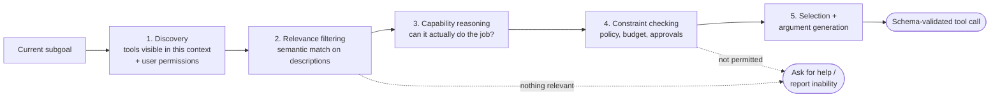

# Part C (1 of 2) — Tool design

← Previous: [Part B — The agent loop and control plane](01b-part-b-agent-loop-and-control-plane.md) · Index: [Full Read-Through](01-full-read-through.md) · Next: [Part C (2 of 2) — Tool failures, sandboxing, cost and code](01d-part-c2-tool-failures-sandboxing-cost.md) →

**Steps in this file**

- [Step 14 · How agents decide which tool to use](01c-part-c1-tool-design.md#14-read-how-agents-decide-which-tool-to-use)
- [Step 15 · Tool schemas that reduce hallucinated actions](01c-part-c1-tool-design.md#15-read-tool-schemas-that-reduce-hallucinated-actions)
- [Step 16 · Design tools for agents, not only developers](01c-part-c1-tool-design.md#16-read-design-tools-for-agents-not-only-developers)
- [Step 17 · Discover tools and knowledge progressively](01c-part-c1-tool-design.md#17-read-discover-tools-and-knowledge-progressively)
- [Step 18 · Move loops and data plumbing into code](01c-part-c1-tool-design.md#18-read-move-loops-and-data-plumbing-into-code)

---

## 14. Read: How agents decide which tool to use

*Source: agentic-ai-system-design-interview-guide-2026.md*

> **Why this step is here.** Part B gave you the loop; Part C opens with the question the loop asks on every iteration: given a subgoal, which tool, with which arguments, and is it allowed? This step turns "the model picks a tool" into a five-stage pipeline in which the model owns only the middle stages and the orchestrator owns discovery and constraints — the same brain/orchestrator split you saw in Steps [7](01b-part-b-agent-loop-and-control-plane.md#7-read-what-belongs-in-the-orchestrator-vs-the-llm) and [10](01b-part-b-agent-loop-and-control-plane.md#10-read-separate-brain-session-and-hands). Read it for the five stages and for the two dotted exits, then ask of each stage: is this done by the model or by code? Steps [15](01c-part-c1-tool-design.md#15-read-tool-schemas-that-reduce-hallucinated-actions) to [17](01c-part-c1-tool-design.md#17-read-discover-tools-and-knowledge-progressively) refine stages 1, 2 and 5; [Step 24 · Tool registry with schema validation](01d-part-c2-tool-failures-sandboxing-cost.md#24-code-tool-registry-with-schema-validation) is the code for the exit labelled "schema-validated tool call".

### Step 14 · 19. How do agents decide which tool to use?

Discovery (context- and permission-scoped) → relevance filtering (semantic match) → capability reasoning → constraint checking (policy, budget, approval) → selection and argument generation. Tool descriptions matter enormously; **fewer tools is better** — selection degrades as the menu grows, so curate per context. Plan for "no tool fits" and for multi-tool composition.

#### Going deeper (Step 14)

**The five stages, and who owns each.** The compressed arrow chain hides an important division of labour.

- *Discovery* is done by code before the model sees anything. The orchestrator assembles the tool menu for this turn from what exists, what this user's permissions allow, and what this phase of the task needs. A support bot in "collect information" mode might see `lookup_order` and `search_kb` but not `issue_refund`. If discovery is wrong, nothing downstream can fix it; the model cannot call a tool it was never shown, and it will happily call one it should not have been shown.
- *Relevance filtering* is where the model reads descriptions and matches them to the subgoal. This is why [Step 16 · Design tools for agents, not only developers](01c-part-c1-tool-design.md#16-read-design-tools-for-agents-not-only-developers) spends so long on descriptions: they are the only input to this stage. In large catalogs, code can pre-filter with an embedding search over descriptions ([Step 17 · Discover tools and knowledge progressively](01c-part-c1-tool-design.md#17-read-discover-tools-and-knowledge-progressively)'s progressive disclosure), leaving the model a shortlist of 5 to 15.
- *Capability reasoning* is the model asking "can this tool actually produce what I need, in the form I need it?" A `search_kb` tool that returns titles cannot answer a question that needs the article body. Good tool descriptions state what comes back, which is what lets this stage work.
- *Constraint checking* is code again: policy (is a refund over $500 allowed without approval?), budget ([Step 23 · Controlling cost explosions from tool calls](01d-part-c2-tool-failures-sandboxing-cost.md#23-read-controlling-cost-explosions-from-tool-calls)), and approval gates ([Step 50 · Human approval for consequential actions](01h-part-e2-long-running-agents.md#50-study-the-diagram-human-approval-for-consequential-actions)). The model may reason about constraints, but the orchestrator enforces them. Never let a "policy check" live only in the prompt.
- *Selection and argument generation* is the model emitting a structured call, which the orchestrator validates against the schema (Steps [15](01c-part-c1-tool-design.md#15-read-tool-schemas-that-reduce-hallucinated-actions) and [24](01d-part-c2-tool-failures-sandboxing-cost.md#24-code-tool-registry-with-schema-validation)) before execution.

**Why fewer tools is better.** Selection quality drops as the menu grows because descriptions start to overlap and the model has to disambiguate near-duplicates from short text. Typical experience: a handful of clearly distinct tools is reliable; past roughly 20 to 30 in one context, wrong-tool and wrong-argument rates climb noticeably. The fix is not a smarter model but curation: subsets per phase, per role, per tenant.

**The two dotted exits are features.** "Nothing relevant" and "not permitted" both route to *ask for help / report inability*. An agent without these exits invents a tool call anyway — the classic hallucinated action. Design the loop so "I cannot do this with what I have" is a first-class, cheap outcome, not a failure.

**Multi-tool composition.** Some subgoals need two tools in sequence (look up the customer, then fetch their orders). The model plans this, but [Step 18 · Move loops and data plumbing into code](01c-part-c1-tool-design.md#18-read-move-loops-and-data-plumbing-into-code) argues that when the composition is deterministic and data-heavy, code should do it and expose one higher-level tool instead.

**Common misreading.** Candidates describe tool selection as a single act of the model — "the LLM picks the tool from the list." Interviewers then ask "what stops it from picking `delete_account`?" and the honest answer is "nothing." The correction is to name the stages code owns (discovery, constraint checking, validation) and describe how the menu shrinks before the model chooses.

**Connects to.** [Step 7 · What belongs in the orchestrator vs the LLM](01b-part-b-agent-loop-and-control-plane.md#7-read-what-belongs-in-the-orchestrator-vs-the-llm) is the orchestrator-vs-LLM split this pipeline instantiates. Steps [15](01c-part-c1-tool-design.md#15-read-tool-schemas-that-reduce-hallucinated-actions) and [16](01c-part-c1-tool-design.md#16-read-design-tools-for-agents-not-only-developers) improve stages 2 and 5 through schema and description design; [Step 17 · Discover tools and knowledge progressively](01c-part-c1-tool-design.md#17-read-discover-tools-and-knowledge-progressively) scales stage 1 to large catalogs. [Step 24 · Tool registry with schema validation](01d-part-c2-tool-failures-sandboxing-cost.md#24-code-tool-registry-with-schema-validation) is the validation gate at the end.

**Check yourself.**
1. A model calls a tool the user is not permitted to use. Which stage failed, and whose fault is it? *Discovery or constraint checking — both orchestrator code; the model was shown a menu it should never have seen.*
2. Why does adding a fiftieth tool hurt more than adding a fifth? *Descriptions begin to overlap and the model disambiguates from short text; curating per-context subsets restores accuracy.*
3. What should happen when no tool fits the subgoal? *An explicit "cannot proceed" outcome that asks for help — not a forced best-guess call.*

---

## 15. Read: Tool schemas that reduce hallucinated actions

*Source: agentic-ai-system-design-interview-guide-2026.md*

> **Why this step is here.** [Step 14 · How agents decide which tool to use](01c-part-c1-tool-design.md#14-read-how-agents-decide-which-tool-to-use) ended with a "schema-validated tool call"; this step is about what the schema must contain for that validation to catch bad calls rather than wave them through. The seven bullets are a checklist for turning a loose function signature into a contract a probabilistic caller cannot easily violate. Read each bullet as "what mistake does this prevent?" and note which are design-time (enums, required fields, formats, descriptions) versus run-time (validate before execution) versus test-time (adversarial prompts). [Step 24 · Tool registry with schema validation](01d-part-c2-tool-failures-sandboxing-cost.md#24-code-tool-registry-with-schema-validation) implements the run-time half; [Step 16 · Design tools for agents, not only developers](01c-part-c1-tool-design.md#16-read-design-tools-for-agents-not-only-developers) broadens the design-time half beyond schema syntax.

### Step 15 · 20. How do you design tool schemas that reduce hallucinated actions?

- **Enums over free strings** — if there are five valid values, enumerate them
- **Required, not optional** — make essential fields required so the agent can't skip them
- **Constrained formats** — date types, numeric ranges, URL types rather than bare strings
- **Descriptions plus examples** on every field
- **Validate before execution** — catch malformed calls before they reach the tool
- **Document failure modes and edge cases** in the schema itself
- **Test with adversarial prompts** — see what the model emits for weird requests, then tighten

Detailed schemas are cheap; hallucinated tool calls in production are not.

#### Going deeper (Step 15)

**What "hallucinated action" means here.** Not a wrong fact, but a tool call that is syntactically plausible and semantically wrong: `status="canceled"` when the API expects `"cancelled"`, an order ID copied from the wrong turn, a date as "next Tuesday", a missing `customer_id` the model decided was optional. Each is a call the tool will reject or, worse, accept and misexecute. A schema is the cheapest place to make these impossible.

**Each bullet as a prevented mistake.**

- *Enums over free strings.* A free `status` field invites synonyms and typos. Five enum values collapse the model's output space to five tokens it can see in the schema. Failure mode: a real value is missing from the enum, so the model picks the nearest wrong one — keep enums complete and versioned.
- *Required, not optional.* Models skip optional fields under pressure. If a `claims_pipeline` needs `policy_number` to do anything, making it optional just moves the error downstream to a confusing 400. Mark it required so validation fails at the gate with a clear message the model can act on.
- *Constrained formats.* `date` types, integer ranges (`quantity: 1..100`), URL types. These turn "the model wrote a weird string" into a validation error with a reason. Typical win: date and ID formatting errors nearly vanish.
- *Descriptions plus examples on every field.* The description is the model's only documentation. "`customer_id`: the UUID from `lookup_customer`, not the email address" prevents a specific, common substitution.
- *Validate before execution.* This is the run-time half. A JSON Schema check costs microseconds; a bad write to a payments API costs a refund and a postmortem.
- *Document failure modes in the schema.* "Returns `NOT_FOUND` if the order is older than 90 days" lets the model interpret the error and choose a different path rather than retry.
- *Test with adversarial prompts.* Feed the tool weird requests ("cancel everything", ambiguous dates, two customers in one message) and watch what the model emits. Every surprising call is a schema gap.

**Why detailed schemas are cheap.** They cost tokens on every turn — a 40-tool catalog with rich schemas can run to several thousand tokens — which is why [Step 17 · Discover tools and knowledge progressively](01c-part-c1-tool-design.md#17-read-discover-tools-and-knowledge-progressively)'s progressive disclosure exists. But that cost is predictable and small next to one bad production action.

**Common misreading.** People treat the schema as documentation for the model and stop there, never enforcing it. The model then emits a call that violates the schema and the tool executes anyway. The schema must be enforced by the orchestrator, and the error returned to the model should be specific enough to self-correct (see the `tool_error` path in [Step 12 · Build a minimal agent loop from scratch](01b-part-b-agent-loop-and-control-plane.md#12-code-build-a-minimal-agent-loop-from-scratch-30-min-this-makes-part-b-concrete)).

**Connects to.** [Step 14 · How agents decide which tool to use](01c-part-c1-tool-design.md#14-read-how-agents-decide-which-tool-to-use) places validation at the end of tool selection. [Step 16 · Design tools for agents, not only developers](01c-part-c1-tool-design.md#16-read-design-tools-for-agents-not-only-developers) covers what schemas cannot express — selection criteria, relationships — and [Step 24 · Tool registry with schema validation](01d-part-c2-tool-failures-sandboxing-cost.md#24-code-tool-registry-with-schema-validation) is the validation code.

**Check yourself.**
1. Why is an enum safer than a description that lists the valid values? *The enum is enforced at validation; the description is only advice the model may ignore.*
2. A tool schema is perfect but the model still passes an email where a UUID belongs. What is the fix? *A format constraint on the field plus a description that names the source tool for the ID.*
3. What does "validate before execution" buy that the tool's own error handling does not? *It fails closed before any side effect, and returns an error the model can read and correct.*

---

## 16. Read: Design tools for agents, not only developers

*Source: anthropic-agent-systems-fde-notes-2025-present.md*

> **Why this step is here.** [Step 15 · Tool schemas that reduce hallucinated actions](01c-part-c1-tool-design.md#15-read-tool-schemas-that-reduce-hallucinated-actions) made the schema strict; this step says strictness is necessary but not sufficient, because the caller is a model that has to *choose* and *understand* the tool, not just satisfy its types. It reframes tool design as part of model quality: overlapping tools, vague descriptions and noisy responses cause "hallucination" that no prompt fix will cure. Read the eight principles and sort them into three groups — what the tool is (boundaries, namespacing), how it is described (selection criteria, examples), and what it returns (compact, actionable). [Step 17 · Discover tools and knowledge progressively](01c-part-c1-tool-design.md#17-read-discover-tools-and-knowledge-progressively) scales these ideas to large catalogs; [Step 18 · Move loops and data plumbing into code](01c-part-c1-tool-design.md#18-read-move-loops-and-data-plumbing-into-code) pushes some tool logic into code entirely.

### Step 16 · 3.3 Design tools for agents, not only developers

A conventional API is a contract between deterministic programs. An agent tool is a contract between deterministic infrastructure and a probabilistic caller. Schema validity alone does not ensure the model will select or use it correctly.

Anthropic's reported principles:

- Build a small set of clearly differentiated tools.
- Match tool boundaries to natural tasks, such as `get_customer_context` rather than forcing several low-level fetches.
- Namespace related tools so large catalogs remain legible.
- Write descriptions that explain selection criteria, constraints, and important relationships.
- Return only information useful for the next decision, with stable identifiers and actionable errors.
- Support response-detail controls, pagination, and filtering to avoid context bloat.
- Include realistic examples where schemas cannot express usage conventions.
- Evaluate tool use on real multi-step tasks and inspect raw traces.

**FDE implication:** tool design is part of model quality. When an agent “hallucinates” parameters or repeatedly chooses the wrong API, first inspect the affordance, overlap, description, and error response before changing the model.

**Interview line:** “I would version and evaluate the tool contract like a prompt or model change, because it directly changes agent behavior.”

Source: [Writing effective tools for agents—with agents](https://www.anthropic.com/engineering/writing-tools-for-agents).

#### Going deeper (Step 16)

**Deterministic infrastructure, probabilistic caller.** A REST API can assume the client read the docs and will call `GET /customer`, then `GET /orders?customer=…`, then `GET /policy`. An agent might do that, or might call the wrong one of three similar fetches, or skip one. So a tool is a contract *and* an affordance: its shape has to make the right use obvious. This is why `get_customer_context` — one call that returns customer, recent orders and policy tier — beats three low-level fetches: it removes two decisions the model could get wrong and two round trips of context.

**The three groups.**

| Group | Principles | Failure if ignored |
|---|---|---|
| What the tool is | Small differentiated set; task-shaped boundaries; namespacing (`billing.refund`, `billing.lookup`) | Near-duplicate tools, wrong-tool selection |
| How it is described | Selection criteria ("use when…, not when…"), constraints, relationships, realistic examples | Model guesses from the name alone |
| What it returns | Only next-decision information; stable IDs; actionable errors; pagination and detail controls | Context bloat, ID confusion, unhelpful retries |

**Actionable errors** deserve a note. `"error": "invalid request"` gives the model nothing. `"error": "order_id 8812 not found; orders older than 90 days require archive_lookup"` tells it what to do next. The error string is part of the tool's interface to the model.

**Evaluate on real traces.** The principles are not a checklist you apply once. You run multi-step tasks, read the raw tool-call traces, and look for the model hesitating between two tools, calling one repeatedly, or passing the same wrong argument. Each pattern maps to a fix in one of the three groups.

**The FDE implication is a debugging order.** When an agent misuses a tool, inspect affordance (is the boundary natural?), overlap (is there a near-twin?), description (does it say when to use it?), and error response (can the model recover?) *before* blaming the model. Most fixes are in the tool contract, which you can ship in an afternoon, not in a model change.

**Common misreading.** Teams wrap every existing internal endpoint as a tool one-for-one, producing 60 overlapping tools with auto-generated descriptions, then conclude the model "isn't good enough at tool use." The correction is to design tools for the tasks the agent actually performs, merge low-level fetches into task-shaped calls, and treat the tool contract as a versioned artifact with its own evals.

**Connects to.** [Step 14 · How agents decide which tool to use](01c-part-c1-tool-design.md#14-read-how-agents-decide-which-tool-to-use) explains why overlap hurts selection. [Step 17 · Discover tools and knowledge progressively](01c-part-c1-tool-design.md#17-read-discover-tools-and-knowledge-progressively) shows how to keep a large catalog legible with progressive disclosure. [Step 64 · Evals measure the whole system](01j-part-f2-evaluation-and-observability.md#64-read-evals-measure-the-whole-system)'s "evals measure the whole system" is the evaluation principle applied to tools.

**Check yourself.**
1. Why is `get_customer_context` better than three separate fetches even though it returns more data per call? *It removes two model decisions and two context round trips; the extra data is filtered to what the next decision needs.*
2. An agent keeps retrying a failing tool with the same arguments. Which of the three groups would you inspect first? *What it returns — the error is probably not actionable enough to change the model's next move.*
3. Why should a tool contract be versioned like a prompt? *Changing a description or response shape changes agent behavior as directly as a prompt edit does, so it needs the same evals and rollout care.*

---

## 17. Read: Discover tools and knowledge progressively

*Source: anthropic-agent-systems-fde-notes-2025-present.md*

> **Why this step is here.** Steps [14](01c-part-c1-tool-design.md#14-read-how-agents-decide-which-tool-to-use) to [16](01c-part-c1-tool-design.md#16-read-design-tools-for-agents-not-only-developers) said "fewer tools, richer descriptions" — but real deployments have hundreds of tools and many procedures, and rich descriptions for all of them would swamp the context. This step resolves the tension with progressive disclosure: show names, search, then load detail only for what was selected. It also introduces a three-way distinction — tool, skill, policy — that you will reuse in every security and authorization discussion later. Read the four-step pattern first, then the three concepts, and make sure you can say why "discovery is not authorization" in your own words. [Step 27 · Context engineering replaces prompt-only thinking](01e-part-d1-context-and-memory.md#27-read-context-engineering-replaces-prompt-only-thinking) is the context-engineering principle this serves; Steps [55](01i-part-f1-security.md#55-read-security-risks-with-tool-using-agents) and [56](01i-part-f1-security.md#56-read-security-should-constrain-capability-structurally) depend on the tool/policy separation.

### Step 17 · 3.4 Discover tools and knowledge progressively

Static loading breaks down when agents have hundreds or thousands of tools. Anthropic's 2025 publications converge on **progressive disclosure**:

1. Load only a short name and description initially.
2. Search or select the relevant capability.
3. Load its full schema, instructions, examples, or resources only when needed.
4. Execute and return a compact result.

Agent Skills apply the same pattern to procedural knowledge: lightweight metadata routes the task; detailed instructions and supporting files load only after selection. MCP applies it to external capabilities and data.

**FDE implication:** separate three concepts:

- **MCP/tool:** what the system can access or do.
- **Skill/procedure:** how the organization wants the work performed.
- **Policy:** whether this user and session may perform the action.

**Interview line:** “Discovery is not authorization. Loading a refund skill or finding a billing tool must not grant the right to move money.”

Sources: [Equipping agents for the real world with Agent Skills](https://www.anthropic.com/engineering/equipping-agents-for-the-real-world-with-agent-skills), [Introducing advanced tool use](https://www.anthropic.com/engineering/advanced-tool-use), and [MCP donation to the Agentic AI Foundation](https://www.anthropic.com/news/donating-the-model-context-protocol-and-establishing-of-the-agentic-ai-foundation).

#### Going deeper (Step 17)

**Why static loading breaks.** Suppose each tool's full schema, description and examples average 300 tokens. Forty tools is 12,000 tokens on every turn; four hundred is 120,000 — larger than many tasks' entire useful context. Beyond raw cost, [Step 27 · Context engineering replaces prompt-only thinking](01e-part-d1-context-and-memory.md#27-read-context-engineering-replaces-prompt-only-thinking)'s "context rot" applies: recall degrades as irrelevant material accumulates, so the model gets worse at using the one tool it needs. Static loading fails on cost and on quality at once.

**The four-step pattern as a memory hierarchy.** Think of it like a cache. Stage 1 keeps a tiny index in context (name plus one line, perhaps 20 tokens per tool). Stage 2 selects — either the model reads the index, or code runs a search over descriptions and hands the model a shortlist. Stage 3 pages in the full schema and examples for the chosen tool only. Stage 4 executes and returns a compact result, so the loaded detail does not linger. Typical effect: a 400-tool catalog costs a few thousand index tokens plus a few hundred for the one tool in use.

**Skills apply the same idea to procedure.** An organization's "how we handle a refund dispute" is procedural knowledge, not a capability. Loading it eagerly for every task wastes context; never loading it means the agent improvises. A skill has lightweight metadata that routes ("refund disputes → load this"), and the detailed instructions and supporting files load after selection. MCP does the same for external capabilities: a server advertises what it offers, and the client fetches detail on demand.

**The three concepts.** Keep them separate because they answer different questions and are enforced in different places:

- *Tool (MCP):* what the system *can* do — enforced by what is wired up.
- *Skill (procedure):* how the organization *wants* it done — enforced by the loaded instructions.
- *Policy:* whether *this user, now* may do it — enforced by an authorization layer outside the model.

An agent can have a refund tool available, a refund skill loaded, and still be denied because this session's principal lacks the right. [Step 14 · How agents decide which tool to use](01c-part-c1-tool-design.md#14-read-how-agents-decide-which-tool-to-use)'s constraint-checking stage is where that denial happens.

**Common misreading.** "The agent found the billing tool via search, so it can use it." Finding is discovery; using is authorization. Conflating them means anyone who can steer the model's search (including an injected document) can reach any tool. The correction is to authorize each call against the principal and resource at execution time, regardless of how the tool was discovered.

**Connects to.** [Step 14 · How agents decide which tool to use](01c-part-c1-tool-design.md#14-read-how-agents-decide-which-tool-to-use) is the selection pipeline this scales. [Step 27 · Context engineering replaces prompt-only thinking](01e-part-d1-context-and-memory.md#27-read-context-engineering-replaces-prompt-only-thinking) is the general context-engineering principle. [Step 34 · Permission-aware RAG query path](01f-part-d2-rag-pipelines.md#34-study-the-diagram-permission-aware-rag-query-path)'s permission-aware RAG and [Step 56 · Security should constrain capability structurally](01i-part-f1-security.md#56-read-security-should-constrain-capability-structurally)'s structural security are the same discovery-vs-authorization line applied to data and actions.

**Check yourself.**
1. What is the cost model that makes progressive disclosure worthwhile? *Index tokens for all tools are tiny; full detail is paid only for the one or two tools actually selected each turn.*
2. A refund skill is loaded and the tool exists. What still has to be true before money moves? *Policy: the current principal must be authorized for this action on this resource, checked at execution time.*
3. Why are skills and tools different concepts if both load progressively? *A tool is a capability; a skill is a procedure for using capabilities the organization's way — you can have either without the other.*

---

## 18. Read: Move loops and data plumbing into code

*Source: anthropic-agent-systems-fde-notes-2025-present.md*

> **Why this step is here.** So far the model has made every tool call and seen every result. This step asks whether that is the right data path when results are large or the work is a loop, a join or a filter, and answers no: the model should decide *what* computation to do, and code should do it. It is the tool-layer version of [Step 7 · What belongs in the orchestrator vs the LLM](01b-part-b-agent-loop-and-control-plane.md#7-read-what-belongs-in-the-orchestrator-vs-the-llm)'s "what belongs in the orchestrator vs the LLM". Read the six bullets as a list of things you should refuse to route through context, then note the tradeoff paragraph — sandboxing and operational complexity are the price. Steps [21](01d-part-c2-tool-failures-sandboxing-cost.md#21-read-sandboxing-tool-execution) and [22](01d-part-c2-tool-failures-sandboxing-cost.md#22-study-the-diagram-sandboxed-generated-code-execution) are that sandbox; [Step 52 · Fan out N independent tool calls with bounded concurrency](01h-part-e2-long-running-agents.md#52-code-fan-out-n-independent-tool-calls-with-bounded-concurrency) is the fan-out code that lives in it.

### Step 18 · 3.5 Move loops and data plumbing into code

Direct tool calling makes every intermediate value travel through the model. Anthropic showed a pattern in which MCP tools are exposed as code APIs inside a sandbox so an agent can discover definitions on demand and perform joins, loops, filters, and transformations locally.

The model should decide **what** computation is needed; deterministic code should handle:

- Large-result filtering and aggregation
- Bulk record transformations
- Loops, branching, and retry schedules
- Cross-system joins
- Schema checks and arithmetic
- Moving data between tools without copying it through model context

Anthropic reported one illustrative workflow dropping from 150,000 context tokens to 2,000 using this design. The number is workload-specific; the portable lesson is that context is the wrong data plane.

**FDE implication:** code execution trades token cost and latency for sandboxing and operational complexity. Use it for sufficiently large or compositional workloads, with CPU, memory, time, filesystem, and egress limits.

**Interview line:** “Natural language is the control plane for ambiguous decisions; code is the data plane for deterministic transformations.”

Source: [Code execution with MCP](https://www.anthropic.com/engineering/code-execution-with-mcp).

#### Going deeper (Step 18)

**The problem with context as a data plane.** Direct tool calling means every intermediate value is serialized into the model's context, read by the model, and re-emitted as the argument to the next call. For a 50-row lookup that is fine. For "fetch 10,000 transactions, filter to disputed ones, join against the merchant table, and sum by category" it is absurd: the rows travel through a model that is slow, expensive per token, and bad at arithmetic, and each hop risks a transcription error. The 150,000 → 2,000 figure Anthropic reported is one workload, but the shape generalizes: whenever the data volume greatly exceeds the decision content, context is the wrong pipe.

**The pattern.** Expose tools as code APIs inside a sandbox. The model writes a short program — "call `transactions.list(status=disputed)`, join with `merchants.get`, group and sum" — and the sandbox runs it. Only the decision-relevant summary returns to context. The model has discovered the tool definitions on demand ([Step 17 · Discover tools and knowledge progressively](01c-part-c1-tool-design.md#17-read-discover-tools-and-knowledge-progressively)), reasoned about *what* to compute, and delegated *how*.

**The six bullets as a decision test.** For each proposed model step ask: is the model adding judgment here, or acting as a slow interpreter? Large-result filtering, bulk transformations, loops and retry schedules, cross-system joins, schema checks and arithmetic, and moving data between tools are all interpreter work. Ambiguity resolution ("which of these two customers did the user mean?") is judgment and stays in the model.

**The cost of the pattern.** Code execution needs a sandbox with CPU, memory, time, filesystem and egress limits, an image to run in, and cleanup. That is real operational surface ([Step 22 · Sandboxed generated-code execution](01d-part-c2-tool-failures-sandboxing-cost.md#22-study-the-diagram-sandboxed-generated-code-execution) draws it). You also give the model a much larger action space — arbitrary code — so [Step 21 · Sandboxing tool execution](01d-part-c2-tool-failures-sandboxing-cost.md#21-read-sandboxing-tool-execution)'s fail-closed rules matter more, not less. Use the pattern when workloads are large or compositional enough to justify it; a five-tool support bot usually does not need it.

**Common misreading.** Hearing "let the model write code" as "let the model do anything." The point is the opposite: code handles the deterministic parts precisely so the model's role narrows to deciding what should happen. A reasonable counterview is that generated code is harder to audit than a fixed tool call sequence, which is why the execution log and artifact scanning in [Step 22 · Sandboxed generated-code execution](01d-part-c2-tool-failures-sandboxing-cost.md#22-study-the-diagram-sandboxed-generated-code-execution) exist.

**Connects to.** [Step 7 · What belongs in the orchestrator vs the LLM](01b-part-b-agent-loop-and-control-plane.md#7-read-what-belongs-in-the-orchestrator-vs-the-llm) is the same split one level up. [Step 17 · Discover tools and knowledge progressively](01c-part-c1-tool-design.md#17-read-discover-tools-and-knowledge-progressively) supplies on-demand tool discovery inside the sandbox. Steps [21](01d-part-c2-tool-failures-sandboxing-cost.md#21-read-sandboxing-tool-execution) and [22](01d-part-c2-tool-failures-sandboxing-cost.md#22-study-the-diagram-sandboxed-generated-code-execution) are the sandbox this pattern requires; [Step 52 · Fan out N independent tool calls with bounded concurrency](01h-part-e2-long-running-agents.md#52-code-fan-out-n-independent-tool-calls-with-bounded-concurrency) is a bounded fan-out you would run there.

**Check yourself.**
1. Why is routing 10,000 rows through the model worse than slow? *Each hop risks transcription error and the model is unreliable at arithmetic and joins; volume without judgment belongs in code.*
2. What does the model still own in the code-execution pattern? *Deciding what computation is needed and interpreting the compact result.*
3. Name the two things you pay for by adopting this pattern. *Sandbox infrastructure with resource and egress limits, and a larger action space that needs stricter fail-closed controls.*

---

← Previous: [Part B — The agent loop and control plane](01b-part-b-agent-loop-and-control-plane.md) · Index: [Full Read-Through](01-full-read-through.md) · Next: [Part C (2 of 2) — Tool failures, sandboxing, cost and code](01d-part-c2-tool-failures-sandboxing-cost.md) →
