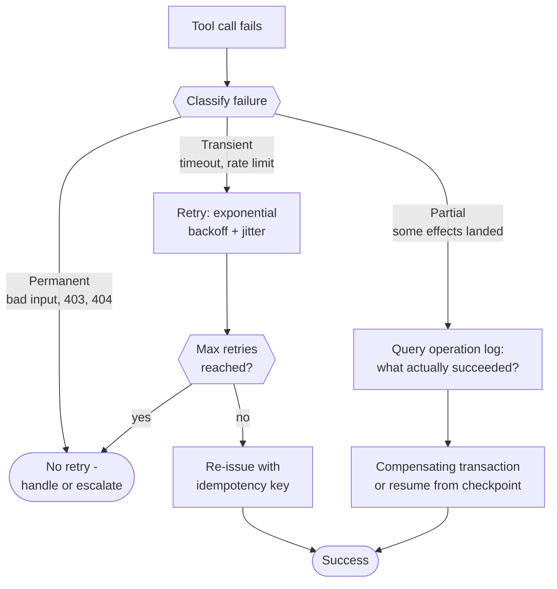
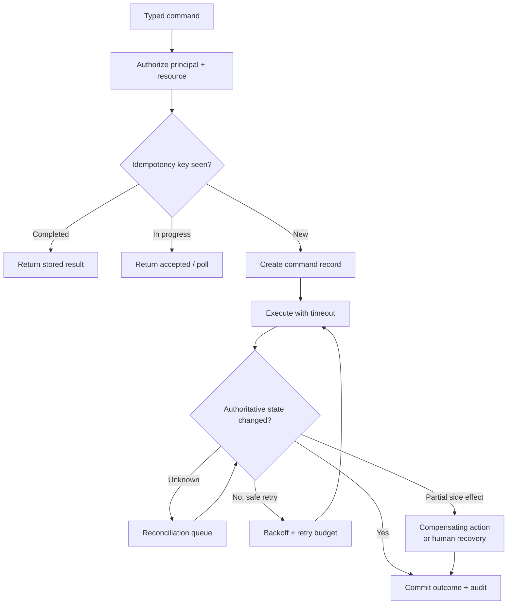
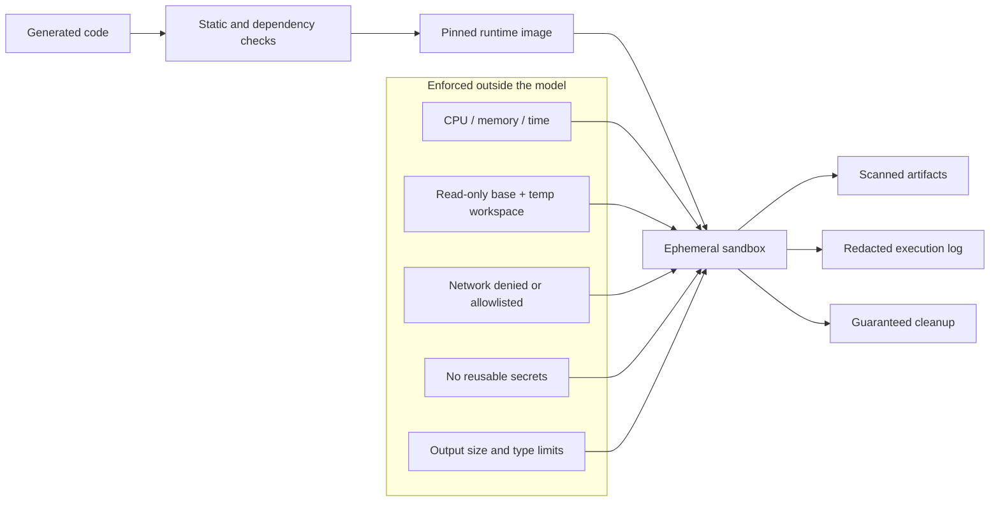
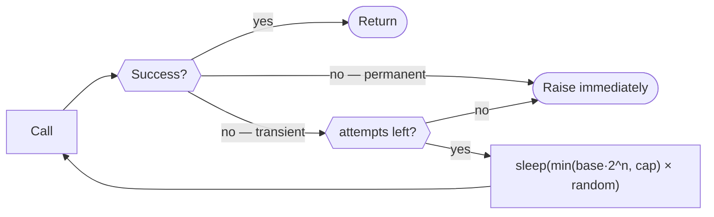

# Part C (2 of 2) — Tool failures, sandboxing, cost and code

← Previous: [Part C (1 of 2) — Tool design](01c-part-c1-tool-design.md) · Index: [Full Read-Through](01-full-read-through.md) · Next: [Part D (1 of 2) — Context engineering and memory](01e-part-d1-context-and-memory.md) →

**Steps in this file**

- [Step 19 · Tool failures, retries and idempotency](01d-part-c2-tool-failures-sandboxing-cost.md#19-read-tool-failures-retries-and-idempotency)
- [Step 20 · Tool execution with idempotency and compensation](01d-part-c2-tool-failures-sandboxing-cost.md#20-study-the-diagram-tool-execution-with-idempotency-and-compensation)
- [Step 21 · Sandboxing tool execution](01d-part-c2-tool-failures-sandboxing-cost.md#21-read-sandboxing-tool-execution)
- [Step 22 · Sandboxed generated-code execution](01d-part-c2-tool-failures-sandboxing-cost.md#22-study-the-diagram-sandboxed-generated-code-execution)
- [Step 23 · Controlling cost explosions from tool calls](01d-part-c2-tool-failures-sandboxing-cost.md#23-read-controlling-cost-explosions-from-tool-calls)
- [Step 24 · Tool registry with schema validation](01d-part-c2-tool-failures-sandboxing-cost.md#24-code-tool-registry-with-schema-validation)
- [Step 25 · Retry with exponential backoff and jitter](01d-part-c2-tool-failures-sandboxing-cost.md#25-code-retry-with-exponential-backoff-and-jitter)
- [Step 26 · Make a create-resource call idempotent](01d-part-c2-tool-failures-sandboxing-cost.md#26-code-make-a-create-resource-call-idempotent)

---

## 19. Read: Tool failures, retries and idempotency

*Source: agentic-ai-system-design-interview-guide-2026.md*

> **Why this step is here.** Tools fail, and how you respond determines whether an agent is safe to run unattended. This step gives you a classification (transient, permanent, partial) that decides the response, three idempotency habits, and three recovery supports. It is the conceptual source for Steps [20](01d-part-c2-tool-failures-sandboxing-cost.md#20-study-the-diagram-tool-execution-with-idempotency-and-compensation), [25](01d-part-c2-tool-failures-sandboxing-cost.md#25-code-retry-with-exponential-backoff-and-jitter) and [26](01d-part-c2-tool-failures-sandboxing-cost.md#26-code-make-a-create-resource-call-idempotent), and the failure taxonomy the coding prep tells you to say aloud before writing any retry code. Read the three failure classes first and make sure you can give an example of each from a payments or ticketing API, then trace the diagram to see that only the transient branch retries and only the partial branch consults the log.

### Step 19 · 22. How do you handle tool failures, retries and idempotency?

Classify the failure first:

- **Transient** (timeout, rate limit) — retry with exponential backoff and jitter, up to a max count
- **Permanent** (bad input, missing resource, permission denied) — don't retry; handle or escalate
- **Partial** (some effects landed) — hardest; requires knowing exactly what succeeded

Design for idempotency:

- Use idempotency keys for operations that create resources
- Check before creating — does this already exist?
- Prefer "ensure state X" semantics over "apply change Y"

Support recovery:

- Log every tool call with a unique ID, its arguments and its result
- Checkpoint state before risky operations
- Use compensating transactions for partial failures, with a clear escalation path when automated recovery fails



#### Going deeper (Step 19)

**Classify before you act.** The three classes need three different responses, and the most common production bug is applying one response to all three.

- *Transient*: the operation might succeed if repeated unchanged. Timeouts, 429 rate limits, 503s, connection resets. Retry with exponential backoff and jitter ([Step 25 · Retry with exponential backoff and jitter](01d-part-c2-tool-failures-sandboxing-cost.md#25-code-retry-with-exponential-backoff-and-jitter)), capped at a small count — three to five attempts is typical — and honour a `Retry-After` header if the server sends one.
- *Permanent*: repeating will not help. 400 bad input, 404 missing resource, 403 permission denied, schema validation failures. Retrying wastes budget and can look like an attack. Return the error to the model (it may fix its arguments) or escalate.
- *Partial*: some effects landed and you do not know which. A `create_order` that timed out after the server committed; a batch of 10 emails where 6 sent. This is the hardest because the safe next action depends on ground truth you have to go and fetch.

**Idempotency turns partial into transient.** If `create_order` accepts an idempotency key, a retry after a timeout either returns the existing order or creates it exactly once. The partial case collapses into a safe retry. That is why the three idempotency habits matter: *keys* for creates, *check-before-create* when the API has no key support (with a known race window, [Step 26 · Make a create-resource call idempotent](01d-part-c2-tool-failures-sandboxing-cost.md#26-code-make-a-create-resource-call-idempotent)), and *ensure-state semantics* — "make sure ticket 42 is closed" is naturally repeatable where "close ticket 42" fails on the second call.

**Recovery needs evidence.** Logging every tool call with a unique ID, arguments and result is what lets the partial branch answer "what actually succeeded?" Checkpointing before risky operations gives you a place to resume from. Compensating transactions (refund the charge, delete the duplicate order) undo effects you cannot roll back, and they can themselves fail, which is why the escalation path is part of the design, not an afterthought.

**Reading the diagram.** Notice that the retry branch re-issues *with an idempotency key* — retry without idempotency is how transient failures become partial ones. Notice too that max-retries flows into the same "handle or escalate" exit as permanent failures: once you stop retrying, the classification no longer matters.

**Common misreading.** Treating every exception as transient and wrapping the whole tool call in a generic retry. This retries 400s uselessly, hammers a rate-limited service, and — worst — retries non-idempotent creates, turning one timeout into two charges. The correction is to classify first and to make retries safe by construction with idempotency keys.

**Connects to.** [Step 20 · Tool execution with idempotency and compensation](01d-part-c2-tool-failures-sandboxing-cost.md#20-study-the-diagram-tool-execution-with-idempotency-and-compensation) is the execution diagram that embeds this logic in a command pipeline. [Step 25 · Retry with exponential backoff and jitter](01d-part-c2-tool-failures-sandboxing-cost.md#25-code-retry-with-exponential-backoff-and-jitter) codes the transient branch; [Step 26 · Make a create-resource call idempotent](01d-part-c2-tool-failures-sandboxing-cost.md#26-code-make-a-create-resource-call-idempotent) codes idempotency. [Step 8 · A safe and debuggable agent loop](01b-part-b-agent-loop-and-control-plane.md#8-read-a-safe-and-debuggable-agent-loop)'s circuit breakers are what trip when retries themselves accumulate.

**Check yourself.**
1. A payments API returns 429. Which class, and what do you do? *Transient: back off with jitter, respect Retry-After, cap attempts.*
2. Why does an idempotency key make the partial-failure case easier? *A retry either returns the existing result or performs the effect exactly once, so you no longer need to know what landed.*
3. What must exist before a compensating transaction is possible? *A log of what was attempted and what succeeded, so you know exactly what to undo.*

---

## 20. Study the diagram: Tool execution with idempotency and compensation

*Source: production-llm-agent-rag-workflow-mermaid-atlas.md*

> **Why this step is here.** [Step 19 · Tool failures, retries and idempotency](01d-part-c2-tool-failures-sandboxing-cost.md#19-read-tool-failures-retries-and-idempotency) gave the rules; this diagram shows where they live in a real execution path, from a typed command arriving to an audited outcome. The important additions are the authorization gate before anything else, the three-way idempotency check (completed, in progress, new), and the "unknown" branch that sends uncertain outcomes to a reconciliation queue rather than guessing. Trace it top to bottom, then ask of each branch which [Step 19 · Tool failures, retries and idempotency](01d-part-c2-tool-failures-sandboxing-cost.md#19-read-tool-failures-retries-and-idempotency) failure class it handles. You will redraw this from memory; [Step 26 · Make a create-resource call idempotent](01d-part-c2-tool-failures-sandboxing-cost.md#26-code-make-a-create-resource-call-idempotent) is the code for the idempotency diamond and [Step 50 · Human approval for consequential actions](01h-part-e2-long-running-agents.md#50-study-the-diagram-human-approval-for-consequential-actions) adds the human-approval gate this diagram assumes happened upstream.

### Step 20 · 13. Tool execution with idempotency and compensation



#### Going deeper (Step 20)

**Walk the diagram.**

*Typed command.* Execution begins with a structured, validated command — not a raw model string. This is the output of [Step 24 · Tool registry with schema validation](01d-part-c2-tool-failures-sandboxing-cost.md#24-code-tool-registry-with-schema-validation)'s registry: name, arguments, and a risk class. Remove it and every downstream box has to defend against malformed input.

*Authorize principal + resource.* Before any idempotency lookup or side effect, check that this user or agent, acting for this tenant, may perform this action on this specific resource. Implementation is usually a policy service or ACL check keyed on `(principal, action, resource_id)`. It comes first because an unauthorized request should never create a command record or consume a retry budget. This is [Step 17 · Discover tools and knowledge progressively](01c-part-c1-tool-design.md#17-read-discover-tools-and-knowledge-progressively)'s "discovery is not authorization" made concrete.

*Idempotency key seen?* Three outcomes, not two. *Completed*: return the stored result — the caller cannot tell it was a replay, which is the point. *In progress*: another worker is executing this same command right now; return "accepted, poll" rather than starting a second execution. *New*: create a command record. The store is typically a database table or Redis keyed by the idempotency key, with the record written *before* execution so a crash mid-way leaves evidence.

*Create command record → Execute with timeout.* The record makes the attempt visible to reconciliation. The timeout is non-negotiable: a call without a deadline can hold the "in progress" state forever and block all replays.

*Authoritative state changed?* This is the box people forget. After execution you do not trust the response; you check the system of record. Four answers: *Yes* → commit and audit. *Unknown* (timeout, ambiguous response) → reconciliation queue, a background job that re-queries the authoritative system later and loops back into the verify diamond. *No, safe retry* → the effect definitely did not land, so re-enter execution with backoff and a retry budget ([Step 25 · Retry with exponential backoff and jitter](01d-part-c2-tool-failures-sandboxing-cost.md#25-code-retry-with-exponential-backoff-and-jitter)). *Partial side effect* → compensating action or human recovery, then commit the final outcome so the record closes.

*Commit outcome + audit.* Writes the result to the command record (so future replays return it) and the audit log. Without this, the idempotency store has no "completed" entries.

**How to redraw it.** Recall five anchors in order: (1) authorize first, (2) idempotency diamond with three exits, (3) execute with timeout, (4) verify against authoritative state, (5) commit and audit. Then add the four verify branches — yes, unknown, safe retry, partial — and finally the two loops: retry back to execute, reconciliation back to verify. If you remember only that verify has an "unknown" branch going to a queue, you have the part most candidates miss.

**Common misreading.** Drawing idempotency as a simple "seen before? yes/no" cache. That misses the in-progress state, so two concurrent retries both execute; and it misses verification, so a "completed" record may store a result the server never actually committed. The correction is three idempotency states and an explicit check of authoritative state before committing.

**Connects to.** [Step 19 · Tool failures, retries and idempotency](01d-part-c2-tool-failures-sandboxing-cost.md#19-read-tool-failures-retries-and-idempotency) is the failure taxonomy each branch handles. [Step 26 · Make a create-resource call idempotent](01d-part-c2-tool-failures-sandboxing-cost.md#26-code-make-a-create-resource-call-idempotent) codes the key derivation and lookup. [Step 49 · Durable LLM workflow](01h-part-e2-long-running-agents.md#49-study-the-diagram-durable-llm-workflow)'s durable workflow diagram wraps this per-command logic in a multi-step process; [Step 50 · Human approval for consequential actions](01h-part-e2-long-running-agents.md#50-study-the-diagram-human-approval-for-consequential-actions) adds approval before the typed command arrives.

**Check yourself.**
1. Why does authorization come before the idempotency check? *An unauthorized request should never create a command record, consume budget, or reveal a stored result.*
2. Two workers receive the same retried command within a second. What prevents a double execution? *The "in progress" idempotency state — the second worker returns accepted/poll instead of executing.*
3. What does the reconciliation queue exist to avoid? *Guessing after an ambiguous response; it defers the decision until authoritative state can be queried.*

---

## 21. Read: Sandboxing tool execution

*Source: agentic-ai-system-design-interview-guide-2026.md*

> **Why this step is here.** Steps [14](01c-part-c1-tool-design.md#14-read-how-agents-decide-which-tool-to-use) to [20](01d-part-c2-tool-failures-sandboxing-cost.md#20-study-the-diagram-tool-execution-with-idempotency-and-compensation) assumed tool execution is safe to attempt; this step asks what contains the damage when a tool, or generated code from [Step 18 · Move loops and data plumbing into code](01c-part-c1-tool-design.md#18-read-move-loops-and-data-plumbing-into-code), does something unexpected. It compresses defense in depth into four layers — isolation, network control, credentials, resource limits — plus two rules that are easy to skip: sanitize tool output before it re-enters context, and fail closed. Read it as a list of things enforced *outside* the model, and for each one ask what attack or accident it stops. [Step 22 · Sandboxed generated-code execution](01d-part-c2-tool-failures-sandboxing-cost.md#22-study-the-diagram-sandboxed-generated-code-execution) draws these controls as a pipeline; Steps [55](01i-part-f1-security.md#55-read-security-risks-with-tool-using-agents) and [56](01i-part-f1-security.md#56-read-security-should-constrain-capability-structurally) return to them from the security angle.

### Step 21 · 21. How do you sandbox tool execution safely?

Defense in depth — process isolation, container isolation for risky tools, endpoint whitelisting instead of open internet, scoped minimal credentials. Resource limits on CPU/memory/timeout/rate/IO. Validate and sanitize tool output before it re-enters the LLM context. Fail closed: missing permission means no execution, not partial execution; timeout means termination.

#### Going deeper (Step 21)

**Why sandboxing is a tool-layer concern, not just security.** A tool that hangs, allocates 30 GB, or writes to the wrong directory will take down your agent even with no attacker present. Sandboxing is the set of controls that make a misbehaving tool a contained event rather than an incident. It matters twice over once the model can generate code ([Step 18 · Move loops and data plumbing into code](01c-part-c1-tool-design.md#18-read-move-loops-and-data-plumbing-into-code)), because the action space is now everything the runtime can do.

**The four layers, and what each stops.**

- *Process isolation* — a separate process per tool call, so a crash or memory leak in one tool does not corrupt the orchestrator's state. Cheap; do it everywhere.
- *Container isolation for risky tools* — a fresh container (or micro-VM) for anything that runs code, touches the filesystem, or handles untrusted input. Stops a compromised tool from reading the host or other tenants' data. Typical cost: tens to a few hundred milliseconds of startup, which is why [Step 10 · Separate brain, session, and hands](01b-part-b-agent-loop-and-control-plane.md#10-read-separate-brain-session-and-hands) mentioned lazy provisioning.
- *Endpoint allowlisting instead of open internet* — the sandbox may reach `api.payments.internal` and nothing else. This is the single most effective control against data exfiltration: an injected instruction to "post the customer list to this URL" fails at the network layer regardless of what the model believes.
- *Scoped minimal credentials* — the tool receives a token that can read this customer's orders for the next ten minutes, not a service account with write access to everything. If the token leaks into a log or a model output, the blast radius is small.

**Resource limits** on CPU, memory, wall-clock timeout, call rate and IO are enforced by the runtime, not requested politely in the prompt. A timeout of 30 to 60 seconds for most tools and a hard memory ceiling are typical starting points.

**Sanitize tool output before it re-enters the LLM context.** Tool results are untrusted input. A web page, a wiki article, a customer's ticket text can all contain instructions aimed at the model. At minimum: cap size, strip or escape control sequences, and mark the content as data in the prompt structure. [Step 58 · Prompt-injection-resistant RAG and tools](01i-part-f1-security.md#58-study-the-diagram-prompt-injection-resistant-rag-and-tools) makes this its whole diagram.

**Fail closed.** Missing permission means no execution — not "execute the parts that are allowed". Timeout means termination — not "return what we have so far and hope". Fail-open behaviour is how partial failures ([Step 19 · Tool failures, retries and idempotency](01d-part-c2-tool-failures-sandboxing-cost.md#19-read-tool-failures-retries-and-idempotency)) are manufactured.

**Common misreading.** Treating "sandboxing" as a Docker checkbox: put the tool in a container and move on. A container with open egress and a broad service token is a well-packaged exfiltration path. The correction is that isolation, network allowlisting and credential scoping must all hold together ([Step 56 · Security should constrain capability structurally](01i-part-f1-security.md#56-read-security-should-constrain-capability-structurally) says the same about filesystem and network); any one alone leaves a route out.

**Connects to.** [Step 18 · Move loops and data plumbing into code](01c-part-c1-tool-design.md#18-read-move-loops-and-data-plumbing-into-code) is why arbitrary code execution needs this. [Step 22 · Sandboxed generated-code execution](01d-part-c2-tool-failures-sandboxing-cost.md#22-study-the-diagram-sandboxed-generated-code-execution) is the pipeline diagram of these controls. Steps [56](01i-part-f1-security.md#56-read-security-should-constrain-capability-structurally) and [58](01i-part-f1-security.md#58-study-the-diagram-prompt-injection-resistant-rag-and-tools) cover the injection and exfiltration threats sandboxing contains.

**Check yourself.**
1. Why is endpoint allowlisting more reliable than instructing the model never to send data externally? *It is enforced by the network layer; the model can be convinced, the firewall cannot.*
2. A tool is missing one of three required permissions. What does fail-closed mean here? *No execution at all — not running the two permitted parts.*
3. Why treat tool output as untrusted when the tool is your own database? *The rows may contain user-supplied text carrying instructions; the source being yours does not make the content safe.*

---

## 22. Study the diagram: Sandboxed generated-code execution

*Source: production-llm-agent-rag-workflow-mermaid-atlas.md*

> **Why this step is here.** [Step 18 · Move loops and data plumbing into code](01c-part-c1-tool-design.md#18-read-move-loops-and-data-plumbing-into-code) argued for letting the model write code; [Step 21 · Sandboxing tool execution](01d-part-c2-tool-failures-sandboxing-cost.md#21-read-sandboxing-tool-execution) listed the controls that make that survivable. This diagram is the two joined: the lifecycle of one generated program from static scan to guaranteed cleanup, with the limits drawn as a separate box labelled "enforced outside the model" to make the trust boundary visible. Trace left to right, then read the limits subgraph as a checklist you would recite when an interviewer asks "how do you let an agent run code safely?" You will redraw it; the three output boxes on the right are the ones most people forget.

### Step 22 · 16. Sandboxed generated-code execution



#### Going deeper (Step 22)

**Walk the diagram.**

*Generated code.* The model's output — a script to filter, join or transform, as in [Step 18 · Move loops and data plumbing into code](01c-part-c1-tool-design.md#18-read-move-loops-and-data-plumbing-into-code). It is untrusted by definition: it may be wrong, or it may have been steered by injected content.

*Static and dependency checks.* Before anything runs: lint for forbidden calls (`subprocess`, raw sockets, `eval`), check imports against an allowlist, scan dependency manifests for known-bad or unpinned packages. This catches the obvious cases in milliseconds and is the cheapest layer. Remove it and every dangerous script reaches the sandbox, where containment is your only defence.

*Pinned runtime image.* A specific, versioned image with a fixed interpreter and vetted libraries. Pinning gives reproducibility ([Step 8 · A safe and debuggable agent loop](01b-part-b-agent-loop-and-control-plane.md#8-read-a-safe-and-debuggable-agent-loop)'s "same snapshot, same result") and removes "it worked yesterday" bugs from floating dependencies. Implementation is a container image digest in a registry you control.

*Ephemeral sandbox.* A fresh container or micro-VM per execution, destroyed afterward. Nothing persists between runs unless explicitly emitted as an artifact, so a compromised run cannot leave a foothold for the next one.

*The limits subgraph.* Five controls, all enforced by the runtime, never by the prompt: CPU/memory/time (cgroups and a hard timeout); a read-only base filesystem plus a scratch workspace (the script can write, but only where you said); network denied or allowlisted ([Step 21 · Sandboxing tool execution](01d-part-c2-tool-failures-sandboxing-cost.md#21-read-sandboxing-tool-execution)'s most valuable control); no reusable secrets (short-lived scoped tokens injected at start, or a proxy that holds the real credential outside the sandbox); and output size and type limits (a script that emits 2 GB or a binary where you expected JSON is stopped). The subgraph label is the design point: the model is not trusted to observe any of these.

*Scanned artifacts.* Files the run produced are scanned — size, type, secrets, malware — before they are stored or returned to context. *Redacted execution log.* Stdout and stderr are kept for debugging ([Step 66 · End-to-end observability](01j-part-f2-evaluation-and-observability.md#66-study-the-diagram-end-to-end-observability)'s observability), with PII and secrets stripped. *Guaranteed cleanup.* The sandbox is torn down even if the script hangs or the orchestrator crashes — typically a supervisor with its own timeout, not a `finally` block in the same process.

**How to redraw it.** Anchors: (1) code → scan → pinned image → sandbox as a horizontal spine; (2) the limits box feeding the sandbox from above, labelled "enforced outside the model"; (3) three outputs on the right: artifacts, log, cleanup. Then fill the five limits — say them as CPU, filesystem, network, secrets, output — and finally add "scanned" and "redacted" as adjectives on the outputs, because unscanned artifacts and unredacted logs are how untrusted content and secrets leak back in.

**Common misreading.** Drawing a single box labelled "sandbox" between code and result. Interviewers then ask "what stops it from calling home with the secrets it was given?" and the answer must come from three separate controls — network allowlist, no reusable secrets, scanned outputs — not from "it's sandboxed". The correction is to name the individual limits and say who enforces each.

**Connects to.** [Step 18 · Move loops and data plumbing into code](01c-part-c1-tool-design.md#18-read-move-loops-and-data-plumbing-into-code) is the motivation; [Step 21 · Sandboxing tool execution](01d-part-c2-tool-failures-sandboxing-cost.md#21-read-sandboxing-tool-execution) is the prose version of the limits. [Step 10 · Separate brain, session, and hands](01b-part-b-agent-loop-and-control-plane.md#10-read-separate-brain-session-and-hands)'s "hands" are these sandboxes; [Step 56 · Security should constrain capability structurally](01i-part-f1-security.md#56-read-security-should-constrain-capability-structurally) explains why filesystem and network isolation only work together; [Step 66 · End-to-end observability](01j-part-f2-evaluation-and-observability.md#66-study-the-diagram-end-to-end-observability) consumes the execution log.

**Check yourself.**
1. Why pin the runtime image rather than install dependencies at run time? *Reproducibility and supply-chain safety: the same code runs against the same vetted libraries every time.*
2. What does "no reusable secrets" look like in practice? *A short-lived, narrowly scoped token injected per run, or a proxy that holds the real credential outside the sandbox.*
3. Why are artifacts scanned on the way out if the input code was already scanned? *The code's behaviour, not its text, determines the output; artifacts may carry injected content, secrets or oversized data back into context.*

---

## 23. Read: Controlling cost explosions from tool calls

*Source: agentic-ai-system-design-interview-guide-2026.md*

> **Why this step is here.** Every retry in [Step 19 · Tool failures, retries and idempotency](01d-part-c2-tool-failures-sandboxing-cost.md#19-read-tool-failures-retries-and-idempotency) and every code run in [Step 22 · Sandboxed generated-code execution](01d-part-c2-tool-failures-sandboxing-cost.md#22-study-the-diagram-sandboxed-generated-code-execution) costs money, and an agent loop that misbehaves can spend it faster than a human can notice. This step is the tool-layer view of cost control: budgets at three scopes, enforced by a tracker that refuses rather than warns, plus the operational tooling around it. Read it for the three scopes, the three tiers, and the closing attitude — assume loops run long, set budgets that hurt but do not ruin, and investigate every trip. [Step 68 · Track and enforce a cost budget across an agent session](01j-part-f2-evaluation-and-observability.md#68-code-track-and-enforce-a-cost-budget-across-an-agent-session) is the tracker as code; [Step 71 · Model gateway and cost-aware routing](01k-part-f3-production-operations.md#71-study-the-diagram-model-gateway-and-cost-aware-routing) moves cost control into the model gateway.

### Step 23 · 24. How do you control cost explosions from tool calls?

Session, per-user and per-operation budgets enforced by a budget tracker that refuses operations whose estimated cost exceeds the remaining limit. Expose cost to the agent for cost-aware tool choice. Tier by cost: free / soft-limit-and-warn / human approval. Add real-time dashboards, spend-rate alerts, automatic shutdown, and post-incident analysis. Assume loops run longer than expected; set budgets that hurt but don't ruin, and investigate every trip.

#### Going deeper (Step 23)

**How cost explodes.** A single model call is cheap — fractions of a cent to a few cents. The danger is multiplication: a loop that should take 5 steps takes 50 because the model keeps re-reading a large tool result; a fan-out spawns 200 sub-tasks instead of 20; a retry decorator without a cap hammers a paid API; a stuck loop ([Step 13 · Detect a stuck agent loop](01b-part-b-agent-loop-and-control-plane.md#13-code-detect-a-stuck-agent-loop)) runs all night. Each is individually plausible and together they are the "runaway cost" failure mode [Step 69 · Most dangerous failure modes of agentic AI](01k-part-f3-production-operations.md#69-read-most-dangerous-failure-modes-of-agentic-ai) ranks among the most dangerous.

**Three scopes, because failures happen at different granularities.** A *per-operation* budget catches one absurd action (a single tool call estimated at $40). A *per-session* budget catches a loop that is individually reasonable but collectively too long. A *per-user* (or per-tenant, per-day) budget catches many sessions each just under the session limit — the pattern an abusive or buggy client produces. Typical shape: operation caps in cents, session caps in single-digit dollars, daily user caps in tens of dollars, all tuned to your economics.

**Refuse, do not warn.** The budget tracker estimates the cost of a proposed operation *before* it runs and refuses if the estimate exceeds the remainder. Estimation is approximate — input tokens are known, output tokens are a guess — so use a conservative estimate and record the actual afterward ([Step 12 · Build a minimal agent loop from scratch](01b-part-b-agent-loop-and-control-plane.md#12-code-build-a-minimal-agent-loop-from-scratch-30-min-this-makes-part-b-concrete)'s agent does exactly `check` then `record`). A tracker that only logs overspend is a dashboard, not a control.

**Expose cost to the agent.** If the tool menu says `search_web` costs about $0.02 and `deep_research` about $2.00, the model can make cost-aware choices and you can instruct it to prefer cheap tools first. This is part of the tool description ([Step 16 · Design tools for agents, not only developers](01c-part-c1-tool-design.md#16-read-design-tools-for-agents-not-only-developers)), not a separate system.

**Three tiers by cost.** Free: run without ceremony. Soft limit: run, warn, and log for review. Human approval: stop and ask ([Step 50 · Human approval for consequential actions](01h-part-e2-long-running-agents.md#50-study-the-diagram-human-approval-for-consequential-actions)). Tiering keeps friction proportional; a $0.001 lookup should never wait for a human.

**Operations around the tracker.** Real-time dashboards show spend by session and tenant; spend-rate alerts catch a loop that is within budget but burning ten times faster than normal; automatic shutdown trips when a rate or total threshold is crossed; post-incident analysis asks why the budget was needed. "Investigate every trip" is the important habit — a tripped budget is a bug report about the loop, not a nuisance.

**Common misreading.** Setting the budget so high it never trips, "to avoid false positives." A budget that never trips gives you no signal and no protection; the point is that it *does* trip on the real anomalies at a level you can afford. The correction is the note's phrase: hurt but not ruin, and treat each trip as diagnostic data.

**Connects to.** [Step 8 · A safe and debuggable agent loop](01b-part-b-agent-loop-and-control-plane.md#8-read-a-safe-and-debuggable-agent-loop)'s circuit breakers include the cost cap this step details. [Step 12 · Build a minimal agent loop from scratch](01b-part-b-agent-loop-and-control-plane.md#12-code-build-a-minimal-agent-loop-from-scratch-30-min-this-makes-part-b-concrete) already calls `budget.check` and `budget.record`. [Step 68 · Track and enforce a cost budget across an agent session](01j-part-f2-evaluation-and-observability.md#68-code-track-and-enforce-a-cost-budget-across-an-agent-session) implements the tracker; [Step 71 · Model gateway and cost-aware routing](01k-part-f3-production-operations.md#71-study-the-diagram-model-gateway-and-cost-aware-routing) adds cost-aware routing at the gateway; [Step 69 · Most dangerous failure modes of agentic AI](01k-part-f3-production-operations.md#69-read-most-dangerous-failure-modes-of-agentic-ai) explains why runaway cost is a top failure mode.

**Check yourself.**
1. Why have a per-user budget when every session is already capped? *Many sessions each just under the cap is how a buggy or abusive client spends; only a wider scope catches it.*
2. What is the difference between a budget tracker and a cost dashboard? *The tracker refuses an operation before it runs; the dashboard only shows what already happened.*
3. A session budget trips once a week. Good or bad? *Good if each trip is investigated and turns out to be a real anomaly; it means the limit is tight enough to carry signal.*

---

## 24. Code: Tool registry with schema validation

*Source: google-fde-python-coding-prep.md*

> **Why this step is here.** Steps [14](01c-part-c1-tool-design.md#14-read-how-agents-decide-which-tool-to-use) and [15](01c-part-c1-tool-design.md#15-read-tool-schemas-that-reduce-hallucinated-actions) said a tool call must be validated against a schema and fail closed for unknown tools; this is that gate as sixty lines of Python, and the `registry` object [Step 12 · Build a minimal agent loop from scratch](01b-part-b-agent-loop-and-control-plane.md#12-code-build-a-minimal-agent-loop-from-scratch-30-min-this-makes-part-b-concrete)'s agent loop already called. The design point is the separation of registration, validation and dispatch into three methods, with a risk class attached at registration so that permission checks live in the registry rather than in the model. Read the decorator first to see how the schema is derived from the function itself, then follow `call` to see the order of checks. [Step 50 · Human approval for consequential actions](01h-part-e2-long-running-agents.md#50-study-the-diagram-human-approval-for-consequential-actions)'s approval flow is what `PermissionError` hands off to.

### Step 24 · Q29. Tool registry with schema validation

**Prompt.** Build a registry where tools are registered with a JSON schema, and a proposed call is validated before execution.

**Why FDE:** Q19/Q20 of your design note. A likely vibe-coding task, since it's open-ended and production-shaped.

**Thinking process**

- Separate the three concerns: **registration**, **validation**, **dispatch**. Say the separation out loud; it's the design point.
- Validate *before* executing, and never dispatch a tool name that isn't registered — a hallucinated tool must fail closed, not raise a confusing `KeyError` deep in the stack.
- Auto-derive the schema from type hints if you can; it removes a class of drift between docs and code.

```python
import inspect
from typing import get_type_hints

class ToolRegistry:
    def __init__(self):
        self.tools = {}

    def register(self, fn=None, *, risk="read"):
        def deco(f):
            hints = get_type_hints(f)
            sig = inspect.signature(f)
            params = {
                name: {
                    "type": hints.get(name, str).__name__,
                    "required": p.default is inspect.Parameter.empty,
                }
                for name, p in sig.parameters.items()
            }
            self.tools[f.__name__] = {
                "fn": f, "params": params, "risk": risk,
                "doc": (f.__doc__ or "").strip(),
            }
            return f
        return deco(fn) if fn else deco

    def validate(self, name, args):
        spec = self.tools.get(name)
        if spec is None:
            return [f"unknown tool {name!r}"]           # fail closed
        problems = []
        for p, meta in spec["params"].items():
            if meta["required"] and p not in args:
                problems.append(f"missing required arg {p!r}")
        for k in args:
            if k not in spec["params"]:
                problems.append(f"unexpected arg {k!r}")
        return problems

    def call(self, name, args, allowed_risk=("read",)):
        problems = self.validate(name, args)
        if problems:
            raise ValueError("; ".join(problems))
        if self.tools[name]["risk"] not in allowed_risk:
            raise PermissionError(f"{name} requires approval")
        return self.tools[name]["fn"](**args)
```

**Follow-ups:** How do you keep the model's tool list short when you have 50 tools? (Context-scoped subsets — Q19: fewer tools is better.) How do you version a tool schema without breaking running sessions?

#### Going deeper (Step 24)

**Read the code.**

*Registration.* `register` works both as `@reg.register` and `@reg.register(risk="write")` — the `fn=None` plus keyword-only `risk` pattern is what allows both. Inside, `get_type_hints` and `inspect.signature` derive the parameter spec from the function: each parameter's type name and whether it is required (no default). This is the "auto-derive" idea from the thinking notes — the schema cannot drift from the code because it *is* the code. The docstring becomes the description the model will read ([Step 16 · Design tools for agents, not only developers](01c-part-c1-tool-design.md#16-read-design-tools-for-agents-not-only-developers)), so docstrings are now part of the tool contract, not a nicety. The `risk` label defaults to `"read"`, the safe direction: a tool that forgets to declare itself risky is still gated by the caller's `allowed_risk`.

*Validation.* `validate` returns a list of problems rather than raising, so the caller can hand *all* of them to the model at once ([Step 12 · Build a minimal agent loop from scratch](01b-part-b-agent-loop-and-control-plane.md#12-code-build-a-minimal-agent-loop-from-scratch-30-min-this-makes-part-b-concrete) joins them into one `tool_error`). The first check — unknown tool name — returns immediately with a clear message. That is the fail-closed rule from Steps [14](01c-part-c1-tool-design.md#14-read-how-agents-decide-which-tool-to-use) and [15](01c-part-c1-tool-design.md#15-read-tool-schemas-that-reduce-hallucinated-actions): a hallucinated tool name becomes a readable error the model can recover from, not a `KeyError` from deep inside dispatch. Then two invariants: every required parameter is present, and no unexpected keys are passed. The second matters more than it looks; unexpected keys are how a model smuggles in a field the tool never defined.

*Dispatch.* `call` runs validation, then the risk check, then executes. The order is deliberate: never evaluate permissions on a malformed call, and never execute before both pass. `ValueError` means "the model made a mistake, let it retry"; `PermissionError` means "the model made a valid request that needs a human" — [Step 12 · Build a minimal agent loop from scratch](01b-part-b-agent-loop-and-control-plane.md#12-code-build-a-minimal-agent-loop-from-scratch-30-min-this-makes-part-b-concrete) returns `needs_approval` on exactly this exception. Two different exception types because they need two different orchestrator responses.

**Complexity and edge cases.** Registration is O(parameters) once; validation is O(parameters + arguments) per call, negligible next to the model call. Edge cases worth naming: the code checks presence and names but *not types* — `"type"` is recorded and never enforced; `*args` or `**kwargs` in a tool signature would appear as required parameters and always fail validation; `.__name__` on some `typing` generics can fail depending on Python version; registering two functions with the same name silently overwrites. In an interview, name the type gap before the interviewer does.

**Say this aloud.** "I am separating registration, validation and dispatch so the model's proposal is checked against a contract derived from the code before anything runs. Unknown tools fail closed with a message the model can read, and the risk class lets the orchestrator — not the model — decide what needs approval. This is the same gate you would draw at the tool-execution box in the architecture diagram."

**One variation.** "Enforce types too" — compare `type(args[p]).__name__` to the recorded type, or better, emit a real JSON Schema from the hints and use a `jsonschema` validator so you also get enums, ranges and formats from [Step 15 · Tool schemas that reduce hallucinated actions](01c-part-c1-tool-design.md#15-read-tool-schemas-that-reduce-hallucinated-actions). Or "version the schema without breaking running sessions" — key the registry by `(name, version)`, pin a session to the versions it started with, and only expose new versions to new sessions.

**Common misreading.** Candidates put the permission check inside each tool function or, worse, in the system prompt. Then the registry cannot answer "what can this session do?" and the approval decision is scattered. The correction is what this code does: risk is metadata on the tool, and the caller decides which risk levels it is willing to run right now.

**Connects to.** [Step 12 · Build a minimal agent loop from scratch](01b-part-b-agent-loop-and-control-plane.md#12-code-build-a-minimal-agent-loop-from-scratch-30-min-this-makes-part-b-concrete) is the loop that consumes `validate` and `call`. Steps [14](01c-part-c1-tool-design.md#14-read-how-agents-decide-which-tool-to-use) and [15](01c-part-c1-tool-design.md#15-read-tool-schemas-that-reduce-hallucinated-actions) are the design rules it enforces. [Step 50 · Human approval for consequential actions](01h-part-e2-long-running-agents.md#50-study-the-diagram-human-approval-for-consequential-actions) is the approval flow behind `PermissionError`; [Step 17 · Discover tools and knowledge progressively](01c-part-c1-tool-design.md#17-read-discover-tools-and-knowledge-progressively) is how you would keep `self.tools` short per context.

**Check yourself.**
1. Why return a list from `validate` instead of raising on the first problem? *So the model receives every problem at once and can fix its call in one retry.*
2. Why are `ValueError` and `PermissionError` different exceptions? *They demand different orchestrator responses: retry with feedback versus pause for approval.*
3. A model passes `order_id="abc"` where an `int` is expected. Does this code catch it? *No — it records types but only checks presence and unexpected keys; say so and offer JSON Schema enforcement.*

---

## 25. Code: Retry with exponential backoff and jitter

*Source: google-fde-python-coding-prep.md*

> **Why this step is here.** [Step 19 · Tool failures, retries and idempotency](01d-part-c2-tool-failures-sandboxing-cost.md#19-read-tool-failures-retries-and-idempotency) said transient failures get exponential backoff with jitter and a cap, and permanent ones never retry; this decorator is that sentence in twenty lines, and the coding prep calls it the most likely code you will write on the job. The details that carry signal are the jitter multiplier, the delay cap, and the `retry_on` tuple that encodes the transient/permanent split as types. Read the flowchart first, then match each diamond to a line of the wrapper. [Step 26 · Make a create-resource call idempotent](01d-part-c2-tool-failures-sandboxing-cost.md#26-code-make-a-create-resource-call-idempotent) handles what this step deliberately does not: making the retried call safe when it might have partly succeeded.

### Step 25 · Q16. Retry with exponential backoff and jitter

**Prompt.** Write a decorator that retries a flaky call with exponential backoff, jitter, a max attempt count, and retries only on transient errors.

**Why FDE:** the most likely single piece of code you will write on the job. Google's own postings describe the role as clearing integration blockers.

**Thinking process**

- Lead with the failure taxonomy from your design note: **transient → retry; permanent → never retry; partial → hardest.** Saying this before coding frames you as someone who's been paged at 3am.
- **Jitter is the point.** Without it, every client retries in lockstep and you get a thundering herd that keeps the recovering service down. Say this — it's the detail that separates copied code from understood code.
- Cap the delay. Unbounded exponential means attempt 10 sleeps for 17 minutes.



```python
import random, time, functools

class Transient(Exception): pass
class Permanent(Exception): pass

def retry(attempts=5, base=0.5, cap=30.0, retry_on=(Transient,)):
    def deco(fn):
        @functools.wraps(fn)
        def wrapper(*args, **kwargs):
            for n in range(attempts):
                try:
                    return fn(*args, **kwargs)
                except retry_on as e:
                    if n == attempts - 1:
                        raise
                    delay = min(base * (2 ** n), cap)
                    time.sleep(delay * (0.5 + random.random()))   # full-ish jitter
            raise RuntimeError("unreachable")
        return wrapper
    return deco
```

**Complexity:** worst-case wall time is the sum of the capped delays — be ready to compute it.

**Follow-ups:** Respect a `Retry-After` header (you should prefer the server's number over your own). Budget the *total* time rather than the attempt count. Idempotency — see Q17, and volunteer the connection.

#### Going deeper (Step 25)

**Read the code.**

*The exception taxonomy.* `Transient` and `Permanent` are two empty classes, but they are the design. `retry_on=(Transient,)` means the `except` clause catches only what you declared transient; a `Permanent` (or any other exception) passes straight through the `try` and propagates on the first attempt. Classification is done by the tool author who raises the right type, not by the retry logic guessing from a message string. In a real client you would map HTTP 429/503/timeouts to `Transient` and 4xx to `Permanent` at the adapter boundary.

*The loop.* `for n in range(attempts)` gives exactly `attempts` calls. On success, return immediately — the happy path costs nothing. On a transient error, the `n == attempts - 1` check re-raises the *original* exception on the last attempt so the caller sees the real cause, not a wrapper. Only when attempts remain does the wrapper sleep.

*The delay.* `min(base * 2 ** n, cap)` is exponential growth with a ceiling. Without the cap, attempt 10 at base 0.5 s sleeps 256 s; with `cap=30` the sequence is 0.5, 1, 2, 4, 8, 16, 30, 30… The multiplier `(0.5 + random.random())` scales each delay to between 0.5x and 1.5x. That is the jitter: if 1,000 clients all fail at the same instant, they no longer retry at the same instant, so the recovering service sees a spread of load instead of a second spike. This is the detail the notes tell you to say aloud.

*The unreachable line.* `raise RuntimeError("unreachable")` exists because the loop always either returns or raises; it satisfies readers and type checkers, and would fire only if `attempts <= 0`.

**Complexity and edge cases.** Worst-case wall time is the sum of the `attempts - 1` sleeps: for the defaults, 0.5 + 1 + 2 + 4 = 7.5 s expected, up to about 11.25 s at maximum jitter, plus the call durations themselves. Be ready to do that arithmetic. `attempts=0` hits the unreachable line instead of a clear error. `time.sleep` blocks the thread — in an async agent you need `asyncio.sleep` and an `async def` wrapper. The decorator retries the whole function, so if the function is not idempotent, retrying it is unsafe — which is the handoff to [Step 26 · Make a create-resource call idempotent](01d-part-c2-tool-failures-sandboxing-cost.md#26-code-make-a-create-resource-call-idempotent).

**Say this aloud.** "I classify before I retry: only exceptions I declared transient are retried, everything else fails fast. The backoff is exponential with a cap so the worst case is bounded, and jittered so a fleet of clients does not synchronize into a thundering herd. I would only wrap idempotent calls in this, or pair it with an idempotency key."

**One variation.** "Respect `Retry-After`" — attach the server's suggested delay to the `Transient` exception and use `max(server_delay, computed_delay)`, because the server knows its own recovery better than your formula. Or "budget total time instead of attempts" — record a deadline at entry and stop retrying when the next sleep would cross it, which is what latency-sensitive callers actually care about.

**Common misreading.** Writing `except Exception` and retrying everything. This retries permission errors and bad input (wasting budget and masking bugs), and retries non-idempotent writes (creating duplicates). The second misreading is skipping jitter "because it's just a random number" — it is the one line that protects the downstream service rather than your own call.

**Connects to.** [Step 19 · Tool failures, retries and idempotency](01d-part-c2-tool-failures-sandboxing-cost.md#19-read-tool-failures-retries-and-idempotency) is the taxonomy the exception types encode. [Step 26 · Make a create-resource call idempotent](01d-part-c2-tool-failures-sandboxing-cost.md#26-code-make-a-create-resource-call-idempotent) makes the retried operation safe. [Step 8 · A safe and debuggable agent loop](01b-part-b-agent-loop-and-control-plane.md#8-read-a-safe-and-debuggable-agent-loop)'s circuit breakers sit above this: many retries in a row should trip the consecutive-error breaker. [Step 68 · Track and enforce a cost budget across an agent session](01j-part-f2-evaluation-and-observability.md#68-code-track-and-enforce-a-cost-budget-across-an-agent-session)'s budget should count retries as spend.

**Check yourself.**
1. Why does the last attempt re-raise the original exception instead of a custom one? *So the caller sees the real cause and can classify or log it; wrapping would hide it.*
2. Compute the expected total sleep for `attempts=4, base=1, cap=30`. *1 + 2 + 4 = 7 s expected; up to 10.5 s at maximum jitter.*
3. What must be true of the wrapped function for this decorator to be safe? *It must be idempotent, or be paired with an idempotency key, or a retry may duplicate a side effect.*

---

## 26. Code: Make a create-resource call idempotent

*Source: google-fde-python-coding-prep.md*

> **Why this step is here.** Steps [19](01d-part-c2-tool-failures-sandboxing-cost.md#19-read-tool-failures-retries-and-idempotency) and [20](01d-part-c2-tool-failures-sandboxing-cost.md#20-study-the-diagram-tool-execution-with-idempotency-and-compensation) said partial failures become safe retries once the operation is idempotent, and [Step 25 · Retry with exponential backoff and jitter](01d-part-c2-tool-failures-sandboxing-cost.md#25-code-retry-with-exponential-backoff-and-jitter)'s decorator is only safe on idempotent calls; this step supplies the missing piece for the hardest case — a create call whose retry double-charges. It shows both mechanisms named in [Step 19 · Tool failures, retries and idempotency](01d-part-c2-tool-failures-sandboxing-cost.md#19-read-tool-failures-retries-and-idempotency), a server-honoured idempotency key and check-before-create, layered in one client, and derives the key from the request so a retry of the same logical operation reuses it. Read `_key` first, then trace the three lookups in `create_order` in order and ask what each one protects against. The follow-ups about shared caches and nonces are where interviewers go next.

### Step 26 · Q17. Make a create-resource call idempotent

**Prompt.** A `create_order` API is not idempotent; a retry can double-charge. Wrap it so retries are safe.

**Why FDE:** the partial-failure case. The request succeeded server-side but the response was lost — retrying naively creates a second order.

**Thinking process**

- Two mechanisms, name both: an **idempotency key** the server honors, or **check-before-create** if it doesn't.
- Be honest that check-before-create has a race window; the key is strictly better when the API supports it. Interviewers like candidates who name the weakness of their own fallback.
- Derive the key deterministically from the request content so a retry of the *same logical operation* reuses it.

```python
import hashlib, json

class IdempotentClient:
    def __init__(self, api):
        self.api = api
        self._cache = {}                       # in prod: Redis with a TTL

    def _key(self, payload):
        blob = json.dumps(payload, sort_keys=True).encode()
        return hashlib.sha256(blob).hexdigest()

    def create_order(self, payload):
        key = self._key(payload)
        if key in self._cache:
            return self._cache[key]
        existing = self.api.find_by_idempotency_key(key)   # server-side check
        if existing:
            self._cache[key] = existing
            return existing
        result = self.api.create_order(payload, idempotency_key=key)
        self._cache[key] = result
        return result
```

**Follow-ups:** Where does the cache live if you have 10 workers? (Shared store, not process memory — and say why.) What TTL? What if the customer legitimately wants two identical orders? (Then the key must include a client-supplied nonce — a genuinely good catch.)

#### Going deeper (Step 26)

**Read the code.**

*The key.* `_key` serializes the payload with `sort_keys=True` and hashes it. Sorting matters: `{"a":1,"b":2}` and `{"b":2,"a":1}` are the same order and must produce the same key. Deriving the key from content means a retry — whether from [Step 25 · Retry with exponential backoff and jitter](01d-part-c2-tool-failures-sandboxing-cost.md#25-code-retry-with-exponential-backoff-and-jitter)'s decorator, a crashed worker, or a user double-clicking — regenerates the same key without anyone having to remember it. The invariant: same logical operation, same key. The failure mode: if the payload contains a timestamp or a random request ID, every retry gets a new key and the protection silently disappears. Strip volatile fields before hashing.

*Three lookups in order.* First, the local `_cache`: cheapest, catches a retry within this process. Second, `find_by_idempotency_key` on the server: catches the [Step 19 · Tool failures, retries and idempotency](01d-part-c2-tool-failures-sandboxing-cost.md#19-read-tool-failures-retries-and-idempotency) partial case where the create succeeded but the response was lost, or where a different worker did the create. Third, `create_order` *with* the key attached: the server can now dedupe even if two requests race past both checks. Each layer is a fallback for the one before it; each result is written back to the cache so the next retry stops at layer one.

*What the caller receives.* The same order object whether this was the first call or the fifth retry. The caller cannot tell the difference, which is the definition of idempotent.

**Complexity and edge cases.** Hashing is O(payload size); the lookups are one cache hit and up to two network calls. Edge cases to name: the in-memory `_cache` dies with the process and is invisible to other workers — the comment says Redis with a TTL, and you should say *why* (ten workers, ten caches, no dedup). The TTL must exceed the longest plausible retry window, typically hours to a day. Check-before-create has a race window between `find` and `create`; passing the key to `create_order` closes it *only if the server honours the key* — if it does not, name the residual race honestly. `json.dumps` raises on non-serializable values (a `Decimal`, a `datetime`), so canonicalize first. And two genuinely identical orders from the same customer collide; the fix is a client-supplied nonce inside the payload so intent, not just content, defines identity.

**Say this aloud.** "The partial-failure case is the one that double-charges: the server committed but we never saw the response. I derive an idempotency key from the canonical request so any retry reuses it, check locally, check the server, and pass the key on create so the server can dedupe the race I cannot see. Check-before-create alone has a window; the server-honoured key is what actually closes it."

**One variation.** "Make it work across ten workers" — replace `_cache` with a shared store using an atomic set-if-absent (`SETNX`-style) that records an *in progress* marker before the create, so a concurrent worker sees the marker and waits or polls rather than creating — which is exactly the three-state idempotency diamond in [Step 20 · Tool execution with idempotency and compensation](01d-part-c2-tool-failures-sandboxing-cost.md#20-study-the-diagram-tool-execution-with-idempotency-and-compensation).

**Common misreading.** Believing the local cache is the idempotency mechanism. It is only an optimization; the mechanism is the key the server stores and checks. A second misreading is hashing the entire request including headers and timestamps, which makes every retry unique and defeats the design. Say what goes into the key and what is excluded.

**Connects to.** [Step 19 · Tool failures, retries and idempotency](01d-part-c2-tool-failures-sandboxing-cost.md#19-read-tool-failures-retries-and-idempotency) names both mechanisms; [Step 20 · Tool execution with idempotency and compensation](01d-part-c2-tool-failures-sandboxing-cost.md#20-study-the-diagram-tool-execution-with-idempotency-and-compensation) is the server-side state machine this client talks to. [Step 25 · Retry with exponential backoff and jitter](01d-part-c2-tool-failures-sandboxing-cost.md#25-code-retry-with-exponential-backoff-and-jitter) is the retry this makes safe. [Step 49 · Durable LLM workflow](01h-part-e2-long-running-agents.md#49-study-the-diagram-durable-llm-workflow)'s durable workflow relies on every step being idempotent in this sense.

**Check yourself.**
1. Why sort keys before hashing? *So semantically identical payloads with different key order produce the same idempotency key.*
2. The create succeeded but the network dropped the response. Which lookup rescues the retry? *The server-side `find_by_idempotency_key` — the local cache never saw a result.*
3. A customer really does want two identical orders. What changes? *The payload must include a client-supplied nonce so each intended order has its own key.*

---

← Previous: [Part C (1 of 2) — Tool design](01c-part-c1-tool-design.md) · Index: [Full Read-Through](01-full-read-through.md) · Next: [Part D (1 of 2) — Context engineering and memory](01e-part-d1-context-and-memory.md) →
