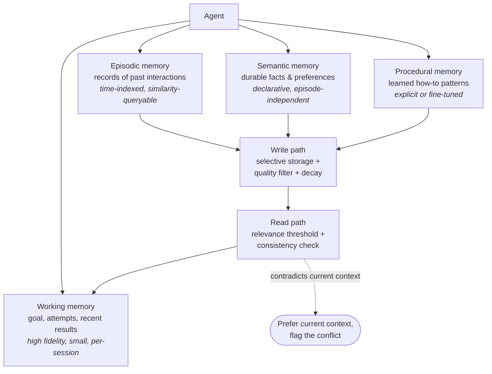

# Part D (1 of 2) — Context engineering and memory

← Previous: [Part C (2 of 2) — Tool failures, sandboxing, cost and code](01d-part-c2-tool-failures-sandboxing-cost.md) · Index: [Full Read-Through](01-full-read-through.md) · Next: [Part D (2 of 2) — RAG pipelines and retrieval code](01f-part-d2-rag-pipelines.md) →

**Steps in this file**

- [Step 27 · Context engineering replaces prompt-only thinking](01e-part-d1-context-and-memory.md#27-read-context-engineering-replaces-prompt-only-thinking)
- [Step 28 · Types of memory agents need](01e-part-d1-context-and-memory.md#28-read-types-of-memory-agents-need)
- [Step 29 · Long-term memory without pollution](01e-part-d1-context-and-memory.md#29-read-long-term-memory-without-pollution)
- [Step 30 · When to retrieve memory vs ignore it](01e-part-d1-context-and-memory.md#30-read-when-to-retrieve-memory-vs-ignore-it)
- [Step 31 · How embeddings help and where they fail](01e-part-d1-context-and-memory.md#31-read-how-embeddings-help-and-where-they-fail)
- [Step 32 · Deleting or correcting memory safely](01e-part-d1-context-and-memory.md#32-read-deleting-or-correcting-memory-safely)

---

## 27. Read: Context engineering replaces prompt-only thinking

*Source: anthropic-agent-systems-fde-notes-2025-present.md*

> **Why this step is here.** Part D opens with the question every later step in it depends on: what should be in the model's context on a given turn, and who decides. [Step 10 · Separate brain, session, and hands](01b-part-b-agent-loop-and-control-plane.md#10-read-separate-brain-session-and-hands) gave you the session as the durable record and the prompt as a view of it; this step turns that into a working method with six concrete moves. Read the six bullets as a checklist and sort each one into "subtract", "defer", "compress", or "externalize". Steps [28](01e-part-d1-context-and-memory.md#28-read-types-of-memory-agents-need) to [32](01e-part-d1-context-and-memory.md#32-read-deleting-or-correcting-memory-safely) apply this to long-term memory, Steps [33](01f-part-d2-rag-pipelines.md#33-study-the-diagram-enterprise-wiki-rag-ingestion) to [37](01f-part-d2-rag-pipelines.md#37-study-the-diagram-agentic-rag-for-complex-research) apply it to retrieval, and [Step 38 · Fit conversation history into a token budget](01f-part-d2-rag-pipelines.md#38-code-fit-conversation-history-into-a-token-budget) is the code that enforces a token budget.

### Step 27 · 3.2 Context engineering replaces prompt-only thinking

Anthropic defines context engineering as curating the complete token state available during inference: instructions, tools, retrieved data, message history, and intermediate results. Longer windows do not eliminate this work. Anthropic cites “context rot”: recall and reasoning can degrade as irrelevant material accumulates.

Design for the **smallest high-signal context** that can support the next decision:

- Keep system instructions clear and at the right level of abstraction.
- Retrieve just-in-time instead of preloading an entire corpus.
- Remove stale tool results and duplicate history.
- Compact completed phases, but preserve raw history outside the context window.
- Store durable notes or artifacts when knowledge must survive a reset.
- Isolate subtasks in subagents when their detailed context is not needed by the lead agent.

**FDE implication:** “We have a one-million-token window” is not an architecture. You still need access control, freshness, relevance ranking, observability, cost control, and a policy for what survives between turns.

**Interview line:** “The session is the source of truth; the prompt is a lossy, task-specific projection of it.”

Sources: [Effective context engineering for AI agents](https://www.anthropic.com/engineering/effective-context-engineering-for-ai-agents) and [Scaling Managed Agents](https://www.anthropic.com/engineering/managed-agents).

#### Going deeper (Step 27)

**What "complete token state" includes.** Everything the model can attend to on this call: the system prompt, every tool schema (a registry of 40 tools at roughly 300 tokens each is 12,000 tokens before the user has said a word), retrieved passages, the message history, and intermediate results such as tool outputs. Most teams only think about the first and last of these. The point of naming all five is that each is a separate lever.

**Context rot, concretely.** The note reports Anthropic's observation that recall and reasoning degrade as irrelevant material accumulates. The intuition: a model can find one fact in a long window, but when 25 of 30 tool results in the window are stale, the relevant five compete for attention with noise that looks equally authoritative. A coding agent that keeps every `ls` and every failed test output in context will, after 40 steps, start re-running commands it already ran. Bigger windows raise the ceiling; they do not remove the slope.

**The six moves, grouped.**

- *Subtract*: remove stale tool results and duplicate history. A tool result that has been acted on is usually done; keep a one-line record of it.
- *Defer*: retrieve just-in-time rather than preloading. This is [Step 17 · Discover tools and knowledge progressively](01c-part-c1-tool-design.md#17-read-discover-tools-and-knowledge-progressively)'s progressive discovery applied to data instead of tools.
- *Compress*: compact completed phases into a summary, but keep the raw history in the session store. Compaction inside the prompt is fine; compaction that destroys the only copy is not, because [Step 67 · Deterministic replay of an agent trace](01j-part-f2-evaluation-and-observability.md#67-code-deterministic-replay-of-an-agent-trace)'s replay and [Step 66 · End-to-end observability](01j-part-f2-evaluation-and-observability.md#66-study-the-diagram-end-to-end-observability)'s tracing need the original.
- *Externalize*: write durable notes or artifacts when knowledge must survive a reset. A long-running agent writes a `progress.md` or a row in a table, then reads it back after compaction ([Step 48 · Long-running agents need durable artifacts and explicit completion](01h-part-e2-long-running-agents.md#48-read-long-running-agents-need-durable-artifacts-and-explicit-completion)).
- *Partition*: give a subtask to a subagent whose detailed context the lead does not need. The lead receives a compact result, not the transcript ([Step 42 · Use multi-agent only where parallel context is valuable](01g-part-e1-multi-agent-coordination.md#42-read-use-multi-agent-only-where-parallel-context-is-valuable)).

**The FDE list is the rest of Part D in one line.** Access control is [Step 34 · Permission-aware RAG query path](01f-part-d2-rag-pipelines.md#34-study-the-diagram-permission-aware-rag-query-path). Freshness is the change-and-deletion loop in [Step 33 · Enterprise wiki RAG ingestion](01f-part-d2-rag-pipelines.md#33-study-the-diagram-enterprise-wiki-rag-ingestion). Relevance ranking is [Step 35 · Hybrid RAG retrieval and ranking](01f-part-d2-rag-pipelines.md#35-study-the-diagram-hybrid-rag-retrieval-and-ranking). Observability is [Step 66 · End-to-end observability](01j-part-f2-evaluation-and-observability.md#66-study-the-diagram-end-to-end-observability). Cost control is Steps [23](01d-part-c2-tool-failures-sandboxing-cost.md#23-read-controlling-cost-explosions-from-tool-calls) and [68](01j-part-f2-evaluation-and-observability.md#68-code-track-and-enforce-a-cost-budget-across-an-agent-session). The policy for what survives between turns is Steps [29](01e-part-d1-context-and-memory.md#29-read-long-term-memory-without-pollution) to [32](01e-part-d1-context-and-memory.md#32-read-deleting-or-correcting-memory-safely). When a customer says "we will just use the big window", you can answer with that list.

**The interview line, unpacked.** "The session is the source of truth; the prompt is a lossy, task-specific projection." Lossy means you deliberately drop things. Task-specific means the projection for "write the migration" differs from the projection for "explain what you did", even over the same session. If you can say which fields of the session each projection reads, you have described context engineering.

**Common misreading.** People treat context engineering as prompt engineering with more material stuffed in, or as a synonym for summarization. It is a data-pipeline problem: what is loaded, from where, when, under whose permissions, and what is discarded afterwards. The second error is compacting the session itself instead of the prompt, which trades a debugging capability for a token saving you could have had anyway.

**Connects to.** [Step 10 · Separate brain, session, and hands](01b-part-b-agent-loop-and-control-plane.md#10-read-separate-brain-session-and-hands) is the brain/session/hands split this step assumes. [Step 17 · Discover tools and knowledge progressively](01c-part-c1-tool-design.md#17-read-discover-tools-and-knowledge-progressively) is the same idea for tools. [Step 38 · Fit conversation history into a token budget](01f-part-d2-rag-pipelines.md#38-code-fit-conversation-history-into-a-token-budget) is the code that trims history to a budget, and [Step 36 · Wiki assistant with conversational memory](01f-part-d2-rag-pipelines.md#36-study-the-diagram-wiki-assistant-with-conversational-memory) shows where a redacted summary is written back.

**Check yourself.**
1. A support agent has 30 tool results in context, 25 of them from resolved sub-steps. Which of the six moves applies first, and what do you keep? *Subtract: drop the 25 stale results and keep a one-line record of each in the prompt, with the full results still in the session store.*
2. Why does "we have a million-token window" not answer an access-control question? *Window size says how much the model can see; it says nothing about whether this user was allowed to see it.*
3. Two projections of the same session, one for "continue the task" and one for "summarize progress for the user". Name one field that differs. *The continue projection needs the last tool results verbatim; the summary projection needs the phase summaries and can drop the raw tool outputs.*

---

## 28. Read: Types of memory agents need

*Source: agentic-ai-system-design-interview-guide-2026.md*

> **Why this step is here.** [Step 27 · Context engineering replaces prompt-only thinking](01e-part-d1-context-and-memory.md#27-read-context-engineering-replaces-prompt-only-thinking) said the session is the source of truth; this step asks what kinds of state that session and its neighbours actually hold. The four memory types are a vocabulary, and the diagram adds the two paths (write and read) that Steps [29](01e-part-d1-context-and-memory.md#29-read-long-term-memory-without-pollution) and [30](01e-part-d1-context-and-memory.md#30-read-when-to-retrieve-memory-vs-ignore-it) detail. For each type, ask three questions as you read: where does it live, who writes it, and when is it cleared. [Step 36 · Wiki assistant with conversational memory](01f-part-d2-rag-pipelines.md#36-study-the-diagram-wiki-assistant-with-conversational-memory) shows short-term memory in a real assistant, and [Step 38 · Fit conversation history into a token budget](01f-part-d2-rag-pipelines.md#38-code-fit-conversation-history-into-a-token-budget) is code that trims working memory.

### Step 28 · 25. What types of memory do agentic systems need?

- **Working** — current goal, attempts, recent results; high fidelity, small, cleared per session
- **Episodic** — records of past interactions; time-indexed, similarity-queryable
- **Semantic** — durable facts and preferences ("this project uses Python 3.9")
- **Procedural** — learned how-to patterns, explicit or baked in via fine-tuning

Not every system needs all four; each adds failure modes, plus cold-start and pollution risks.

#### Going deeper (Step 28)

**The four types, with a coding agent as the running example.**

| Type | Example content | Lifetime | Typical store | Main risk |
|---|---|---|---|---|
| Working | the failing test, the last three edits, the current goal | one session | the message list and in-process state | overflow, so it needs trimming |
| Episodic | "on Tuesday we tried migrating auth and hit a circular import" | weeks to months | event log rows with a timestamp and an embedding | irrelevant recall |
| Semantic | "repo uses Python 3.9, pytest, no type hints" | until corrected | key-value or table with source and confidence | wrong fact persists |
| Procedural | "to add a migration here: run alembic revision, then edit the env file" | long | prompt snippets, skill files, or fine-tuning | stale procedure |

Working memory is not retrieved; it *is* the context. Episodic memory answers "what happened", semantic answers "what is true", procedural answers "how do we do it". A support bot's episodic memory is prior tickets; its semantic memory is the customer's plan tier and stated channel preference; its procedural memory is the refund workflow.

**Why the diagram routes three of the four through a write path.** Episodic, semantic and procedural memories outlive the session, so something must decide what gets admitted. The write path box says three things: *selective storage* (not everything), a *quality filter* (is it confirmed?), and *decay* (does it lose weight over time?). [Step 29 · Long-term memory without pollution](01e-part-d1-context-and-memory.md#29-read-long-term-memory-without-pollution) unpacks each. Working memory has no write path because everything in the session is already there.

**Why the read path has two checks.** *Relevance threshold* means a memory below a score is not returned at all, rather than returned and hoped to be ignored. *Consistency check* compares a retrieved memory to what is in the current context. The dashed edge is the rule for a conflict: prefer the current context and flag it. A user who says "I switched to Python 3.11" should override the stored 3.9, and the agent should say it noticed.

**"Not every system needs all four."** A claims pipeline that processes one claim per run needs working memory only. A personal assistant needs semantic memory or it forgets your preferences daily. Each type you add brings a cold-start problem (new users have no memories, so behaviour differs from tested behaviour) and a pollution problem (a wrong fact written once is retrieved forever). Adding a memory type is a design decision to defend, not a default.

**Common misreading.** "Memory" gets equated with "a vector database". Working memory is the prompt, semantic facts are often better in a table with exact lookup than as embeddings ([Step 31 · How embeddings help and where they fail](01e-part-d1-context-and-memory.md#31-read-how-embeddings-help-and-where-they-fail) explains why), and procedural memory is usually just text in a prompt or a file. A second confusion is calling conversation history "episodic memory"; within a session it is working memory, and it only becomes episodic once written out and made queryable across sessions.

**Connects to.** [Step 29 · Long-term memory without pollution](01e-part-d1-context-and-memory.md#29-read-long-term-memory-without-pollution) is the write path in detail, [Step 30 · When to retrieve memory vs ignore it](01e-part-d1-context-and-memory.md#30-read-when-to-retrieve-memory-vs-ignore-it) the read path. [Step 32 · Deleting or correcting memory safely](01e-part-d1-context-and-memory.md#32-read-deleting-or-correcting-memory-safely) covers what happens when a stored memory is wrong. [Step 36 · Wiki assistant with conversational memory](01f-part-d2-rag-pipelines.md#36-study-the-diagram-wiki-assistant-with-conversational-memory) shows short-term session memory in a wiki assistant, and [Step 38 · Fit conversation history into a token budget](01f-part-d2-rag-pipelines.md#38-code-fit-conversation-history-into-a-token-budget) trims working memory to a budget.

**Check yourself.**
1. A wiki assistant remembers that a user asked about the expense policy last week. Which type is that, and what index does it need? *Episodic: a time-indexed record, ideally also similarity-queryable.*
2. Why does the diagram give working memory no write path? *It is the session itself; nothing has to be admitted into it, only trimmed out of it.*
3. What is the cold-start risk of semantic memory? *New users have no stored facts, so the system behaves differently for them than for the users you tested with.*

---

## 29. Read: Long-term memory without pollution

*Source: agentic-ai-system-design-interview-guide-2026.md*

> **Why this step is here.** [Step 28 · Types of memory agents need](01e-part-d1-context-and-memory.md#28-read-types-of-memory-agents-need)'s diagram had a single box called "write path"; this step is what goes inside it. The question is how a long-term store stays trustworthy after months of use, and the answer is a pipeline: admission, filtering, decay, read-time validation, user controls, and monitoring. Read it as six stages and ask, for each, what a support bot would wrongly store without it. [Step 30 · When to retrieve memory vs ignore it](01e-part-d1-context-and-memory.md#30-read-when-to-retrieve-memory-vs-ignore-it) covers the read side and [Step 32 · Deleting or correcting memory safely](01e-part-d1-context-and-memory.md#32-read-deleting-or-correcting-memory-safely) covers repairing what got through.

### Step 29 · 26. How do you design long-term memory without polluting it?

Store selectively (confirmed facts, verified successful patterns, stated preferences, summaries — not raw transcripts). Filter on accuracy, confidence threshold and contradiction with existing memory. Apply decay: recency weighting, confidence decay, usage-based retention. Validate at retrieval for relevance (not just similarity) and consistency. Give users visibility, correction, deletion and opt-out. Monitor which memories correlate with bad outcomes.

#### Going deeper (Step 29)

**Store selectively: the admission rule.** The source lists four admissible kinds: confirmed facts, verified successful patterns, stated preferences, and summaries. Each has a test. A fact is confirmed if the user said it explicitly or a tool verified it. A pattern is verified if it succeeded, not merely if it was tried. A preference is stated, not inferred from tone. Raw transcripts fail all four: they are large, they contain the model's own guesses and hallucinations, and they hold personal data you may not be allowed to keep. A support bot should store "customer prefers email" (stated) and not "customer seemed angry" (inferred, transient) or the whole chat.

**The three filters.** *Accuracy*: can this be checked against a source of truth right now? If so, check it. *Confidence threshold*: when a model extracts a fact from a conversation, ask it for a confidence and drop anything below a bar (0.8 is a typical starting point, tuned against a labelled set). *Contradiction*: if the store says Python 3.9 and the new fact says 3.11, do not append a second fact; route it to the correction flow in [Step 32 · Deleting or correcting memory safely](01e-part-d1-context-and-memory.md#32-read-deleting-or-correcting-memory-safely), which versions the old one.

**Decay is three different mechanisms.** *Recency weighting* makes older memories rank lower at read time, often with a half-life. *Confidence decay* lowers the score of a fact that has not been reconfirmed, so an unverified guess from six months ago fades. *Usage-based retention* archives memories that have never been retrieved in, say, 90 days. Decay is not deletion: archive first, so a mistaken decay is recoverable.

**Validate at retrieval: relevance is not similarity.** "User likes dark mode" is similar, by embedding, to any UI question, but irrelevant to a question about a rendering bug. A similarity search returns it; a relevance check (a small model asked "does this memory bear on this task?") drops it. The consistency check is the [Step 28 · Types of memory agents need](01e-part-d1-context-and-memory.md#28-read-types-of-memory-agents-need) conflict rule: prefer what is in the current context.

**User visibility, correction, deletion, opt-out.** These are product features and also compliance. If you cannot show a user what the system remembers about them, you cannot honour a deletion request, and [Step 32 · Deleting or correcting memory safely](01e-part-d1-context-and-memory.md#32-read-deleting-or-correcting-memory-safely) notes that deletion requests are a legal requirement in many jurisdictions.

**Monitor memories against outcomes.** Record which memory ids were in context on each turn ([Step 66 · End-to-end observability](01j-part-f2-evaluation-and-observability.md#66-study-the-diagram-end-to-end-observability)'s traces are the place). When a run fails or a user complains, you can ask which memories correlate with bad outcomes and quarantine them. Without the id-to-trace link, a polluted memory is invisible.

**Common misreading.** The tempting design is "append everything, let the retriever sort it out". Retrieval cannot fix admission: a confidently stored wrong fact scores as well as a right one, and the model will act on it. The second error is confusing decay with deletion and hard-deleting on a schedule, which loses the audit trail [Step 32 · Deleting or correcting memory safely](01e-part-d1-context-and-memory.md#32-read-deleting-or-correcting-memory-safely) depends on.

**Connects to.** [Step 28 · Types of memory agents need](01e-part-d1-context-and-memory.md#28-read-types-of-memory-agents-need) is the diagram this fills in. [Step 30 · When to retrieve memory vs ignore it](01e-part-d1-context-and-memory.md#30-read-when-to-retrieve-memory-vs-ignore-it) is the read side of the same store. [Step 32 · Deleting or correcting memory safely](01e-part-d1-context-and-memory.md#32-read-deleting-or-correcting-memory-safely) covers correction and deletion, and [Step 66 · End-to-end observability](01j-part-f2-evaluation-and-observability.md#66-study-the-diagram-end-to-end-observability) supplies the traces you need to monitor memory against outcomes.

**Check yourself.**
1. A coding agent tried an approach that failed twice and worked once. Should "this approach works" be stored? *Not yet: a pattern is verified when it succeeds reliably, so one success in three is not confirmed.*
2. What is the difference between a similarity check and a relevance check at read time? *Similarity is vector closeness; relevance asks whether the memory bears on this task, which a similar memory may not.*
3. Why link memory ids into traces? *So that when an outcome is bad you can find which memories were in context and quarantine the ones that correlate with failure.*

---

## 30. Read: When to retrieve memory vs ignore it

*Source: agentic-ai-system-design-interview-guide-2026.md*

> **Why this step is here.** [Step 29 · Long-term memory without pollution](01e-part-d1-context-and-memory.md#29-read-long-term-memory-without-pollution) was about what gets written; this step is the read path from [Step 28 · Types of memory agents need](01e-part-d1-context-and-memory.md#28-read-types-of-memory-agents-need)'s diagram, and its question is narrower than it looks: on this turn, should the agent consult long-term memory at all? It applies [Step 27 · Context engineering replaces prompt-only thinking](01e-part-d1-context-and-memory.md#27-read-context-engineering-replaces-prompt-only-thinking)'s "smallest high-signal context" rule to memory. Read the retrieve list and the ignore list side by side, then the three strategy rules, and notice that the last rule appeared already as the dashed edge in [Step 28 · Types of memory agents need](01e-part-d1-context-and-memory.md#28-read-types-of-memory-agents-need). [Step 37 · Agentic RAG for complex research](01f-part-d2-rag-pipelines.md#37-study-the-diagram-agentic-rag-for-complex-research) shows an agent making the same decision about retrieval from documents.

### Step 30 · 27. When should memory be retrieved vs ignored?

**Retrieve when:**

- The user references past interactions ("like we discussed before")
- The task depends on preferences or established patterns
- Current context is insufficient to respond well
- Similar past tasks provide useful examples

**Ignore when:**

- Current context already provides everything needed
- Past experiences would bias toward outdated solutions
- The user explicitly asked for a fresh start
- Retrieved memory contradicts explicit current information
- The task requires objective analysis uncontaminated by past views

**Retrieval strategy:**

- Apply a relevance threshold — low-relevance memories are just noise
- Weight sources: user-provided > inferred, verified > unverified
- On contradiction, prefer current context and flag the conflict

Anti-pattern: retrieving on every turn regardless of need — it burns context, adds latency and risks pollution.

#### Going deeper (Step 30)

**How "retrieve when" becomes code.** The four triggers are a gating decision, and it should be cheap. Explicit references ("like we discussed") are pattern-matchable. Task type (personalised recommendation versus objective calculation) can come from the same small router [Step 53 · Route a query to the right agent without calling a large model](01h-part-e2-long-running-agents.md#53-code-route-a-query-to-the-right-agent-without-calling-a-large-model) builds. "Current context is insufficient" is a confidence signal: if the model would have to guess a preference, look one up. The gate runs before retrieval, so it costs a few milliseconds rather than a memory query.

**What retrieving on every turn costs.** Typical numbers: five memories at 200 tokens each is 1,000 tokens per turn, plus 50 to 150 ms of lookup latency, plus the chance that one of the five is wrong. Over a 40-turn session that is 40,000 tokens of mostly-irrelevant material, which is exactly the context rot [Step 27 · Context engineering replaces prompt-only thinking](01e-part-d1-context-and-memory.md#27-read-context-engineering-replaces-prompt-only-thinking) warned about. The anti-pattern at the end of the source is the default in most first implementations.

**The ignore list is about bias, not just cost.** Past experience biases toward outdated solutions: a coding agent that remembers the old API keeps using it after the upgrade. A code-review agent should not recall the author's past preferences, because the review must be objective. "Fresh start" is a user right and also a debugging tool. And a memory that contradicts explicit current information loses, every time.

**Weighting sources.** Tag every memory with its source (user-stated, tool-verified, model-inferred) and multiply its score accordingly. User-provided beats inferred; verified beats unverified. The tag is written at admission time ([Step 29 · Long-term memory without pollution](01e-part-d1-context-and-memory.md#29-read-long-term-memory-without-pollution)), which is why the write path and read path must share a schema.

**Contradiction handling.** Prefer the current context and flag: "You previously mentioned X; I am going with Y as you said just now." The flag matters because silently dropping the memory hides a fact that may need correction ([Step 32 · Deleting or correcting memory safely](01e-part-d1-context-and-memory.md#32-read-deleting-or-correcting-memory-safely)).

**Common misreading.** Teams pick "always retrieve" or "never retrieve" and skip the gate. The other error is assuming the model will ignore an irrelevant memory if you include it. It will not, reliably; injected memory shifts the answer even when it is irrelevant, which is why the threshold drops low-relevance memories instead of passing them through.

**Connects to.** [Step 28 · Types of memory agents need](01e-part-d1-context-and-memory.md#28-read-types-of-memory-agents-need) is the diagram whose read path this describes, [Step 29 · Long-term memory without pollution](01e-part-d1-context-and-memory.md#29-read-long-term-memory-without-pollution) is the matching write path, and [Step 53 · Route a query to the right agent without calling a large model](01h-part-e2-long-running-agents.md#53-code-route-a-query-to-the-right-agent-without-calling-a-large-model) gives a cheap router that can double as the retrieval gate. [Step 37 · Agentic RAG for complex research](01f-part-d2-rag-pipelines.md#37-study-the-diagram-agentic-rag-for-complex-research) applies the same retrieve-or-not judgement to documents.

**Check yourself.**
1. A user asks a coding agent to "refactor this the way we did last month". Retrieve or not, and why? *Retrieve: an explicit reference to a past interaction is the clearest trigger.*
2. Why weight user-stated memories above inferred ones? *Inferred facts are the model's guesses; a stated fact has a source you can point to and the user can correct.*
3. What is wrong with "include the memories and let the model decide"? *Irrelevant memory biases the answer even when the model does not act on it directly, and it burns tokens on every turn.*

---

## 31. Read: How embeddings help and where they fail

*Source: agentic-ai-system-design-interview-guide-2026.md*

> **Why this step is here.** Before the five RAG diagrams, you need to know what the vector index in the middle of them can and cannot do. This step answers that in one paragraph: four strengths, five failure classes, four compensations. Read it by pairing each failure with the compensation that fixes it, because [Step 35 · Hybrid RAG retrieval and ranking](01f-part-d2-rag-pipelines.md#35-study-the-diagram-hybrid-rag-retrieval-and-ranking)'s hybrid retrieval diagram is exactly those pairings drawn as boxes. [Step 40 · Cosine similarity and top-k retrieval without a vector DB](01f-part-d2-rag-pipelines.md#40-code-cosine-similarity-and-top-k-retrieval-without-a-vector-db) is the code for the part that works, and [Step 39 · Chunk a document for retrieval with overlap](01f-part-d2-rag-pipelines.md#39-code-chunk-a-document-for-retrieval-with-overlap) decides what gets embedded in the first place.

### Step 31 · 28. How do embeddings help — and where do they fail?

Good for semantic similarity without keyword overlap, scalable vector search, cross-lingual matching, and paraphrase tolerance. They fail on precision lookups ("the 2024 Q3 report"), negation ("NOT about marketing"), temporal reasoning, multi-hop relationship traversal, and specific IDs/numbers with no semantic content. Compensate with keyword filters, metadata filtering, structured queries and hybrid retrieval fusion.

#### Going deeper (Step 31)

**What an embedding is, in one sentence.** A dense vector (typically 768 to 3,072 numbers) where two texts land near each other if the model was trained to consider them similar in meaning. Nearness is measured with cosine similarity ([Step 40 · Cosine similarity and top-k retrieval without a vector DB](01f-part-d2-rag-pipelines.md#40-code-cosine-similarity-and-top-k-retrieval-without-a-vector-db)). Vectors from different embedding models are not comparable, so a corpus embedded with one model must be re-embedded to switch.

**The four strengths, with examples.** *No keyword overlap needed*: "how do I reset my password" matches a page titled "credential recovery steps". *Scalable search*: approximate nearest-neighbour indexes answer over millions of vectors in milliseconds. *Cross-lingual*: a German query can find an English page if the model is multilingual. *Paraphrase tolerance*: "cancel my plan" and "stop my subscription" score close together.

**The five failures, and why each happens.**

| Failure | Why embeddings miss it | Compensation |
|---|---|---|
| Precision lookups ("the 2024 Q3 report") | 2024 Q3 and 2023 Q3 embed almost identically | keyword filter or metadata filter on year and quarter |
| Negation ("NOT about marketing") | the vector is dominated by "marketing"; negation barely moves it | keyword exclusion, or a rewriter that turns negation into a filter |
| Temporal reasoning ("the latest policy") | "latest" has no stable meaning in vector space | metadata filter on date, freshness in reranking ([Step 35 · Hybrid RAG retrieval and ranking](01f-part-d2-rag-pipelines.md#35-study-the-diagram-hybrid-rag-retrieval-and-ranking)) |
| Multi-hop ("who manages the author of the auth module") | one vector cannot chain two relationships | graph traversal or a structured query |
| IDs and numbers ("INC-48213") | no semantic content; tokenised into noise | exact keyword match |

The general pattern is that embeddings answer "what is this about" and fail at "which exact one" and "what is true now". Enterprise questions are heavy on names, codes, dates and IDs, so the failures are common, not exotic.

**Hybrid retrieval fusion.** Run keyword and vector search in parallel and merge the ranked lists. [Step 35 · Hybrid RAG retrieval and ranking](01f-part-d2-rag-pipelines.md#35-study-the-diagram-hybrid-rag-retrieval-and-ranking) names the merge method (reciprocal rank fusion) and adds graph and structured queries as further retrievers. The point of fusion is that no single retriever has to be right; a document that ranks moderately in both usually ranks high after the merge.

**Chunking interacts with embedding quality.** A 2,000-token chunk about five topics embeds as a blur of all five and matches none of them well. [Step 39 · Chunk a document for retrieval with overlap](01f-part-d2-rag-pipelines.md#39-code-chunk-a-document-for-retrieval-with-overlap)'s chunker exists partly to keep each vector about one thing.

**Common misreading.** "Vector search is semantic, so it is strictly better than keyword search." For a corpus of tickets, contracts and runbooks, keyword search often wins on the queries users actually type, which are full of identifiers. The related error is reading a cosine score as a confidence: 0.82 means "close in embedding space", not "answers the question", which is why [Step 35 · Hybrid RAG retrieval and ranking](01f-part-d2-rag-pipelines.md#35-study-the-diagram-hybrid-rag-retrieval-and-ranking) puts a reranker after retrieval.

**Connects to.** [Step 35 · Hybrid RAG retrieval and ranking](01f-part-d2-rag-pipelines.md#35-study-the-diagram-hybrid-rag-retrieval-and-ranking) draws the compensations as a hybrid pipeline. [Step 39 · Chunk a document for retrieval with overlap](01f-part-d2-rag-pipelines.md#39-code-chunk-a-document-for-retrieval-with-overlap) shapes the chunks that get embedded, and [Step 40 · Cosine similarity and top-k retrieval without a vector DB](01f-part-d2-rag-pipelines.md#40-code-cosine-similarity-and-top-k-retrieval-without-a-vector-db) is the similarity computation itself. [Step 28 · Types of memory agents need](01e-part-d1-context-and-memory.md#28-read-types-of-memory-agents-need)'s semantic memory is a case where a table often beats an embedding for the same reason.

**Check yourself.**
1. A user asks a wiki assistant for "ticket PROJ-1187". Which retriever should find it, and why would vector search struggle? *Keyword: the ID has no semantic content, so its embedding is close to every other ID.*
2. Why does a chunk covering five topics hurt retrieval? *Its vector is an average of the five, so it is not close to a query about any one of them.*
3. What does a cosine score of 0.82 tell you about relevance? *Only that the texts are close in embedding space; relevance to the question needs a reranker or a judge.*

---

## 32. Read: Deleting or correcting memory safely

*Source: agentic-ai-system-design-interview-guide-2026.md*

> **Why this step is here.** Steps [29](01e-part-d1-context-and-memory.md#29-read-long-term-memory-without-pollution) and [30](01e-part-d1-context-and-memory.md#30-read-when-to-retrieve-memory-vs-ignore-it) assumed the store contains some wrong entries, because it always will; this step is the repair procedure. The question is how to remove or change a memory without losing recoverability, without breaking conclusions that depended on it, and without leaving copies behind. Read the three groups (delete, correct, bulk) and notice they share three habits: keep a trail, check what depends on this, and change gradually. [Step 33 · Enterprise wiki RAG ingestion](01f-part-d2-rag-pipelines.md#33-study-the-diagram-enterprise-wiki-rag-ingestion)'s deletion loop is the same problem for document chunks.

### Step 32 · 29. How do you delete or correct agent memory safely?

**Deleting:**

- Soft-delete first — mark deleted rather than removing, so a mistake is recoverable
- Keep an audit trail: what, when, by whom, why
- Run propagation analysis — were other memories derived from this one?
- Notify the user if the agent recently acted on the information being corrected

**Correcting:**

- Version rather than overwrite: "previously believed X, corrected to Y"
- Never overwrite silently — a changed fact may invalidate conclusions drawn from it
- Lower confidence on corrected entries until they're reconfirmed

**Bulk operations:**

- Roll large changes out gradually with monitoring
- Run consistency checks afterward
- Keep backups — bad corrections can corrupt the store
- Honor user deletion requests promptly (a legal requirement in many jurisdictions)

#### Going deeper (Step 32)

**Deleting is a state change, not a row removal.** A soft delete sets a tombstone flag and hides the memory from reads while keeping the row, so an accidental deletion is reversible. The audit trail (what, when, by whom, why) is what makes a later question like "why did the agent stop knowing the customer's tier?" answerable. Both need a retention window, after which a hard delete happens; user deletion requests set that window short.

**Propagation analysis is the part people skip.** Memories derive from other memories. "User is a Python developer" may have been inferred from "project uses Python 3.9". Delete the second and the first is now unsupported. To do this you need lineage: each derived memory points at the memories it was derived from. Without lineage pointers, propagation analysis is a manual search. The same applies to summaries: a conversation summary that mentions the deleted fact still carries it.

**Notify if the agent acted on it.** A support bot that stored a wrong shipping address and dispatched a parcel to it has a real-world consequence attached to the memory. Correcting the store is necessary; telling the user that an action was taken on the old value is the part that prevents the second complaint. This requires the action log ([Step 66 · End-to-end observability](01j-part-f2-evaluation-and-observability.md#66-study-the-diagram-end-to-end-observability)) to reference memory ids, which is the same link [Step 29 · Long-term memory without pollution](01e-part-d1-context-and-memory.md#29-read-long-term-memory-without-pollution) asked for.

**Correcting by versioning.** "Previously believed X, corrected to Y" is an event, not an overwrite. It keeps the history so conclusions drawn from X can be found and re-examined, and it makes the correction itself auditable. The corrected entry starts with lowered confidence until reconfirmed, because the correction may itself be wrong, and [Step 30 · When to retrieve memory vs ignore it](01e-part-d1-context-and-memory.md#30-read-when-to-retrieve-memory-vs-ignore-it)'s source weighting then ranks it appropriately.

**Bulk operations are deployments.** Treat a mass correction like a code rollout: a small percentage first, monitoring for regressions, a backup taken before, consistency checks after. The note's hedge on legal requirements ("in many jurisdictions") should stay in your answer; the safe statement is that deletion requests must be honoured promptly and provably.

**Where the copies hide.** A memory usually exists in several places: the primary row, its embedding in a vector index, a keyword index entry, derived memories, and cached summaries. Deleting from one is not deleting. [Step 33 · Enterprise wiki RAG ingestion](01f-part-d2-rag-pipelines.md#33-study-the-diagram-enterprise-wiki-rag-ingestion)'s "delete stale chunks from every index" is the same discipline for RAG.

**Common misreading.** Treating the memory store as a cache that can be flushed and rebuilt. It cannot, because the raw conversations that produced it may already be gone under retention rules, and because the memories have downstream dependants. The opposite error is never deleting and relying on decay, which does not satisfy a user's deletion request.

**Connects to.** [Step 29 · Long-term memory without pollution](01e-part-d1-context-and-memory.md#29-read-long-term-memory-without-pollution) is the write path that should have kept most bad entries out. [Step 33 · Enterprise wiki RAG ingestion](01f-part-d2-rag-pipelines.md#33-study-the-diagram-enterprise-wiki-rag-ingestion) applies deletion propagation to document indexes. [Step 59 · Multi-tenant data isolation](01i-part-f1-security.md#59-study-the-diagram-multi-tenant-data-isolation) covers tenant isolation, where a deletion must also be tenant-scoped, and [Step 66 · End-to-end observability](01j-part-f2-evaluation-and-observability.md#66-study-the-diagram-end-to-end-observability) supplies the action log you need to know whether the agent acted on a fact.

**Check yourself.**
1. A user corrects their timezone. What happens to a stored "prefers meetings at 9am" that was derived from the old one? *Propagation analysis finds it via lineage and marks it for re-derivation or lowered confidence.*
2. Why version instead of overwrite? *An overwrite hides that conclusions were drawn from the old value; a version lets you find and re-examine them.*
3. Name three places a single memory may be duplicated. *The primary row, its vector index entry, and any summary or derived memory that used it.*

---

← Previous: [Part C (2 of 2) — Tool failures, sandboxing, cost and code](01d-part-c2-tool-failures-sandboxing-cost.md) · Index: [Full Read-Through](01-full-read-through.md) · Next: [Part D (2 of 2) — RAG pipelines and retrieval code](01f-part-d2-rag-pipelines.md) →
