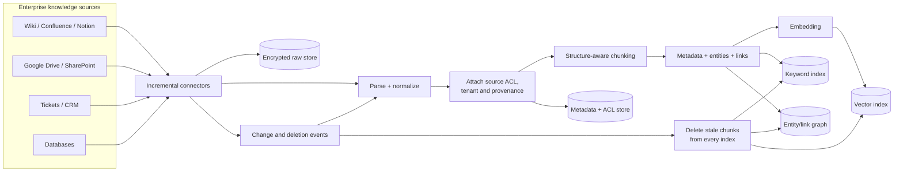
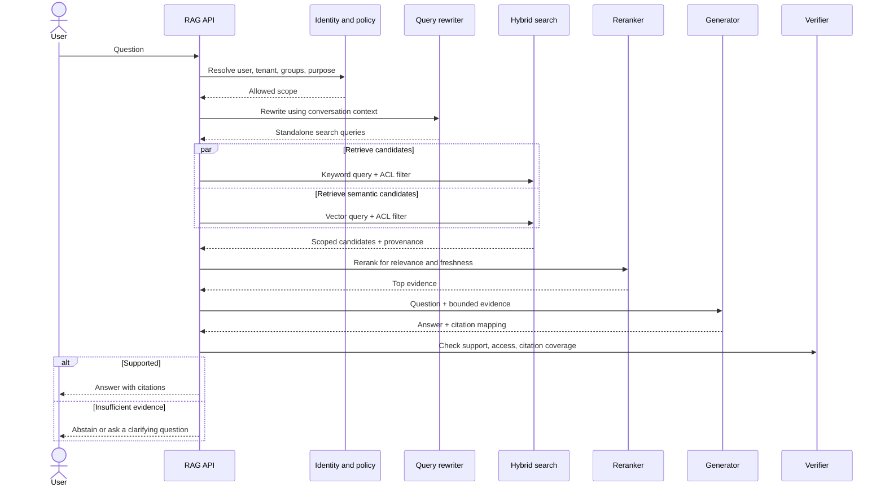
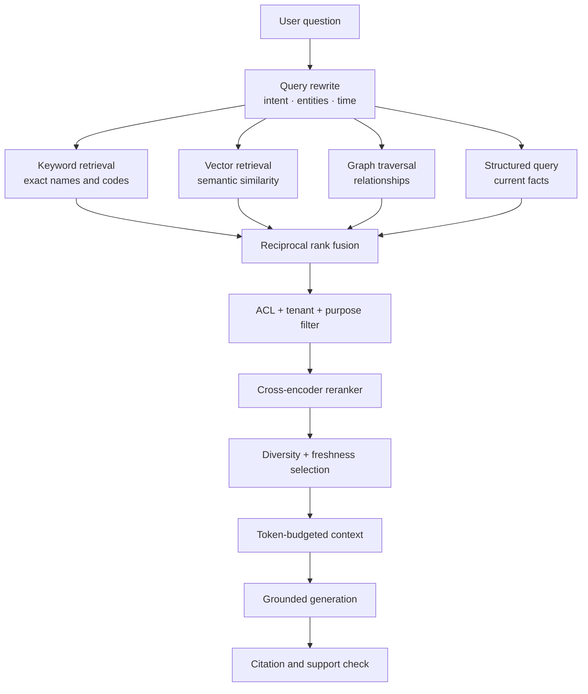
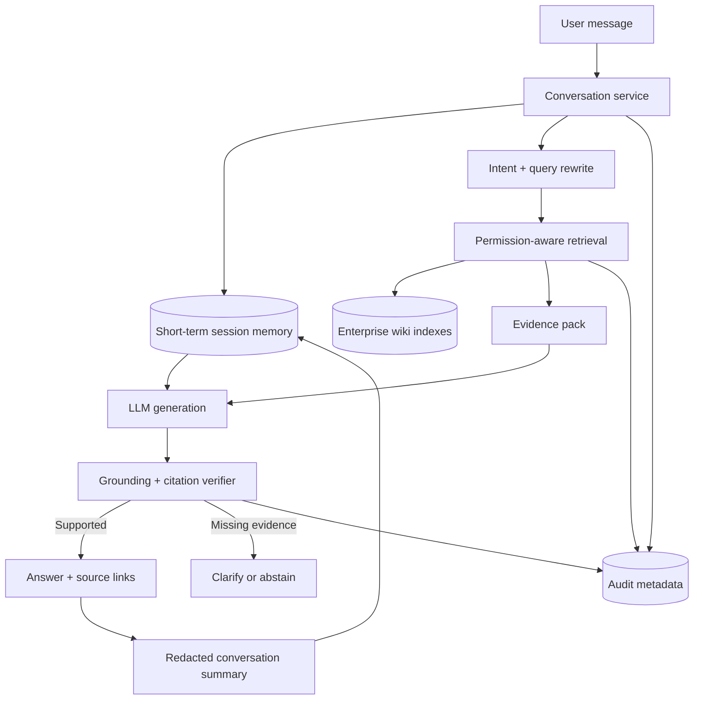
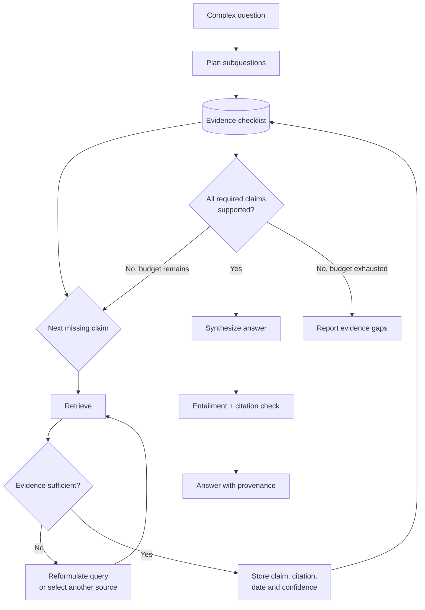
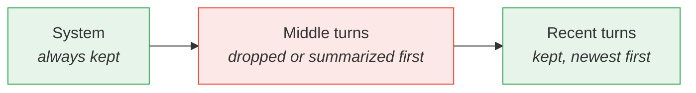

# Part D (2 of 2) — RAG pipelines and retrieval code

← Previous: [Part D (1 of 2) — Context engineering and memory](01e-part-d1-context-and-memory.md) · Index: [Full Read-Through](01-full-read-through.md) · Next: [Part E (1 of 2) — Multi-agent coordination](01g-part-e1-multi-agent-coordination.md) →

**Steps in this file**

- [Step 33 · Enterprise wiki RAG ingestion](01f-part-d2-rag-pipelines.md#33-study-the-diagram-enterprise-wiki-rag-ingestion)
- [Step 34 · Permission-aware RAG query path](01f-part-d2-rag-pipelines.md#34-study-the-diagram-permission-aware-rag-query-path)
- [Step 35 · Hybrid RAG retrieval and ranking](01f-part-d2-rag-pipelines.md#35-study-the-diagram-hybrid-rag-retrieval-and-ranking)
- [Step 36 · Wiki assistant with conversational memory](01f-part-d2-rag-pipelines.md#36-study-the-diagram-wiki-assistant-with-conversational-memory)
- [Step 37 · Agentic RAG for complex research](01f-part-d2-rag-pipelines.md#37-study-the-diagram-agentic-rag-for-complex-research)
- [Step 38 · Fit conversation history into a token budget](01f-part-d2-rag-pipelines.md#38-code-fit-conversation-history-into-a-token-budget)
- [Step 39 · Chunk a document for retrieval with overlap](01f-part-d2-rag-pipelines.md#39-code-chunk-a-document-for-retrieval-with-overlap)
- [Step 40 · Cosine similarity and top-k retrieval without a vector DB](01f-part-d2-rag-pipelines.md#40-code-cosine-similarity-and-top-k-retrieval-without-a-vector-db)

---

## 33. Study the diagram: Enterprise wiki RAG ingestion

*Source: production-llm-agent-rag-workflow-mermaid-atlas.md*

> **Why this step is here.** The next five diagrams are one system seen from five angles, and this is the first: how enterprise documents become searchable chunks with permissions attached. It answers where the vector index, keyword index and ACL store in Steps [34](01f-part-d2-rag-pipelines.md#34-study-the-diagram-permission-aware-rag-query-path) and [35](01f-part-d2-rag-pipelines.md#35-study-the-diagram-hybrid-rag-retrieval-and-ranking) come from, and it applies [Step 32 · Deleting or correcting memory safely](01e-part-d1-context-and-memory.md#32-read-deleting-or-correcting-memory-safely)'s deletion discipline to documents. Read it left to right along the main pipeline, then trace the change-and-deletion loop at the bottom separately, because that loop is the part that distinguishes a demo from a product.

### Step 33 · 6. Enterprise wiki RAG ingestion



**Production constraint:** ingestion must propagate edits, ACL changes, and deletions—not only add new embeddings.

#### Going deeper (Step 33)

**Walk the diagram.**

*Sources.* Four families, chosen because each has a different API shape: wikis have page trees, drives have folders and sharing settings, ticket systems have structured fields plus free text, databases have rows. The diagram lists them so you remember that "connect to the knowledge" is four integrations, not one.

*Incremental connectors.* One per source, each holding a cursor (last-modified timestamp or change token) so a run fetches only what changed. Remove this box and you re-crawl the whole corpus daily, which is slow, expensive, and misses deletions entirely. Implementation: scheduled jobs or webhook receivers writing to a queue.

*Encrypted raw store.* The original bytes, kept so you can re-parse or re-chunk without re-fetching, and so an audit can show exactly what was ingested. Remove it and every chunking improvement means a full re-crawl. Implementation: object storage with encryption at rest and a retention policy.

*Parse and normalize.* HTML, PDF, Markdown and database rows become one document model with text, headings and fields. This is where tables and code blocks get marked so the chunker ([Step 39 · Chunk a document for retrieval with overlap](01f-part-d2-rag-pipelines.md#39-code-chunk-a-document-for-retrieval-with-overlap)) can treat them as units.

*Attach source ACL, tenant and provenance.* This happens before chunking on purpose: a chunk inherits its document's permissions, tenant and source URL. Attach it later and you have to reconstruct the link. Remove it and [Step 34 · Permission-aware RAG query path](01f-part-d2-rag-pipelines.md#34-study-the-diagram-permission-aware-rag-query-path)'s ACL filter has nothing to filter on, so either everyone sees everything or nobody sees anything. Implementation: a metadata store (usually Postgres) keyed by document and chunk id.

*Structure-aware chunking → metadata, entities, links → embedding.* Chunking respects headings and paragraphs. Enrichment extracts entities (people, systems, ticket ids) and cross-links, which feed the keyword index and the graph. Embedding writes to the vector index. Three indexes exist because [Step 31 · How embeddings help and where they fail](01e-part-d1-context-and-memory.md#31-read-how-embeddings-help-and-where-they-fail) showed that no single one covers every query type.

*Change and deletion events.* The connector also emits "page X changed" and "page Y deleted / access restricted". Changes re-enter at parse. Deletions go to a box that removes chunks from every index. Remove this loop and a document made confidential yesterday stays retrievable today; that is the failure the production constraint warns about. It requires chunk ids that are derivable from the document id, so the delete can find them.

**How to redraw it.** Anchor on four things first: (1) sources fan into connectors, (2) the linear pipeline parse → ACL → chunk → enrich → embed, (3) three indexes plus a separate ACL store at the end, (4) a change-and-deletion loop that feeds back into parse and into all three indexes. Then add the raw store hanging off the connectors. If you draw only the linear pipeline you have drawn a demo; the loop is the product.

**Common misreading.** Candidates draw ingestion as a one-way street ending at the vector database, and describe freshness as "we re-index nightly". Nightly re-indexing does not remove chunks whose source was deleted or restricted unless you also diff against the previous run, and it leaves a day-long leak window. Say "connectors emit change and deletion events, and deletion propagates to every index".

**Connects to.** [Step 34 · Permission-aware RAG query path](01f-part-d2-rag-pipelines.md#34-study-the-diagram-permission-aware-rag-query-path) reads the indexes and ACL store this builds. [Step 39 · Chunk a document for retrieval with overlap](01f-part-d2-rag-pipelines.md#39-code-chunk-a-document-for-retrieval-with-overlap) is the chunking box as code. [Step 32 · Deleting or correcting memory safely](01e-part-d1-context-and-memory.md#32-read-deleting-or-correcting-memory-safely) is the same deletion discipline for memories, and [Step 59 · Multi-tenant data isolation](01i-part-f1-security.md#59-study-the-diagram-multi-tenant-data-isolation) covers keeping tenants separate in these stores.

**Check yourself.**
1. A wiki page is moved to a restricted space. Which boxes must react, in order? *Connector emits an ACL change event, the ACL store is updated, and, if scope changed enough, stale chunks are deleted or re-tagged in every index.*
2. Why attach ACLs before chunking rather than after? *Chunks inherit the document's permissions; attaching later means reconstructing which chunk came from which document.*
3. What does the raw store buy you? *Re-parsing and re-chunking without re-fetching, plus an auditable record of what was ingested.*

---

## 34. Study the diagram: Permission-aware RAG query path

*Source: production-llm-agent-rag-workflow-mermaid-atlas.md*

> **Why this step is here.** [Step 33 · Enterprise wiki RAG ingestion](01f-part-d2-rag-pipelines.md#33-study-the-diagram-enterprise-wiki-rag-ingestion) built the indexes; this sequence diagram is the read path across them, and its one rule (filter by authorization during retrieval, not after) is the single most-probed point in enterprise RAG interviews. It draws on [Step 31 · How embeddings help and where they fail](01e-part-d1-context-and-memory.md#31-read-how-embeddings-help-and-where-they-fail) for why two retrievers run in parallel and on [Step 27 · Context engineering replaces prompt-only thinking](01e-part-d1-context-and-memory.md#27-read-context-engineering-replaces-prompt-only-thinking) for why the evidence is bounded. Read it top to bottom as nine messages, and for each one ask what leaks or breaks if it is skipped. [Step 35 · Hybrid RAG retrieval and ranking](01f-part-d2-rag-pipelines.md#35-study-the-diagram-hybrid-rag-retrieval-and-ranking) zooms into the retrieval and ranking box, and [Step 36 · Wiki assistant with conversational memory](01f-part-d2-rag-pipelines.md#36-study-the-diagram-wiki-assistant-with-conversational-memory) adds conversation memory around it.

### Step 34 · 7. Permission-aware RAG query path



**Rule:** filter by authorization during retrieval, not after generation.

#### Going deeper (Step 34)

**Walk the diagram.**

*User → RAG API → Identity and policy.* The first thing the API does is resolve who is asking: user, tenant, groups, and purpose. "Purpose" is the least familiar item; it means what the query may be used for (a support agent viewing customer data for a ticket, versus an analyst pulling a bulk export), and some policies depend on it. The reply is an allowed scope, which becomes a filter expression. Skip this hop and everything downstream is unscoped. Implementation: an identity provider for the user and groups, plus a policy service that turns them into a filter.

*Query rewriter.* Turns "what about its pricing?" into "Acme contract pricing 2025" using the conversation. Retrieval systems search on the rewritten, standalone text, never on the raw follow-up. Skip it and follow-up questions return nothing useful. Implementation: a small, fast model.

*Parallel retrieval with ACL filter.* Keyword and vector queries run at the same time, each carrying the scope filter. The filter is applied inside the search, so only permitted chunks are candidates. This is the rule in action. The alternative, retrieve 20 then remove the 18 the user may not see, has two failures: you often end with too few results, and if the filtering happens after generation the model has already read the forbidden text and its answer may echo it. Candidates come back with provenance so citations are possible.

*Reranker.* Scores the candidates jointly against the query for relevance and freshness, and cuts to the top few. Skip it and the generator gets the retriever's ranking, which [Step 31 · How embeddings help and where they fail](01e-part-d1-context-and-memory.md#31-read-how-embeddings-help-and-where-they-fail) showed is a similarity ranking, not a relevance ranking.

*Generator with bounded evidence.* The question plus a fixed budget of evidence ([Step 38 · Fit conversation history into a token budget](01f-part-d2-rag-pipelines.md#38-code-fit-conversation-history-into-a-token-budget)'s logic applied to passages). The answer includes a mapping from claims to sources.

*Verifier.* Three checks: support (is each claim entailed by the cited evidence?), access (is every cited chunk in the allowed scope? This is defence in depth against a filter bug), and citation coverage (are there uncited claims?). The `alt` branch is the honest exit: abstain or ask a clarifying question rather than answer without evidence.

**How to redraw it.** Anchors: (1) identity resolution is the first hop after the API, (2) rewrite before retrieval, (3) a `par` block with two retrievals both carrying the ACL filter, (4) rerank → generate → verify in that order, (5) an `alt` with a supported branch and an abstain branch. Add the participant list last; the order of the hops is what matters.

**Common misreading.** "We check permissions before showing the answer" sounds like the rule but is the anti-pattern: it is post-generation filtering. The correction is to say the scope is resolved first and passed into the search as a filter, and that the verifier re-checks access as a second line, not the first. A second misreading is to treat abstention as a failure; in enterprise RAG a clear "I could not find authorised evidence for that" is a correct output.

**Connects to.** [Step 33 · Enterprise wiki RAG ingestion](01f-part-d2-rag-pipelines.md#33-study-the-diagram-enterprise-wiki-rag-ingestion) produces the indexes and ACL store queried here. [Step 35 · Hybrid RAG retrieval and ranking](01f-part-d2-rag-pipelines.md#35-study-the-diagram-hybrid-rag-retrieval-and-ranking) expands the retrieval and ranking box. [Step 36 · Wiki assistant with conversational memory](01f-part-d2-rag-pipelines.md#36-study-the-diagram-wiki-assistant-with-conversational-memory) wraps this path in conversation memory, and [Step 58 · Prompt-injection-resistant RAG and tools](01i-part-f1-security.md#58-study-the-diagram-prompt-injection-resistant-rag-and-tools) hardens it against prompt injection in retrieved text.

**Check yourself.**
1. Why does filtering after retrieval often return too few results? *The top-k was chosen without the filter, so most of it may be unauthorised and the remainder is not the best permitted evidence.*
2. What does the verifier's access check protect against if retrieval already filtered? *A bug or misconfiguration in the filter; it is defence in depth.*
3. A follow-up question is "and for last year?". Which participant makes this searchable? *The query rewriter, which produces a standalone query from conversation context.*

---

## 35. Study the diagram: Hybrid RAG retrieval and ranking

*Source: production-llm-agent-rag-workflow-mermaid-atlas.md*

> **Why this step is here.** [Step 34 · Permission-aware RAG query path](01f-part-d2-rag-pipelines.md#34-study-the-diagram-permission-aware-rag-query-path) drew "hybrid search" and "reranker" as two participants; this diagram opens them up. Its question is how you get from a user question to a token-budgeted set of evidence that covers the failure cases in [Step 31 · How embeddings help and where they fail](01e-part-d1-context-and-memory.md#31-read-how-embeddings-help-and-where-they-fail). Read it as three stages: fan out to four retrievers, merge, then a funnel of four narrowing steps. For each retriever, name the [Step 31 · How embeddings help and where they fail](01e-part-d1-context-and-memory.md#31-read-how-embeddings-help-and-where-they-fail) failure it exists to cover. [Step 40 · Cosine similarity and top-k retrieval without a vector DB](01f-part-d2-rag-pipelines.md#40-code-cosine-similarity-and-top-k-retrieval-without-a-vector-db) is the vector retrieval box as code.

### Step 35 · 8. Hybrid RAG retrieval and ranking



#### Going deeper (Step 35)

**Walk the diagram.**

*Query rewrite: intent, entities, time.* One model call that produces a standalone query and pulls out structured pieces: which entities are named (a product, a ticket id), what time frame is meant ("latest", "last quarter"), and what the user wants (a definition, a procedure, a current value). Those pieces are what let the next four boxes do different things with the same question. Skip it and every retriever gets the raw text and the filters have nothing to filter on.

*Four retrievers.* Each covers a [Step 31 · How embeddings help and where they fail](01e-part-d1-context-and-memory.md#31-read-how-embeddings-help-and-where-they-fail) failure. Keyword retrieval (BM25 in Elasticsearch or OpenSearch) handles exact names and codes. Vector retrieval handles paraphrase and meaning. Graph traversal follows relationships (owner of, depends on, mentioned in) for multi-hop questions, usually implemented as adjacency tables or a graph database populated by [Step 33 · Enterprise wiki RAG ingestion](01f-part-d2-rag-pipelines.md#33-study-the-diagram-enterprise-wiki-rag-ingestion)'s entity/link box. Structured query hits the system of record for facts that must be current, such as a price or an owner, where indexed text is stale by definition. You do not always run all four; the rewrite's intent decides which fire.

*Reciprocal rank fusion.* Merges ranked lists without comparing scores across systems, which is the problem: a BM25 score and a cosine score live on different scales. RRF gives each document the sum over lists of 1 / (k + rank), with k around 60 as a typical constant. A document ranked moderately in two lists beats one ranked first in only one. It is about 20 lines of code and needs no tuning to work reasonably.

*ACL, tenant and purpose filter.* [Step 34 · Permission-aware RAG query path](01f-part-d2-rag-pipelines.md#34-study-the-diagram-permission-aware-rag-query-path) filtered inside each retriever; this diagram shows the check again after the merge. Read it as defence in depth and as the place a purpose rule is applied. Remove it and a bug in one retriever's filter leaks through.

*Cross-encoder reranker.* Reads query and passage together and outputs a relevance score. It is far more accurate than embedding similarity and far more expensive, which is why it runs on the top 50 to 100 candidates, never on the corpus.

*Diversity and freshness selection.* Prevents five near-duplicate chunks from the same page filling the budget, and prefers the newer of two versions. Remove it and the generator sees one fact five times and nothing else.

*Token-budgeted context → grounded generation → citation and support check.* The funnel ends in a fixed budget ([Step 38 · Fit conversation history into a token budget](01f-part-d2-rag-pipelines.md#38-code-fit-conversation-history-into-a-token-budget)), an answer that must cite, and a check that each claim is supported. The last box is [Step 34 · Permission-aware RAG query path](01f-part-d2-rag-pipelines.md#34-study-the-diagram-permission-aware-rag-query-path)'s verifier.

**How to redraw it.** Anchors: (1) one rewrite box fanning out to four retrievers, (2) all four converging on a fusion box, (3) a straight funnel below it in the order filter → rerank → select → budget, (4) generate then check at the bottom. Then label each retriever with what it is for. If you forget one retriever, the graph is the usual casualty, and that is fine to say aloud.

**Common misreading.** Drawing "vector DB → LLM" and calling it RAG. The interviewer's follow-up will be an ID lookup or a "what is the current owner" question, both of which that design fails. The other error is putting the reranker before fusion or on the whole corpus; it is a precision step on a small candidate set, not a retriever.

**Connects to.** [Step 31 · How embeddings help and where they fail](01e-part-d1-context-and-memory.md#31-read-how-embeddings-help-and-where-they-fail) lists the failures each retriever covers. [Step 33 · Enterprise wiki RAG ingestion](01f-part-d2-rag-pipelines.md#33-study-the-diagram-enterprise-wiki-rag-ingestion) builds the indexes and graph. [Step 34 · Permission-aware RAG query path](01f-part-d2-rag-pipelines.md#34-study-the-diagram-permission-aware-rag-query-path) is the surrounding request path, [Step 38 · Fit conversation history into a token budget](01f-part-d2-rag-pipelines.md#38-code-fit-conversation-history-into-a-token-budget) is the token budget, and [Step 40 · Cosine similarity and top-k retrieval without a vector DB](01f-part-d2-rag-pipelines.md#40-code-cosine-similarity-and-top-k-retrieval-without-a-vector-db) is the vector retrieval box without infrastructure.

**Check yourself.**
1. Why fuse by rank rather than by score? *Scores from different retrievers are on different scales; ranks are comparable without calibration.*
2. Which retriever answers "what is the current on-call for payments?" and why not the vector index? *Structured query against the system of record; indexed text is stale the moment the rota changes.*
3. Why not run the cross-encoder on every chunk in the corpus? *It scores each query-passage pair with a model call, so it is affordable only on a short candidate list.*

---

## 36. Study the diagram: Wiki assistant with conversational memory

*Source: production-llm-agent-rag-workflow-mermaid-atlas.md*

> **Why this step is here.** Steps [34](01f-part-d2-rag-pipelines.md#34-study-the-diagram-permission-aware-rag-query-path) and [35](01f-part-d2-rag-pipelines.md#35-study-the-diagram-hybrid-rag-retrieval-and-ranking) answered one question at a time; this diagram adds the conversation around them, which is where Part D's memory half (Steps [28](01e-part-d1-context-and-memory.md#28-read-types-of-memory-agents-need) to [30](01e-part-d1-context-and-memory.md#30-read-when-to-retrieve-memory-vs-ignore-it)) meets its retrieval half. The question is how continuity across turns coexists with permissions that are checked per turn, and the memory rule at the bottom is the answer. Read the main path first, then the write-back loop from the answer into session memory, then the audit edges. [Step 38 · Fit conversation history into a token budget](01f-part-d2-rag-pipelines.md#38-code-fit-conversation-history-into-a-token-budget) is the code that keeps the session memory within budget.

### Step 36 · 9. Wiki assistant with conversational memory



**Memory rule:** conversation memory improves continuity but does not grant access to knowledge the current user cannot retrieve.

#### Going deeper (Step 36)

**Walk the diagram.**

*Conversation service.* Owns the turn: it has the session id, loads state, calls the other components, and writes audit metadata. It exists so retrieval and generation stay stateless. Remove it and every component has to know about sessions. Implementation: a web service with a session table.

*Short-term session memory.* The store for this conversation: recent turns plus a running summary. It is [Step 28 · Types of memory agents need](01e-part-d1-context-and-memory.md#28-read-types-of-memory-agents-need)'s working memory persisted so a user can come back after a page reload. Implementation: Redis or a Postgres table keyed by session, with a TTL. It has two edges: one out to intent and rewrite (so "what about last year?" can be resolved) and one to generation (so the answer stays coherent with earlier turns).

*Intent and query rewrite → permission-aware retrieval → wiki indexes → evidence pack.* This is Steps [34](01f-part-d2-rag-pipelines.md#34-study-the-diagram-permission-aware-rag-query-path) and [35](01f-part-d2-rag-pipelines.md#35-study-the-diagram-hybrid-rag-retrieval-and-ranking) collapsed to three boxes. The evidence pack is the token-budgeted set of chunks with provenance.

*LLM generation with two inputs.* Session memory gives continuity; the evidence pack gives facts. Keeping them as separate inputs is what lets the verifier ask whether each claim came from evidence rather than from the conversation.

*Grounding and citation verifier.* The same fork as [Step 34 · Permission-aware RAG query path](01f-part-d2-rag-pipelines.md#34-study-the-diagram-permission-aware-rag-query-path): supported → answer with source links; missing evidence → clarify or abstain.

*Redacted conversation summary → session memory.* The write-back loop, and the box with the most design content. The summary is redacted: personal data and secrets stripped, and, more subtly, it records that a question was asked and answered, not the retrieved document text. This is how the memory rule holds. If the summary carried the evidence verbatim, a user whose access was revoked overnight would still have the content in their session, and a shared or leaked session would expose documents. Store document references instead, and re-check permission when they are used.

*Audit metadata.* Three edges into one store: who asked (conversation service), what was retrieved under which scope (retrieval), and what was verified (checker). Remove any edge and you cannot answer "why did this user see this document" later. Implementation: an append-only log.

**How to redraw it.** Anchors: (1) conversation service as the hub with session memory beside it, (2) rewrite → permission-aware retrieval → evidence pack down the middle, (3) generation fed by both memory and evidence, (4) the verifier fork, (5) the loop from the answer back into session memory via a redacted summary. Add the audit store and its three edges last.

**Common misreading.** Treating conversation memory as a cache of retrieved content, so that follow-up turns skip retrieval and reuse yesterday's evidence. That is faster and it breaks the memory rule: permissions are checked per retrieval, and cached evidence bypasses the check. The correction is that memory stores continuity (what was discussed, what was concluded, references), and evidence is re-retrieved under the current user's scope every turn it is needed.

**Connects to.** Steps [34](01f-part-d2-rag-pipelines.md#34-study-the-diagram-permission-aware-rag-query-path) and [35](01f-part-d2-rag-pipelines.md#35-study-the-diagram-hybrid-rag-retrieval-and-ranking) are the retrieval path in the middle. [Step 28 · Types of memory agents need](01e-part-d1-context-and-memory.md#28-read-types-of-memory-agents-need) defines the working memory this session store persists, and [Step 38 · Fit conversation history into a token budget](01f-part-d2-rag-pipelines.md#38-code-fit-conversation-history-into-a-token-budget) trims it. [Step 59 · Multi-tenant data isolation](01i-part-f1-security.md#59-study-the-diagram-multi-tenant-data-isolation) covers the tenant isolation that the session store must also respect.

**Check yourself.**
1. A user asks a follow-up about a document they saw yesterday, but their access was revoked overnight. What should happen? *Retrieval under today's scope finds nothing, so the assistant abstains; the session summary must not carry the content.*
2. Why does session memory have an edge into query rewrite? *Follow-up questions are only searchable once references like "it" and "last year" are resolved from the conversation.*
3. Which three components write audit metadata, and what question does each record answer? *The conversation service (who asked), retrieval (what was retrieved under which scope), and the verifier (what was checked and passed).*

---

## 37. Study the diagram: Agentic RAG for complex research

*Source: production-llm-agent-rag-workflow-mermaid-atlas.md*

> **Why this step is here.** The previous four diagrams were pipelines; this one is a loop, and it is where Part D meets Part B's agent definition from [Step 1 · What makes an AI system truly agentic](01a-part-a-what-an-agent-is.md#1-read-what-makes-an-ai-system-truly-agentic). The question is what changes when a question needs several pieces of evidence that cannot be retrieved in one shot. Read the inner loop (retrieve, judge, reformulate) first, then the outer completeness check with its three exits, and notice how the budget exit turns a possible infinite loop into an honest partial answer. [Step 42 · Use multi-agent only where parallel context is valuable](01g-part-e1-multi-agent-coordination.md#42-read-use-multi-agent-only-where-parallel-context-is-valuable) scales this same pattern across parallel workers.

### Step 37 · 10. Agentic RAG for complex research



#### Going deeper (Step 37)

**Walk the diagram.**

*Plan subquestions → evidence checklist.* The complex question is decomposed into claims that would need support: "what did revenue do", "what did the competitor launch", "when". The checklist is a durable artifact, not a thought: a table or JSON document with one row per required claim and its status. It exists so progress survives a context reset ([Step 48 · Long-running agents need durable artifacts and explicit completion](01h-part-e2-long-running-agents.md#48-read-long-running-agents-need-durable-artifacts-and-explicit-completion)) and so a human can see what is still open. Remove it and the agent cannot tell when it is done.

*Next missing claim → retrieve.* Pick one open row. Retrieval here is the whole of [Step 35 · Hybrid RAG retrieval and ranking](01f-part-d2-rag-pipelines.md#35-study-the-diagram-hybrid-rag-retrieval-and-ranking), possibly with a different source per claim. This is the point where the system becomes agentic by [Step 1 · What makes an AI system truly agentic](01a-part-a-what-an-agent-is.md#1-read-what-makes-an-ai-system-truly-agentic)'s test: it chooses which query to run next based on what it has so far.

*Evidence sufficient?* A judgement, usually a model call with a rubric: does this passage actually support the claim, with a date and a source? A "no" leads to reformulate the query or pick another source, then retry. This inner loop needs its own small cap (three attempts per claim is typical) or one unretrievable claim consumes the whole budget.

*Store claim, citation, date and confidence.* A "yes" writes a structured row: the claim text, where it came from, when the source was dated, and how confident the judge was. The date matters because the synthesis step must prefer newer evidence when two claims conflict. Then back to the checklist.

*All required claims supported?* Three exits. Yes → synthesize. No with budget remaining → loop to the next missing claim. No with budget exhausted → report evidence gaps. The budget is tokens, steps, or wall time, whichever binds first (Steps [9](01b-part-b-agent-loop-and-control-plane.md#9-read-termination-conditions) and [23](01d-part-c2-tool-failures-sandboxing-cost.md#23-read-controlling-cost-explosions-from-tool-calls)). The third exit is the design decision: the agent reports what it found and what it could not, rather than guessing to fill the gap.

*Synthesize → entailment and citation check → answer with provenance.* Synthesis writes prose over the stored rows only, and the check verifies each sentence is entailed by a cited row. The output carries provenance per claim, which is what makes a research answer auditable.

**How to redraw it.** Anchors: (1) plan feeding a checklist store at the top, (2) an inner loop of retrieve → judge → reformulate → retrieve, (3) a note-storing box that feeds back to the checklist, (4) a completeness diamond with three labelled exits, (5) synthesize → verify → out. Draw the three exits with their labels before anything else in the lower half; the budget-exhausted exit is what interviewers look for.

**Common misreading.** Describing agentic RAG as "let the model call the search tool in a loop until it is satisfied". Without the checklist, the per-claim cap and the budget exit, that loop has no termination condition and no way to say what it did not find. The correction is to name the checklist as durable state, the two caps, and the gap report as a first-class output.

**Connects to.** [Step 1 · What makes an AI system truly agentic](01a-part-a-what-an-agent-is.md#1-read-what-makes-an-ai-system-truly-agentic)'s three properties are all present here, and [Step 9 · Termination conditions](01b-part-b-agent-loop-and-control-plane.md#9-read-termination-conditions)'s termination rules are the two caps. [Step 35 · Hybrid RAG retrieval and ranking](01f-part-d2-rag-pipelines.md#35-study-the-diagram-hybrid-rag-retrieval-and-ranking) is the retrieve box. [Step 42 · Use multi-agent only where parallel context is valuable](01g-part-e1-multi-agent-coordination.md#42-read-use-multi-agent-only-where-parallel-context-is-valuable) shows the same pattern with parallel workers, and [Step 48 · Long-running agents need durable artifacts and explicit completion](01h-part-e2-long-running-agents.md#48-read-long-running-agents-need-durable-artifacts-and-explicit-completion) explains why the checklist must be durable.

**Check yourself.**
1. Why store the date with each claim? *Two sources may conflict; synthesis needs to prefer the newer one and say so.*
2. What happens if the inner retrieve-judge loop has no per-claim cap? *One unretrievable claim consumes the whole budget and the other claims never get attempted.*
3. Which exit distinguishes this design from a naive search loop? *Budget exhausted → report evidence gaps: an honest partial answer instead of an invented one.*

---

## 38. Code: Fit conversation history into a token budget

*Source: google-fde-python-coding-prep.md*

> **Why this step is here.** This is [Step 27 · Context engineering replaces prompt-only thinking](01e-part-d1-context-and-memory.md#27-read-context-engineering-replaces-prompt-only-thinking)'s "smallest high-signal context" as fifteen lines of Python, and it is the first of three code steps that make Part D concrete. The question is which messages survive when history exceeds the window, and the answer is a policy (pin the system prompt, keep recency, drop the middle) that you should state before writing a line. Read the thinking-process bullets first, then the code, and check that each bullet maps to a specific line. [Step 36 · Wiki assistant with conversational memory](01f-part-d2-rag-pipelines.md#36-study-the-diagram-wiki-assistant-with-conversational-memory)'s session memory is where this runs in a real assistant.

### Step 38 · Q24. Fit conversation history into a token budget

**Prompt.** Given a list of messages with token counts and a budget, select which to keep: always the system prompt, always the most recent turns, drop from the middle.

**Why FDE:** context management is the number-one practical constraint in production agents.

**Thinking process**

- State the policy before coding: system prompt is pinned, recency wins, the middle is negotiable. Different products choose differently — ask which matters here.
- Walk backwards from the newest message so recency falls out naturally.
- Don't split a tool call from its result — an orphaned tool response confuses the model. Mentioning this pairing constraint is a strong production signal.



```python
def fit_to_budget(messages, budget):
    system = [m for m in messages if m["role"] == "system"]
    rest = [m for m in messages if m["role"] != "system"]

    used = sum(m["tokens"] for m in system)
    if used > budget:
        raise ValueError("system prompt alone exceeds the budget")

    kept = []
    for m in reversed(rest):                    # newest first
        if used + m["tokens"] > budget:
            break
        kept.append(m)
        used += m["tokens"]
    return system + list(reversed(kept))
```

**Complexity:** O(n).

**Follow-ups:** Summarize the dropped middle instead of discarding it (then the summary costs tokens too — budget for it). Token counts are model-specific; you need the real tokenizer, not a word count. What if a *single* message exceeds the budget? (Truncate it, and say which end.)

#### Going deeper (Step 38)

**Read the code.**

*Splitting `system` from `rest`.* Two list comprehensions separate the pinned messages from the negotiable ones. Doing it up front means the loop below never has to special-case roles. It also handles more than one system message, which happens when a framework injects tool instructions as a second system turn.

*The guard on `used > budget`.* If the system prompt alone does not fit, there is no valid output, so the function raises rather than returning a prompt with no history or, worse, silently dropping part of the system prompt. Failing loudly here is the invariant: the caller must never receive a context whose instructions were truncated without knowing.

*Walking `reversed(rest)`.* Iterating newest-first means recency needs no scoring or sorting; the first messages considered are the ones you most want to keep. The running `used` counter is the whole state.

*`break`, not `continue`.* When the next-older message does not fit, the loop stops. A `continue` would skip that message and keep looking for smaller, older ones that do fit. That squeezes more tokens into the budget but creates gaps in the middle of the history, and a conversation with holes confuses the model more than a shorter contiguous one. The `break` is a deliberate choice for contiguity; a reasonable counterview is that a summariser fills the gap anyway, at which point `continue` plus a summary is fine.

*The return.* `system + list(reversed(kept))` restores chronological order. The caller receives a list in the same shape it passed in, so the function is a drop-in filter.

**Complexity and edge cases.** O(n) time, O(n) space for the two partitions. Edge cases to name: an empty `rest` returns only the system prompt; no system prompt at all returns the recent turns (fine, but note it); a single non-system message larger than the remaining budget stops the loop immediately, so you may return zero history, which is legal but should probably trigger the truncation follow-up; token counts must come from the model's tokenizer, and `m["tokens"]` is assumed to already be that. The code does not handle tool-call and tool-result pairing: if the `break` lands between a tool result (kept) and the assistant turn that called it (dropped), the model sees an orphaned result. That is the production bug the thinking-process bullet warns about, and the code leaves it to you to raise.

**Say this aloud.** "The policy is: system pinned, recency wins, middle negotiable, and I am walking newest-first so recency falls out of iteration order rather than a sort. I stop at the first message that does not fit so the history stays contiguous. In production I would treat a tool call and its result as one unit, and budget for a summary of what I dropped, because the session store still has the full history and this function only shapes the prompt."

**One variation.** "Keep tool calls and results together." Pre-group `rest` into units (an assistant turn with tool calls plus the tool results that answer it), sum tokens per unit, and run the same reversed loop over units instead of messages; the `break` then never splits a pair.

**Common misreading.** Treating this function as the memory system. It is a projection: it decides what the model sees on this call, and the dropped messages must still exist in the session store ([Step 27 · Context engineering replaces prompt-only thinking](01e-part-d1-context-and-memory.md#27-read-context-engineering-replaces-prompt-only-thinking)) or you have lost them for replay, audit and summarisation. The second error is estimating tokens with a word count; the budget is in the model's tokens and a 20 percent error will overflow the window.

**Connects to.** [Step 27 · Context engineering replaces prompt-only thinking](01e-part-d1-context-and-memory.md#27-read-context-engineering-replaces-prompt-only-thinking) is the principle, [Step 36 · Wiki assistant with conversational memory](01f-part-d2-rag-pipelines.md#36-study-the-diagram-wiki-assistant-with-conversational-memory) is where the trimmed history lives, and [Step 12 · Build a minimal agent loop from scratch](01b-part-b-agent-loop-and-control-plane.md#12-code-build-a-minimal-agent-loop-from-scratch-30-min-this-makes-part-b-concrete)'s agent loop is the caller. [Step 35 · Hybrid RAG retrieval and ranking](01f-part-d2-rag-pipelines.md#35-study-the-diagram-hybrid-rag-retrieval-and-ranking)'s token-budgeted context applies the same idea to evidence passages instead of turns.

**Check yourself.**
1. Why does the loop `break` rather than `continue` when a message does not fit? *To keep the retained history contiguous; skipping one message and keeping older ones leaves gaps.*
2. A tool result is kept but the assistant turn that requested it is dropped. What does the model see, and how do you prevent it? *An orphaned result with no call; group call and result into one unit before trimming.*
3. Why raise instead of trimming the system prompt when it exceeds the budget? *The caller must never receive silently truncated instructions; an exception makes the misconfiguration visible.*

---

## 39. Code: Chunk a document for retrieval with overlap

*Source: google-fde-python-coding-prep.md*

> **Why this step is here.** [Step 33 · Enterprise wiki RAG ingestion](01f-part-d2-rag-pipelines.md#33-study-the-diagram-enterprise-wiki-rag-ingestion) had a box called "structure-aware chunking" and [Step 31 · How embeddings help and where they fail](01e-part-d1-context-and-memory.md#31-read-how-embeddings-help-and-where-they-fail) explained why a chunk about five topics embeds badly; this is the code for that box. The question is how to split text so that each chunk is about one thing, fits the embedding budget, and does not lose facts at its edges. Read the three thinking-process bullets, then trace the code once with a normal paragraph, once with an oversized paragraph, and once with a paragraph that does not fit the current chunk. [Step 40 · Cosine similarity and top-k retrieval without a vector DB](01f-part-d2-rag-pipelines.md#40-code-cosine-similarity-and-top-k-retrieval-without-a-vector-db) consumes what this produces.

### Step 39 · Q25. Chunk a document for retrieval with overlap

**Prompt.** Split text into chunks of at most N tokens with M tokens of overlap, without splitting mid-sentence where avoidable.

**Why FDE:** you will do this on every customer's document corpus, and chunking quality dominates RAG quality more than the embedding model does.

**Thinking process**

- Explain *why* overlap exists: a fact spanning a boundary is otherwise unretrievable from either chunk.
- Prefer semantic boundaries — split on paragraphs, fall back to sentences, then hard-split only if a single sentence is oversized.
- Attach metadata (source, offset) to every chunk. Without provenance you cannot cite, and without citation enterprise users won't trust the answer.

```python
import re

def chunk_text(text, max_tokens=500, overlap=50, count=len):
    paragraphs = [p.strip() for p in re.split(r"\n\s*\n", text) if p.strip()]
    chunks, cur, cur_n = [], [], 0

    def flush():
        if cur:
            chunks.append(" ".join(cur))

    for para in paragraphs:
        n = count(para)
        if cur_n + n <= max_tokens:
            cur.append(para); cur_n += n
            continue
        flush()
        if n > max_tokens:                       # oversized paragraph
            sentences = re.split(r"(?<=[.!?])\s+", para)
            cur, cur_n = [], 0
            for s in sentences:
                if cur_n + count(s) > max_tokens:
                    flush(); cur, cur_n = [], 0
                cur.append(s); cur_n += count(s)
        else:
            tail = cur[-1:] if overlap else []   # carry overlap forward
            cur, cur_n = tail + [para], sum(count(x) for x in tail) + n
    flush()
    return chunks
```

**Follow-ups:** Tables and code blocks break sentence splitting entirely. How do you evaluate chunking? (Retrieval recall@k on a golden question set — tie back to your design note's eval section.)

#### Going deeper (Step 39)

**Read the code.**

*Paragraph split.* `re.split(r"\n\s*\n", text)` treats blank lines as boundaries, then strips and drops empties. Paragraphs are the first choice of boundary because authors already put one idea per paragraph, which is what you want each vector to represent.

*The accumulator and `flush`.* `cur` is the list of pieces in the chunk being built, `cur_n` its running size. `flush` appends the joined chunk but does not clear `cur`; the callers reset it, which is what makes the overlap trick below possible. The closure sees `cur` rebound by the enclosing function because Python closures capture the variable, not the value.

*The fits case.* If the paragraph fits, append and continue. Most paragraphs take this path.

*The oversized case.* A paragraph larger than `max_tokens` cannot go in any chunk whole, so after flushing the current chunk it is split on sentence ends and packed sentence by sentence, flushing whenever the next sentence would overflow. Note what this branch does not do: if a single sentence is itself larger than `max_tokens`, it is appended anyway, producing an oversized chunk. The thinking-process bullet says "hard-split only if a single sentence is oversized"; the code leaves that hard split for you to add, and saying so in an interview is a good sign.

*The overlap case.* If the paragraph would overflow but is not itself oversized, flush the current chunk and start the next one with `cur[-1:]`, the last paragraph of the previous chunk, followed by the new paragraph. That is the overlap: a fact spanning the boundary appears in both chunks. Observe that the overlap is one paragraph, not `overlap` tokens; the parameter acts as an on/off switch here. The sentence branch has no overlap at all.

*`count=len`.* The default counts characters, which is a placeholder. Pass the model's tokenizer as `count` in production; the function is written to accept it.

**Complexity and edge cases.** O(total text length): each character is scanned by the splits and each piece is joined once. Edge cases: empty text returns `[]`; text with no blank lines is one paragraph and takes the sentence path; the sentence regex splits after abbreviations like "Dr." and decimals do not break it only because they lack a following space; tables and code blocks have no sentence structure and get shredded, which is why [Step 33 · Enterprise wiki RAG ingestion](01f-part-d2-rag-pipelines.md#33-study-the-diagram-enterprise-wiki-rag-ingestion) marks them during parsing so they can be kept as units; the function returns strings only, so the follow-up about attaching source and offset metadata is unaddressed and you should say so.

**Say this aloud.** "I am splitting on semantic boundaries in order of preference, paragraph then sentence, and only the sentence path can produce a chunk that is too large. Overlap exists because a fact on a boundary is otherwise in neither chunk. Every chunk needs a document id and character offset attached before it goes anywhere near an index, because without provenance the answer cannot cite and users will not trust it."

**One variation.** "Make the overlap a real token count." Instead of `cur[-1:]`, walk backwards over `cur` accumulating pieces until `overlap` tokens are reached, and seed the next chunk with those pieces; the rest of the loop is unchanged.

**Common misreading.** Optimising the embedding model before the chunker. The source says chunking quality dominates, and the reason is [Step 31 · How embeddings help and where they fail](01e-part-d1-context-and-memory.md#31-read-how-embeddings-help-and-where-they-fail)'s blur effect: a chunk with mixed topics matches nothing well regardless of the model. The other error is fixed-size character windows, which split mid-sentence and mid-table and make citations unreadable.

**Connects to.** [Step 33 · Enterprise wiki RAG ingestion](01f-part-d2-rag-pipelines.md#33-study-the-diagram-enterprise-wiki-rag-ingestion) is the pipeline stage this implements. [Step 31 · How embeddings help and where they fail](01e-part-d1-context-and-memory.md#31-read-how-embeddings-help-and-where-they-fail) explains why chunk purity matters for embeddings. [Step 40 · Cosine similarity and top-k retrieval without a vector DB](01f-part-d2-rag-pipelines.md#40-code-cosine-similarity-and-top-k-retrieval-without-a-vector-db) scores the chunks this produces, and [Step 64 · Evals measure the whole system](01j-part-f2-evaluation-and-observability.md#64-read-evals-measure-the-whole-system)'s evals are where recall@k on a golden question set measures whether the chunking is any good.

**Check yourself.**
1. A 900-token paragraph arrives with `max_tokens=500`. Which path runs and what could still go wrong? *The sentence path; a single sentence over 500 tokens is still appended whole and produces an oversized chunk.*
2. Why does `flush` not clear `cur`? *So the overlap branch can read the last paragraph of the chunk just flushed and carry it forward.*
3. What is missing from the returned value for production use? *Provenance: a source id and offset per chunk, without which the answer cannot cite.*

---

## 40. Code: Cosine similarity and top-k retrieval without a vector DB

*Source: google-fde-python-coding-prep.md*

> **Why this step is here.** Part D ends with the vector retrieval box from [Step 35 · Hybrid RAG retrieval and ranking](01f-part-d2-rag-pipelines.md#35-study-the-diagram-hybrid-rag-retrieval-and-ranking) reduced to seven lines of numpy, because as an FDE you will prototype retrieval before a customer has any vector infrastructure. The question is how to score a query against every document and pick the top k cheaply, and the two design decisions are normalise once and select without sorting. Read the two thinking-process bullets, then the code, and confirm you can explain why each line is O(what it is). [Step 31 · How embeddings help and where they fail](01e-part-d1-context-and-memory.md#31-read-how-embeddings-help-and-where-they-fail) already told you where this will fail, and [Step 35 · Hybrid RAG retrieval and ranking](01f-part-d2-rag-pipelines.md#35-study-the-diagram-hybrid-rag-retrieval-and-ranking) is what you add when it does.

### Step 40 · Q26. Cosine similarity and top-k retrieval without a vector DB

**Prompt.** Given query and document embeddings, return the top-k most similar documents.

**Why FDE:** you'll prototype retrieval before the customer has any vector infrastructure provisioned.

**Thinking process**

- Normalize once up front, then cosine similarity is just a dot product. Say this — it's the optimization that matters.
- With numpy it's a single matrix-vector product. Mention that this is fine up to roughly a hundred thousand vectors, and beyond that you want an ANN index (HNSW/ScaNN).

```python
import numpy as np

def top_k_similar(query_vec, doc_matrix, k=5):
    q = query_vec / (np.linalg.norm(query_vec) + 1e-10)
    d = doc_matrix / (np.linalg.norm(doc_matrix, axis=1, keepdims=True) + 1e-10)
    scores = d @ q                                  # cosine, since both normalized
    idx = np.argpartition(-scores, min(k, len(scores) - 1))[:k]   # O(n), not O(n log n)
    return sorted(((int(i), float(scores[i])) for i in idx),
                  key=lambda x: -x[1])
```

**Complexity:** O(n·d) for scoring, O(n) for selection via `argpartition`.

**Follow-ups:** Why cosine over Euclidean? (Magnitude carries little meaning in embedding space.) Where does pure vector search fail? (Exact IDs, negation, recency — Q28 of your design note. Answer: hybrid with keyword and metadata filters.)

#### Going deeper (Step 40)

**Read the code.**

*Normalising the query.* Divide by its L2 norm. The `+ 1e-10` guards against a zero vector, which would otherwise give a division by zero and a row of NaNs; a zero embedding should not happen but a bug upstream can produce one, and NaNs propagate silently through `argpartition`.

*Normalising the document matrix.* `np.linalg.norm(..., axis=1, keepdims=True)` gives one norm per row as a column vector so the division broadcasts row-wise. After this, every row has unit length. This is the decision the thinking-process bullet says to say aloud: cosine similarity is the dot product of unit vectors, so normalising once turns every future query into a plain matrix-vector product. In a real system you normalise the documents at index time, not per query; the code does it inline to be self-contained.

*`d @ q`.* One matrix-vector product yields n cosine scores. This is the whole of scoring, and it is why numpy is enough for a prototype: it is a single call into optimised linear algebra.

*`argpartition`.* You want the k largest, not a full ordering. `np.argpartition(-scores, kth)` rearranges indices so the kth smallest of `-scores` (the kth largest score) is in place, with everything smaller before it, in O(n). Slicing `[:k]` takes the top k in arbitrary order. `min(k, len(scores) - 1)` keeps `kth` valid when k exceeds n.

*The final sort.* Only the k results are sorted, descending by score, and returned as `(index, score)` tuples with plain Python types so the caller can serialise them. The caller receives indices into `doc_matrix`, so it must hold the chunk ids and provenance in a parallel list.

**Complexity and edge cases.** Scoring is O(n·d) where d is the embedding dimension; selection is O(n); the final sort is O(k log k). Memory is the constraint that bites first: 100,000 vectors at 1,536 dimensions in float32 is about 600 MB, and the normalised copy doubles it. Edge cases: k greater than n returns all n, which is fine; an empty `doc_matrix` makes `kth` equal -1 and the call fails, so guard it; ties are broken arbitrarily by `argpartition`; a query and documents from different embedding models produce meaningless scores with no error. Beyond roughly 10^5 vectors, or when latency matters, move to an approximate nearest-neighbour index; the note names HNSW and ScaNN as the typical choices.

**Say this aloud.** "Both sides are unit-normalised so cosine is a dot product, and the documents should be normalised once at index time. Selection uses a partial partition rather than a sort because I only need the top k. This is exact search and it is fine to about a hundred thousand vectors; past that I would put an ANN index in front, and in any case I would pair it with keyword and metadata filters because pure vector search misses exact IDs, negation and recency."

**One variation.** "Score a batch of queries." Stack the normalised queries into a matrix Q and compute `d @ Q.T`, giving an n-by-m score matrix, then apply `argpartition` along axis 0; the scoring cost is unchanged per query but the matrix product amortises far better.

**Common misreading.** Presenting this as a retrieval system. It is the similarity kernel and nothing else: no filtering, no fusion with keyword results, no reranking, and it returns positions rather than documents. The interviewer's follow-up will be an exact-ID query or "why not Euclidean"; the answers are [Step 31 · How embeddings help and where they fail](01e-part-d1-context-and-memory.md#31-read-how-embeddings-help-and-where-they-fail) (hybrid) and "magnitude carries little meaning in embedding space, so direction is what you compare".

**Connects to.** [Step 31 · How embeddings help and where they fail](01e-part-d1-context-and-memory.md#31-read-how-embeddings-help-and-where-they-fail) lists where this fails and [Step 35 · Hybrid RAG retrieval and ranking](01f-part-d2-rag-pipelines.md#35-study-the-diagram-hybrid-rag-retrieval-and-ranking) shows what surrounds it in production. [Step 39 · Chunk a document for retrieval with overlap](01f-part-d2-rag-pipelines.md#39-code-chunk-a-document-for-retrieval-with-overlap) produces the chunks whose embeddings fill `doc_matrix`, and [Step 52 · Fan out N independent tool calls with bounded concurrency](01h-part-e2-long-running-agents.md#52-code-fan-out-n-independent-tool-calls-with-bounded-concurrency)'s bounded fan-out is how you would call an embedding API for them without overloading it.

**Check yourself.**
1. Why normalise the document matrix once instead of computing cosine per query? *After normalisation cosine is a dot product, so every query becomes one matrix-vector product with no per-query norm computation.*
2. What does `argpartition` buy over `argsort` here? *O(n) selection of the top k instead of O(n log n) for a full ordering you do not need.*
3. At what point does this approach stop being adequate, and what replaces it? *Around a hundred thousand vectors or tight latency; an approximate nearest-neighbour index such as HNSW or ScaNN.*

---

← Previous: [Part D (1 of 2) — Context engineering and memory](01e-part-d1-context-and-memory.md) · Index: [Full Read-Through](01-full-read-through.md) · Next: [Part E (1 of 2) — Multi-agent coordination](01g-part-e1-multi-agent-coordination.md) →
