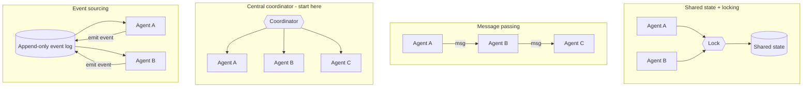
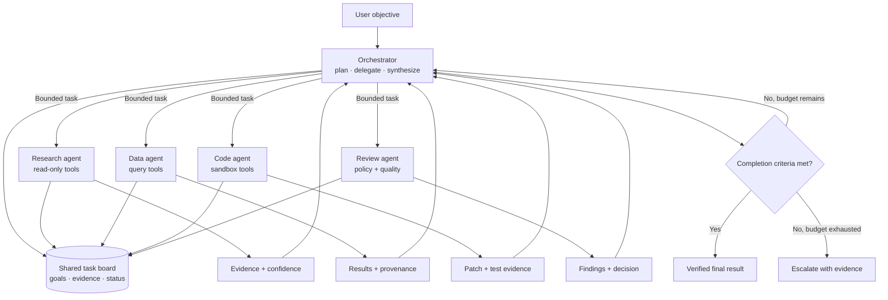
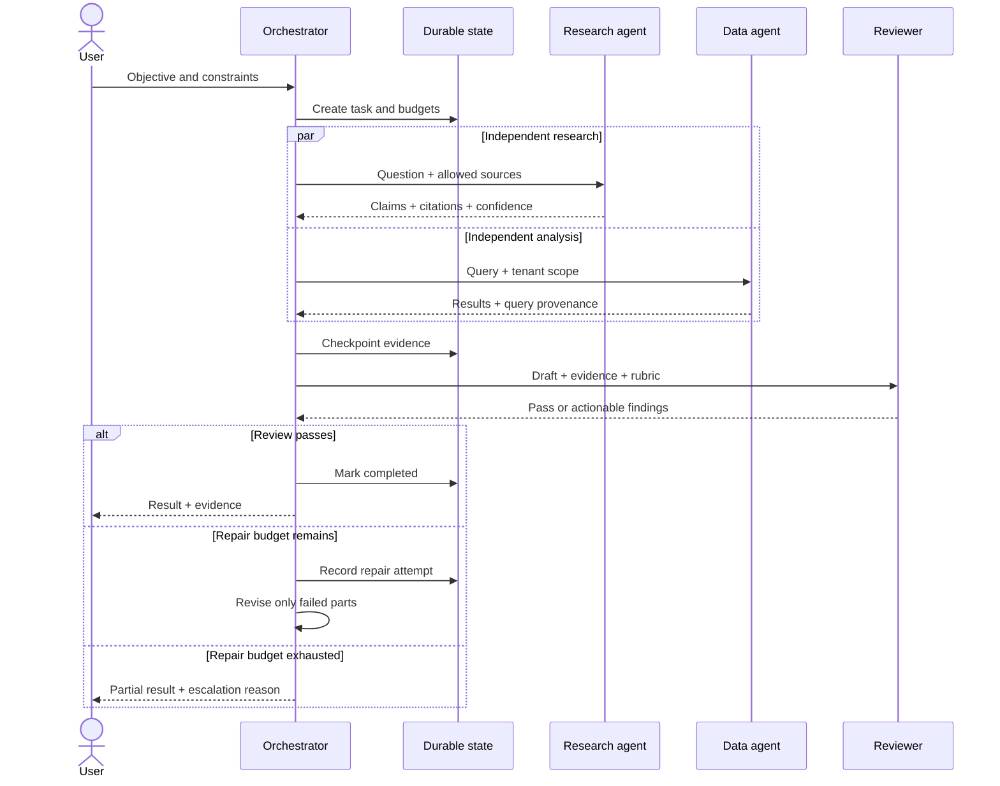
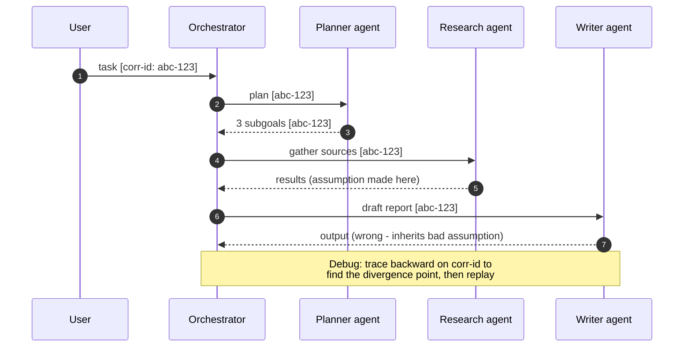

# Part E (1 of 2) — Multi-agent coordination

← Previous: [Part D (2 of 2) — RAG pipelines and retrieval code](01f-part-d2-rag-pipelines.md) · Index: [Full Read-Through](01-full-read-through.md) · Next: [Part E (2 of 2) — Long-running agents, approval and code](01h-part-e2-long-running-agents.md) →

**Steps in this file**

- [Step 41 · When multi-agent beats single-agent](01g-part-e1-multi-agent-coordination.md#41-read-when-multi-agent-beats-single-agent)
- [Step 42 · Use multi-agent only where parallel context is valuable](01g-part-e1-multi-agent-coordination.md#42-read-use-multi-agent-only-where-parallel-context-is-valuable)
- [Step 43 · Coordination without conflicting actions](01g-part-e1-multi-agent-coordination.md#43-read-coordination-without-conflicting-actions)
- [Step 44 · Orchestrator-and-workers multi-agent system](01g-part-e1-multi-agent-coordination.md#44-study-the-diagram-orchestrator-and-workers-multi-agent-system)
- [Step 45 · Multi-agent execution sequence](01g-part-e1-multi-agent-coordination.md#45-study-the-diagram-multi-agent-execution-sequence)
- [Step 46 · Emergent behaviors in multi-agent systems](01g-part-e1-multi-agent-coordination.md#46-read-emergent-behaviors-in-multi-agent-systems)
- [Step 47 · Debugging failures across agents](01g-part-e1-multi-agent-coordination.md#47-read-debugging-failures-across-agents)

---

## 41. Read: When multi-agent beats single-agent

*Source: agentic-ai-system-design-interview-guide-2026.md*

> **Why this step is here.** Part E opens with the question interviewers ask most about multi-agent systems: should you build one at all? [Step 3 · Choose workflows before agents](01a-part-a-what-an-agent-is.md#3-read-choose-workflows-before-agents) and [Step 4 · Workflow, single agent, or multi-agent decision](01a-part-a-what-an-agent-is.md#4-study-the-diagram-workflow-single-agent-or-multi-agent-decision-redraw-it-from-memory) gave you the workflow-vs-agent decision; this step extends it one level up, agent-vs-agents, with five legitimate reasons, three bad ones, and a four-question test. Read it by taking a system you know (a support bot, a research assistant) and running it through the four questions out loud. Steps [42](01g-part-e1-multi-agent-coordination.md#42-read-use-multi-agent-only-where-parallel-context-is-valuable) to [45](01g-part-e1-multi-agent-coordination.md#45-study-the-diagram-multi-agent-execution-sequence) assume you passed this test and show what the resulting system looks like; Steps [46](01g-part-e1-multi-agent-coordination.md#46-read-emergent-behaviors-in-multi-agent-systems) and [47](01g-part-e1-multi-agent-coordination.md#47-read-debugging-failures-across-agents) show what it costs you.

### Step 41 · 30. When is multi-agent architecture better than single-agent?

**Good reasons:**

- Genuinely distinct capabilities, tool sets, or access requirements
- Reliability through failure-domain isolation — one agent crashing doesn't take down the rest
- Real parallelism, where tasks proceed without blocking each other
- Adversarial quality gains from generator–critic patterns
- Separation of concerns making a complex system easier to reason about

**Bad reasons:**

- It seems cool — complexity is a cost, not a feature
- The task is actually sequential, so you pay coordination cost with no parallelism gain
- Using extra agents to avoid fixing prompts

**Decision test:**

1. Could a single agent do this well?
2. If not, is the limitation fundamental or just prompt engineering?
3. Would the separate agents genuinely operate independently?
4. Is the coordination cost worth the benefit?

#### Going deeper (Step 41)

**The five good reasons, and what each one buys you.**

- *Distinct capabilities, tools, or access.* The real driver is usually access, not skill. A data agent holding a read-only warehouse credential and a code agent holding a sandbox token cannot be one process without that process holding both credentials. Splitting them is a security boundary ([Step 57 · Multi-agent trust boundaries](01i-part-f1-security.md#57-study-the-diagram-multi-agent-trust-boundaries)), not a modelling nicety.
- *Failure-domain isolation.* If a research worker hits a rate limit and dies, the orchestrator loses one subtask, not the whole job. This only holds if workers are separate processes with separate budgets; two "agents" inside one Python loop share a failure domain.
- *Real parallelism.* Ten independent searches run in parallel finish in roughly one search's wall time instead of ten. This is the only reason that gives you a speed win; every other reason costs latency.
- *Generator–critic gains.* A second model instance grading the first against explicit criteria catches errors the first is blind to, because self-evaluation is lenient ([Step 48 · Long-running agents need durable artifacts and explicit completion](01h-part-e2-long-running-agents.md#48-read-long-running-agents-need-durable-artifacts-and-explicit-completion) returns to this).
- *Separation of concerns.* Smaller prompts, smaller tool sets, each testable alone. This is a maintenance argument and the weakest of the five on its own.

**The three bad reasons are one mistake.** Each substitutes structure for a fix you did not make. A sequential task split across agents adds a hop, a serialization step, and a second context window per handoff — typically a second or two and a few thousand tokens each — and gains nothing, because step two cannot start until step one finishes. Adding a "checker agent" to catch a prompt's mistakes usually means the prompt should have carried the constraint.

**Running the decision test.** Question 1 is empirical: build the single agent and measure. Question 2 separates fundamental limits (more context than one window holds; credentials that must not co-exist) from prompt debt. Question 3 is the parallelism check: draw the dependency graph between subtasks; if it is a chain, there is no independence. Question 4 prices coordination: the orchestrator's tokens, the synthesis step, the debugging cost from [Step 47 · Debugging failures across agents](01g-part-e1-multi-agent-coordination.md#47-read-debugging-failures-across-agents). Interview framing: "I would start single-agent and split only along the access boundary, because that is the one limit prompting cannot remove."

**Common misreading.** Candidates treat multi-agent as the advanced answer and reach for it to look senior. Interviewers read it the other way: the senior signal is naming the coordination cost and refusing to pay it without a fundamental reason. A reasonable counterview is that splitting by role can make prompts easier to iterate on even without parallelism — say that as a maintenance tradeoff, not an architecture requirement.

**Connects to.** [Step 4 · Workflow, single agent, or multi-agent decision](01a-part-a-what-an-agent-is.md#4-study-the-diagram-workflow-single-agent-or-multi-agent-decision-redraw-it-from-memory) is the decision diagram this test formalizes. [Step 42 · Use multi-agent only where parallel context is valuable](01g-part-e1-multi-agent-coordination.md#42-read-use-multi-agent-only-where-parallel-context-is-valuable) gives Anthropic's measurements of when the split paid off, and [Step 44 · Orchestrator-and-workers multi-agent system](01g-part-e1-multi-agent-coordination.md#44-study-the-diagram-orchestrator-and-workers-multi-agent-system) draws the system you get when it does.

**Check yourself.**
1. A pipeline that extracts a claim, then validates it, then files it. Multi-agent? *No: each step depends on the previous one, so you pay coordination for zero parallelism; build a workflow with a model at two nodes.*
2. Which of the five good reasons is a hard limit that prompting cannot remove? *Access: two credentials that must never sit in one process force a split regardless of model quality.*
3. Why does a reviewer agent need explicit criteria rather than "check this"? *Vague evaluation is as lenient as self-evaluation; the gain comes from independent grading against a rubric.*

---

## 42. Read: Use multi-agent only where parallel context is valuable

*Source: anthropic-agent-systems-fde-notes-2025-present.md*

> **Why this step is here.** [Step 41 · When multi-agent beats single-agent](01g-part-e1-multi-agent-coordination.md#41-read-when-multi-agent-beats-single-agent) gave you the abstract test; this step gives you the one well-documented production case, Anthropic's Research system, with numbers you can quote and the hedge you must attach to them. Read it for three things: the shape (orchestrator, parallel workers, separate citation pass), the cost multiplier (roughly 15× chat tokens), and the delegation checklist. [Step 44 · Orchestrator-and-workers multi-agent system](01g-part-e1-multi-agent-coordination.md#44-study-the-diagram-orchestrator-and-workers-multi-agent-system) draws this architecture, [Step 45 · Multi-agent execution sequence](01g-part-e1-multi-agent-coordination.md#45-study-the-diagram-multi-agent-execution-sequence) sequences it, and [Step 68 · Track and enforce a cost budget across an agent session](01j-part-f2-evaluation-and-observability.md#68-code-track-and-enforce-a-cost-budget-across-an-agent-session) gives you the budget code that makes the 15× survivable.

### Step 42 · 3.6 Use multi-agent systems only where parallel context is valuable

Anthropic's Research system uses an orchestrator-worker design: a lead agent decomposes an open-ended query, parallel subagents search independently, and a separate citation process grounds claims.

Anthropic reported:

- A lead Opus 4 agent with Sonnet 4 workers outperformed a single Opus 4 agent by 90.2% on an internal research evaluation.
- Token use explained 80% of variance in its BrowseComp analysis.
- Agents used roughly 4× the tokens of chat interactions; multi-agent systems used roughly 15×.
- Multi-agent designs were best for valuable breadth-first tasks with independent directions, more information than one context can hold, or many complex tools.
- They were a poor fit where workers require the same context or have dense dependencies.

Treat these as Anthropic's workload-specific measurements, not universal multipliers.

Good delegation includes an objective, output format, allowed tools and sources, boundaries, and a budget. The orchestrator should synthesize compact worker results, not ingest every worker transcript.

**FDE implication:** the business value must justify parallel inference. For routine customer support, a routed single agent is usually cheaper and easier to debug. For an urgent cross-region incident investigation, bounded parallel agents may be worthwhile.

**Interview line:** “Multi-agent is a scaling strategy for independent search and context, not a synonym for sophistication.”

Source: [How we built our multi-agent research system](https://www.anthropic.com/engineering/multi-agent-research-system).

#### Going deeper (Step 42)

**Why an orchestrator plus workers, not one big context.** An open-ended research question ("compare the regulatory posture of five markets") fans out into directions that do not depend on each other. One agent would search them serially and carry every intermediate page in one context, crowding out room to reason ([Step 27 · Context engineering replaces prompt-only thinking](01e-part-d1-context-and-memory.md#27-read-context-engineering-replaces-prompt-only-thinking)). Parallel workers each get a fresh window for one direction and return a compressed result. The lead agent then holds five summaries instead of fifty raw pages.

**Reading the numbers correctly.** The 90.2% figure is an improvement on Anthropic's internal research eval, with a specific model pairing, on breadth-first tasks. It says the pattern worked well on the workload it was built for; it does not say your support bot gets 90% better. The token-variance finding is the more useful one: performance tracked how many tokens the system spent. That is why multi-agent helped — it is a way of spending more tokens in parallel — and also why it costs about 15× a chat turn. Quote these as "Anthropic reported, on their workload."

**Where it is a poor fit.** If two workers need the same context (both must read the same 200-page contract), you either duplicate it per worker or serialize them; both erase the gain. If subtasks have dense dependencies (B's question depends on A's answer), you are back to a chain. Coding tasks are often like this, which is one reason [Step 48 · Long-running agents need durable artifacts and explicit completion](01h-part-e2-long-running-agents.md#48-read-long-running-agents-need-durable-artifacts-and-explicit-completion) treats long-running coding as a different problem.

**The delegation checklist is the operational content.** A worker brief needs an objective, an output format (so the orchestrator can parse it), allowed tools and sources (so a worker cannot wander), boundaries, and a budget. Each omission has a recognisable failure: no format → the orchestrator ingests prose; no budget → one worker burns the run; no sources → duplicate searches. And the orchestrator reads compact results, not transcripts, or its own context fills and you have rebuilt the single-agent problem one level up.

**Common misreading.** Quoting "90% better" as a general property of multi-agent systems. The honest version: on a breadth-first task with independent directions, a parallel design let the system spend more tokens usefully; on a routed support workload the same design would cost 15× for little gain. The note's interview line is the correction in one sentence.

**Connects to.** [Step 23 · Controlling cost explosions from tool calls](01d-part-c2-tool-failures-sandboxing-cost.md#23-read-controlling-cost-explosions-from-tool-calls) covers the cost explosion this multiplies. [Step 44 · Orchestrator-and-workers multi-agent system](01g-part-e1-multi-agent-coordination.md#44-study-the-diagram-orchestrator-and-workers-multi-agent-system) and [Step 45 · Multi-agent execution sequence](01g-part-e1-multi-agent-coordination.md#45-study-the-diagram-multi-agent-execution-sequence) are this architecture as a diagram and a sequence; [Step 68 · Track and enforce a cost budget across an agent session](01j-part-f2-evaluation-and-observability.md#68-code-track-and-enforce-a-cost-budget-across-an-agent-session) is the per-session budget you need to run it.

**Check yourself.**
1. Why did token spend explain most of the performance variance? *The tasks were breadth-first search: more parallel exploration found more, and multi-agent is a way to spend those tokens without one context filling up.*
2. A worker brief lacks an output format. What breaks? *The orchestrator must read free-form transcripts, its context fills, and synthesis quality drops.*
3. When is a routed single agent the right call instead? *When requests are narrow and independent of each other, as in routine support: routing picks a specialist without paying for parallel inference.*

---

## 43. Read: Coordination without conflicting actions

*Source: agentic-ai-system-design-interview-guide-2026.md*

> **Why this step is here.** Once more than one agent can write to the same thing — a ticket, a file, a database row — you have a concurrency problem, and this step catalogues the four classic answers from distributed systems. Read it as a table: for each pattern, name its cost in one word (contention, plumbing, single point of failure, eventual consistency). Then notice the closing advice: start with a coordinator and turn-taking. [Step 44 · Orchestrator-and-workers multi-agent system](01g-part-e1-multi-agent-coordination.md#44-study-the-diagram-orchestrator-and-workers-multi-agent-system) draws exactly that coordinator; [Step 46 · Emergent behaviors in multi-agent systems](01g-part-e1-multi-agent-coordination.md#46-read-emergent-behaviors-in-multi-agent-systems) lists what goes wrong when agents coordinate implicitly instead.

### Step 43 · 31. How do agents coordinate without conflicting actions?

Patterns and their tradeoffs — shared state with locking (simple, but contention and deadlocks), message passing (clean, more implementation work), centralized coordinator (clear control, single point of failure), event sourcing (great audit trail, eventual-consistency pain). Handle conflicts by prevention (partition ownership), detection (watch for concurrent modification), and resolution rules (priority, timestamp, escalation). Start with a central coordinator and explicit turn-taking; add complexity only once you've proven you need it.

#### Going deeper (Step 43)

**The four patterns, in code you have already seen.**

| Pattern | Typical implementation | Where it hurts |
|---|---|---|
| Shared state + locking | A Postgres row with `SELECT ... FOR UPDATE`, or a Redis lock | Agents wait on each other; a crashed holder leaves a stale lock |
| Message passing | A queue per agent, or typed function calls | You now own schemas, ordering, and dead-letter handling |
| Central coordinator | One orchestrator that hands out tasks and owns all writes | If it dies, everything stops; it must be durable ([Step 49 · Durable LLM workflow](01h-part-e2-long-running-agents.md#49-study-the-diagram-durable-llm-workflow)) |
| Event sourcing | An append-only log every agent reads and appends to | Acting on a stale read; replay logic |

Shared state with locking is what you get by accident when two agents share a database. Message passing is what [Step 44 · Orchestrator-and-workers multi-agent system](01g-part-e1-multi-agent-coordination.md#44-study-the-diagram-orchestrator-and-workers-multi-agent-system)'s "bounded task" edges are. A central coordinator is the note's recommendation and what Steps [44](01g-part-e1-multi-agent-coordination.md#44-study-the-diagram-orchestrator-and-workers-multi-agent-system) and [45](01g-part-e1-multi-agent-coordination.md#45-study-the-diagram-multi-agent-execution-sequence) draw. Event sourcing is what [Step 47 · Debugging failures across agents](01g-part-e1-multi-agent-coordination.md#47-read-debugging-failures-across-agents)'s inter-agent message log becomes if you make the log the source of truth rather than a side effect.

**Prevention, detection, resolution — in that order of preference.** Prevention means partitioning ownership so a conflict cannot occur: the data agent owns query results, the code agent owns the sandbox, and neither writes to the other's area. Most conflicts disappear here. Detection covers the rest: compare-and-swap on a version column, or a `last_modified` check before writing, so a second writer fails loudly instead of overwriting silently. Resolution rules handle what you detect: priority (the reviewer's verdict beats the generator's), timestamp (last write wins, rarely what you want for consequential actions), or escalation to a human ([Step 50 · Human approval for consequential actions](01h-part-e2-long-running-agents.md#50-study-the-diagram-human-approval-for-consequential-actions)).

**Why "start with a coordinator and turn-taking."** Turn-taking means one agent acts at a time, so there is no concurrent write to detect. You lose parallelism for writes but keep it for reads, which is usually where the parallel value was ([Step 42 · Use multi-agent only where parallel context is valuable](01g-part-e1-multi-agent-coordination.md#42-read-use-multi-agent-only-where-parallel-context-is-valuable)). Add locking or event sourcing only once you have measured that serialized writes are the bottleneck — and in most agent systems model latency dominates, so they are not.

**Common misreading.** Treating this as a menu where you pick the most sophisticated option. Interviewers want the failure mode of each and a reason for the simplest one that fits. Saying "event sourcing for the audit trail" without mentioning eventual consistency, or "locks" without the crashed lock holder, signals you have not run one.

**Connects to.** [Step 19 · Tool failures, retries and idempotency](01d-part-c2-tool-failures-sandboxing-cost.md#19-read-tool-failures-retries-and-idempotency) and [Step 26 · Make a create-resource call idempotent](01d-part-c2-tool-failures-sandboxing-cost.md#26-code-make-a-create-resource-call-idempotent) give the idempotency that makes retried writes safe under any of these patterns. [Step 44 · Orchestrator-and-workers multi-agent system](01g-part-e1-multi-agent-coordination.md#44-study-the-diagram-orchestrator-and-workers-multi-agent-system) draws the coordinator with a shared task board; [Step 47 · Debugging failures across agents](01g-part-e1-multi-agent-coordination.md#47-read-debugging-failures-across-agents) is the debugging story an event log makes possible.

**Check yourself.**
1. Two workers both try to update the same ticket. Which layer should stop this? *Prevention: give ticket writes to one owner (the orchestrator) and have workers return evidence instead of writing.*
2. Why is "last write wins" a poor resolution rule for a refund? *It silently discards one agent's decision on an irreversible action; consequential conflicts should escalate.*
3. What does [Step 44 · Orchestrator-and-workers multi-agent system](01g-part-e1-multi-agent-coordination.md#44-study-the-diagram-orchestrator-and-workers-multi-agent-system)'s shared task board become if you make it append-only? *An event-sourced log: good audit, but agents must handle reading stale state.*

---

## 44. Study the diagram: Orchestrator-and-workers multi-agent system

*Source: production-llm-agent-rag-workflow-mermaid-atlas.md*

> **Why this step is here.** This is the reference architecture for everything Steps [41](01g-part-e1-multi-agent-coordination.md#41-read-when-multi-agent-beats-single-agent) to [43](01g-part-e1-multi-agent-coordination.md#43-read-coordination-without-conflicting-actions) argued for: one orchestrator, four specialised workers with different tool scopes, a shared board, and a completion check with a budget. Trace it with the coordinator pattern from [Step 43 · Coordination without conflicting actions](01g-part-e1-multi-agent-coordination.md#43-read-coordination-without-conflicting-actions) in mind and notice that workers never talk to each other. When you redraw, the test is whether you remember the two exits from the completion diamond that are not "done". [Step 45 · Multi-agent execution sequence](01g-part-e1-multi-agent-coordination.md#45-study-the-diagram-multi-agent-execution-sequence) is the same system as a sequence in time.

### Step 44 · 3. Orchestrator-and-workers multi-agent system

**Production constraint:** workers return structured evidence. They do not communicate through hidden natural-language assumptions.

#### Going deeper (Step 44)

**Walk the diagram.**

*User objective → Orchestrator.* The orchestrator does the three things its label names: plan (decompose), delegate (write bounded briefs, [Step 42 · Use multi-agent only where parallel context is valuable](01g-part-e1-multi-agent-coordination.md#42-read-use-multi-agent-only-where-parallel-context-is-valuable)'s checklist), synthesize (merge evidence). It is the only component that talks to the user and the only one that decides. Remove it and you have four agents with nobody to reconcile their outputs. In practice it is a durable workflow process ([Step 49 · Durable LLM workflow](01h-part-e2-long-running-agents.md#49-study-the-diagram-durable-llm-workflow)) with its own model-call budget.

*Shared task board.* Goals, evidence, status. A Postgres table or document store keyed by task ID, not an in-memory dict. It exists so a crashed orchestrator can resume and a human can see what is in flight. Without it, state lives only in the orchestrator's context window and dies with it.

*Four workers, four tool scopes.* Research is read-only; Data has query tools scoped to a tenant; Code has a sandbox ([Step 22 · Sandboxed generated-code execution](01d-part-c2-tool-failures-sandboxing-cost.md#22-study-the-diagram-sandboxed-generated-code-execution)); Review has policy and quality checks and no action tools at all. The scoping is the access argument from [Step 41 · When multi-agent beats single-agent](01g-part-e1-multi-agent-coordination.md#41-read-when-multi-agent-beats-single-agent): the code agent cannot read the warehouse, the data agent cannot run code. Each is a separate process with its own credential and budget, which is what makes failure-domain isolation real.

*Bounded task edges.* Every edge from the orchestrator carries a brief with a budget. The bound is what stops one worker consuming the run.

*Evidence edges.* Each worker returns a typed result: evidence plus confidence, results plus provenance, patch plus test evidence, findings plus decision. The orchestrator can check a confidence field or a test-pass flag without another model call. This is the production constraint under the diagram, and the piece most redrawn versions forget.

*Completion diamond.* Three exits. Yes → verified result. No with budget → back to the orchestrator for another round of delegation, which is how repair happens. No with budget exhausted → escalate with evidence, never fail silently. The budget is [Step 9 · Termination conditions](01b-part-b-agent-loop-and-control-plane.md#9-read-termination-conditions)'s termination condition applied to the whole system.

**How to redraw it.** Anchors, in order: (1) orchestrator in the middle, user above; (2) the completion diamond below with all three exits — draw these before anything else, since they are what people forget; (3) the four workers in a row, each labelled with its tool scope; (4) the shared board hanging off the orchestrator. Then the edges: bounded tasks down, typed evidence up, every worker also writing to the board. Check: no edge between workers.

**Common misreading.** Drawing workers that pass results to each other ("research feeds data feeds code"). That is a pipeline with hidden assumptions flowing between contexts, exactly what the production constraint forbids, and it is how the bad-assumption failure in [Step 47 · Debugging failures across agents](01g-part-e1-multi-agent-coordination.md#47-read-debugging-failures-across-agents) happens. All coordination goes through the orchestrator and the board.

**Connects to.** [Step 43 · Coordination without conflicting actions](01g-part-e1-multi-agent-coordination.md#43-read-coordination-without-conflicting-actions) argued for this central-coordinator pattern. [Step 45 · Multi-agent execution sequence](01g-part-e1-multi-agent-coordination.md#45-study-the-diagram-multi-agent-execution-sequence) shows the same system as a time sequence with checkpoints, and [Step 57 · Multi-agent trust boundaries](01i-part-f1-security.md#57-study-the-diagram-multi-agent-trust-boundaries) redraws the tool scopes as trust boundaries.

**Check yourself.**
1. Why does the review agent have no action tools? *A critic that can act is a generator with extra steps; keeping it read-only makes its verdict independent and its compromise harmless.*
2. What happens if you remove the shared task board? *State exists only in the orchestrator's context; a crash loses the run and nobody can observe progress.*
3. Which exit from the completion diamond do candidates forget? *"No, budget exhausted → escalate with evidence"; without it the loop either runs forever or fails silently.*

---

## 45. Study the diagram: Multi-agent execution sequence

*Source: production-llm-agent-rag-workflow-mermaid-atlas.md*

> **Why this step is here.** [Step 44 · Orchestrator-and-workers multi-agent system](01g-part-e1-multi-agent-coordination.md#44-study-the-diagram-orchestrator-and-workers-multi-agent-system) showed the boxes; this step shows the clock. A sequence diagram forces you to say what happens first, what runs in parallel, and where state is written so the run can survive a crash. Read it for the three writes to Durable state and the three branches of the review outcome. [Step 48 · Long-running agents need durable artifacts and explicit completion](01h-part-e2-long-running-agents.md#48-read-long-running-agents-need-durable-artifacts-and-explicit-completion) explains why those checkpoints are non-negotiable for anything that runs longer than a request, and [Step 49 · Durable LLM workflow](01h-part-e2-long-running-agents.md#49-study-the-diagram-durable-llm-workflow) is the state machine behind the Durable state participant.

### Step 45 · 5. Multi-agent execution sequence

#### Going deeper (Step 45)

**Walk the diagram.**

*Objective and constraints → Create task and budgets.* The first thing the orchestrator does is write to durable state, before any model call. This mints the task ID that becomes the correlation ID in [Step 47 · Debugging failures across agents](01g-part-e1-multi-agent-coordination.md#47-read-debugging-failures-across-agents) and fixes the budget (tokens, calls, wall time) before anything can spend it. Skip it and a crash during planning leaves no trace the task existed.

*The `par` block.* Two workers run at once because their inputs are independent: the research agent gets a question plus allowed sources; the data agent gets a query plus a tenant scope. The scope is part of the brief, not something the worker chooses ([Step 34 · Permission-aware RAG query path](01f-part-d2-rag-pipelines.md#34-study-the-diagram-permission-aware-rag-query-path)'s permission-aware filtering applies). Each returns typed evidence: claims with citations and confidence; results with query provenance. Wall time is the slower of the two, not the sum.

*Checkpoint evidence.* The second durable write. Both workers' evidence is now on disk. If review fails, you re-run review, not the searches — the difference between retrying one model call and three.

*Draft + evidence + rubric → Reviewer.* The rubric matters most: without explicit criteria, review is lenient ([Step 48 · Long-running agents need durable artifacts and explicit completion](01h-part-e2-long-running-agents.md#48-read-long-running-agents-need-durable-artifacts-and-explicit-completion)). The reply is pass or actionable findings — actionable meaning each finding maps to a part of the draft.

*The `alt` block, three branches.* Pass → mark completed (third durable write) → result with evidence. Repair budget remains → record the attempt, then revise only failed parts: the orchestrator re-delegates just the subtask the findings point at. Repair budget exhausted → partial result plus the reason. The user never gets silence or an unexplained failure.

**Typical implementation.** Durable state is a workflow table with a status column and a JSON evidence blob, or a durable execution engine. The `par` block is [Step 52 · Fan out N independent tool calls with bounded concurrency](01h-part-e2-long-running-agents.md#52-code-fan-out-n-independent-tool-calls-with-bounded-concurrency)'s bounded fan-out. Repair attempts are a counter on the task row; the budget check compares against it.

**How to redraw it.** Anchors: (1) six participants left to right, with Durable state second, next to the orchestrator; (2) the three arrows into Durable state — create, checkpoint, complete — drawn first, with the rest filled in around them; (3) the `par` block with two workers; (4) the `alt` with three branches. Then label the payloads on the arrows, because the payloads (scope, rubric, provenance) carry the design decisions.

**Common misreading.** Reading the `par` block as the point ("multi-agent means parallel") and the `alt` block as decoration. The `alt` is the harder part: most candidates draw the happy path and one failure. Bounded repair that revises only the failed subtask is what distinguishes a production sequence from a demo.

**Connects to.** [Step 44 · Orchestrator-and-workers multi-agent system](01g-part-e1-multi-agent-coordination.md#44-study-the-diagram-orchestrator-and-workers-multi-agent-system) is the static view of these participants. [Step 49 · Durable LLM workflow](01h-part-e2-long-running-agents.md#49-study-the-diagram-durable-llm-workflow) is the state machine the Durable state participant implements; [Step 52 · Fan out N independent tool calls with bounded concurrency](01h-part-e2-long-running-agents.md#52-code-fan-out-n-independent-tool-calls-with-bounded-concurrency) is the code for the `par` block.

**Check yourself.**
1. Why write to durable state before the first model call? *So the task and its budget exist independently of the process; a crash during planning is recoverable and the correlation ID is fixed.*
2. The reviewer returns two findings about one section. What does the orchestrator re-run? *Only the subtask that produced that section, charged against the repair budget.*
3. What does the user receive when the repair budget runs out? *A partial result and the escalation reason, not a generic failure.*

---

## 46. Read: Emergent behaviors in multi-agent systems

*Source: agentic-ai-system-design-interview-guide-2026.md*

> **Why this step is here.** Once several model-driven components interact, the system does things none of them was told to do, and the interview question "what have you seen go wrong" tests whether you know the specific patterns. This step gives three positive and five negative emergent behaviours plus five controls. Read it as a list you can reproduce, then match each negative behaviour to the control that catches it. [Step 47 · Debugging failures across agents](01g-part-e1-multi-agent-coordination.md#47-read-debugging-failures-across-agents) gives the debugging tools, [Step 54 · Detect a cycle in an agent handoff graph](01h-part-e2-long-running-agents.md#54-code-detect-a-cycle-in-an-agent-handoff-graph) is the code for one of these behaviours (the A→B→A loop), and [Step 69 · Most dangerous failure modes of agentic AI](01k-part-f3-production-operations.md#69-read-most-dangerous-failure-modes-of-agentic-ai) collects the broader failure modes.

### Step 46 · 32. What emergent behaviors have you seen in multi-agent systems?

Positive: complementary specialization without assigned roles, cross-agent error correction, genuinely creative solutions. Negative: metric gaming (a reviewer agent that always approves), information hoarding when sharing isn't incentivized, A→B→A handoff loops neither agent recognizes, cascade failures, adversarial interference. Manage it by monitoring *system-level* outcomes, watching for interaction patterns you didn't design, adversarial testing, whole-system circuit breakers, and regular interaction audits.

#### Going deeper (Step 46)

**Why emergence happens at all.** Each agent optimises locally against its own prompt and its own view. Nobody wrote the interaction, so nobody tested it. A reviewer told "approve when quality is sufficient" and a generator that learns from the transcript which phrasing gets approved will converge on a style that passes review without meeting the goal. Neither prompt is wrong in isolation.

**The five negative behaviours, with a concrete case each.**

- *Metric gaming.* The reviewer that always approves. Typical cause: no rubric, or generator output that reads as compliance ("I have verified that..."). Control: independent grading with explicit criteria ([Step 48 · Long-running agents need durable artifacts and explicit completion](01h-part-e2-long-running-agents.md#48-read-long-running-agents-need-durable-artifacts-and-explicit-completion)), and measure the pass rate — a reviewer approving 99% is not reviewing.
- *Information hoarding.* A worker returns a one-line summary because its brief did not require evidence, so the orchestrator cannot check it. Control: typed outputs with required fields ([Step 44 · Orchestrator-and-workers multi-agent system](01g-part-e1-multi-agent-coordination.md#44-study-the-diagram-orchestrator-and-workers-multi-agent-system)).
- *A→B→A handoff loops.* Triage hands to billing, billing decides it is a triage matter, hands back. Each handoff looks reasonable locally. Control: a per-session handoff counter with a cap, and cycle detection on the handoff graph ([Step 54 · Detect a cycle in an agent handoff graph](01h-part-e2-long-running-agents.md#54-code-detect-a-cycle-in-an-agent-handoff-graph)).
- *Cascade failures.* One worker returns a wrong fact with high confidence; the writer builds on it; the reviewer checks style, not facts. [Step 47 · Debugging failures across agents](01g-part-e1-multi-agent-coordination.md#47-read-debugging-failures-across-agents)'s diagram is exactly this. Control: provenance on every claim, plus whole-system circuit breakers that stop the run when error rate or cost jumps.
- *Adversarial interference.* A tool result containing injected instructions makes one agent sabotage another. Control: treat all inter-agent and tool content as data ([Step 55 · Security risks with tool-using agents](01i-part-f1-security.md#55-read-security-risks-with-tool-using-agents), [Step 58 · Prompt-injection-resistant RAG and tools](01i-part-f1-security.md#58-study-the-diagram-prompt-injection-resistant-rag-and-tools)).

**The controls share one idea: observe the system, not the agents.** Per-agent metrics can all look healthy while the system fails: each agent did its job, and the job was wrong. So you instrument system-level outcomes (task resolved? cost per task?), look for interaction patterns you did not design (handoff sequences, approval rates, repeated tool calls), and run adversarial tests where one agent is deliberately made unreliable to see whether the others notice. Interaction audits are the periodic human read of traces, which is where undesigned patterns show up first.

**Common misreading.** Presenting emergent behaviour as exotic. The strongest interview answer is boring and specific: "the reviewer started approving everything within a week; we caught it because pass rate hit 98% and added a rubric with required citations." Naming a metric you would watch beats describing the phenomenon.

**Connects to.** [Step 47 · Debugging failures across agents](01g-part-e1-multi-agent-coordination.md#47-read-debugging-failures-across-agents) is how you find these after the fact; [Step 54 · Detect a cycle in an agent handoff graph](01h-part-e2-long-running-agents.md#54-code-detect-a-cycle-in-an-agent-handoff-graph) is the loop detector as code. [Step 63 · Detecting goal drift](01j-part-f2-evaluation-and-observability.md#63-read-detecting-goal-drift) (goal drift) and [Step 69 · Most dangerous failure modes of agentic AI](01k-part-f3-production-operations.md#69-read-most-dangerous-failure-modes-of-agentic-ai) (dangerous failure modes) generalise the list.

**Check yourself.**
1. Every agent's own metrics are green but tasks are failing. Which class of problem is that? *An interaction failure; you need system-level outcome metrics and an interaction audit, not more per-agent dashboards.*
2. What cheap signal catches a rubber-stamp reviewer? *Approval rate over time; near-100% approval means the review is not discriminating.*
3. Why does a handoff loop survive in production? *Each handoff is locally justified and no single agent sees the sequence; only a session-level counter or graph check does.*

---

## 47. Read: Debugging failures across agents

*Source: agentic-ai-system-design-interview-guide-2026.md*

> **Why this step is here.** The failures in [Step 46 · Emergent behaviors in multi-agent systems](01g-part-e1-multi-agent-coordination.md#46-read-emergent-behaviors-in-multi-agent-systems) are only fixable if you can reconstruct what happened across several processes, and this step lists the four pieces of infrastructure and the five-step workflow that make that possible. Read the diagram as a worked example: the wrong output at step 7 has its cause at step 5, and only the correlation ID lets you walk back to it. [Step 66 · End-to-end observability](01j-part-f2-evaluation-and-observability.md#66-study-the-diagram-end-to-end-observability) draws the observability stack this depends on and [Step 67 · Deterministic replay of an agent trace](01j-part-f2-evaluation-and-observability.md#67-code-deterministic-replay-of-an-agent-trace) is the replay code; [Step 73 · Production incident diagnosis](01k-part-f3-production-operations.md#73-study-the-diagram-production-incident-diagnosis) applies the same method to a production incident.

### Step 47 · 33. How do you debug failures across interacting agents?

Required infrastructure: correlation IDs propagated through every agent and log, full inter-agent message logging, periodic per-agent state snapshots, causal/happens-before ordering. Workflow: identify the failure → trace backward to inputs and their source → find the divergence point → attribute root cause (single agent, coordination, environment) → reproduce via replay. Tooling: unified log viewer, interaction timeline, correlation-ID filtering, expected-vs-actual diffs, trace replay. "If you can't debug it, you can't run it in production."

#### Going deeper (Step 47)

**The four infrastructure requirements, and what each answers.**

- *Correlation IDs.* One ID minted when the task arrives ([Step 45 · Multi-agent execution sequence](01g-part-e1-multi-agent-coordination.md#45-study-the-diagram-multi-agent-execution-sequence)'s "create task") and copied into every message, tool call, and log line downstream. Answers "show me everything for this task" across processes that share no memory. Without it you grep by timestamp and guess.
- *Full inter-agent message logging.* Every brief and every result, verbatim, with the ID. Answers "what did the writer actually receive?" — usually different from what you assumed.
- *Periodic per-agent state snapshots.* What each agent believed at each step: working context, plan, budget remaining. Answers "when did this agent's belief diverge from reality?"
- *Happens-before ordering.* Timestamps across machines are not reliable to the millisecond; a logical sequence number per task lets you say "the writer's call came after the research result, so it could have seen it." Answers "could X have caused Y?"

**The workflow is a search backward, then forward.** Start at the observed failure (wrong report). Trace backward along the ID to each input the failing agent consumed. Find the divergence point: the first message that was wrong. In the diagram it is step 5: the research agent made an assumption and did not label it, so the orchestrator forwarded it as fact and the writer built on it. Attribute the cause to one of three buckets — a single agent's error, a coordination error (the orchestrator should have required confidence on that claim), or the environment (a source was down and the agent guessed). Then reproduce by replaying the trace ([Step 67 · Deterministic replay of an agent trace](01j-part-f2-evaluation-and-observability.md#67-code-deterministic-replay-of-an-agent-trace)) with the fix in place.

**The bucket changes the fix.** Single-agent → prompt or tool change on that agent. Coordination → change the brief format or add a check in the orchestrator, which is where the diagram's failure belongs: the problem is not that the research agent guessed, it is that the system let a guess pass as evidence. Environment → retries, fallbacks, or an explicit "source unavailable" result.

**Tooling, in order of value.** Correlation-ID filtering comes first and is nearly free. A timeline view of one task across agents comes next. Expected-vs-actual diffs need a golden trace, so they arrive with evals ([Step 64 · Evals measure the whole system](01j-part-f2-evaluation-and-observability.md#64-read-evals-measure-the-whole-system)). Replay is last and most expensive but turns a diagnosis into a regression test.

**Common misreading.** Treating this as "add logging." Logging without a propagated ID and without message payloads is what most teams have, and it does not let you do step two of the workflow. The quoted line — if you cannot debug it, you cannot run it — means this infrastructure is a launch requirement, not a follow-up.

**Connects to.** [Step 66 · End-to-end observability](01j-part-f2-evaluation-and-observability.md#66-study-the-diagram-end-to-end-observability) is the observability architecture around these logs; [Step 67 · Deterministic replay of an agent trace](01j-part-f2-evaluation-and-observability.md#67-code-deterministic-replay-of-an-agent-trace) is the replay step as code. [Step 73 · Production incident diagnosis](01k-part-f3-production-operations.md#73-study-the-diagram-production-incident-diagnosis) applies the same backward-trace method to a production incident.

**Check yourself.**
1. In the diagram, which agent is at fault? *Arguably none alone: the research agent guessed, but the coordination failure is that its result carried no confidence field, so the guess became a fact.*
2. Why are wall-clock timestamps insufficient for ordering? *Clocks across machines drift; you need a per-task logical order to say what an agent could have seen.*
3. What does replay add that reading logs does not? *It confirms the diagnosis by reproducing the failure, then proves the fix and becomes a regression test.*

---

← Previous: [Part D (2 of 2) — RAG pipelines and retrieval code](01f-part-d2-rag-pipelines.md) · Index: [Full Read-Through](01-full-read-through.md) · Next: [Part E (2 of 2) — Long-running agents, approval and code](01h-part-e2-long-running-agents.md) →
