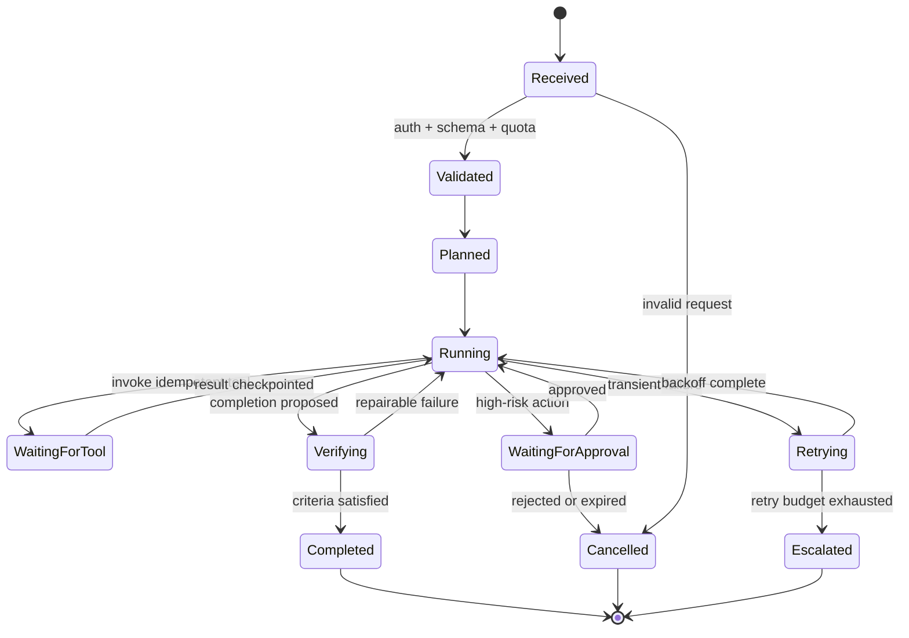
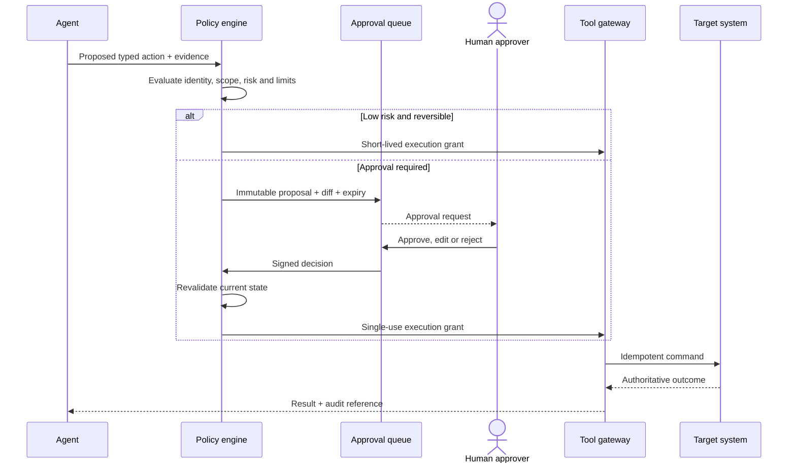
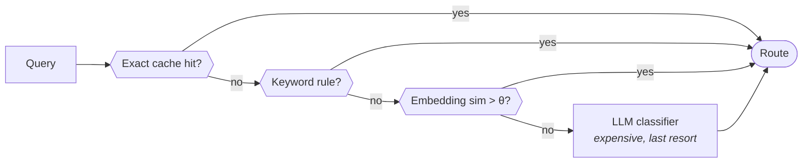
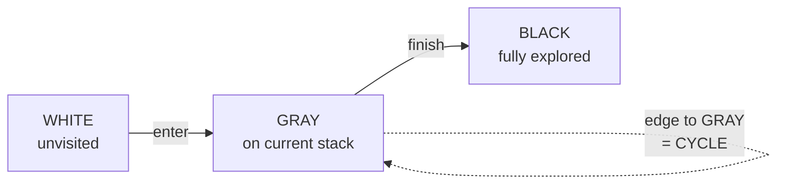

# Part E (2 of 2) — Long-running agents, approval and code

← Previous: [Part E (1 of 2) — Multi-agent coordination](01g-part-e1-multi-agent-coordination.md) · Index: [Full Read-Through](01-full-read-through.md) · Next: [Part F (1 of 3) — Security](01i-part-f1-security.md) →

**Steps in this file**

- [Step 48 · Long-running agents need durable artifacts and explicit completion](01h-part-e2-long-running-agents.md#48-read-long-running-agents-need-durable-artifacts-and-explicit-completion)
- [Step 49 · Durable LLM workflow](01h-part-e2-long-running-agents.md#49-study-the-diagram-durable-llm-workflow)
- [Step 50 · Human approval for consequential actions](01h-part-e2-long-running-agents.md#50-study-the-diagram-human-approval-for-consequential-actions)
- [Step 51 · Human-in-the-loop controls](01h-part-e2-long-running-agents.md#51-read-human-in-the-loop-controls)
- [Step 52 · Fan out N independent tool calls with bounded concurrency](01h-part-e2-long-running-agents.md#52-code-fan-out-n-independent-tool-calls-with-bounded-concurrency)
- [Step 53 · Route a query to the right agent without calling a large model](01h-part-e2-long-running-agents.md#53-code-route-a-query-to-the-right-agent-without-calling-a-large-model)
- [Step 54 · Detect a cycle in an agent handoff graph](01h-part-e2-long-running-agents.md#54-code-detect-a-cycle-in-an-agent-handoff-graph)

---

## 48. Read: Long-running agents need durable artifacts and explicit completion

*Source: anthropic-agent-systems-fde-notes-2025-present.md*

> **Why this step is here.** Steps [41](01g-part-e1-multi-agent-coordination.md#41-read-when-multi-agent-beats-single-agent) to [47](01g-part-e1-multi-agent-coordination.md#47-read-debugging-failures-across-agents) were about many agents; this step is about one agent that runs for hours, which turns out to be the same problem — a distributed workflow — approached from the other side. Read it for the failure pattern (attempting too much, losing state, declaring success early), the seven practices, and the one portable idea about lenient self-evaluation. The FDE implication is the sentence to memorise. [Step 49 · Durable LLM workflow](01h-part-e2-long-running-agents.md#49-study-the-diagram-durable-llm-workflow) is the state machine it asks for, and Steps [61](01j-part-f2-evaluation-and-observability.md#61-read-evaluating-long-horizon-agent-performance) to [63](01j-part-f2-evaluation-and-observability.md#63-read-detecting-goal-drift) cover how you evaluate a run this long.

### Step 48 · 3.7 Long-running agents need durable artifacts and explicit completion

Compaction alone did not solve Anthropic's long-running coding experiments. Agents attempted too much at once, lost state mid-feature, or declared success prematurely after seeing partial progress.

Practices that improved continuity:

- Use an initializer to establish the environment and decompose requirements.
- Represent the full requirement set as structured, testable items.
- Work incrementally and leave the environment clean after each unit.
- Persist progress notes and use version history as recovery artifacts.
- Reset context when needed and hand off a structured state summary.
- Verify through end-to-end behavior, not only unit tests or the agent's claim.
- Separate generation from skeptical evaluation for complex or subjective outputs.

The 2026 follow-up used planner, generator, and evaluator roles. Its most portable idea is not “always use three agents”; it is that self-evaluation is systematically lenient, so independent grading with explicit criteria is a useful control.

**FDE implication:** for a workflow that lasts hours or awaits human approval, store a resumable state machine and idempotency keys. Never rely on an in-memory conversation loop staying alive.

**Interview line:** “A long-running agent is a distributed workflow with probabilistic steps. I design crash recovery and resume semantics before increasing the step limit.”

Sources: [Effective harnesses for long-running agents](https://www.anthropic.com/engineering/effective-harnesses-for-long-running-agents) and [Harness design for long-running application development](https://www.anthropic.com/engineering/harness-design-long-running-apps).

#### Going deeper (Step 48)

**Why compaction is not enough.** Compaction (summarising older context to make room) preserves tokens, not intent. An agent 200 steps into a feature loses which requirement it was on, what it already tried, and what "done" means. It then does what looks locally reasonable: attempts the whole remaining feature at once, or sees one passing test and declares victory. The three failures in the note are all versions of losing the plan.

**The seven practices are one design: externalise the plan.** The initializer produces a requirement checklist that lives outside the model's context. Structured, testable items make "done" machine-checkable rather than the agent's opinion. Incremental work with a clean environment per unit means every checkpoint is a state you could resume from. Progress notes and version history are the recovery artifacts a fresh context can read. A context reset with a structured handoff summary is the deliberate version of compaction — you choose what carries over. End-to-end verification catches "unit tests pass, feature does not work." Separate skeptical evaluation catches "the agent says it is done."

**The portable idea.** Anthropic's later work used planner, generator, and evaluator roles. The note is careful: do not take away "use three agents." Take away that a model grading its own work is systematically lenient, so an independent grader with explicit criteria is a control worth adding wherever quality matters and cannot be checked deterministically. That grader can be a second call to the same model with a different prompt and no memory of the generation.

**The FDE implication, concretely.** A customer workflow that waits two days for a manager's approval cannot live in a running Python loop. It needs a state row ([Step 49 · Durable LLM workflow](01h-part-e2-long-running-agents.md#49-study-the-diagram-durable-llm-workflow)), an idempotency key per side-effecting step ([Step 26 · Make a create-resource call idempotent](01d-part-c2-tool-failures-sandboxing-cost.md#26-code-make-a-create-resource-call-idempotent)), and resume logic that reads the row and continues from the last checkpoint. Raising the step limit before you have this multiplies the cost of the crash you have not planned for.

**Common misreading.** Hearing "long-running agent" and answering with a bigger context window or a better summariser. The correction is structural: plan, progress, and completion criteria live in durable artifacts, and the conversation loop is disposable.

**Connects to.** [Step 49 · Durable LLM workflow](01h-part-e2-long-running-agents.md#49-study-the-diagram-durable-llm-workflow) is the state machine the FDE implication describes; [Step 45 · Multi-agent execution sequence](01g-part-e1-multi-agent-coordination.md#45-study-the-diagram-multi-agent-execution-sequence) already showed the checkpoints in sequence. [Step 9 · Termination conditions](01b-part-b-agent-loop-and-control-plane.md#9-read-termination-conditions) gave termination conditions; [Step 64 · Evals measure the whole system](01j-part-f2-evaluation-and-observability.md#64-read-evals-measure-the-whole-system) covers evaluating the whole system rather than the agent's claim.

**Check yourself.**
1. An agent says "feature complete" after unit tests pass. Which practice catches the case where it is wrong? *End-to-end verification plus independent evaluation; the agent's claim is not evidence.*
2. Why is a structured handoff summary better than automatic compaction? *You choose what carries over — the checklist, what was tried, what "done" means — rather than letting a summariser guess.*
3. What breaks if you raise the step limit before adding resume semantics? *The cost of a mid-run crash grows with every step, and the only recovery is starting over.*

---

## 49. Study the diagram: Durable LLM workflow

*Source: production-llm-agent-rag-workflow-mermaid-atlas.md*

> **Why this step is here.** [Step 48 · Long-running agents need durable artifacts and explicit completion](01h-part-e2-long-running-agents.md#48-read-long-running-agents-need-durable-artifacts-and-explicit-completion) said a long-running agent is a distributed workflow and told you to design crash recovery first; this diagram is what that design looks like as a state machine, with every wait, retry, approval, and exit made explicit. Read it by naming the three terminal states, then the three waiting states and what wakes each one. The "Persist" line under the diagram is the schema of your workflow table. [Step 50 · Human approval for consequential actions](01h-part-e2-long-running-agents.md#50-study-the-diagram-human-approval-for-consequential-actions) zooms into WaitingForApproval, and Steps [19](01d-part-c2-tool-failures-sandboxing-cost.md#19-read-tool-failures-retries-and-idempotency), [25](01d-part-c2-tool-failures-sandboxing-cost.md#25-code-retry-with-exponential-backoff-and-jitter), and [26](01d-part-c2-tool-failures-sandboxing-cost.md#26-code-make-a-create-resource-call-idempotent) are the retry and idempotency rules this machine assumes.

### Step 49 · 11. Durable LLM workflow



**Persist:** state, attempt number, idempotency key, tool result reference, approval decision, deadline, budget, and terminal reason.

#### Going deeper (Step 49)

**Walk the diagram.**

*Received → Validated.* Auth, schema, and quota are checked before any model call, and the early exit to Cancelled means you never spend tokens on a request you would reject. In practice this is your API layer plus a rate limiter, and it fixes tenant and budget for everything downstream.

*Validated → Planned → Running.* Planned is where the model decomposes the task and the plan is written down ([Step 48 · Long-running agents need durable artifacts and explicit completion](01h-part-e2-long-running-agents.md#48-read-long-running-agents-need-durable-artifacts-and-explicit-completion)'s initializer). Running is the agent loop from [Step 8 · A safe and debuggable agent loop](01b-part-b-agent-loop-and-control-plane.md#8-read-a-safe-and-debuggable-agent-loop); everything else in the diagram is a reason to leave Running and a condition for coming back.

*Running ↔ WaitingForTool.* A tool call is its own state because it can take seconds or hours and the process may not be alive when it returns. The edge labels carry the two rules: invoke with an idempotency key, checkpoint the result before returning to Running. If the process dies here, resume re-issues the same key and gets the same result ([Step 26 · Make a create-resource call idempotent](01d-part-c2-tool-failures-sandboxing-cost.md#26-code-make-a-create-resource-call-idempotent)).

*Running ↔ WaitingForApproval.* A high-risk action pauses the machine; a human wakes it. Approved → Running; rejected or expired → Cancelled. The expiry matters: an approval request with no deadline is a leaked state. [Step 50 · Human approval for consequential actions](01h-part-e2-long-running-agents.md#50-study-the-diagram-human-approval-for-consequential-actions) is the detail.

*Running ↔ Retrying → Escalated.* Transient failure goes to Retrying; backoff completes; back to Running ([Step 25 · Retry with exponential backoff and jitter](01d-part-c2-tool-failures-sandboxing-cost.md#25-code-retry-with-exponential-backoff-and-jitter)). When the retry budget is exhausted, Escalated is terminal — the machine neither loops forever nor gives up silently.

*Running → Verifying → Completed or Running.* "Completion proposed" is the agent's claim; Verifying checks it against criteria. Repairable failure returns to Running, which is [Step 45 · Multi-agent execution sequence](01g-part-e1-multi-agent-coordination.md#45-study-the-diagram-multi-agent-execution-sequence)'s "revise only failed parts." Only criteria-satisfied reaches Completed.

*The persist list.* State, attempt number, idempotency key, tool result reference, approval decision, deadline, budget, terminal reason. Every field exists so a fresh process can pick up the row and know exactly what to do next, and so an auditor can know why it ended.

**Typical implementation.** A `workflow_runs` table with a `state` column and those fields, plus a worker that polls for runs whose wait has ended; or a durable execution engine doing the same behind an API. A transition is one UPDATE with a `WHERE state = <expected>` clause so two workers cannot advance the same run.

**How to redraw it.** Anchors: (1) the spine — Received, Validated, Planned, Running, Verifying, Completed; (2) the three terminals — Completed, Cancelled, Escalated; (3) the three waiting states hanging off Running — Tool, Approval, Retrying — each with a return edge and a failure edge. Then the early Cancelled exit from Received and the Verifying → Running repair loop. Finally write the persist list beneath it; interviewers ask for it.

**Common misreading.** Drawing Running as one box with "tools, retries, approvals" inside. The point of the diagram is that each wait is a distinct persisted state with its own exits, because that is what lets the process die and resume. If your redraw has one Running box, you have drawn an in-memory loop.

**Connects to.** [Step 19 · Tool failures, retries and idempotency](01d-part-c2-tool-failures-sandboxing-cost.md#19-read-tool-failures-retries-and-idempotency), [Step 25 · Retry with exponential backoff and jitter](01d-part-c2-tool-failures-sandboxing-cost.md#25-code-retry-with-exponential-backoff-and-jitter), and [Step 26 · Make a create-resource call idempotent](01d-part-c2-tool-failures-sandboxing-cost.md#26-code-make-a-create-resource-call-idempotent) give the retry and idempotency rules on the edges. [Step 50 · Human approval for consequential actions](01h-part-e2-long-running-agents.md#50-study-the-diagram-human-approval-for-consequential-actions) expands WaitingForApproval; [Step 9 · Termination conditions](01b-part-b-agent-loop-and-control-plane.md#9-read-termination-conditions) gave the termination conditions the three terminal states implement.

**Check yourself.**
1. The process crashes in WaitingForTool. What happens on resume? *The worker reads the row, sees the idempotency key, re-issues the call, and gets the original result or a duplicate-safe no-op.*
2. Why is Escalated terminal rather than an edge back to Running? *Retry budget exhausted means the system has tried what it is allowed to; continuing would be an unbounded loop.*
3. Which persisted field answers "why did this run end?" six months later? *The terminal reason, alongside the approval decision and attempt number.*

---

## 50. Study the diagram: Human approval for consequential actions

*Source: production-llm-agent-rag-workflow-mermaid-atlas.md*

> **Why this step is here.** The WaitingForApproval state in [Step 49 · Durable LLM workflow](01h-part-e2-long-running-agents.md#49-study-the-diagram-durable-llm-workflow) hides a small protocol, and this sequence diagram spells it out: who evaluates risk, where the proposal is stored, how a human decision becomes a single-use grant, and why the tool gateway rather than the agent executes the command. Read it by following one proposal through both branches of the `alt`. [Step 51 · Human-in-the-loop controls](01h-part-e2-long-running-agents.md#51-read-human-in-the-loop-controls) gives the human-side requirements this protocol must satisfy; Steps [56](01i-part-f1-security.md#56-read-security-should-constrain-capability-structurally) and [57](01i-part-f1-security.md#57-study-the-diagram-multi-agent-trust-boundaries) place the policy engine inside the security architecture.

### Step 50 · 12. Human approval for consequential actions



#### Going deeper (Step 50)

**Walk the diagram.**

*Agent → Policy engine: proposed typed action plus evidence.* The agent never calls the target system. It proposes a structured action ("refund order 123 for $40, reason: duplicate charge") with the evidence it used. Typed means the policy engine reads fields, not prose. This is [Step 7 · What belongs in the orchestrator vs the LLM](01b-part-b-agent-loop-and-control-plane.md#7-read-what-belongs-in-the-orchestrator-vs-the-llm)'s split: the model proposes, deterministic code decides.

*Policy engine evaluates identity, scope, risk, limits.* Whose authority, which tenant and resource, which risk class ([Step 56 · Security should constrain capability structurally](01i-part-f1-security.md#56-read-security-should-constrain-capability-structurally)'s action classification), and whether amount or rate is under a limit. This is a rules service with lookup tables, not a model call, so it is fast and testable.

*Fast branch: low risk and reversible → short-lived grant.* A read, or an undoable write, goes straight through. The grant expires in seconds, so it cannot be hoarded.

*Approval branch: immutable proposal plus diff plus expiry → queue.* Immutable so what the human approved is exactly what executes. The diff is [Step 51 · Human-in-the-loop controls](01h-part-e2-long-running-agents.md#51-read-human-in-the-loop-controls)'s contextual presentation: before and after, in the reviewer's terms. The expiry implements [Step 51 · Human-in-the-loop controls](01h-part-e2-long-running-agents.md#51-read-human-in-the-loop-controls)'s safe default: no decision by the deadline means no action.

*Human: approve, edit, or reject → signed decision.* Edit lets the reviewer fix the amount rather than reject and wait for another round; most systems omit it. The signature lets the policy engine verify who decided.

*Revalidate current state.* Between proposal and approval the world may have changed: the order was already refunded, the account closed. Revalidation prevents executing a stale, approved plan.

*Single-use grant → Tool gateway → idempotent command.* Single-use so a grant cannot be replayed; idempotent so a retry after a network failure does not double-refund ([Step 26 · Make a create-resource call idempotent](01d-part-c2-tool-failures-sandboxing-cost.md#26-code-make-a-create-resource-call-idempotent)). The gateway holds the real credential ([Step 56 · Security should constrain capability structurally](01i-part-f1-security.md#56-read-security-should-constrain-capability-structurally)); the agent never sees it.

*Authoritative outcome → result plus audit reference.* The agent learns what actually happened, not what it asked for, and gets a reference to cite. Proposal, decision, and outcome are linked in the audit record.

**Typical implementation.** Policy engine: a rules service or policy-as-code evaluator. Approval queue: a table with status and expiry, surfaced in chat or a review UI. Tool gateway: [Step 20 · Tool execution with idempotency and compensation](01d-part-c2-tool-failures-sandboxing-cost.md#20-study-the-diagram-tool-execution-with-idempotency-and-compensation)'s execution service with grant verification added. Signed decision: a token over the proposal ID and verdict.

**How to redraw it.** Anchors: (1) six participants with the human in the middle; (2) the proposal into the policy engine; (3) the `alt` with a fast path and an approval path; (4) the gateway executing, never the agent. Then add details in the order they get probed: expiry, revalidation, single-use grant, idempotent command, audit reference.

**Common misreading.** Putting the approval prompt inside the agent ("the agent asks the user whether to refund") and letting the agent execute. That is a confused deputy: an injected tool result can make the agent believe approval was given. Approval lives in a separate queue, and execution needs a grant the agent cannot mint.

**Connects to.** [Step 51 · Human-in-the-loop controls](01h-part-e2-long-running-agents.md#51-read-human-in-the-loop-controls) lists what the human needs at the approval step. [Step 56 · Security should constrain capability structurally](01i-part-f1-security.md#56-read-security-should-constrain-capability-structurally) and [Step 57 · Multi-agent trust boundaries](01i-part-f1-security.md#57-study-the-diagram-multi-agent-trust-boundaries) show the policy engine and gateway as the structural security boundary; [Step 26 · Make a create-resource call idempotent](01d-part-c2-tool-failures-sandboxing-cost.md#26-code-make-a-create-resource-call-idempotent) is the idempotent command.

**Check yourself.**
1. Why revalidate after approval instead of executing immediately? *The world may have changed while the request waited; an approved but stale plan can still be wrong.*
2. What does "immutable proposal" protect against? *The agent or an injected instruction changing the action between what the human saw and what runs.*
3. Why is the grant single-use? *So a retry, replay, or compromised agent cannot reuse one approval for a second action.*

---

## 51. Read: Human-in-the-loop controls

*Source: agentic-ai-system-design-interview-guide-2026.md*

> **Why this step is here.** [Step 50 · Human approval for consequential actions](01h-part-e2-long-running-agents.md#50-study-the-diagram-human-approval-for-consequential-actions) was the machinery of approval; this step is the human side — what a reviewer needs to decide well and quickly, and how approval systems degrade into rubber stamps. Read it as four lists (gate requirements, escalation triggers, override, effectiveness) and then the anti-patterns, which are the failure of each list. Human-in-the-loop is one of the eight decisions in [Step 80 · The eight decisions they will probe](01m-part-g1-fde-interview-knowledge.md#80-read-the-eight-decisions-they-will-probe-write-one-sentence-of-your-own-for-each), and the cost of human review is a line item under the C of SAFE COST in [Step 81 · SAFE COST and SCOPE](01m-part-g1-fde-interview-knowledge.md#81-memorize-safe-cost-and-scope), so you will be asked. [Step 56 · Security should constrain capability structurally](01i-part-f1-security.md#56-read-security-should-constrain-capability-structurally)'s action-classifier limit is why deterministic gates remain necessary.

### Step 51 · 37. How do you implement human-in-the-loop controls?

**Approval gates need:**

- Risk classification defining which action categories require review
- Contextual presentation — what the agent wants to do, why, and what the implications are
- Richer options than yes/no: approve, reject, modify, escalate
- A safe default on timeout (usually rejection)

**Escalation triggers:**

- The agent recognizes its own uncertainty
- The system detects anomalous behavior
- A metric threshold is crossed (cost, time, errors)

**Override capability:** humans must be able to intervene anywhere, not just at gates — stop execution, correct state, resume.

**Making it effective:**

- Don't cry wolf — escalate only what genuinely needs attention
- Give reviewers enough context to decide
- Feed approval and rejection patterns back into agent policy

**Anti-patterns:** rubber-stamp approval, approval friction on low-risk routine actions, context-free notifications the human can't act on.

#### Going deeper (Step 51)

**Approval gates, requirement by requirement.**

- *Risk classification.* A table, not a per-action judgement: read / reversible write / irreversible write / external communication / security change ([Step 56 · Security should constrain capability structurally](01i-part-f1-security.md#56-read-security-should-constrain-capability-structurally)). Only the last three go to a human. If you cannot say which class an action is in before the agent proposes it, you cannot build the gate.
- *Contextual presentation.* The reviewer sees what the agent wants to do, why (the evidence), and what it implies (the diff from [Step 50 · Human approval for consequential actions](01h-part-e2-long-running-agents.md#50-study-the-diagram-human-approval-for-consequential-actions)). A refund request shows the order, the customer's message, the policy clause, and the amount. Working rule: if the reviewer has to open another system to decide, the presentation failed.
- *Richer options than yes/no.* Approve, reject, modify, escalate. Modify saves a round trip when the action is right and the amount is wrong. Escalate lets a first-line reviewer route a hard case upward instead of guessing.
- *Safe default on timeout.* Usually reject. The exception is when inaction is the harmful choice (an alert that must go out), where the default becomes a pre-approved conservative action.

**Escalation triggers are three different sensors.** The agent's own uncertainty (a confidence field on its proposal) is cheap but unreliable, because models are overconfident. Anomaly detection (an unusual tool combination, a first-time destination) is system-level and catches what the agent will not report. Metric thresholds (cost, time, error count) are the simplest and should exist from day one ([Step 68 · Track and enforce a cost budget across an agent session](01j-part-f2-evaluation-and-observability.md#68-code-track-and-enforce-a-cost-budget-across-an-agent-session)).

**Override is not the same as gates.** Gates are where the system asks. Override is the human interrupting anywhere: stop, correct state (fix a wrong fact on the task board), resume. [Step 49 · Durable LLM workflow](01h-part-e2-long-running-agents.md#49-study-the-diagram-durable-llm-workflow)'s durable state machine is what makes "correct and resume" possible; an in-memory loop can only be killed.

**Making it effective is a feedback loop.** Escalate rarely so each escalation gets attention. Give enough context to decide in under a minute. Then feed decisions back: if reviewers approve 100% of a category, move it to the fast path; if they reject a pattern, add it to policy so the agent stops proposing it.

**Common misreading.** Treating "human in the loop" as a checkbox that makes the system safe. A gate that fires on every action trains reviewers to approve without reading within a week, and then you have a slower system with the same risk. The signal interviewers want is that you route by risk class and measure reviewer behaviour.

**Connects to.** [Step 50 · Human approval for consequential actions](01h-part-e2-long-running-agents.md#50-study-the-diagram-human-approval-for-consequential-actions) is the protocol these requirements plug into; [Step 56 · Security should constrain capability structurally](01i-part-f1-security.md#56-read-security-should-constrain-capability-structurally) explains why a learned classifier cannot replace the deterministic gate. [Step 80 · The eight decisions they will probe](01m-part-g1-fde-interview-knowledge.md#80-read-the-eight-decisions-they-will-probe-write-one-sentence-of-your-own-for-each) and [Step 81 · SAFE COST and SCOPE](01m-part-g1-fde-interview-knowledge.md#81-memorize-safe-cost-and-scope) turn this into interview vocabulary.

**Check yourself.**
1. Reviewers approve 99% of a category within seconds. What do you do? *Treat it as a signal: move the category to the fast path or fix the presentation; a rubber stamp is not a control.*
2. Why is "the agent flags its own uncertainty" not enough as an escalation trigger? *Models are often confidently wrong; you need system-level anomaly and threshold triggers that do not depend on self-report.*
3. What makes "correct state and resume" possible? *A durable state machine ([Step 49 · Durable LLM workflow](01h-part-e2-long-running-agents.md#49-study-the-diagram-durable-llm-workflow)) where a human can edit the persisted task state and the worker continues from it.*

---

## 52. Code: Fan out N independent tool calls with bounded concurrency

*Source: google-fde-python-coding-prep.md*

> **Why this step is here.** The `par` block in [Step 45 · Multi-agent execution sequence](01g-part-e1-multi-agent-coordination.md#45-study-the-diagram-multi-agent-execution-sequence) and the fan-out edges in [Step 44 · Orchestrator-and-workers multi-agent system](01g-part-e1-multi-agent-coordination.md#44-study-the-diagram-orchestrator-and-workers-multi-agent-system) need code, and this is it: N independent calls, at most `limit` in flight, no single failure aborting the batch. It is also the most common practical FDE task — enrich records against an API without getting rate-limited. Read the code for three decisions: a semaphore for the bound, a per-item try/except for isolation, and `gather` for ordered results. [Step 25 · Retry with exponential backoff and jitter](01d-part-c2-tool-failures-sandboxing-cost.md#25-code-retry-with-exponential-backoff-and-jitter) (backoff) and [Step 68 · Track and enforce a cost budget across an agent session](01j-part-f2-evaluation-and-observability.md#68-code-track-and-enforce-a-cost-budget-across-an-agent-session) (budget) are what you compose with it.

### Step 52 · Q34. Fan out N independent tool calls with bounded concurrency

**Prompt.** Call 500 endpoints, at most 10 in flight, collecting results and errors without letting one failure kill the batch.

**Why FDE:** enriching a customer's records against an API is a weekly task, and unbounded concurrency will get you rate-limited or banned.

**Thinking process**

- Say the shape first: this is I/O-bound, so threads or asyncio both work and the GIL isn't the constraint. Choose asyncio if the client library supports it, `ThreadPoolExecutor` otherwise.
- A semaphore bounds concurrency. Bound it — "as fast as possible" is how you take down a customer's staging environment.
- Never let one exception abort the batch: capture per-item results.

```python
import asyncio

async def fan_out(items, worker, limit=10):
    sem = asyncio.Semaphore(limit)
    async def guarded(item):
        async with sem:
            try:
                return {"item": item, "ok": True, "value": await worker(item)}
            except Exception as e:
                return {"item": item, "ok": False, "error": repr(e)}
    return await asyncio.gather(*(guarded(i) for i in items))
```

**Complexity:** wall time ≈ `ceil(n / limit) × per-call latency`.

**Follow-ups:** Add a timeout per call (`asyncio.wait_for`) so one hung request doesn't hold a slot forever. Compose with the rate limiter from Q18. Threads vs. asyncio vs. processes — be ready to say CPU-bound work needs processes because of the GIL.

#### Going deeper (Step 52)

**Read the code.**

*`fan_out` creates the semaphore inside the coroutine.* `Semaphore(limit)` is the whole concurrency policy: at most `limit` coroutines are past the `async with` at any moment. Creating it inside the async function rather than at module level ties it to the running event loop and avoids "attached to a different loop" errors.

*`guarded` wraps each item.* `async with sem` acquires a slot and releases it on any exit, including exceptions — the invariant that keeps slots from leaking. Inside, the `try` turns success and failure into a dict of the same shape: `item`, `ok`, and either `value` or `error`. The caller gets one list, same length as the input, and partitions by `ok`. Capturing `repr(e)` rather than the exception object keeps the result serialisable for a log or a retry queue.

*`asyncio.gather(*(guarded(i) for i in items))`.* All N coroutines are created up front; the semaphore, not `gather`, throttles them. Because `guarded` never raises, `gather` never raises, and results come back in input order, so `results[i]` matches `items[i]` with no bookkeeping.

*Why `except Exception`.* `CancelledError` is a `BaseException` in modern Python, so cancelling the batch still propagates and stops everything, which is what you want.

**Complexity and edge cases.** Wall time is roughly `ceil(n / limit) × per-call latency`: 500 calls at 10 in flight and 200 ms each is about 10 seconds; at `limit=1` it is 100 seconds. Memory is O(n) for coroutine objects and results — fine for hundreds, worth a queue-based worker pool for millions. A hung worker holds its slot forever, so the batch degrades to `limit − 1` effective concurrency; the fix is a per-call timeout. If `worker` is a blocking function rather than a coroutine, you get no concurrency at all and need an async client or a thread executor.

**Say this aloud.** "This is I/O-bound, so the GIL is irrelevant and asyncio or threads both work; I bound concurrency because the customer's API, not my CPU, is the shared resource. Each item's outcome is captured independently so a partial batch is still useful — the same evidence-per-worker principle as the orchestrator design. The bound plus a rate limiter is how I stay under the vendor's quota instead of discovering it from a ban."

**One variation.** "Add a timeout so one hung request cannot hold a slot": wrap `await worker(item)` in `asyncio.wait_for(..., timeout=t)`; `TimeoutError` is an `Exception`, so it lands in the error branch with no other change. A second common ask, "retry transient failures", is [Step 25 · Retry with exponential backoff and jitter](01d-part-c2-tool-failures-sandboxing-cost.md#25-code-retry-with-exponential-backoff-and-jitter)'s backoff wrapper called inside `guarded`, so retries also count against the semaphore.

**Common misreading.** Reaching for `gather(..., return_exceptions=True)` instead of a per-item try. It works, but it mixes exception objects into the result list, loses the item association unless you zip afterwards, and gives you no place to add per-item timeouts or retries. The explicit wrapper is the shape that scales.

**Connects to.** [Step 45 · Multi-agent execution sequence](01g-part-e1-multi-agent-coordination.md#45-study-the-diagram-multi-agent-execution-sequence)'s `par` block is this function. [Step 25 · Retry with exponential backoff and jitter](01d-part-c2-tool-failures-sandboxing-cost.md#25-code-retry-with-exponential-backoff-and-jitter) gives the backoff to compose inside it; [Step 68 · Track and enforce a cost budget across an agent session](01j-part-f2-evaluation-and-observability.md#68-code-track-and-enforce-a-cost-budget-across-an-agent-session) gives the budget check you would add before acquiring a slot.

**Check yourself.**
1. Why does `gather` never raise here? *Every exception is caught inside `guarded` and converted to a result dict, so `gather` only sees normal returns.*
2. You double `limit` and wall time barely changes. Why? *The bottleneck moved — probably the remote API's rate limit or a latency floor; concurrency helps only while you are below the shared resource's ceiling.*
3. The worker is a synchronous `requests.get`. What happens? *No concurrency: each call blocks the event loop; you need an async client or `run_in_executor`.*

---

## 53. Code: Route a query to the right agent without calling a large model

*Source: google-fde-python-coding-prep.md*

> **Why this step is here.** Multi-agent systems need a dispatcher, and the note flags this as a reported interview probe and the main cost lever in a support bot. The design idea is a cost-ordered cascade: try the free tiers first, escalate to the expensive one only on low confidence. Read the flowchart for the four tiers and their fallthrough, then the class for how the cache, threshold, and stats implement them. [Step 40 · Cosine similarity and top-k retrieval without a vector DB](01f-part-d2-rag-pipelines.md#40-code-cosine-similarity-and-top-k-retrieval-without-a-vector-db) supplies `cosine`; [Step 71 · Model gateway and cost-aware routing](01k-part-f3-production-operations.md#71-study-the-diagram-model-gateway-and-cost-aware-routing) draws the same cascade at the model-gateway level.

### Step 53 · Q28. Route a query to the right agent without calling a large model

**Prompt.** Build a tiered router: exact-match cache, then keyword rules, then embedding similarity, and only then an LLM.

**Why FDE:** this is the reported multi-agent probe *and* the core cost lever in the support-chatbot design. High-value question.

**Thinking process**

- Order the tiers by cost and state the economics: if 60% of traffic resolves in the first two tiers, that's a 60% cut to your dominant cost line.
- Every tier needs a confidence threshold and a fallthrough. A router that's confidently wrong is worse than one that escalates.



```python
class TieredRouter:
    def __init__(self, rules, exemplars, embed, llm_route, threshold=0.82):
        self.cache, self.rules = {}, rules          # rules: {keyword: agent}
        self.exemplars = exemplars                  # [(vec, agent)]
        self.embed, self.llm_route = embed, llm_route
        self.threshold = threshold
        self.stats = {"cache": 0, "rule": 0, "embed": 0, "llm": 0}

    def route(self, query):
        q = query.strip().lower()
        if q in self.cache:
            self.stats["cache"] += 1
            return self.cache[q]
        for kw, agent in self.rules.items():
            if kw in q:
                self.stats["rule"] += 1
                return self._remember(q, agent)
        vec = self.embed(q)
        best, score = max(((a, cosine(vec, v)) for v, a in self.exemplars),
                          key=lambda x: x[1], default=(None, 0.0))
        if score >= self.threshold:
            self.stats["embed"] += 1
            return self._remember(q, best)
        self.stats["llm"] += 1
        return self._remember(q, self.llm_route(query))

    def _remember(self, q, agent):
        self.cache[q] = agent
        return agent
```

**Follow-ups:** How do you tune the threshold? (Label a set, sweep it, pick by precision/recall tradeoff — and note that a wrong route costs more than an escalation.) How do you detect router drift over time?

#### Going deeper (Step 53)

**Read the code.**

*Constructor.* `rules` maps keyword → agent; `exemplars` is a list of pre-embedded example queries with their agents; `embed` and `llm_route` are injected callables, so the router is testable with fakes. `threshold=0.82` is a starting point, not a truth; the tuning follow-up is expected. `stats` counts which tier resolved each query — the instrument that proves the economics and detects drift.

*Tier 1, exact cache.* The key is the normalised query (`strip().lower()`), so trivial variants hit. A hit costs a dictionary lookup versus a model call. Invariant: anything in the cache was produced by a lower tier earlier, so a hit is as trustworthy as the tier that filled it.

*Tier 2, keyword rules.* Substring match over a dict in insertion order, so rule order is precedence. This is where a domain expert's knowledge goes ("refund" → billing). Every hit is cached via `_remember`.

*Tier 3, embedding similarity.* One embedding call (typically tens of milliseconds) and a linear scan over exemplars with `cosine` from [Step 40 · Cosine similarity and top-k retrieval without a vector DB](01f-part-d2-rag-pipelines.md#40-code-cosine-similarity-and-top-k-retrieval-without-a-vector-db). `default=(None, 0.0)` protects the empty-exemplar case. The threshold is the confidence gate: below it, the router refuses to guess.

*Tier 4, LLM classifier.* The original `query` is passed, not the normalised `q`, so the model sees full casing. Its answer is cached too, so the next identical query skips the model.

**Complexity and edge cases.** Cache and rules are O(1) and O(rules); the embedding tier is O(exemplars × d), fine for thousands of exemplars and a reason for an index beyond that. The cache is unbounded — add an LRU or TTL before production. Substring rules false-positive: `"refund"` matches "non-refundable", so prefer word-boundary matching. Caching the LLM's answer means one wrong LLM route is served forever for that text; cache only above a confidence, or with a TTL. The key ignores user and tenant, which is right for routing but wrong if the same text should route differently per customer.

**Say this aloud.** "I order tiers by cost and let each fall through on low confidence, so the expensive classifier only sees what the cheap tiers could not handle. If 60% resolves in the first two tiers, my largest cost line drops 60%. The stats dict is how I prove that and how I notice drift — if the LLM share climbs, my rules and exemplars have gone stale."

**One variation.** "Tune the threshold": label a few hundred queries, sweep θ from about 0.7 to 0.95, plot routing accuracy against escalation rate, and pick the point where a wrong route (a bad customer interaction) is rarer than an escalation (one LLM call). "Detect drift": alert when the weekly LLM-tier share rises above baseline, and periodically re-route a sample of cache hits through the LLM to check agreement.

**Common misreading.** Treating the LLM tier as the fallback "when unsure" and the cheap tiers as safe. The cheap tiers are exactly where a confidently wrong route comes from: a bad keyword rule misroutes thousands of queries with zero cost signal. Every tier needs a confidence notion, and the rules tier needs review as much as the threshold does.

**Connects to.** [Step 40 · Cosine similarity and top-k retrieval without a vector DB](01f-part-d2-rag-pipelines.md#40-code-cosine-similarity-and-top-k-retrieval-without-a-vector-db) is the `cosine` this uses. [Step 71 · Model gateway and cost-aware routing](01k-part-f3-production-operations.md#71-study-the-diagram-model-gateway-and-cost-aware-routing) draws cost-aware routing at the model-gateway level; [Step 23 · Controlling cost explosions from tool calls](01d-part-c2-tool-failures-sandboxing-cost.md#23-read-controlling-cost-explosions-from-tool-calls) is the cost problem this cascade addresses.

**Check yourself.**
1. Why cache the LLM result, and what is the risk? *It turns a one-off expensive decision into a free one for repeat queries; the risk is freezing a wrong route, so bound it with a TTL or confidence check.*
2. The LLM share of `stats` doubles over a month. What happened? *Traffic shifted away from your rules and exemplars — drift; refresh exemplars from recent LLM-routed queries.*
3. Why pass `query` rather than `q` to the LLM? *The model benefits from original casing and whitespace; normalisation was for cache keys, not meaning.*

---

## 54. Code: Detect a cycle in an agent handoff graph

*Source: google-fde-python-coding-prep.md*

> **Why this step is here.** [Step 46 · Emergent behaviors in multi-agent systems](01g-part-e1-multi-agent-coordination.md#46-read-emergent-behaviors-in-multi-agent-systems) named the A→B→A handoff loop as a behaviour neither agent recognises; this step is the detector as code, and the note says implementing it rather than describing it is the differentiator. Read the state diagram first — white, gray, black — until you can say why a gray neighbour means a cycle and a black one does not. Then read the parent-map trick that returns the loop itself. [Step 13 · Detect a stuck agent loop](01b-part-b-agent-loop-and-control-plane.md#13-code-detect-a-stuck-agent-loop) was the single-agent version of loop detection; [Step 45 · Multi-agent execution sequence](01g-part-e1-multi-agent-coordination.md#45-study-the-diagram-multi-agent-execution-sequence)'s repair budget is the runtime cap this complements.

### Step 54 · Q9. Detect a cycle in an agent handoff graph

**Prompt.** Agents hand off to each other. Given edges `{agent: [targets]}`, detect whether a handoff cycle exists and return one if so.

**Why FDE:** this is Q32 of your agentic note as code — the A→B→A loop that neither agent recognizes. Being able to *implement* the detection, not just describe it, is the differentiator.

**Thinking process**

- Directed graph → DFS with three colors, not a plain `visited` set. Explain why: a node already fully explored (black) is fine to revisit; a node currently on the stack (gray) means a cycle.
- Keep a parent map so you can reconstruct the cycle rather than just returning `True`. Interviewers almost always ask for the path next — get ahead of it.



```python
def find_cycle(graph):
    WHITE, GRAY, BLACK = 0, 1, 2
    color = {n: WHITE for n in graph}
    parent = {}

    def dfs(u):
        color[u] = GRAY
        for v in graph.get(u, []):
            if color.get(v, WHITE) == GRAY:        # back edge
                cycle, cur = [v], u
                while cur != v:
                    cycle.append(cur)
                    cur = parent[cur]
                cycle.append(v)
                return cycle[::-1]
            if color.get(v, WHITE) == WHITE:
                parent[v] = u
                got = dfs(v)
                if got:
                    return got
        color[u] = BLACK
        return None

    for n in list(graph):
        if color[n] == WHITE:
            got = dfs(n)
            if got:
                return got
    return None
```

**Complexity:** O(V + E).

**Follow-ups:** Recursion depth on a deep graph → convert to an explicit stack. How would you *prevent* the loop at runtime rather than detect it after? (Handoff counter per session, capped — tie back to your design note.)

#### Going deeper (Step 54)

**Read the code.**

*Three colours, not a visited set.* In an undirected graph, meeting any seen node means a cycle. In a directed graph it does not: two agents can both hand off to the same reviewer without any loop. So you must separate "seen and finished" (BLACK) from "seen and still on the current path" (GRAY). An edge to a GRAY node points back into the path you are standing on — a back edge — and that is the only kind of edge that closes a directed cycle.

*`color.get(v, WHITE)`.* Targets may not appear as keys in `graph` (an agent that receives handoffs but makes none). The `.get` default treats them as unvisited instead of raising `KeyError`; `graph.get(u, [])` does the same for nodes with no outgoing edges.

*`parent` map and reconstruction.* When the back edge `u → v` is found, `v` is somewhere up the current path. Starting at `u` and following `parent` until you reach `v` collects the path in reverse; appending `v` again and reversing yields `[v, ..., u, v]`, an explicit loop the caller can log. A self-handoff `u → u` yields `[u, u]`, which is correct.

*The outer loop.* Handoff graphs are often disconnected (billing and legal never touch). Starting a DFS from every still-WHITE node covers all components; nodes already BLACK are skipped for free.

*Return value.* The first cycle found, or `None`. Enumerating all cycles is a different and harder problem.

**Complexity and edge cases.** O(V + E) time — each node goes GRAY once and BLACK once, each edge is inspected once — and O(V) space for colours, parents, and the recursion stack. Python's default recursion limit is around 1000 frames, so a handoff chain deeper than that raises `RecursionError`; the fix is an explicit stack. Duplicate edges and edges to unknown nodes are handled. An empty graph returns `None`.

**Say this aloud.** "Handoffs form a directed graph, so I use three-colour DFS: a gray neighbour is an ancestor on my current path and that is a cycle; a black one is just shared downstream. I keep parents so I can return the actual loop, because the useful output for an operator is 'triage → billing → triage', not `True`. This is a static check on the configured handoff graph; at runtime I would also cap handoffs per session, because a model can invent an edge the config never listed."

**One variation.** "Make it iterative": push `(node, neighbour iterator)` frames onto a list; a node turns GRAY when pushed and BLACK when its iterator is exhausted and it is popped. Same colours, same parent map, no recursion limit. The other likely ask, "prevent it at runtime", is a per-session handoff counter that escalates to a human at a small cap, plus logging the handoff sequence so [Step 47 · Debugging failures across agents](01g-part-e1-multi-agent-coordination.md#47-read-debugging-failures-across-agents)'s audit can see the loop.

**Common misreading.** Using a single `visited` set and reporting a cycle when two paths converge. In an agent system that false positive would flag every fan-in to a shared reviewer as a loop. The other slip is returning a boolean; the interviewer's next question is always "which loop?".

**Connects to.** [Step 46 · Emergent behaviors in multi-agent systems](01g-part-e1-multi-agent-coordination.md#46-read-emergent-behaviors-in-multi-agent-systems) named the behaviour; [Step 13 · Detect a stuck agent loop](01b-part-b-agent-loop-and-control-plane.md#13-code-detect-a-stuck-agent-loop) was loop detection for one agent's repeated actions. [Step 45 · Multi-agent execution sequence](01g-part-e1-multi-agent-coordination.md#45-study-the-diagram-multi-agent-execution-sequence)'s repair budget and [Step 9 · Termination conditions](01b-part-b-agent-loop-and-control-plane.md#9-read-termination-conditions)'s termination conditions are the runtime complement to this static check.

**Check yourself.**
1. Two agents both hand off to a reviewer that hands off to no one. Cycle? *No: the reviewer is BLACK when reached the second time; only a GRAY neighbour is a back edge.*
2. Why does reconstruction stop when `cur == v`? *`v` is where the back edge points, so it starts the loop; the path from `v` down to `u` plus the edge back is the cycle.*
3. Why is a static check not enough for a live multi-agent system? *The model can make a handoff the configured graph never listed; a runtime per-session handoff cap catches that.*

---

← Previous: [Part E (1 of 2) — Multi-agent coordination](01g-part-e1-multi-agent-coordination.md) · Index: [Full Read-Through](01-full-read-through.md) · Next: [Part F (1 of 3) — Security](01i-part-f1-security.md) →
