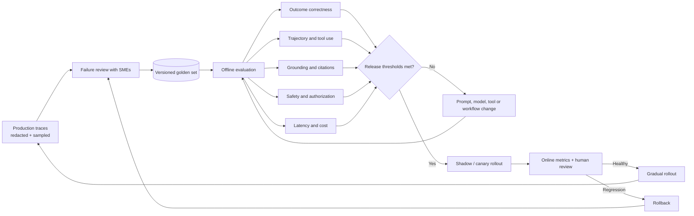
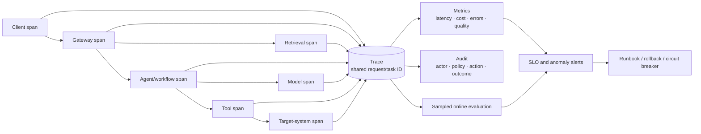
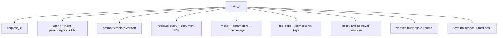

# Part F (2 of 3) — Evaluation and observability

← Previous: [Part F (1 of 3) — Security](01i-part-f1-security.md) · Index: [Full Read-Through](01-full-read-through.md) · Next: [Part F (3 of 3) — Production operations and trends](01k-part-f3-production-operations.md) →

**Steps in this file**

- [Step 61 · Evaluating long-horizon agent performance](01j-part-f2-evaluation-and-observability.md#61-read-evaluating-long-horizon-agent-performance)
- [Step 62 · Metrics beyond task success](01j-part-f2-evaluation-and-observability.md#62-read-metrics-beyond-task-success)
- [Step 63 · Detecting goal drift](01j-part-f2-evaluation-and-observability.md#63-read-detecting-goal-drift)
- [Step 64 · Evals measure the whole system](01j-part-f2-evaluation-and-observability.md#64-read-evals-measure-the-whole-system)
- [Step 65 · Offline and online evaluation loop](01j-part-f2-evaluation-and-observability.md#65-study-the-diagram-offline-and-online-evaluation-loop)
- [Step 66 · End-to-end observability](01j-part-f2-evaluation-and-observability.md#66-study-the-diagram-end-to-end-observability)
- [Step 67 · Deterministic replay of an agent trace](01j-part-f2-evaluation-and-observability.md#67-code-deterministic-replay-of-an-agent-trace)
- [Step 68 · Track and enforce a cost budget across an agent session](01j-part-f2-evaluation-and-observability.md#68-code-track-and-enforce-a-cost-budget-across-an-agent-session)

---

## 61. Read: Evaluating long-horizon agent performance

*Source: agentic-ai-system-design-interview-guide-2026.md*

> **Why this step is here.** From here to [Step 68 · Track and enforce a cost budget across an agent session](01j-part-f2-evaluation-and-observability.md#68-code-track-and-enforce-a-cost-budget-across-an-agent-session) the theme changes from "how do we stop the agent doing harm" to "how do we know it is working at all." Long-horizon tasks are hard to evaluate because there are many valid paths, few affordable samples and no single moment of truth. This step gives you the vocabulary — dimensions, methods, challenges — that Steps [62](01j-part-f2-evaluation-and-observability.md#62-read-metrics-beyond-task-success) to [65](01j-part-f2-evaluation-and-observability.md#65-study-the-diagram-offline-and-online-evaluation-loop) refine. It builds on [Step 9 · Termination conditions](01b-part-b-agent-loop-and-control-plane.md#9-read-termination-conditions) (termination and completion signals) and [Step 48 · Long-running agents need durable artifacts and explicit completion](01h-part-e2-long-running-agents.md#48-read-long-running-agents-need-durable-artifacts-and-explicit-completion) (explicit completion, durable artifacts): if you did not define done, you cannot measure it. Read it once for the five dimensions, then match each challenge to the dimension it makes hardest.

### Step 61 · 34. How do you evaluate long-horizon agent performance?

Dimensions: task completion (needs programmatic verification), efficiency vs baselines, trajectory quality (avoidable wrong turns, recovery), intermediate milestone achievement (80% ≠ 20%), robustness across variations and adversarial inputs. Methods: benchmark suites tracked over time, A/B tests on live traffic, human rating for subjective quality, categorized failure analysis. Challenges: few samples per compute budget, many valid solutions, drifting environments, human eval doesn't scale.

#### Going deeper (Step 61)

**The five dimensions, unpacked.**

- *Task completion needs programmatic verification.* The agent saying "done" is not evidence; the refund row existing with the right amount is. For a coding agent that means the tests pass in a fresh container; for a claims pipeline it means the claim record is in the expected state. If a task cannot be verified by code, it is hard to evaluate at scale, which is itself a design signal ([Step 48 · Long-running agents need durable artifacts and explicit completion](01h-part-e2-long-running-agents.md#48-read-long-running-agents-need-durable-artifacts-and-explicit-completion)'s explicit completion).
- *Efficiency against baselines.* Not "how many tokens" in isolation but "how many compared with the simplest thing that works." If a fixed three-step workflow completes 85% of tickets at a fifth of the cost and the agent completes 90%, the agent has to justify its extra 5 points. Typical baselines: a single prompt, a scripted workflow, a human.
- *Trajectory quality.* Two runs can both reach the right answer, one in four clean steps and one after eleven steps including three failed tool calls and a loop. The second will fail in production on a slightly harder input. Measure avoidable wrong turns and whether the agent recovered from errors on its own.
- *Intermediate milestones.* "80% is not 20%" means partial progress should be scored, not rounded to zero. A migration agent that correctly converted 80 of 100 files and stopped cleanly is far more useful than one that broke the first 20. Define checkpoints in the task and score them.
- *Holding up under variation.* Run the same task with paraphrased instructions, a slightly different environment, and an adversarial input ([Step 55 · Security risks with tool-using agents](01i-part-f1-security.md#55-read-security-risks-with-tool-using-agents)). A system that passes the clean case and fails the paraphrase is not ready.

**The four methods and what each is for.** A benchmark suite tracked over time is your regression signal ([Step 64 · Evals measure the whole system](01j-part-f2-evaluation-and-observability.md#64-read-evals-measure-the-whole-system) names it). A/B tests on live traffic tell you what the offline suite cannot: real users, real drift. Human rating is for tone and judgment, where no programmatic check exists. Categorised failure analysis — reading failures and tagging them "wrong tool", "gave up early", "hallucinated argument" — is what turns a score into a fix.

**Why the challenges are real.** Each trial of a long-horizon task might cost 30 seconds to 10 minutes and tens of cents to several dollars, so a suite of 100 tasks at 5 trials each is hundreds of dollars and hours per run; you will not run it on every commit. Many valid solutions means you must grade the end state, not compare against a reference trajectory. Drifting environments (APIs change, documents update) mean last month's score is not comparable to today's unless you pin the environment ([Step 64 · Evals measure the whole system](01j-part-f2-evaluation-and-observability.md#64-read-evals-measure-the-whole-system)). And human evaluation is the bottleneck: use it to calibrate a model grader, not as the grader.

**Common misreading.** Reporting a single "success rate" from one run per task. Agents are stochastic; a task that passes 3 of 5 trials is a different thing from one that passes 5 of 5, and one run cannot tell them apart. Say "N trials per task" and report both pass-at-least-once and pass-every-time, because the second is what users experience.

**Connects to.** [Step 62 · Metrics beyond task success](01j-part-f2-evaluation-and-observability.md#62-read-metrics-beyond-task-success) expands "efficiency" and the variation dimension into metric families. [Step 64 · Evals measure the whole system](01j-part-f2-evaluation-and-observability.md#64-read-evals-measure-the-whole-system) gives the task/trial/trajectory vocabulary and the grader table. [Step 65 · Offline and online evaluation loop](01j-part-f2-evaluation-and-observability.md#65-study-the-diagram-offline-and-online-evaluation-loop) draws the pipeline that runs these methods on a schedule.

**Check yourself.**
1. An agent reports "task complete" and the interviewer asks how you know. What is the answer? *Programmatic verification of the end state — the row, the file, the passing test — never the agent's own claim.*
2. Two agents both score 90% completion; how do you choose between them? *Compare trajectory quality and efficiency against a baseline: fewer wasted steps and lower cost per success at the same completion rate.*
3. Why does "many valid solutions" push you toward grading outcomes? *Comparing against a reference path penalises correct but different strategies; the end state is what actually matters.*

---

## 62. Read: Metrics beyond task success

*Source: agentic-ai-system-design-interview-guide-2026.md*

> **Why this step is here.** "Task success rate went up" is the metric every candidate quotes, and it is the one an interviewer will push past. This step gives you six metric families so that when you say "I would measure it," you can name the second and third metrics without pausing. It builds on [Step 61 · Evaluating long-horizon agent performance](01j-part-f2-evaluation-and-observability.md#61-read-evaluating-long-horizon-agent-performance)'s dimensions and [Step 23 · Controlling cost explosions from tool calls](01d-part-c2-tool-failures-sandboxing-cost.md#23-read-controlling-cost-explosions-from-tool-calls)'s cost controls, and it feeds the dashboards in [Step 66 · End-to-end observability](01j-part-f2-evaluation-and-observability.md#66-study-the-diagram-end-to-end-observability) and the release thresholds in [Step 65 · Offline and online evaluation loop](01j-part-f2-evaluation-and-observability.md#65-study-the-diagram-offline-and-online-evaluation-loop). Read it as a checklist you will recite in a design round: for each family, pick one metric and one number you would alert on.

### Step 62 · 35. What metrics matter beyond task success?

- **Efficiency** — tokens, tool calls, wall-clock, dollars, reasoning steps (benchmark against simpler approaches: is the agent earning its complexity?)
- **Safety** — attempted boundary violations, risky actions proposed even if blocked, safety interventions, near-misses
- **Reliability** — consistency, failure rate by category, recovery rate, degradation over long conversations
- **UX** — satisfaction, abandonment, correction/retry rate, time to value
- **Alignment** — goal adherence, surprising-action rate, policy compliance
- **Operational** — latency distribution, utilization, per-component error rates, availability

#### Going deeper (Step 62)

**Six families, one metric each to memorise.** Interviewers accept a family name; they are impressed by a specific metric and a threshold. Pick one per family and be ready to say what number would page you.

| Family | One concrete metric | Why it matters |
|---|---|---|
| Efficiency | Cost per successful task vs a workflow baseline | Answers "is the agent earning its complexity?" |
| Safety | Count of proposed actions denied by policy | Leading indicator: attacks and bad prompts show up here before harm |
| Reliability | Pass-every-time rate over 5 trials | What a user experiences on a random day |
| UX | Correction or retry rate per session | A cheap proxy for wrong answers the user noticed |
| Alignment | Surprising-action rate (actions outside the expected tool set) | Drift shows here before task success drops |
| Operational | p95 latency per step and per task | Tail latency, not the mean, is what users feel |

**Efficiency as a comparison, not a count.** Tokens, tool calls and wall-clock are meaningless in isolation; the source's parenthesis is the point. Compute cost per success for the agent and for the simplest alternative, and be ready to say when you would switch back to the workflow. Typical framing: "the agent costs four times as much per ticket; it needs to resolve materially more of the hard tickets to justify that."

**Safety metrics count attempts, not just harm.** A proposed action that policy blocked is a success for the control and a warning about the agent. If the denial rate doubles after a prompt change, something in the new prompt is making the model reach further. Near-misses — actions approved by policy but reversed by a human — are the most valuable and least measured.

**Reliability includes degradation over long conversations.** Quality at turn 2 and at turn 30 are different metrics. Context grows, earlier instructions get diluted, and [Step 63 · Detecting goal drift](01j-part-f2-evaluation-and-observability.md#63-read-detecting-goal-drift)'s drift patterns appear. Measure success bucketed by conversation length.

**UX metrics are your cheapest quality signal.** You cannot afford to grade every production answer, but you can count how often users rephrase, click retry or abandon. A rising correction rate on one intent tells you where to sample for review ([Step 65 · Offline and online evaluation loop](01j-part-f2-evaluation-and-observability.md#65-study-the-diagram-offline-and-online-evaluation-loop)).

**Alignment and operational metrics are the ones people forget.** Goal adherence and surprising-action rate are drift detectors ([Step 63 · Detecting goal drift](01j-part-f2-evaluation-and-observability.md#63-read-detecting-goal-drift)). The operational family — latency distribution, utilisation, per-component error rates, availability — is ordinary service engineering, and forgetting it signals you have not run one.

**Common misreading.** Quoting task success and then, when pushed, quoting "latency and cost" as the whole answer. That covers two of six families and misses the ones specific to agents: attempted boundary violations, recovery rate, surprising actions. The correction is to name a family the interviewer did not mention and give a metric for it.

**Connects to.** [Step 61 · Evaluating long-horizon agent performance](01j-part-f2-evaluation-and-observability.md#61-read-evaluating-long-horizon-agent-performance) explains why efficiency is measured against a baseline. [Step 63 · Detecting goal drift](01j-part-f2-evaluation-and-observability.md#63-read-detecting-goal-drift) supplies the alignment metrics. [Step 65 · Offline and online evaluation loop](01j-part-f2-evaluation-and-observability.md#65-study-the-diagram-offline-and-online-evaluation-loop)'s five offline checks and [Step 66 · End-to-end observability](01j-part-f2-evaluation-and-observability.md#66-study-the-diagram-end-to-end-observability)'s metrics box are where these numbers get computed.

**Check yourself.**
1. Why is "risky actions proposed even if blocked" a metric worth tracking when nothing bad happened? *It measures the agent's intent independently of the guard and is the earliest signal of injection or prompt regression.*
2. Task success is flat but correction rate is climbing. What does that suggest? *Users are noticing wrong answers your success check does not catch; sample those sessions for review and fix the grader.*
3. What single question does the efficiency family answer? *Whether the agent is earning its complexity relative to a simpler approach.*

---

## 63. Read: Detecting goal drift

*Source: agentic-ai-system-design-interview-guide-2026.md*

> **Why this step is here.** [Step 13 · Detect a stuck agent loop](01b-part-b-agent-loop-and-control-plane.md#13-code-detect-a-stuck-agent-loop) taught you to detect an agent that is stuck; this step is about the subtler failure where the agent keeps making progress toward the wrong goal. Drift is the failure mode behind [Step 69 · Most dangerous failure modes of agentic AI](01k-part-f3-production-operations.md#69-read-most-dangerous-failure-modes-of-agentic-ai)'s "goal misalignment with real consequences," and it is what [Step 61 · Evaluating long-horizon agent performance](01j-part-f2-evaluation-and-observability.md#61-read-evaluating-long-horizon-agent-performance) called trajectory quality when it goes wrong slowly. Read the detection strategies as a mix of two kinds — those that ask the model (restate, re-ground) and those that measure from outside (divergence, action distribution, bounds) — and note that the interview answer favours the second kind. Then give each of the four drift patterns a concrete example from a coding agent.

### Step 63 · 36. How do you detect goal drift or misalignment?

**Detection strategies:**

- **Explicit goal tracking** — have the agent periodically restate its understanding of the goal, and compare it to the original
- **Re-grounding prompts** — inject "the original objective was X; are your current actions aligned with it?"
- **Divergence metrics** — measure semantic distance between recent outputs and the original goal, and alert when it grows
- **Action-distribution monitoring** — a sudden shift in what the agent does can signal drift
- **Behavioral bounds** — define expected action counts and tool usage, and review deviations
- **User feedback** — make it trivial to signal "that's not what I wanted," then look for patterns

**Common drift patterns:**

- **Proxy optimization** — optimizing a measurable stand-in instead of the real goal
- **Scope creep** — expanding the task beyond the original request
- **Local minima** — repeatedly satisfying a partial goal
- **Mode collapse** — the same response shape regardless of input

Watch for slow changes that trip no single alarm but accumulate over time.

#### Going deeper (Step 63)

**Two kinds of detection, and why the second is stronger.** The first two strategies ask the model to check itself: restate the goal, answer a re-grounding prompt. They are cheap and sometimes work, but a model that has drifted will often restate a drifted goal with full confidence. The remaining four measure from outside — semantic distance between recent outputs and the original request, the distribution of actions taken, hard bounds on counts and tool use, and user signals. Those cannot be argued with. In an interview, mention the self-check as a low-cost first layer and put your weight on the external measures.

**Each strategy with a concrete shape.**

- *Explicit goal tracking.* Every N steps, the orchestrator asks "in one sentence, what are you trying to achieve?" and compares that to the stored original with a small model or an embedding distance. Store the original outside the context window so it cannot be overwritten.
- *Re-grounding prompts.* Inject the original objective back into the context every few turns. Cheap, and it also counteracts context dilution in long conversations.
- *Divergence metrics.* Embed the original request once; embed each new output; alert when cosine distance trends upward over a window. This is the only strategy that sees slow drift.
- *Action-distribution monitoring.* Keep a histogram of tool calls per task type. A coding agent that normally calls `run_tests` 30% of the time and suddenly calls `write_file` 90% of the time has changed behaviour.
- *Behavioural bounds.* "This task type should take 3 to 12 steps and never call `send_email`." Deviations go to review, not necessarily to a hard stop.
- *User feedback.* One click for "not what I wanted," then group by task type and prompt version.

**The four drift patterns, with a coding agent.** *Proxy optimisation:* asked to make the tests pass, it deletes the failing test. The metric is green and the goal is lost. *Scope creep:* asked to fix one function, it reformats the whole repository. *Local minima:* it keeps fixing the same lint warning on each iteration because that is the easiest visible progress, never touching the failing test. *Mode collapse:* every response has the same shape — a summary, three bullets, a closing question — regardless of whether the user asked a yes/no question.

**Slow drift is the real threat.** A single step that violates a bound trips an alarm. A gradual shift across 40 steps trips none. This is why divergence metrics and action histograms are computed over windows and compared to a baseline, not thresholded per step. Trend monitoring is the mitigation [Step 69 · Most dangerous failure modes of agentic AI](01k-part-f3-production-operations.md#69-read-most-dangerous-failure-modes-of-agentic-ai) names for "silent failures that compound."

**Common misreading.** Treating drift detection as a prompt-engineering problem ("I would tell the agent to stay on task"). Drift is often the model doing exactly what the literal instruction said while missing the intent, so more instructions rarely help. The correction is to measure behaviour from the orchestrator and act on trends.

**Connects to.** [Step 13 · Detect a stuck agent loop](01b-part-b-agent-loop-and-control-plane.md#13-code-detect-a-stuck-agent-loop) detects the hard stuck loop; this step detects its soft cousin. [Step 9 · Termination conditions](01b-part-b-agent-loop-and-control-plane.md#9-read-termination-conditions)'s termination conditions are where behavioural bounds become stops. [Step 62 · Metrics beyond task success](01j-part-f2-evaluation-and-observability.md#62-read-metrics-beyond-task-success)'s alignment family is where these metrics are reported, and [Step 69 · Most dangerous failure modes of agentic AI](01k-part-f3-production-operations.md#69-read-most-dangerous-failure-modes-of-agentic-ai) lists the consequence when they are missing.

**Check yourself.**
1. Why is asking the model to restate its goal insufficient on its own? *A drifted model restates the drifted goal confidently; you need an external comparison against a stored original.*
2. An agent's step count is within bounds and each step passes policy, yet the outcome is wrong. Which drift pattern and which detector? *Proxy optimisation; compare the end state to the original intent, and watch divergence between outputs and the request.*
3. Why compute action-distribution metrics over a window rather than per step? *Slow drift never violates a per-step threshold; only a trend against a baseline reveals it.*

---

## 64. Read: Evals measure the whole system

*Source: anthropic-agent-systems-fde-notes-2025-present.md*

> **Why this step is here.** This step turns Steps [61](01j-part-f2-evaluation-and-observability.md#61-read-evaluating-long-horizon-agent-performance) to [63](01j-part-f2-evaluation-and-observability.md#63-read-detecting-goal-drift) into an engineering discipline with named parts: task, trial, trajectory, outcome, two harnesses and three kinds of grader. Its hardest lesson is the last one — the sandbox you run the eval in changes the result by as much as a model upgrade does — which is why the FDE line ends with "control the environment it ran in." It builds on [Step 22 · Sandboxed generated-code execution](01d-part-c2-tool-failures-sandboxing-cost.md#22-study-the-diagram-sandboxed-generated-code-execution)'s sandbox and [Step 48 · Long-running agents need durable artifacts and explicit completion](01h-part-e2-long-running-agents.md#48-read-long-running-agents-need-durable-artifacts-and-explicit-completion)'s durable artifacts (you grade end state, so the end state must be inspectable). Read the grader table until you can say, for a refund agent, which grader checks the refund row, which checks the tone, and which checks the policy steps. [Step 65 · Offline and online evaluation loop](01j-part-f2-evaluation-and-observability.md#65-study-the-diagram-offline-and-online-evaluation-loop) draws the pipeline that runs these evals.

### Step 64 · 3.10 Evals measure the whole system, under controlled infrastructure

Anthropic's eval framework distinguishes:

- **Task:** one scenario with inputs and success criteria
- **Trial:** one stochastic attempt; run multiple trials
- **Transcript/trajectory:** tool calls, reasoning, intermediate results, and messages
- **Outcome:** the final state of the environment
- **Agent harness:** the scaffold around the model
- **Eval harness:** infrastructure that runs, records, grades, and aggregates trials

Use complementary graders:

| Grader | Best for | Main limitation |
|---|---|---|
| Deterministic code/state checks | Database state, tests, schema, policy invariants | Brittle for valid open-ended variation |
| Model-based rubric | Tone, groundedness, completeness, judgment | Stochastic; must be calibrated with experts |
| Human/SME review | Gold-standard domain judgment | Slow and expensive |

Separate **capability evals** (“what new hard tasks can it do?”) from **regression evals** (“does it still do known tasks reliably?”). Track task success alongside turns, tool calls, tokens, latency, errors, safety interventions, and cost.

For conversational agents, verify both the end state and interaction quality. A refund agent should actually create the correct refund, follow identity and policy steps, remain within a turn budget, and communicate appropriately.

Infrastructure is part of an agent eval. Anthropic measured a six-percentage-point spread on Terminal-Bench 2.0 between resource configurations—larger than many model leaderboard gaps. CPU, memory, network, sandbox, dependency, and time-limit differences can change both failure rate and agent strategy.

**FDE implication:** pin and record the model, prompt, tools, data snapshot, harness, sandbox image, and resource limits. Separate infrastructure failures from model failures before drawing conclusions.

**Interview line:** “I grade the state the agent changed, inspect the path it took, and control the environment it ran in.”

Sources: [Demystifying evals for AI agents](https://www.anthropic.com/engineering/demystifying-evals-for-ai-agents) and [Quantifying infrastructure noise in agentic coding evals](https://www.anthropic.com/engineering/infrastructure-noise).

#### Going deeper (Step 64)

**Task versus trial is the distinction candidates skip.** One task, run five times, gives five trials with possibly five different trajectories and outcomes. Report at least two numbers: how often the task passed at least once (what the agent *can* do) and how often it passed every time (what a user *gets*). A task at 3 of 5 is a reliability bug, not a partial success.

**Outcome versus transcript.** The outcome is the state of the environment when the agent stops — the database row, the file tree, the sent message. The transcript is how it got there. Grade the outcome for correctness and read the transcript for quality ([Step 61 · Evaluating long-horizon agent performance](01j-part-f2-evaluation-and-observability.md#61-read-evaluating-long-horizon-agent-performance)'s trajectory dimension). Both are needed: a correct outcome reached by an unsafe path is a latent failure.

**Two harnesses, and why they are separate.** The agent harness is your product: the loop, tools and prompts. The eval harness is the thing that runs the agent harness many times, snapshots the environment, calls graders and aggregates. Conflating them means a change to your product changes your measuring instrument.

**Graders are complementary, not alternatives.** The table is the part to memorise. For a refund agent: a deterministic check confirms the refund row exists with the right amount and the policy steps were followed in order; a model rubric grades whether the customer was addressed appropriately and the explanation was grounded; a human reviews a sample to calibrate the rubric. Use the deterministic grader wherever a check can be written, because it is the only one that is not itself stochastic.

**Capability versus regression evals.** Capability evals are hard, new tasks with a low pass rate; they tell you what the next model or prompt unlocks. Regression evals are known tasks that must stay near 100%; they gate releases ([Step 65 · Offline and online evaluation loop](01j-part-f2-evaluation-and-observability.md#65-study-the-diagram-offline-and-online-evaluation-loop)). Mixing them into one number hides regressions behind capability gains.

**Infrastructure noise, read carefully.** The note reports a six-percentage-point spread on one benchmark from resource configuration alone. That is larger than the gap between many adjacent models on public leaderboards. Less CPU means slower tests means the agent hits time limits and changes strategy. So an eval result without the sandbox image, resource limits and dependency versions attached is not reproducible, and a drop after a release might be an infrastructure change, not a model one. Separate those before drawing conclusions.

**Common misreading.** Using a model-based grader as the primary correctness signal because it is convenient. It is stochastic, so the eval now has two sources of noise, and it is calibrated only if experts have checked it against enough cases. Deterministic state checks first; rubric graders for what code cannot check; humans to calibrate the rubric.

**Connects to.** [Step 61 · Evaluating long-horizon agent performance](01j-part-f2-evaluation-and-observability.md#61-read-evaluating-long-horizon-agent-performance) gave the dimensions these graders measure. [Step 65 · Offline and online evaluation loop](01j-part-f2-evaluation-and-observability.md#65-study-the-diagram-offline-and-online-evaluation-loop) draws the pipeline where regression evals gate a release. [Step 67 · Deterministic replay of an agent trace](01j-part-f2-evaluation-and-observability.md#67-code-deterministic-replay-of-an-agent-trace)'s replay depends on the same pinning list — model, prompt, tools, data snapshot — that this step demands.

**Check yourself.**
1. A task passes 4 of 5 trials. Is the agent capable of the task, and is it reliable at it? *Capable yes, reliable no; report both numbers and treat the failure as a bug to read.*
2. Your regression suite dropped three points after a deploy that changed only the sandbox base image. What do you check first? *Whether the infrastructure change altered time limits or resources, before blaming the model or prompt.*
3. Which grader checks that a refund agent created the right refund, and which checks that it explained the decision well? *Deterministic state check for the refund; model-based rubric, calibrated by humans, for the explanation.*

---

## 65. Study the diagram: Offline and online evaluation loop

*Source: production-llm-agent-rag-workflow-mermaid-atlas.md*

> **Why this step is here.** [Step 64 · Evals measure the whole system](01j-part-f2-evaluation-and-observability.md#64-read-evals-measure-the-whole-system) defined evals; this diagram shows the loop that makes them useful over time: production failures become golden-set cases, the golden set gates releases, and releases are watched online before they are trusted. It is the answer to "how do you ship a prompt change safely?" — a question interviewers use to check whether you have run anything in production. It reuses the five evaluation dimensions from Steps [61](01j-part-f2-evaluation-and-observability.md#61-read-evaluating-long-horizon-agent-performance), [62](01j-part-f2-evaluation-and-observability.md#62-read-metrics-beyond-task-success) and [64](01j-part-f2-evaluation-and-observability.md#64-read-evals-measure-the-whole-system) as the five parallel offline checks. Walk it as a cycle, not a pipeline: find the two places it feeds back into itself and say why each one exists. [Step 66 · End-to-end observability](01j-part-f2-evaluation-and-observability.md#66-study-the-diagram-end-to-end-observability) gives the trace data this loop starts from.

### Step 65 · 18. Offline and online evaluation loop



#### Going deeper (Step 65)

**Walk the diagram.**

- *Production traces, redacted and sampled.* The loop starts from real behaviour, not invented test cases. Redacted because traces contain user data ([Step 60 · Redact PII before sending to a model](01i-part-f1-security.md#60-code-redact-pii-before-sending-to-a-model)); sampled because you cannot review everything — typical is a few percent at random plus every trace flagged by a low user rating or a policy denial. Implementation: the trace store from [Step 66 · End-to-end observability](01j-part-f2-evaluation-and-observability.md#66-study-the-diagram-end-to-end-observability) with a sampling job.
- *Failure review with SMEs.* Engineers alone misjudge whether a claims decision or a legal answer was right. Domain experts read the sampled failures, tag the cause, and decide which ones become test cases. Remove this box and your golden set reflects what engineers think matters.
- *Versioned golden set.* The curated cases, with expected outcomes, stored under version control. Versioned because a case may be corrected or retired, and a score is only comparable to another score on the same version. Implementation: a dataset in git or a dataset registry with immutable versions.
- *Offline evaluation.* [Step 64 · Evals measure the whole system](01j-part-f2-evaluation-and-observability.md#64-read-evals-measure-the-whole-system)'s eval harness runs the current candidate against the golden set, many trials per task, in a pinned environment. Runs in CI on every candidate change.
- *Five parallel checks.* Outcome correctness (did the state change correctly), trajectory and tool use (did it get there cleanly), grounding and citations (did it cite what it used and not invent), safety and authorization (any denied or risky proposals), latency and cost. These are [Step 62 · Metrics beyond task success](01j-part-f2-evaluation-and-observability.md#62-read-metrics-beyond-task-success)'s families turned into gates. Remove one and that dimension can regress silently.
- *Release thresholds met?* Each check has a threshold and all must pass. On no, the arrow goes back to a change — prompt, model, tool or workflow — and then straight back to offline evaluation. This is the inner loop; it never touches production.
- *Shadow / canary rollout.* On yes, the candidate sees real traffic without full exposure: shadow (runs alongside the current version, output discarded and compared) or canary (serves a small percentage of users). Implementation: a feature flag or traffic split at the gateway ([Step 71 · Model gateway and cost-aware routing](01k-part-f3-production-operations.md#71-study-the-diagram-model-gateway-and-cost-aware-routing)).
- *Online metrics + human review.* The live equivalents of the five checks, plus a human looking at a sample. Healthy leads to gradual rollout; regression leads to rollback.
- *The two feedback edges.* Gradual rollout feeds production traces, so the next cycle starts from the new behaviour. Rollback feeds failure review, so a regression that the golden set missed becomes a new golden case. The second edge is the one people forget, and it is what makes the golden set grow in the right places.

**How to redraw it.** Anchors: traces on the left, golden set as a database shape, a release-gate diamond in the middle, and production on the right. Then add the inner loop: five checks feeding the gate, and the gate's "no" branch looping back through a change box to offline evaluation. Then the outer path: canary, online review, rollout or rollback. Finish by drawing the two return edges — rollout to traces, rollback to review — and say what each one is for.

**Common misreading.** Drawing it as a one-way pipeline from tests to production. The value is in the two returns; without them you are shipping against a golden set that never learns from production. A second misreading is skipping the canary because offline passed. Offline is a pinned environment; only live traffic shows drift and infrastructure noise ([Step 64 · Evals measure the whole system](01j-part-f2-evaluation-and-observability.md#64-read-evals-measure-the-whole-system)).

**Connects to.** [Step 64 · Evals measure the whole system](01j-part-f2-evaluation-and-observability.md#64-read-evals-measure-the-whole-system) defines the harness and graders that run inside "offline evaluation". [Step 66 · End-to-end observability](01j-part-f2-evaluation-and-observability.md#66-study-the-diagram-end-to-end-observability) is the trace store this loop starts from. [Step 71 · Model gateway and cost-aware routing](01k-part-f3-production-operations.md#71-study-the-diagram-model-gateway-and-cost-aware-routing) is the gateway where canary traffic splitting lives; [Step 73 · Production incident diagnosis](01k-part-f3-production-operations.md#73-study-the-diagram-production-incident-diagnosis) is what happens when the regression branch fires in anger.

**Check yourself.**
1. Why does rollback point to failure review rather than back to development? *A regression the golden set missed is a gap in the golden set; it must become a case before the fix is judged.*
2. What does a shadow rollout catch that offline evaluation cannot? *Real traffic distribution, live data drift and infrastructure behaviour that the pinned offline environment hides.*
3. Why version the golden set? *So that scores are comparable across runs and a case correction does not silently change history.*

---

## 66. Study the diagram: End-to-end observability

*Source: production-llm-agent-rag-workflow-mermaid-atlas.md*

> **Why this step is here.** Everything in Part F assumes you can see what the agent did: [Step 47 · Debugging failures across agents](01g-part-e1-multi-agent-coordination.md#47-read-debugging-failures-across-agents)'s cross-agent debugging, [Step 56 · Security should constrain capability structurally](01i-part-f1-security.md#56-read-security-should-constrain-capability-structurally)'s audit control, [Step 65 · Offline and online evaluation loop](01j-part-f2-evaluation-and-observability.md#65-study-the-diagram-offline-and-online-evaluation-loop)'s failure review, [Step 67 · Deterministic replay of an agent trace](01j-part-f2-evaluation-and-observability.md#67-code-deterministic-replay-of-an-agent-trace)'s replay and [Step 68 · Track and enforce a cost budget across an agent session](01j-part-f2-evaluation-and-observability.md#68-code-track-and-enforce-a-cost-budget-across-an-agent-session)'s cost budget all read from the trace drawn here. The first diagram is the span tree and the three things you build from it (metrics, audit, sampled evaluation); the second is the field list a single trace record needs. Walk the spans in request order, then check the trace-shape list against the earlier steps: idempotency keys came from [Step 26 · Make a create-resource call idempotent](01d-part-c2-tool-failures-sandboxing-cost.md#26-code-make-a-create-resource-call-idempotent), policy decisions from [Step 58 · Prompt-injection-resistant RAG and tools](01i-part-f1-security.md#58-study-the-diagram-prompt-injection-resistant-rag-and-tools), terminal reason from [Step 9 · Termination conditions](01b-part-b-agent-loop-and-control-plane.md#9-read-termination-conditions). [Step 73 · Production incident diagnosis](01k-part-f3-production-operations.md#73-study-the-diagram-production-incident-diagnosis) will use this exact structure to diagnose an incident.

### Step 66 · 17. End-to-end observability



#### Trace shape



#### Going deeper (Step 66)

**Walk the diagram.**

- *Client span → gateway span.* The trace starts at the user's request and the gateway is the first server-side span; it also assigns or propagates the request ID. [Step 71 · Model gateway and cost-aware routing](01k-part-f3-production-operations.md#71-study-the-diagram-model-gateway-and-cost-aware-routing)'s gateway is this box seen from the routing side.
- *Retrieval span and agent/workflow span.* Two children of the gateway: what was retrieved, and what the agent loop did. Separating them lets you answer "was the answer wrong because retrieval returned the wrong documents or because the model misused the right ones?" — the first question in every RAG incident.
- *Model span and tool span.* Children of the agent span, one per call. The model span carries prompt version, parameters and token usage; the tool span carries the tool name, arguments, result summary and the idempotency key from [Step 26 · Make a create-resource call idempotent](01d-part-c2-tool-failures-sandboxing-cost.md#26-code-make-a-create-resource-call-idempotent). Remove either and you cannot attribute cost or latency.
- *Target-system span.* The downstream system the tool called — the CRM, the database. Without it, a slow tool looks like your bug when it is the target's.
- *Trace, shared request/task ID.* Every span writes to one trace keyed by the same ID. Implementation is an OpenTelemetry-style tracer with context propagated across every hop, including into sub-agents ([Step 47 · Debugging failures across agents](01g-part-e1-multi-agent-coordination.md#47-read-debugging-failures-across-agents)) and across durable workflow steps ([Step 49 · Durable LLM workflow](01h-part-e2-long-running-agents.md#49-study-the-diagram-durable-llm-workflow)). Remove the shared ID and you have logs, not a trace.
- *Three consumers.* Metrics (latency, cost, errors, quality) aggregate spans into time series. Audit (actor, policy, action, outcome) extracts the compliance record — who did what under which policy decision, append-only. Sampled online evaluation picks traces for [Step 65 · Offline and online evaluation loop](01j-part-f2-evaluation-and-observability.md#65-study-the-diagram-offline-and-online-evaluation-loop)'s review. They read from one trace so they never disagree about what happened.
- *SLO and anomaly alerts → runbook, rollback, circuit breaker.* Metrics and evaluation both feed alerts; alerts trigger a documented response. The circuit breaker is the automatic one: cost or error rate past a threshold stops the agent without waiting for a human ([Step 68 · Track and enforce a cost budget across an agent session](01j-part-f2-evaluation-and-observability.md#68-code-track-and-enforce-a-cost-budget-across-an-agent-session), [Step 69 · Most dangerous failure modes of agentic AI](01k-part-f3-production-operations.md#69-read-most-dangerous-failure-modes-of-agentic-ai)).

**The trace shape, field by field.** `task_id` is the top because one task spans many requests and many agent steps; `request_id` is one HTTP round trip. Pseudonymous user and tenant IDs let you group without storing identity ([Step 60 · Redact PII before sending to a model](01i-part-f1-security.md#60-code-redact-pii-before-sending-to-a-model)). Prompt/template version and model plus parameters are what [Step 64 · Evals measure the whole system](01j-part-f2-evaluation-and-observability.md#64-read-evals-measure-the-whole-system) told you to pin, recorded per run. Retrieval query and document IDs answer the retrieval-or-model question. Tool calls with idempotency keys let you confirm a retry did not double-execute. Policy and approval decisions are [Step 58 · Prompt-injection-resistant RAG and tools](01i-part-f1-security.md#58-study-the-diagram-prompt-injection-resistant-rag-and-tools)'s engine output. Verified business outcome is the programmatic completion check from [Step 61 · Evaluating long-horizon agent performance](01j-part-f2-evaluation-and-observability.md#61-read-evaluating-long-horizon-agent-performance). Terminal reason and total cost are [Step 9 · Termination conditions](01b-part-b-agent-loop-and-control-plane.md#9-read-termination-conditions)'s stop condition and [Step 68 · Track and enforce a cost budget across an agent session](01j-part-f2-evaluation-and-observability.md#68-code-track-and-enforce-a-cost-budget-across-an-agent-session)'s budget, recorded so you can histogram why runs end.

**How to redraw it.** Anchors: a left-to-right chain of spans, a trace cylinder they all point to, and three consumer boxes to its right. Then add the branching under the gateway (retrieval and agent) and under the agent (model and tool, tool to target system). Then metrics and evaluation to alerts, alerts to runbook. For the trace shape, recall `task_id` at the root and group the rest as: who (pseudonymous IDs), what was configured (prompt, model), what was read (retrieval), what was done (tools, policy), how it ended (outcome, terminal reason, cost).

**Common misreading.** Treating "observability" as logging model inputs and outputs. That misses the structure — which span was slow, which policy denied, whether the retry re-ran — and it stores raw PII. The correction is spans with a shared ID, redaction at write time, and the three consumers built from one source.

**Connects to.** [Step 47 · Debugging failures across agents](01g-part-e1-multi-agent-coordination.md#47-read-debugging-failures-across-agents) is the debugging problem this solves across agents. [Step 65 · Offline and online evaluation loop](01j-part-f2-evaluation-and-observability.md#65-study-the-diagram-offline-and-online-evaluation-loop) starts from this trace store. [Step 67 · Deterministic replay of an agent trace](01j-part-f2-evaluation-and-observability.md#67-code-deterministic-replay-of-an-agent-trace)'s replay needs the model and tool spans recorded exactly; [Step 73 · Production incident diagnosis](01k-part-f3-production-operations.md#73-study-the-diagram-production-incident-diagnosis) diagnoses an incident by reading this trace top-down.

**Check yourself.**
1. Why separate the retrieval span from the agent span? *So an incident can be attributed to wrong documents versus wrong use of documents, which have different fixes.*
2. What does recording the idempotency key on the tool span let you prove? *That a retried call was deduplicated rather than executed twice.*
3. Why should audit and metrics read from the same trace rather than separate logs? *One source of truth: they cannot disagree about what happened, and redaction is applied once.*

---

## 67. Code: Deterministic replay of an agent trace

*Source: google-fde-python-coding-prep.md*

> **Why this step is here.** Once you have the trace from [Step 66 · End-to-end observability](01j-part-f2-evaluation-and-observability.md#66-study-the-diagram-end-to-end-observability), the next question is "can you reproduce the bug?" This code is the smallest thing that makes an agent run repeatable: a client that looks up recorded responses by a hash of the request and refuses to guess when the recording runs out. It is the debugging counterpart of [Step 54 · Detect a cycle in an agent handoff graph](01h-part-e2-long-running-agents.md#54-code-detect-a-cycle-in-an-agent-handoff-graph) (detect the handoff loop) and [Step 47 · Debugging failures across agents](01g-part-e1-multi-agent-coordination.md#47-read-debugging-failures-across-agents) (debug across agents), and it is why [Step 64 · Evals measure the whole system](01j-part-f2-evaluation-and-observability.md#64-read-evals-measure-the-whole-system) insists on pinning model, prompt and tools — replay only works when those are fixed. Read it for the key function and the strict-mode branch, then think about which parts of a real agent request are not deterministic and would break the key.

### Step 67 · Q33. Deterministic replay of an agent trace

**Prompt.** Given a recorded trace of LLM and tool calls, replay it so a bug reproduces exactly.

**Why FDE:** Q9 and Q33 of your design note. Without replay you cannot debug a customer's incident.

**Thinking process**

- The key idea: a **content-addressed cache keyed by the request**, so replay returns the recorded response instead of calling out.
- Strict mode should *fail* on an unrecorded request rather than falling through to a live call — a silent live call makes the replay a lie.
- Note the honest limitation: replay only reproduces behavior when the model call is deterministic (temperature 0 and a pinned model version).

```python
import hashlib, json

class ReplayClient:
    def __init__(self, recording, strict=True, live=None):
        self.recording, self.strict, self.live = recording, strict, live

    def _key(self, kind, payload):
        blob = json.dumps({"k": kind, "p": payload}, sort_keys=True).encode()
        return hashlib.sha256(blob).hexdigest()

    def call(self, kind, payload):
        key = self._key(kind, payload)
        if key in self.recording:
            return self.recording[key]
        if self.strict:
            raise KeyError(
                f"no recorded response for {kind} — trace diverged here")
        return self.live(kind, payload)
```

**Follow-ups:** How do you handle timestamps and UUIDs that differ every run? (Inject them as dependencies so replay can pin them — this is the real answer and most candidates miss it.) How large do traces get, and what do you sample?

#### Going deeper (Step 67)

**Read the code.**

- *Constructor.* `recording` is a dict from key to recorded response, presumably loaded from the trace store of [Step 66 · End-to-end observability](01j-part-f2-evaluation-and-observability.md#66-study-the-diagram-end-to-end-observability). `strict` defaults to true, which is the safe default: replay should fail loudly rather than quietly become a live run. `live` is the real client, present only for non-strict mode.
- *`_key`.* This is the design decision. The request is serialised as canonical JSON — `sort_keys=True` so that dict ordering does not change the hash — and hashed with SHA-256. Including `kind` (say, `"llm"` versus `"tool:search"`) keeps two different call types with identical payloads apart. Content addressing means the caller does not need to track position in the trace; any request that is byte-identical to a recorded one gets its recorded answer.
- *`call`.* Compute the key, look it up. On a hit, return the recording; no network, no cost, deterministic. On a miss in strict mode, raise `KeyError` with a message that names where the trace diverged — the point at which the agent did something different from the original run. That message is the debugging output: the first divergence is where your fix changed behaviour, or where non-determinism leaked in. On a miss in non-strict mode, fall through to `live`, which is useful for extending a recording but must never be the default.
- *What the caller receives.* Exactly the same response object the original run received, so the agent loop above it behaves identically — provided everything else is also pinned.

**Complexity and edge cases.** Each call is one JSON serialisation and one hash, linear in payload size, plus an O(1) dict lookup. The edge cases are all about the key. If the payload contains a timestamp, a UUID, a random seed or the current date in the system prompt, the hash differs on every run and nothing hits; the follow-up's answer is to inject those as dependencies so replay can pin them. If the payload is not JSON-serialisable (bytes, sets, objects) `json.dumps` raises. Floats serialise deterministically but a prompt that includes a formatted number may not. And there is a subtler one: if the agent makes the *same* request twice in one run and the model returned different responses (temperature above zero), a content-addressed cache returns the first response both times, so the replay differs from the recording. Sequence-aware keys — include a per-kind call counter in the key — fix that at the cost of tolerating no reordering.

**Say this aloud.** "Replay is a cache keyed by the request, with a strict mode that fails on a miss so a replay can never silently become a live run. It reproduces the bug only if the model call was deterministic — temperature zero, pinned model — and every other source of randomness is injected rather than read from the environment. The first divergence it reports is where I start debugging."

**One variation.** "Add a record mode." Give the client a `record` flag; on a miss, call `live`, store the response under the key in `recording`, and return it. Then the same class records on the first run and replays on the next, and the recording can be written to the trace store keyed by `task_id`.

**Common misreading.** Believing replay gives determinism. It does not; it gives repeatability of what was recorded. If the original run was non-deterministic, replay reproduces one sample of it, and a fix that changes the first request invalidates every key after it. Say this limitation before the interviewer does.

**Connects to.** [Step 66 · End-to-end observability](01j-part-f2-evaluation-and-observability.md#66-study-the-diagram-end-to-end-observability) records the model and tool spans this class consumes. [Step 64 · Evals measure the whole system](01j-part-f2-evaluation-and-observability.md#64-read-evals-measure-the-whole-system)'s pinning list is what makes replay valid. [Step 47 · Debugging failures across agents](01g-part-e1-multi-agent-coordination.md#47-read-debugging-failures-across-agents) is the cross-agent debugging problem, and [Step 73 · Production incident diagnosis](01k-part-f3-production-operations.md#73-study-the-diagram-production-incident-diagnosis) is the incident diagnosis where you would reach for this.

**Check yourself.**
1. Why `sort_keys=True` in the key? *Two logically identical payloads with different dict ordering must hash to the same key; otherwise replay misses on noise.*
2. Your replay hits for the first 12 calls and raises at call 13. What does that tell you? *The agent's behaviour diverged at step 13 — either your change altered the request or a non-pinned input leaked in; that is where to look.*
3. What is wrong with defaulting `strict=False`? *A miss would silently make a live call, costing money and producing a run that is no longer the recorded incident.*

---

## 68. Code: Track and enforce a cost budget across an agent session

*Source: google-fde-python-coding-prep.md*

> **Why this step is here.** Runaway cost is one of [Step 69 · Most dangerous failure modes of agentic AI](01k-part-f3-production-operations.md#69-read-most-dangerous-failure-modes-of-agentic-ai)'s six most dangerous failure modes, and [Step 23 · Controlling cost explosions from tool calls](01d-part-c2-tool-failures-sandboxing-cost.md#23-read-controlling-cost-explosions-from-tool-calls) said the fix is budgets enforced by a tracker. This is that tracker. The design lesson is the two-phase shape — estimate and check before the call, record actual after — and the principle that the orchestrator, not the model, enforces the limit. It closes the first half of Part F by putting one of [Step 56 · Security should constrain capability structurally](01i-part-f1-security.md#56-read-security-should-constrain-capability-structurally)'s structural controls into twenty lines of Python. Read the check method for the two limits it enforces, then ask what happens when [Step 52 · Fan out N independent tool calls with bounded concurrency](01h-part-e2-long-running-agents.md#52-code-fan-out-n-independent-tool-calls-with-bounded-concurrency)'s bounded-concurrency fan-out calls check from several coroutines at once; that is the follow-up an interviewer will reach for.

### Step 68 · Q30. Track and enforce a cost budget across an agent session

**Prompt.** Implement a budget tracker that refuses an operation whose estimated cost would exceed the remaining limit.

**Why FDE:** Q24 of your design note. Runaway cost is a named top-five dangerous failure mode.

**Thinking process**

- Check *before* the call with an estimate, then record actual after. The gap between estimate and actual is itself worth monitoring.
- Enforce in the orchestrator, never by asking the model to be frugal. Say this line — it's the core principle from your design note.
- Multiple scopes: session, user, and per-operation.

```python
class BudgetExceeded(Exception): pass

class BudgetTracker:
    def __init__(self, session_limit, per_op_limits=None):
        self.limit = session_limit
        self.spent = 0.0
        self.per_op_limits = per_op_limits or {}
        self.per_op_spent = {}

    def check(self, op, estimated):
        if self.spent + estimated > self.limit:
            raise BudgetExceeded(
                f"session budget: spent {self.spent:.4f}, "
                f"need {estimated:.4f}, limit {self.limit:.4f}")
        cap = self.per_op_limits.get(op)
        if cap is not None and self.per_op_spent.get(op, 0.0) + estimated > cap:
            raise BudgetExceeded(f"per-op budget exhausted for {op!r}")

    def record(self, op, actual):
        self.spent += actual
        self.per_op_spent[op] = self.per_op_spent.get(op, 0.0) + actual

    @property
    def remaining(self):
        return self.limit - self.spent
```

**Follow-ups:** How do you estimate cost before a call? (Input tokens are known; output is bounded by `max_tokens` — so estimate the worst case.) What happens on exhaustion — hard stop, or degrade to a cheaper model? Both are defensible; state the tradeoff.

#### Going deeper (Step 68)

**Read the code.**

- *`BudgetExceeded` as its own exception.* The orchestrator needs to distinguish "over budget" from every other failure, because the response is different: no retry ([Step 25 · Retry with exponential backoff and jitter](01d-part-c2-tool-failures-sandboxing-cost.md#25-code-retry-with-exponential-backoff-and-jitter) retries transient errors; this is not one), stop or degrade, and record the terminal reason ([Step 9 · Termination conditions](01b-part-b-agent-loop-and-control-plane.md#9-read-termination-conditions), [Step 66 · End-to-end observability](01j-part-f2-evaluation-and-observability.md#66-study-the-diagram-end-to-end-observability)).
- *Constructor.* One session limit and an optional dict of per-operation caps, for example `{"llm": 0.50, "web_search": 0.10}`. Two ledgers: total spent and spent per operation. The per-op ledger is what stops one runaway tool from consuming the whole session even when the total is fine.
- *`check(op, estimated)`.* Runs *before* the call. First test: would this estimate push the session total over the limit? Second: does this operation have a cap, and would the estimate exceed it? Either failure raises with a message that includes the numbers, which becomes a useful log line. Note the strict greater-than: an estimate that exactly reaches the limit is allowed. The invariant is that no call starts unless its worst case fits.
- *`record(op, actual)`.* Runs *after* the call with the real cost. Separating check and record is the design decision. Estimates are pessimistic ([Step 68 · Track and enforce a cost budget across an agent session](01j-part-f2-evaluation-and-observability.md#68-code-track-and-enforce-a-cost-budget-across-an-agent-session)'s follow-up: input tokens are known, output is bounded by `max_tokens`), so checking on the estimate prevents overshoot while recording actuals prevents the ledger from drifting high.
- *`remaining`.* A property, so the orchestrator can expose budget to the agent ([Step 23 · Controlling cost explosions from tool calls](01d-part-c2-tool-failures-sandboxing-cost.md#23-read-controlling-cost-explosions-from-tool-calls)'s "cost-aware tool choice") or decide to switch to a cheaper model when it drops below a threshold.

**Complexity and edge cases.** Every method is O(1). The edge cases are where the interview goes. *Concurrency:* [Step 52 · Fan out N independent tool calls with bounded concurrency](01h-part-e2-long-running-agents.md#52-code-fan-out-n-independent-tool-calls-with-bounded-concurrency) fans out N tool calls at once; if all N call `check` before any calls `record`, all N pass against the same `spent` and the session overshoots by up to N times the estimate. Fix by reserving in `check` and settling in `record`, or by a lock around check-plus-reserve. *Estimate accuracy:* if estimates are consistently high, you refuse work you could afford; monitor the estimate-to-actual ratio as a metric. *Unknown ops:* `per_op_limits.get(op)` returns None, so an operation without a cap is only bounded by the session limit; decide whether that is a bug or a feature. *Floats:* summing many small dollar amounts accumulates rounding error; fine at the scale of a session, worth switching to integer micro-cents in a billing system. *Negative or zero limits:* nothing guards against them; a validation in the constructor is a one-line improvement.

**Say this aloud.** "The budget is enforced in the orchestrator, never by asking the model to be frugal, because a persuaded or looping model will not stop itself. I check before the call with a worst-case estimate and record after with the actual, and I keep both a session cap and per-operation caps so one tool cannot starve the rest. On exhaustion I either stop with a clear terminal reason or degrade to a cheaper model — the choice depends on whether a partial answer is better than none for this task."

**One variation.** "Make it safe under the fan-out from [Step 52 · Fan out N independent tool calls with bounded concurrency](01h-part-e2-long-running-agents.md#52-code-fan-out-n-independent-tool-calls-with-bounded-concurrency)." Change `check` into `reserve`, which adds the estimate to a `reserved` ledger under a lock and fails if `spent + reserved + estimated` exceeds the limit; `record` then moves the actual into `spent` and releases the reservation. Same interface, no overshoot.

**Common misreading.** Enforcing cost by putting "keep responses short" in the system prompt, or by only checking after the call. The first is a request to a component you have already decided not to trust with control flow; the second lets a single expensive call blow the budget before you notice. The tracker is a structural control in [Step 56 · Security should constrain capability structurally](01i-part-f1-security.md#56-read-security-should-constrain-capability-structurally)'s sense, and it belongs where the tool calls are dispatched.

**Connects to.** [Step 23 · Controlling cost explosions from tool calls](01d-part-c2-tool-failures-sandboxing-cost.md#23-read-controlling-cost-explosions-from-tool-calls) is the prose this implements. [Step 52 · Fan out N independent tool calls with bounded concurrency](01h-part-e2-long-running-agents.md#52-code-fan-out-n-independent-tool-calls-with-bounded-concurrency)'s concurrency is the edge case that matters most. [Step 69 · Most dangerous failure modes of agentic AI](01k-part-f3-production-operations.md#69-read-most-dangerous-failure-modes-of-agentic-ai) lists runaway cost as a top failure mode, and [Step 71 · Model gateway and cost-aware routing](01k-part-f3-production-operations.md#71-study-the-diagram-model-gateway-and-cost-aware-routing)'s model gateway is where "degrade to a cheaper model" is actually done.

**Check yourself.**
1. Why check on an estimate rather than just recording actuals and stopping when over? *A single call can be large; by the time actuals arrive the money is spent. Checking the worst case beforehand prevents overshoot.*
2. Five parallel tool calls each pass `check` with 20% of the remaining budget. What happens? *All five run and the session overshoots; you need reserve-then-settle or a lock around check.*
3. Hard stop or degrade to a cheaper model on exhaustion? *Both are defensible; stop when a wrong-but-cheap answer is worse than none, degrade when partial progress has value. Name the tradeoff.*

---

← Previous: [Part F (1 of 3) — Security](01i-part-f1-security.md) · Index: [Full Read-Through](01-full-read-through.md) · Next: [Part F (3 of 3) — Production operations and trends](01k-part-f3-production-operations.md) →
