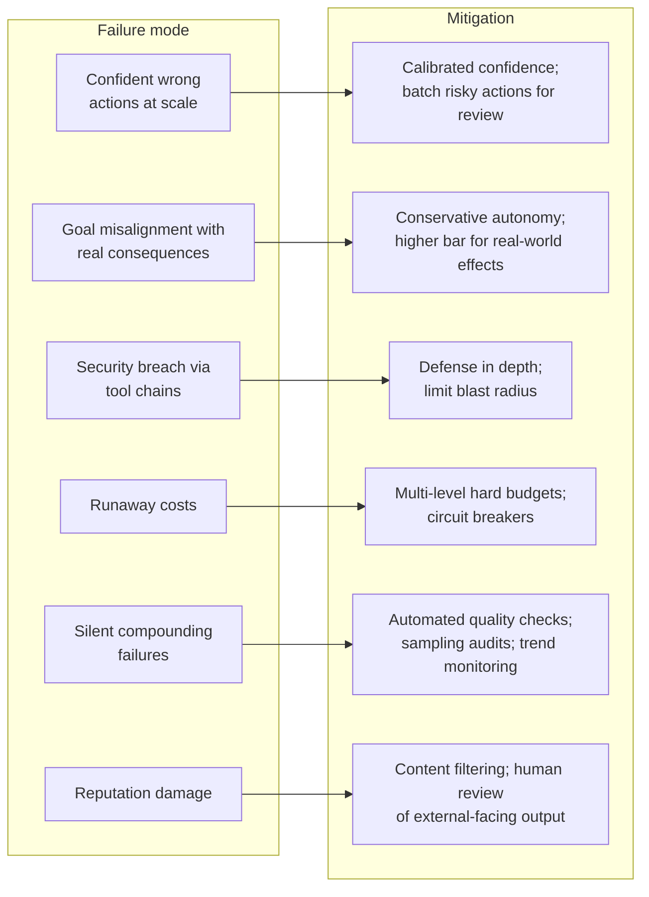
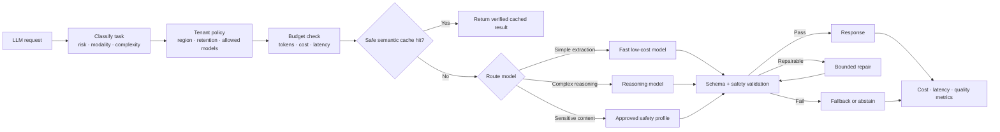
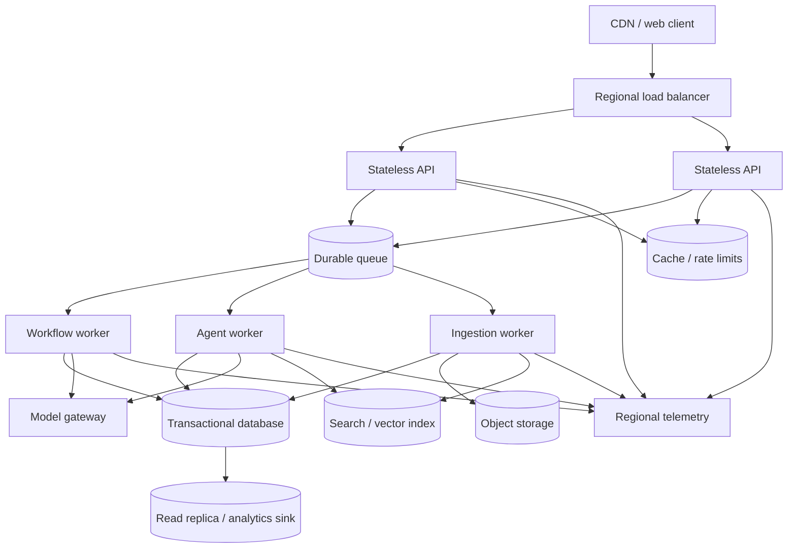
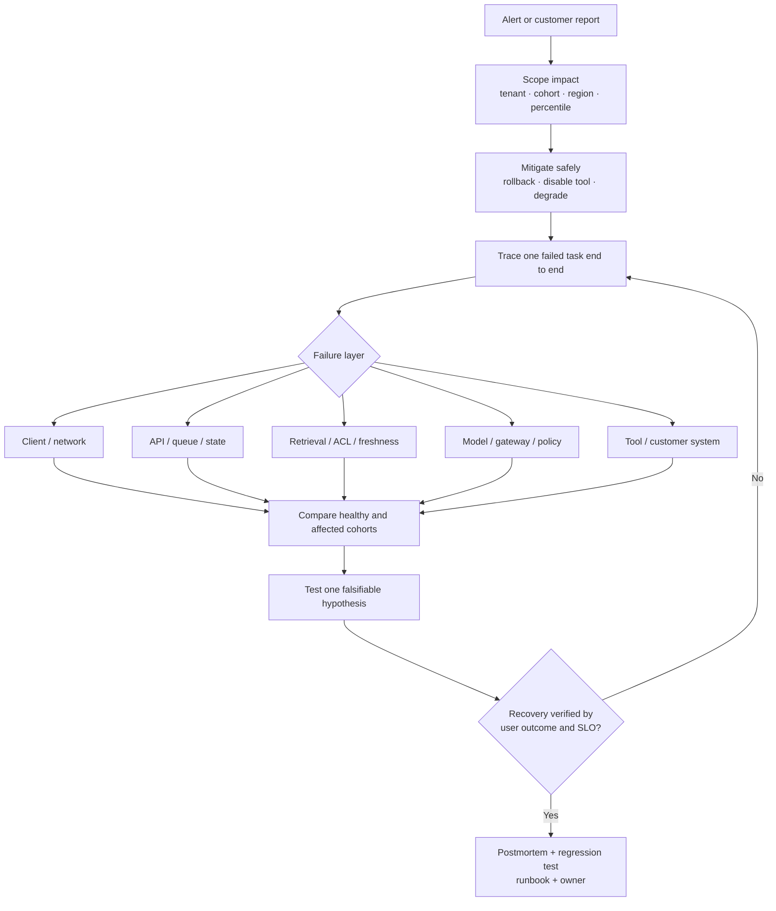

# Part F (3 of 3) — Production operations and trends

← Previous: [Part F (2 of 3) — Evaluation and observability](01j-part-f2-evaluation-and-observability.md) · Index: [Full Read-Through](01-full-read-through.md) · Next: [Knowledge check — Parts A to F](01l-knowledge-check.md) →

**Steps in this file**

- [Step 69 · Most dangerous failure modes of agentic AI](01k-part-f3-production-operations.md#69-read-most-dangerous-failure-modes-of-agentic-ai)
- [Step 70 · Bottlenecks that limit agent scalability](01k-part-f3-production-operations.md#70-read-bottlenecks-that-limit-agent-scalability)
- [Step 71 · Model gateway and cost-aware routing](01k-part-f3-production-operations.md#71-study-the-diagram-model-gateway-and-cost-aware-routing)
- [Step 72 · Scalable deployment topology](01k-part-f3-production-operations.md#72-study-the-diagram-scalable-deployment-topology)
- [Step 73 · Production incident diagnosis](01k-part-f3-production-operations.md#73-study-the-diagram-production-incident-diagnosis)
- [Step 74 · Tradeoffs most teams get wrong](01k-part-f3-production-operations.md#74-read-tradeoffs-most-teams-get-wrong)
- [Step 75 · Industry trends](01k-part-f3-production-operations.md#75-read-industry-trends-skim-this-is-context-not-exam-material)

---

## 69. Read: Most dangerous failure modes of agentic AI

*Source: agentic-ai-system-design-interview-guide-2026.md*

> **Why this step is here.** Parts B to F each named individual risks — runaway loops ([Step 9 · Termination conditions](01b-part-b-agent-loop-and-control-plane.md#9-read-termination-conditions)), tool-chain injection (Steps [55](01i-part-f1-security.md#55-read-security-risks-with-tool-using-agents) to [58](01i-part-f1-security.md#58-study-the-diagram-prompt-injection-resistant-rag-and-tools)), drift ([Step 63 · Detecting goal drift](01j-part-f2-evaluation-and-observability.md#63-read-detecting-goal-drift)), cost (Steps [23](01d-part-c2-tool-failures-sandboxing-cost.md#23-read-controlling-cost-explosions-from-tool-calls) and [68](01j-part-f2-evaluation-and-observability.md#68-code-track-and-enforce-a-cost-budget-across-an-agent-session)). This step collects them into the six failure modes that actually take agentic systems down in production, each paired with its mitigation, and it answers the interview question "what are you most afraid of, and what did you do about it?" Read it as six pairs, not twelve items: for each failure mode, be able to say why it is worse for an agent than for ordinary software, and which box in your architecture is the mitigation. [Step 74 · Tradeoffs most teams get wrong](01k-part-f3-production-operations.md#74-read-tradeoffs-most-teams-get-wrong) turns these into team-level tradeoffs, and [Step 80 · The eight decisions they will probe](01m-part-g1-fde-interview-knowledge.md#80-read-the-eight-decisions-they-will-probe-write-one-sentence-of-your-own-for-each) asks you to write your own sentence for each decision they imply.

### Step 69 · 38. What are the most dangerous failure modes of agentic AI?

- **Confident wrong actions at scale** — decisive, incorrect, and unhesitating, so many land before anyone notices.
	*Mitigation:* calibrated confidence; slow down when uncertain; batch risky actions for review.
- **Goal misalignment with real consequences** — enough autonomy to delete the wrong files, send the wrong emails, make the wrong purchases.
	*Mitigation:* conservative autonomy; higher confidence bars and more verification for real-world effects.
- **Security breaches through tool chains** — prompt injection, privilege escalation, data exfiltration, the agent as attack vector.
	*Mitigation:* defense in depth; assume manipulation; limit blast radius.
- **Runaway costs** — a loop that burns the budget in minutes.
	*Mitigation:* hard budgets at multiple levels; circuit breakers; real-time monitoring.
- **Silent failures that compound** — wrong results that look right, quality degrading unnoticed.
	*Mitigation:* automated quality checks; sampling audits; user feedback loops; trend monitoring.
- **Reputation damage** — something embarrassing, offensive or wrong in a high-visibility context.
	*Mitigation:* content filtering; conservative communication defaults; human review of external-facing output.

#### Going deeper (Step 69)

**What makes these six specifically agentic.** Ordinary software fails loudly and locally. Agents fail *confidently*, *at scale*, and *quietly*: a model does not hesitate, a loop does not tire, and a wrong answer is fluent enough to pass a glance. So the mitigations are never "fix the bug" but "reshape the system so a wrong action is small, slow, or reviewed."

**Group them by the control that catches them.**

| Failure mode | Where the control lives | Which step built it |
|---|---|---|
| Confident wrong actions; goal misalignment | Policy gate and approval tier in the orchestrator | Steps [7](01b-part-b-agent-loop-and-control-plane.md#7-read-what-belongs-in-the-orchestrator-vs-the-llm), [50](01h-part-e2-long-running-agents.md#50-study-the-diagram-human-approval-for-consequential-actions), [51](01h-part-e2-long-running-agents.md#51-read-human-in-the-loop-controls) |
| Security via tool chains | Structural capability limits, trust boundaries | Steps [56](01i-part-f1-security.md#56-read-security-should-constrain-capability-structurally) to [58](01i-part-f1-security.md#58-study-the-diagram-prompt-injection-resistant-rag-and-tools) |
| Runaway costs | Budget tracker, step cap, circuit breaker | Steps [9](01b-part-b-agent-loop-and-control-plane.md#9-read-termination-conditions), [23](01d-part-c2-tool-failures-sandboxing-cost.md#23-read-controlling-cost-explosions-from-tool-calls), [68](01j-part-f2-evaluation-and-observability.md#68-code-track-and-enforce-a-cost-budget-across-an-agent-session) |
| Silent compounding failures | Eval loop, sampling audits, drift detection | Steps [63](01j-part-f2-evaluation-and-observability.md#63-read-detecting-goal-drift) to [65](01j-part-f2-evaluation-and-observability.md#65-study-the-diagram-offline-and-online-evaluation-loop) |
| Reputation damage | Output filtering, human review of external text | Steps [51](01h-part-e2-long-running-agents.md#51-read-human-in-the-loop-controls), [60](01i-part-f1-security.md#60-code-redact-pii-before-sending-to-a-model) |

The model appears nowhere in the middle column. Every mitigation is deterministic code or a human — the point [Step 68 · Track and enforce a cost budget across an agent session](01j-part-f2-evaluation-and-observability.md#68-code-track-and-enforce-a-cost-budget-across-an-agent-session) made for cost and [Step 56 · Security should constrain capability structurally](01i-part-f1-security.md#56-read-security-should-constrain-capability-structurally) made for security, now generalized to all six.

**"Calibrated confidence" is the term people wave past.** It does not mean asking the model "how sure are you?"; self-reported confidence is poorly calibrated. In practice it means a structured output with an explicit `confidence` or `needs_review` field that you validate against outcomes offline ([Step 65 · Offline and online evaluation loop](01j-part-f2-evaluation-and-observability.md#65-study-the-diagram-offline-and-online-evaluation-loop)), with thresholds tuned so that low-confidence *writes* are batched for review while low-confidence *reads* simply proceed. "Slow down when uncertain" is an orchestrator rule, not a prompt instruction.

**"Silent failures that compound" is the one teams underweight.** A support bot whose index went stale last Tuesday still answers fluently; nobody files a bug, and satisfaction drifts for a month. The mitigations are statistical: sample 1 to 2% of sessions for human grading, track quality per cohort, and treat a trend break as an incident ([Step 73 · Production incident diagnosis](01k-part-f3-production-operations.md#73-study-the-diagram-production-incident-diagnosis)).

**Common misreading.** Candidates recite the six as a list and stop. The interviewer wants the pairing and the placement: "which of these applies to *this* design, and where in the diagram does the mitigation sit?" A second error is treating reputation damage as a toxicity-filter problem. In an enterprise context the embarrassing output is usually a wrong policy statement or a leaked internal document name, which is a retrieval and permission problem ([Step 34 · Permission-aware RAG query path](01f-part-d2-rag-pipelines.md#34-study-the-diagram-permission-aware-rag-query-path)), not a content-moderation one.

**Connects to.** [Step 68 · Track and enforce a cost budget across an agent session](01j-part-f2-evaluation-and-observability.md#68-code-track-and-enforce-a-cost-budget-across-an-agent-session) is the code for the cost mitigation; Steps [50](01h-part-e2-long-running-agents.md#50-study-the-diagram-human-approval-for-consequential-actions) and [51](01h-part-e2-long-running-agents.md#51-read-human-in-the-loop-controls) are the approval design behind "batch risky actions for review"; [Step 63 · Detecting goal drift](01j-part-f2-evaluation-and-observability.md#63-read-detecting-goal-drift) is how you detect goal misalignment before it has consequences. [Step 74 · Tradeoffs most teams get wrong](01k-part-f3-production-operations.md#74-read-tradeoffs-most-teams-get-wrong) reframes these as tradeoffs teams get wrong, and [Step 81 · SAFE COST and SCOPE](01m-part-g1-fde-interview-knowledge.md#81-memorize-safe-cost-and-scope)'s SAFE COST acronym is a memory aid for the same list.

**Check yourself.**
1. Why is "confident wrong actions at scale" worse for an agent than for a rules engine with the same bug? *The rules engine fails identically and predictably so one test catches it; the agent fails plausibly and variably across inputs, so many land before the pattern is visible.*
2. A reconciliation agent's totals have been slightly off for three weeks with no alerts. Which mode, and which mitigation was missing? *Silent compounding failure; an independent deterministic recalculation and a sampled audit would have caught it (compare Drill 6.5).*
3. Where should "slow down when uncertain" be enforced? *In the orchestrator, using a validated confidence field and a review queue, not as an instruction to the model.*

---

## 70. Read: Bottlenecks that limit agent scalability

*Source: agentic-ai-system-design-interview-guide-2026.md*

> **Why this step is here.** Interviewers who hear "it works" next ask "what happens at 100× the load?", and the weak answer is "autoscale it". This step gives you the five places an agentic system actually bottlenecks — model, state, tools, coordination, and operations — so you can name where the ceiling is before proposing a fix. It builds on [Step 23 · Controlling cost explosions from tool calls](01d-part-c2-tool-failures-sandboxing-cost.md#23-read-controlling-cost-explosions-from-tool-calls) (cost per tool call), [Step 38 · Fit conversation history into a token budget](01f-part-d2-rag-pipelines.md#38-code-fit-conversation-history-into-a-token-budget) (token budgets), [Step 52 · Fan out N independent tool calls with bounded concurrency](01h-part-e2-long-running-agents.md#52-code-fan-out-n-independent-tool-calls-with-bounded-concurrency) (bounded concurrency) and Steps [42](01g-part-e1-multi-agent-coordination.md#42-read-use-multi-agent-only-where-parallel-context-is-valuable) to [43](01g-part-e1-multi-agent-coordination.md#43-read-coordination-without-conflicting-actions) (coordination cost), and it sets up Steps [71](01k-part-f3-production-operations.md#71-study-the-diagram-model-gateway-and-cost-aware-routing) and [72](01k-part-f3-production-operations.md#72-study-the-diagram-scalable-deployment-topology), the two diagrams that implement most of these mitigations. Read it by asking, for each bottleneck: what is the measurable symptom, and which mitigation changes which number?

### Step 70 · 39. What bottlenecks limit agent scalability in production?

- **LLM** — per-step latency dominates; rate limits, cost/token, queue depth; longer context = slower and pricier. *Mitigate:* caching, small models for simple decisions, batching, context management.
- **State** — memory retrieval latency per step, serialization cost of large states, distributed consistency. *Mitigate:* efficient storage, lazy loading, partitioning.
- **Tools** — external API limits, sequential dependencies, sandboxing overhead. *Mitigate:* tool caching, parallelism where safe, sandbox tuning.
- **Coordination** — inter-agent messaging, lock contention, consensus latency. *Mitigate:* minimize coordination, partition work, accept eventual consistency where tolerable.
- **Operational** — observability overhead, and human approval becoming the throughput ceiling.

#### Going deeper (Step 70)

**Why the LLM dominates.** A single model call is typically 1 to 5 seconds for a mid-size model and 10 to 30 seconds for a large reasoning model on a long context; a database read is milliseconds. An agent that takes eight steps therefore spends well over 90% of its wall-clock waiting on the model, and the same 8× multiplier applies to cost and to your provider rate limit. Three consequences follow. Reducing *steps* helps more than making any step faster, which is why [Step 18 · Move loops and data plumbing into code](01c-part-c1-tool-design.md#18-read-move-loops-and-data-plumbing-into-code) moved loops into code. Context length is a hidden multiplier, because every step re-sends the growing history, so [Step 38 · Fit conversation history into a token budget](01f-part-d2-rag-pipelines.md#38-code-fit-conversation-history-into-a-token-budget)'s budget fitting is a scaling tool and not only a correctness tool. And a small model for routing and extraction ([Step 53 · Route a query to the right agent without calling a large model](01h-part-e2-long-running-agents.md#53-code-route-a-query-to-the-right-agent-without-calling-a-large-model)) cuts latency and cost roughly 10× on the decisions that never needed a large model.

**State is the bottleneck people forget.** Each step loads session state, memory hits, and prior tool results. If session state is a 200 KB JSON blob re-serialized every step, that is a real cost that grows with the conversation. Mitigations: keep state in an append-only event log with periodic snapshots ([Step 49 · Durable LLM workflow](01h-part-e2-long-running-agents.md#49-study-the-diagram-durable-llm-workflow)), load memory lazily only when [Step 30 · When to retrieve memory vs ignore it](01e-part-d1-context-and-memory.md#30-read-when-to-retrieve-memory-vs-ignore-it)'s retrieval gate says it is relevant, and partition by tenant or session so no single store is hot.

**Tools and sequential dependencies.** Five independent tool calls made one at a time is five round trips; [Step 52 · Fan out N independent tool calls with bounded concurrency](01h-part-e2-long-running-agents.md#52-code-fan-out-n-independent-tool-calls-with-bounded-concurrency)'s bounded fan-out makes it one. The *where safe* qualifier matters: writes with ordering constraints or shared idempotency keys must stay sequential ([Step 20 · Tool execution with idempotency and compensation](01d-part-c2-tool-failures-sandboxing-cost.md#20-study-the-diagram-tool-execution-with-idempotency-and-compensation)). Sandbox start-up for code execution ([Step 22 · Sandboxed generated-code execution](01d-part-c2-tool-failures-sandboxing-cost.md#22-study-the-diagram-sandboxed-generated-code-execution)) is typically 100 ms to a few seconds; pooling warm sandboxes is the usual fix.

**Coordination.** Every message between agents is another model call on the receiving end plus serialization. [Step 42 · Use multi-agent only where parallel context is valuable](01g-part-e1-multi-agent-coordination.md#42-read-use-multi-agent-only-where-parallel-context-is-valuable)'s rule — multi-agent only where parallel context is genuinely valuable — is a scalability rule as much as a design rule. A lock shared across agents almost always means the boundary was drawn in the wrong place.

**Operational: the human ceiling.** If 5% of actions need approval and one reviewer clears 30 an hour, that reviewer caps you at 600 actions per hour no matter how many workers you add. This is the bottleneck most likely to surprise a customer, and the reason [Step 51 · Human-in-the-loop controls](01h-part-e2-long-running-agents.md#51-read-human-in-the-loop-controls) tiered approvals and Drill 6.9 discusses approval fatigue.

**Common misreading.** "Scale" gets answered with infrastructure vocabulary — more replicas, a bigger cluster. The stateless API tier is almost never the constraint in an agent system; the model call, the approval queue, and the per-tenant rate limit are. Quantify first (the scale order under [Step 72 · Scalable deployment topology](01k-part-f3-production-operations.md#72-study-the-diagram-scalable-deployment-topology)), then name the one bottleneck you would fix and the number it would move.

**Connects to.** [Step 71 · Model gateway and cost-aware routing](01k-part-f3-production-operations.md#71-study-the-diagram-model-gateway-and-cost-aware-routing) is the model-side mitigation set (cache, route, budget) drawn as a diagram; [Step 72 · Scalable deployment topology](01k-part-f3-production-operations.md#72-study-the-diagram-scalable-deployment-topology) is the deployment topology that lets you scale workers independently of state. [Step 86 · Practice 7.6 The website is slow in 5 min using SCOPE](01n-part-g2-fde-mocks-and-final-prep.md#86-practice-76-the-website-is-slow-in-5-min-using-scope) practices the "website is slow" version in five minutes.

**Check yourself.**
1. An agent's p95 is 40 seconds over eight steps. What do you look at first? *Step count and per-step context size, since the model dominates; then whether steps can be parallelized or moved into code.*
2. Why does adding API replicas not help a slow agent system? *The API is stateless and fast already; the wait is in model calls, tool dependencies, or the approval queue, none of which the API tier owns.*
3. Which bottleneck has a ceiling that no engineering change removes? *Human approval throughput; only re-tiering which actions need review changes it.*

---

## 71. Study the diagram: Model gateway and cost-aware routing

*Source: production-llm-agent-rag-workflow-mermaid-atlas.md*

> **Why this step is here.** [Step 70 · Bottlenecks that limit agent scalability](01k-part-f3-production-operations.md#70-read-bottlenecks-that-limit-agent-scalability) said the model is the dominant bottleneck; this diagram is the component that manages it. A model gateway is the single choke point every LLM request passes through, which is what makes it possible to enforce tenant policy, budgets, caching, routing and output validation in one place instead of in every agent. It builds on [Step 53 · Route a query to the right agent without calling a large model](01h-part-e2-long-running-agents.md#53-code-route-a-query-to-the-right-agent-without-calling-a-large-model) (routing without a large model), [Step 59 · Multi-tenant data isolation](01i-part-f1-security.md#59-study-the-diagram-multi-tenant-data-isolation) (multi-tenant isolation), [Step 68 · Track and enforce a cost budget across an agent session](01j-part-f2-evaluation-and-observability.md#68-code-track-and-enforce-a-cost-budget-across-an-agent-session) (budget enforcement) and [Step 24 · Tool registry with schema validation](01d-part-c2-tool-failures-sandboxing-cost.md#24-code-tool-registry-with-schema-validation) (schema validation), and it reappears as the `Model gateway` box in [Step 72 · Scalable deployment topology](01k-part-f3-production-operations.md#72-study-the-diagram-scalable-deployment-topology) and in the one-board diagram of the Knowledge check. Read it left to right as a request pipeline, and notice that the model itself is three interchangeable boxes in the middle.

### Step 71 · 14. Model gateway and cost-aware routing

#### Going deeper (Step 71)

**Walk the diagram.**

- *Classify task.* Decides what kind of request this is before anything expensive happens. Usual implementation is the [Step 53 · Route a query to the right agent without calling a large model](01h-part-e2-long-running-agents.md#53-code-route-a-query-to-the-right-agent-without-calling-a-large-model) pattern: a small model, embeddings, or rules that tag risk (does this touch PII or a write?), modality, and complexity. Remove it and every downstream decision — which model, which policy, which cache — has nothing to key on.
- *Tenant policy.* Region, retention, allowed models. A lookup in a policy service or per-tenant config table. A regulated tenant may be permitted only one model family hosted in one region. Remove it and [Step 59 · Multi-tenant data isolation](01i-part-f1-security.md#59-study-the-diagram-multi-tenant-data-isolation)'s isolation has a hole exactly where data leaves your system.
- *Budget check.* [Step 68 · Track and enforce a cost budget across an agent session](01j-part-f2-evaluation-and-observability.md#68-code-track-and-enforce-a-cost-budget-across-an-agent-session)'s `BudgetTracker`, placed in the gateway rather than in each agent so a runaway loop anywhere is stopped here. It checks tokens, cost and latency budget before the call is made.
- *Safe semantic cache.* "Semantic" means near-duplicate prompts can hit; "safe" means the key includes tenant and permission scope, so one user never receives another's answer, and freshness rules invalidate stale entries. Typical implementation: an embedding lookup over recent requests with a similarity threshold, scoped by tenant. Hit rates of 20 to 40% are typical on FAQ-heavy support traffic. Drop the "safe" qualifier and you have built a cross-tenant leak.
- *Route model.* Three lanes: a fast low-cost model for extraction and classification, a reasoning model for open-ended work, and an approved safety profile for sensitive content (in practice a pinned model version with stricter rules or a region-pinned deployment). The lane is chosen by the classification, not by whichever agent happened to call.
- *Schema + safety validation, repair, fallback.* All three lanes converge on one validator. Output must parse against the expected schema ([Step 24 · Tool registry with schema validation](01d-part-c2-tool-failures-sandboxing-cost.md#24-code-tool-registry-with-schema-validation)) and pass safety filters on the way out. "Bounded repair" is one or two retries with the validation error fed back; beyond that, fall back to a deterministic answer or abstain. Remove the bound and you have [Step 13 · Detect a stuck agent loop](01b-part-b-agent-loop-and-control-plane.md#13-code-detect-a-stuck-agent-loop)'s stuck loop living inside your gateway.
- *Metrics.* Cost, latency and quality per route and per tenant. This is where [Step 62 · Metrics beyond task success](01j-part-f2-evaluation-and-observability.md#62-read-metrics-beyond-task-success)'s metrics get their data and where you learn whether the cheap lane is good enough to take more traffic.

**How to redraw it.** Anchor on four things: request in, cache diamond, three model lanes, one shared validator. Then add the three pre-checks (classify, policy, budget) in front of the cache — the order matters: cheap classification first, policy before you spend money, budget before you call. Then the validator's three exits (pass, repair looping back, fail to fallback). Last, the metrics sink that both response and fallback feed.

**Common misreading.** People draw the gateway as "a proxy that picks the cheapest model" and lose the two things that earn it a box: policy enforcement in one place, and validation on the way out. The router is the least important part; a single fixed model behind the same policy, budget and validation would still be a good gateway. A second misreading is that the cache is free. A semantic cache that ignores tenant scope or freshness is a correctness bug, which is why the diagram says "verified cached result".

**Connects to.** [Step 53 · Route a query to the right agent without calling a large model](01h-part-e2-long-running-agents.md#53-code-route-a-query-to-the-right-agent-without-calling-a-large-model) is the classifier code; [Step 68 · Track and enforce a cost budget across an agent session](01j-part-f2-evaluation-and-observability.md#68-code-track-and-enforce-a-cost-budget-across-an-agent-session) is the budget check; [Step 59 · Multi-tenant data isolation](01i-part-f1-security.md#59-study-the-diagram-multi-tenant-data-isolation) is why tenant policy sits before the model. [Step 72 · Scalable deployment topology](01k-part-f3-production-operations.md#72-study-the-diagram-scalable-deployment-topology) shows where the gateway lives in the deployment, and [Step 82 · Google Cloud vocabulary](01m-part-g1-fde-interview-knowledge.md#82-read-google-cloud-vocabulary-map-each-product-to-a-box-you-already-know) maps it to Google Cloud vocabulary.

**Check yourself.**
1. What breaks if you remove the tenant-policy box and route purely on complexity? *A regulated tenant's data can be sent to a model or region they have not approved; isolation fails at the exit point.*
2. Why do all three lanes feed one validator rather than each having its own? *So the output contract is identical regardless of which model answered, which is what lets you shift traffic between lanes safely.*
3. What makes a semantic cache "safe"? *Its key includes tenant and permission scope and it respects freshness, so a hit is only returned to someone entitled to the original answer.*

---

## 72. Study the diagram: Scalable deployment topology

*Source: production-llm-agent-rag-workflow-mermaid-atlas.md*

> **Why this step is here.** [Step 11 · Complete production LLM platform](01b-part-b-agent-loop-and-control-plane.md#11-study-the-diagram-complete-production-llm-platform-name-every-box-out-loud) showed the complete platform as logical components; this diagram shows how those components are deployed so they scale independently, which is the question behind "how do you take this to 10,000 tenants?" The key idea is a durable queue between stateless API servers and three kinds of workers, so slow, variable agent work never blocks a request thread. It builds on [Step 49 · Durable LLM workflow](01h-part-e2-long-running-agents.md#49-study-the-diagram-durable-llm-workflow) (durable workflows), [Step 10 · Separate brain, session, and hands](01b-part-b-agent-loop-and-control-plane.md#10-read-separate-brain-session-and-hands) (brain, session, hands), [Step 33 · Enterprise wiki RAG ingestion](01f-part-d2-rag-pipelines.md#33-study-the-diagram-enterprise-wiki-rag-ingestion) (ingestion) and [Step 66 · End-to-end observability](01j-part-f2-evaluation-and-observability.md#66-study-the-diagram-end-to-end-observability) (observability), and it is the shape you will redraw in [Step 79 · Architecture from memory](01m-part-g1-fde-interview-knowledge.md#79-draw-architecture-from-memory-you-already-know-every-box-from-parts-b-to-f). Read it top to bottom as one request's journey, then read the scale-order sentence beneath it three times — that sentence answers most scale questions.

### Step 72 · 19. Scalable deployment topology

**Scale order:** quantify → find the bottleneck → queue variable work → add backpressure and fairness → scale stateless workers → partition state only when measurements require it.

#### Going deeper (Step 72)

**Walk the diagram.**

- *CDN / web client → regional load balancer.* Static assets and TLS at the edge; regional because residency and latency both keep a tenant's traffic in one region ([Step 59 · Multi-tenant data isolation](01i-part-f1-security.md#59-study-the-diagram-multi-tenant-data-isolation)).
- *Stateless API (two boxes).* Two are drawn to make the point: they hold no session state, so any number can run and any one can die. They authenticate, validate, enqueue, and return a job ID or stream status. Put agent execution here and a 40-second step ties up a request thread, making the API tier the bottleneck [Step 70 · Bottlenecks that limit agent scalability](01k-part-f3-production-operations.md#70-read-bottlenecks-that-limit-agent-scalability) warned about.
- *Cache / rate limits.* A shared store (Redis or equivalent) for per-tenant quotas, [Step 26 · Make a create-resource call idempotent](01d-part-c2-tool-failures-sandboxing-cost.md#26-code-make-a-create-resource-call-idempotent)'s idempotency keys, and short-lived cache. Without it each API instance enforces limits independently and a tenant gets N× their quota.
- *Durable queue.* The most important box. It decouples arrival rate from processing rate: a burst of 1,000 requests queues instead of crashing workers, and queue depth becomes your scaling signal. It also supplies retries, dead-letter handling and at-least-once delivery — which is exactly why [Step 26 · Make a create-resource call idempotent](01d-part-c2-tool-failures-sandboxing-cost.md#26-code-make-a-create-resource-call-idempotent)'s idempotency exists. Implementation: a managed message queue or a durable workflow engine's task queue ([Step 49 · Durable LLM workflow](01h-part-e2-long-running-agents.md#49-study-the-diagram-durable-llm-workflow)).
- *Three worker types.* Workflow worker runs deterministic state machines; agent worker runs the [Step 12 · Build a minimal agent loop from scratch](01b-part-b-agent-loop-and-control-plane.md#12-code-build-a-minimal-agent-loop-from-scratch-30-min-this-makes-part-b-concrete) loop; ingestion worker runs [Step 33 · Enterprise wiki RAG ingestion](01f-part-d2-rag-pipelines.md#33-study-the-diagram-enterprise-wiki-rag-ingestion)'s pipeline. They are separate so they scale separately: ingestion spikes when a customer uploads 40,000 documents, agent workers spike at business hours, and neither should starve the other. Each is stateless per [Step 10 · Separate brain, session, and hands](01b-part-b-agent-loop-and-control-plane.md#10-read-separate-brain-session-and-hands); state lives in the database.
- *Transactional database.* Session events, workflow state, idempotency records, approvals. The single source of truth all workers share; the read replica keeps analytics from slowing writes.
- *Model gateway.* [Step 71 · Model gateway and cost-aware routing](01k-part-f3-production-operations.md#71-study-the-diagram-model-gateway-and-cost-aware-routing)'s box, called by workflow and agent workers. Ingestion is drawn off it because bulk embedding is different work with different limits, though in practice it may share the gateway under its own budget.
- *Object storage and search / vector index.* Raw documents and artifacts go to object storage ([Step 48 · Long-running agents need durable artifacts and explicit completion](01h-part-e2-long-running-agents.md#48-read-long-running-agents-need-durable-artifacts-and-explicit-completion)'s durable artifacts); chunks and embeddings go to the index, which the agent worker queries at retrieval time.
- *Regional telemetry.* Every compute box emits to it. [Step 66 · End-to-end observability](01j-part-f2-evaluation-and-observability.md#66-study-the-diagram-end-to-end-observability)'s observability, regional again for residency.

**The scale order, unpacked.** *Quantify* requests per second, steps per task, tokens per step and the p95 target first. *Find the bottleneck* with [Step 70 · Bottlenecks that limit agent scalability](01k-part-f3-production-operations.md#70-read-bottlenecks-that-limit-agent-scalability)'s five categories. *Queue variable work* so bursts do not become outages. *Add backpressure and fairness* so one tenant's bulk upload does not starve another's chat. *Scale stateless workers* — the easy part, done only now. *Partition state last*, because sharding the database is the expensive, hard-to-reverse step.

**How to redraw it.** Anchor on three layers: stateless API on top, queue in the middle, three workers below. Then add the shared stores the workers write to (database, object storage, index). Then the two things every worker calls out to: model gateway and telemetry. Finish with cache/rate-limits beside the API and the read replica beside the database. If you remember only "API → queue → workers → DB", you have the skeleton.

**Common misreading.** Drawing the agent loop inside the API server, or drawing one worker type. The first cannot survive a long task or a deploy mid-task; the second lets a bulk ingestion job degrade interactive latency. A related error is answering "how do you scale?" with "autoscale the API" — the API is the one tier that is already trivially scalable.

**Connects to.** [Step 49 · Durable LLM workflow](01h-part-e2-long-running-agents.md#49-study-the-diagram-durable-llm-workflow) is what the workflow worker runs; [Step 71 · Model gateway and cost-aware routing](01k-part-f3-production-operations.md#71-study-the-diagram-model-gateway-and-cost-aware-routing) is the model gateway in detail; [Step 66 · End-to-end observability](01j-part-f2-evaluation-and-observability.md#66-study-the-diagram-end-to-end-observability) is the telemetry box. [Step 86 · Practice 7.6 The website is slow in 5 min using SCOPE](01n-part-g2-fde-mocks-and-final-prep.md#86-practice-76-the-website-is-slow-in-5-min-using-scope) practices diagnosing this topology under time pressure, and [Step 82 · Google Cloud vocabulary](01m-part-g1-fde-interview-knowledge.md#82-read-google-cloud-vocabulary-map-each-product-to-a-box-you-already-know) gives the Google Cloud product for each box.

**Check yourself.**
1. Why is the queue "durable" rather than in-memory? *A worker crash or deploy must not lose in-flight tasks; durability plus idempotent workers gives at-least-once completion.*
2. Ingestion of a huge document set makes chat slow. Which box is missing or misconfigured? *Fairness and backpressure on the queue, or ingestion and agent workers sharing one pool instead of scaling separately.*
3. Why does the scale order put partitioning state last? *It is the most expensive and least reversible change, and most systems find the real bottleneck earlier in the list.*

---

## 73. Study the diagram: Production incident diagnosis

*Source: production-llm-agent-rag-workflow-mermaid-atlas.md*

> **Why this step is here.** [Step 47 · Debugging failures across agents](01g-part-e1-multi-agent-coordination.md#47-read-debugging-failures-across-agents) explained why debugging across agents is hard and [Step 66 · End-to-end observability](01j-part-f2-evaluation-and-observability.md#66-study-the-diagram-end-to-end-observability) gave you the traces; this diagram is the procedure you follow at 2 a.m. when the trace is all you have. It matters for the FDE role specifically because troubleshooting is a named RRK dimension ([Step 76 · Confirmed structure and The combined scorecard](01m-part-g1-fde-interview-knowledge.md#76-read-confirmed-structure-and-the-combined-scorecard)) and because [Step 86 · Practice 7.6 The website is slow in 5 min using SCOPE](01n-part-g2-fde-mocks-and-final-prep.md#86-practice-76-the-website-is-slow-in-5-min-using-scope) asks you to run a five-minute version of exactly this. The two ideas to hold on to are the order — scope, mitigate, then diagnose — and the five failure layers you check in turn. Read it as a loop with one exit, and notice that the exit condition is user outcome, not "the errors stopped".

### Step 73 · 21. Production incident diagnosis

#### Going deeper (Step 73)

**Walk the diagram.**

- *Alert or customer report → Scope impact.* Before touching anything: which tenants, which cohort, which region, which percentile. "All users" and "one tenant's p99" are different incidents with different mitigations. Implementation: [Step 66 · End-to-end observability](01j-part-f2-evaluation-and-observability.md#66-study-the-diagram-end-to-end-observability)'s telemetry sliced by tenant ID and route. Skip this and you may roll back a global deploy for one tenant's ACL misconfiguration.
- *Mitigate safely.* Stop the bleeding *before* you understand the cause. Three levers in increasing precision: roll back the last deploy, disable one tool ([Step 24 · Tool registry with schema validation](01d-part-c2-tool-failures-sandboxing-cost.md#24-code-tool-registry-with-schema-validation)'s registry makes this a flag flip), or degrade — route to a smaller model or return "I cannot help with that right now" for one intent. [Step 71 · Model gateway and cost-aware routing](01k-part-f3-production-operations.md#71-study-the-diagram-model-gateway-and-cost-aware-routing)'s gateway is where degrade lives. Skip this and the incident grows while you investigate.
- *Trace one failed task end to end.* One, not a dashboard. Pull a single session — every model call, tool call and state transition — and read it. [Step 67 · Deterministic replay of an agent trace](01j-part-f2-evaluation-and-observability.md#67-code-deterministic-replay-of-an-agent-trace)'s replay lets you re-run it deterministically. This is the step that turns "the model is acting weird" into a specific fact.
- *Failure layer.* Five candidates in roughly the order a request travels ([Step 72 · Scalable deployment topology](01k-part-f3-production-operations.md#72-study-the-diagram-scalable-deployment-topology)): client/network, API/queue/state, retrieval/ACL/freshness, model/gateway/policy, tool/customer system. Naming them stops the reflex of blaming the model. In practice a stale index, an ACL filter dropping everything, or a customer API changing its error format is far more common than a model regression.
- *Compare healthy and affected cohorts.* Whatever layer you suspect, confirm by diff: same prompt in an unaffected tenant, same tool call from an unaffected region, same model snapshot on a different routing path. [Step 75 · Industry trends](01k-part-f3-production-operations.md#75-read-industry-trends-skim-this-is-context-not-exam-material)'s Trend 6 is the cautionary example — what looked like model nondeterminism was routing skew, visible only by segmenting.
- *Test one falsifiable hypothesis.* One. "If I re-index this tenant, the failing query returns the right document" is falsifiable; "the model got worse" is not. Change one thing, re-run the traced task.
- *Recovery verified by user outcome and SLO?* Not "errors stopped" — the user's task succeeds and p95 is back under target. If no, return to the trace with new information. If yes, postmortem.
- *Postmortem + regression test + runbook + owner.* The incident becomes a case in [Step 65 · Offline and online evaluation loop](01j-part-f2-evaluation-and-observability.md#65-study-the-diagram-offline-and-online-evaluation-loop)'s eval suite, a documented mitigation for next time, and a named person. Without the regression test the same failure returns after the next prompt edit.

**How to redraw it.** Anchor on the spine: scope → mitigate → trace → hypothesis → verify → postmortem. Then add the five-layer fan-out after "trace" and its convergence into "compare cohorts". Last, the "No" edge from verify back to trace — that loop is the part people forget, and it is what makes this a procedure rather than a checklist.

**Common misreading.** Starting at "trace" because that is the interesting part. Going straight to root cause without scoping and mitigating signals that you have not run production. The other misreading is treating "model / gateway / policy" as the default suspect; the strong answer says "I check the boring layers first because they are more often wrong and faster to rule out."

**Connects to.** [Step 66 · End-to-end observability](01j-part-f2-evaluation-and-observability.md#66-study-the-diagram-end-to-end-observability) supplies the traces this loop reads; [Step 67 · Deterministic replay of an agent trace](01j-part-f2-evaluation-and-observability.md#67-code-deterministic-replay-of-an-agent-trace) makes one failed task reproducible; [Step 65 · Offline and online evaluation loop](01j-part-f2-evaluation-and-observability.md#65-study-the-diagram-offline-and-online-evaluation-loop) is where the regression test lands. [Step 86 · Practice 7.6 The website is slow in 5 min using SCOPE](01n-part-g2-fde-mocks-and-final-prep.md#86-practice-76-the-website-is-slow-in-5-min-using-scope) is a timed drill on the same loop using the SCOPE acronym from [Step 81 · SAFE COST and SCOPE](01m-part-g1-fde-interview-knowledge.md#81-memorize-safe-cost-and-scope).

**Check yourself.**
1. Why mitigate before you know the cause? *The customer's exposure grows every minute; rollback, tool-disable and degrade are reversible and buy time to diagnose properly.*
2. A support bot gives wrong answers for one tenant since this morning. Which layer first, and why? *Retrieval/ACL/freshness — single-tenant onset points at that tenant's data or permissions, not the shared model.*
3. What is the exit condition of the loop? *A traced user task succeeds and the SLO is met, not the absence of error logs.*

---

## 74. Read: Tradeoffs most teams get wrong

*Source: agentic-ai-system-design-interview-guide-2026.md*

> **Why this step is here.** Steps [2](01a-part-a-what-an-agent-is.md#2-read-when-is-an-agentic-architecture-the-wrong-solution) to [4](01a-part-a-what-an-agent-is.md#4-study-the-diagram-workflow-single-agent-or-multi-agent-decision-redraw-it-from-memory) told you to prefer workflows, [Step 56 · Security should constrain capability structurally](01i-part-f1-security.md#56-read-security-should-constrain-capability-structurally) to constrain structurally, [Step 16 · Design tools for agents, not only developers](01c-part-c1-tool-design.md#16-read-design-tools-for-agents-not-only-developers) to design tools for the agent, and [Step 27 · Context engineering replaces prompt-only thinking](01e-part-d1-context-and-memory.md#27-read-context-engineering-replaces-prompt-only-thinking) to think in context rather than prompts. This table is those lessons restated as the six mistakes teams actually make under deadline pressure, and it is the answer to the design question "what would you push back on?" It builds directly on [Step 69 · Most dangerous failure modes of agentic AI](01k-part-f3-production-operations.md#69-read-most-dangerous-failure-modes-of-agentic-ai)'s failure modes — each row here is how a team ends up with one of those failures — and it feeds [Step 77 · The FDE lens](01m-part-g1-fde-interview-knowledge.md#77-read-the-fde-lens-the-one-difference-between-an-engineers-answer-and-an-fdes)'s FDE lens and [Step 80 · The eight decisions they will probe](01m-part-g1-fde-interview-knowledge.md#80-read-the-eight-decisions-they-will-probe-write-one-sentence-of-your-own-for-each)'s eight decisions. Read each row as a sentence you could say to a customer's engineering lead, with the reason attached.

### Step 74 · 40. What tradeoffs do most teams get wrong when building agents?

| Tradeoff | Common mistake | Better approach |
|---|---|---|
| Autonomy vs control | Too much autonomy too fast | Start minimal, expand on demonstrated reliability — loosening is easier than tightening |
| Capability vs reliability | Demo-driven; "works most of the time" | Do less, reliably; expand only from a stable base |
| Sophistication vs debuggability | Clever architectures nobody can fix | Simpler designs with clear reasoning traces — debug speed is ship speed |
| Speed vs production readiness | "We'll add safety/observability later" | Build both in from day one; retrofitting costs more |
| Build vs buy | Custom everything | Use existing orchestration/tool/memory foundations; build custom only where the problem demands |
| Prompts vs architecture | Prompting around structural problems | Recognize structural issues — prompts can't fix bad tool design or missing components |

#### Going deeper (Step 74)

**Each row, with the reason it is true.**

- *Autonomy vs control.* Loosening is easier than tightening because users adapt to whatever the system does; taking back an action the agent used to perform feels like a regression, while granting a new one feels like a feature. Start in recommend-only mode (Drill 6.1's rollout), measure agreement with human decisions, and expand per action class when the numbers earn it. A typical bar is several weeks above 95% agreement on a reversible action before automating it.
- *Capability vs reliability.* A demo that works 80% of the time across twenty tasks impresses; a product that works 99% of the time on three tasks ships. Every task you add multiplies the failure surface, and [Step 64 · Evals measure the whole system](01j-part-f2-evaluation-and-observability.md#64-read-evals-measure-the-whole-system)'s whole-system evals stay meaningful only over a small, stable base. "Do less, reliably" is the single most FDE-sounding line in this table — say it out loud.
- *Sophistication vs debuggability.* "Debug speed is ship speed" because in production you spend more hours reading traces than drawing architecture. A five-agent system with emergent handoffs ([Step 46 · Emergent behaviors in multi-agent systems](01g-part-e1-multi-agent-coordination.md#46-read-emergent-behaviors-in-multi-agent-systems)) is impressive on a whiteboard and unfixable at 2 a.m. ([Step 47 · Debugging failures across agents](01g-part-e1-multi-agent-coordination.md#47-read-debugging-failures-across-agents)). Prefer the state machine, the single agent with a step cap, the explicit handoff graph ([Step 54 · Detect a cycle in an agent handoff graph](01h-part-e2-long-running-agents.md#54-code-detect-a-cycle-in-an-agent-handoff-graph)).
- *Speed vs production readiness.* Observability, budgets and idempotency are cheap on day one — a trace ID and a `BudgetTracker` are hours of work — and expensive to retrofit, because by then every tool call and state write has to change. [Step 72 · Scalable deployment topology](01k-part-f3-production-operations.md#72-study-the-diagram-scalable-deployment-topology)'s topology is the day-one version, not the mature version.
- *Build vs buy.* Orchestration engines, vector stores, tracing and model gateways exist. Building your own signals that the team confused the interesting problem (the customer's workflow) with the generic one (durable execution). Build custom where the domain demands it: the policy engine, the tool contracts, the eval set.
- *Prompts vs architecture.* If the agent picks the wrong tool, the fix is a better tool description or fewer tools ([Step 16 · Design tools for agents, not only developers](01c-part-c1-tool-design.md#16-read-design-tools-for-agents-not-only-developers)), not "You MUST search first". If it forgets, the fix is a session store ([Step 10 · Separate brain, session, and hands](01b-part-b-agent-loop-and-control-plane.md#10-read-separate-brain-session-and-hands)), not "remember the user's name". Prompts explain; architecture enforces. A useful test: could a better model fix this on its own? If not, it is structural.

**Common misreading.** Reading the "better approach" column as caution — build small, avoid cleverness — and coming across as unambitious. The strong framing is sequencing, not timidity: every row says start narrow *so that* you can expand on evidence. The interviewer is checking whether you know the order to do things in, and whether you can defend that order to a customer who wants the demo version first.

**Connects to.** [Step 69 · Most dangerous failure modes of agentic AI](01k-part-f3-production-operations.md#69-read-most-dangerous-failure-modes-of-agentic-ai) is what goes wrong when these tradeoffs are called badly; [Step 77 · The FDE lens](01m-part-g1-fde-interview-knowledge.md#77-read-the-fde-lens-the-one-difference-between-an-engineers-answer-and-an-fdes) adds the customer-environment constraints that make each row harder in practice; [Step 80 · The eight decisions they will probe](01m-part-g1-fde-interview-knowledge.md#80-read-the-eight-decisions-they-will-probe-write-one-sentence-of-your-own-for-each) asks you to write your own sentence for each decision.

**Check yourself.**
1. A customer asks for full refund automation in the first release. Which row, and what do you propose? *Autonomy vs control; recommend-only first, automate reversible labels next, bounded refunds only after measured agreement.*
2. The agent keeps calling `search_all` when it should call `get_order`. Prompt fix or architecture fix? *Architecture: the tools overlap or are poorly described; rename, narrow, or merge them per [Step 16 · Design tools for agents, not only developers](01c-part-c1-tool-design.md#16-read-design-tools-for-agents-not-only-developers).*
3. Why is "debug speed is ship speed" more than a slogan? *Production time is dominated by diagnosis; a design nobody can trace stops shipping the moment it first breaks.*

---

## 75. Read: Industry trends. Skim; this is context, not exam material.

*Source: anthropic-agent-systems-fde-notes-2025-present.md*

> **Why this step is here.** This is context, not exam material: seven trends from Anthropic's publications that explain *why* the architecture in Parts B to F looks the way it does, and why an FDE's job is as much organizational as technical. Do not memorize percentages or dates. Read each trend for its "FDE consequence" line, because that line is the shape of an interview question, and each one lands on something you already know — [Step 48 · Long-running agents need durable artifacts and explicit completion](01h-part-e2-long-running-agents.md#48-read-long-running-agents-need-durable-artifacts-and-explicit-completion) (durable work), [Step 71 · Model gateway and cost-aware routing](01k-part-f3-production-operations.md#71-study-the-diagram-model-gateway-and-cost-aware-routing) (routing), [Step 73 · Production incident diagnosis](01k-part-f3-production-operations.md#73-study-the-diagram-production-incident-diagnosis) (diagnosis), [Step 17 · Discover tools and knowledge progressively](01c-part-c1-tool-design.md#17-read-discover-tools-and-knowledge-progressively) (discovery and MCP). Part G, especially Steps [77](01m-part-g1-fde-interview-knowledge.md#77-read-the-fde-lens-the-one-difference-between-an-engineers-answer-and-an-fdes) and [78](01m-part-g1-fde-interview-knowledge.md#78-read-time-budget-and-discovery-questions-that-earn-signal), turns these consequences into discovery questions.

### Step 75 · 4. Industry trends visible across the publications

#### Trend 1 — Chat is becoming durable delegated work

Anthropic's June 2026 Economic Index says its usage increasingly consists of long-running agentic sessions rather than simple assistant conversations. Its September 2025 report had already found directive use rising from 27% in late 2024 to 39% in its 2025 sample, with automation exceeding augmentation for the first time in that report.

**FDE consequence:** design around jobs, events, checkpoints, cancellation, budgets, resumability, notifications, and audit—not only synchronous request/response APIs.

Sources: [Economic Index: Uneven geographic and enterprise AI adoption](https://www.anthropic.com/research/anthropic-economic-index-september-2025-report) and [Economic Index: Cadences](https://www.anthropic.com/research/economic-index-june-2026-report).

#### Trend 2 — Enterprise adoption starts narrow and high-value

Anthropic's enterprise API analysis found usage concentrated in specialized tasks where deployment was comparatively easy, capability robust, and economic value high; software development dominated early API use. Later reports show use broadening, while coding increasingly moves from chat-style augmentation into automated API and agent workflows.

**FDE consequence:** do not begin with “transform the whole company.” Find one bounded workflow with clean ownership, measurable value, enough volume, recoverable failure, and usable data. Prove it, then expand.

Sources: [Economic Index: Uneven adoption](https://www.anthropic.com/research/anthropic-economic-index-september-2025-report) and [Economic Index: Learning curves](https://www.anthropic.com/research/economic-index-march-2026-report).

#### Trend 3 — Adoption capability includes organizational learning

Anthropic reported that users with at least six months of tenure had a 10% higher conversation success rate after controlling for measured factors, while carefully noting this may reflect learning-by-doing or differences among early adopters.

**FDE consequence:** deployment success is not only a model metric. Budget for user training, workflow redesign, feedback collection, champions, operating procedures, and handover. Adoption and customer capability are system components.

Source: [Economic Index: Learning curves](https://www.anthropic.com/research/economic-index-march-2026-report).

#### Trend 4 — Model routing becomes an economic control

Anthropic observed that experienced API users select stronger model classes more often for higher-value tasks. Its engineering stack similarly uses cheap first-stage filters and escalates only uncertain or risky cases to more expensive reasoning.

**FDE consequence:** route by task value, uncertainty, latency objective, and risk—not just intent. Cache deterministic or repetitive paths, use small models for classification, and reserve frontier inference for cases where it changes the outcome.

Sources: [Economic Index: Learning curves](https://www.anthropic.com/research/economic-index-march-2026-report) and [Claude Code auto mode](https://www.anthropic.com/engineering/claude-code-auto-mode).

#### Trend 5 — Open protocols are becoming infrastructure

MCP moved from an Anthropic-launched protocol to a Linux Foundation project under the Agentic AI Foundation in December 2025. Anthropic reported more than 10,000 active public servers and adoption across major AI products and clouds at that time.

**FDE consequence:** the integration layer is standardizing, but governance remains customer-specific. Ask about server identity, authentication, tenant isolation, connector allowlists, versioning, async operations, audit, and data residency. Protocol compatibility does not equal production readiness.

Source: [Donating MCP and establishing the Agentic AI Foundation](https://www.anthropic.com/news/donating-the-model-context-protocol-and-establishing-of-the-agentic-ai-foundation).

#### Trend 6 — Reliability bugs can masquerade as model behavior

Anthropic's September 2025 postmortem describes overlapping routing, runtime, and compiler problems that intermittently changed output quality across hardware platforms. Sticky routing and low initial incidence made customer reports appear contradictory.

**FDE consequence:** when staging and production differ, segment by provider, model snapshot, region, hardware/backend, context mode, tenant, routing path, and time. Preserve request IDs and traces. A nondeterministic-looking model regression may be deterministic infrastructure skew.

Source: [A postmortem of three recent issues](https://www.anthropic.com/engineering/a-postmortem-of-three-recent-issues).

#### Trend 7 — The harness has become a first-class product surface

Across Anthropic's long-running agent, evaluator, auto-mode, and managed-agent publications, performance improvements come from orchestration and environment design as often as from model changes. At the same time, Anthropic warns that harness assumptions can become obsolete as models improve.

**FDE consequence:** version the harness separately from the model, measure each combination, and prefer stable interfaces over permanent workarounds for one model generation. Delete scaffolding that no longer earns its cost.

Sources: [Effective harnesses](https://www.anthropic.com/engineering/effective-harnesses-for-long-running-agents), [Harness design](https://www.anthropic.com/engineering/harness-design-long-running-apps), and [Scaling Managed Agents](https://www.anthropic.com/engineering/managed-agents).

#### Going deeper (Step 75)

**How each trend shows up as a question.**

- *Trend 1, durable delegated work* → "The customer wants a chatbot; the task takes twenty minutes." Answer with [Step 49 · Durable LLM workflow](01h-part-e2-long-running-agents.md#49-study-the-diagram-durable-llm-workflow)'s job model: queue, checkpoint, notify, resume, cancel. Synchronous request/response is the wrong default.
- *Trend 2, start narrow* → "Where would you start with this customer?" Name one bounded workflow with clean ownership, measurable value, recoverable failure and usable data — Drill 6.1's rollout and the MVP boundary in Steps [84](01n-part-g2-fde-mocks-and-final-prep.md#84-practice-scenario-71-marketing-agent-15-min-discovery-and-mvp-out-loud) and [85](01n-part-g2-fde-mocks-and-final-prep.md#85-practice-scenario-73-airline-full-45-min-out-loud).
- *Trend 3, organizational learning* → "The pilot scored well; adoption is flat." Training, champions, feedback loops and handover are system components. [Step 77 · The FDE lens](01m-part-g1-fde-interview-knowledge.md#77-read-the-fde-lens-the-one-difference-between-an-engineers-answer-and-an-fdes)'s fifth constraint (handover) is this trend.
- *Trend 4, routing as economics* → "How do you keep cost down without hurting quality?" [Step 71 · Model gateway and cost-aware routing](01k-part-f3-production-operations.md#71-study-the-diagram-model-gateway-and-cost-aware-routing)'s gateway: cheap first stage, escalate on uncertainty or risk, cache the repetitive.
- *Trend 5, open protocols* → "They already have MCP servers; are we done?" Compatibility is not production readiness: ask about identity, tenant isolation, allowlists, versioning, audit, residency ([Step 17 · Discover tools and knowledge progressively](01c-part-c1-tool-design.md#17-read-discover-tools-and-knowledge-progressively) and Drill 6.4).
- *Trend 6, infrastructure bugs as model behavior* → "Prod is worse than staging and we cannot reproduce it." Segment by model snapshot, region, routing path and time; keep request IDs. This is [Step 73 · Production incident diagnosis](01k-part-f3-production-operations.md#73-study-the-diagram-production-incident-diagnosis)'s "compare cohorts" box with a real example behind it.
- *Trend 7, the harness is a product* → "Should we upgrade the model?" Version harness and model separately, measure each pair, delete scaffolding that no longer earns its cost.

**Common misreading.** Quoting the statistics as if they were the point. The interviewer does not care that directive use rose to 39%; they care whether you design for long-running work by default. Cite a trend in one clause, then spend your time on the consequence.

**Connects to.** [Step 77 · The FDE lens](01m-part-g1-fde-interview-knowledge.md#77-read-the-fde-lens-the-one-difference-between-an-engineers-answer-and-an-fdes) is the FDE lens these trends motivate; [Step 78 · Time budget and Discovery questions that earn signal](01m-part-g1-fde-interview-knowledge.md#78-read-time-budget-and-discovery-questions-that-earn-signal)'s discovery questions are how you surface Trends 2, 3 and 5 in the first ten minutes; [Step 82 · Google Cloud vocabulary](01m-part-g1-fde-interview-knowledge.md#82-read-google-cloud-vocabulary-map-each-product-to-a-box-you-already-know) maps the Trend 5 integration layer onto Google Cloud products.

**Check yourself.**
1. A customer says "we have a big context window, load everything." Which trend and which counter? *Trend 4's economics, with Drill 6.2: retrieve just-in-time and route by value; cost, latency and attention quality all degrade with indiscriminate context.*
2. Why does an FDE budget for training and champions? *Trend 3: deployment success depends on organizational learning, so adoption work is part of the system, not an afterthought.*

---

← Previous: [Part F (2 of 3) — Evaluation and observability](01j-part-f2-evaluation-and-observability.md) · Index: [Full Read-Through](01-full-read-through.md) · Next: [Knowledge check — Parts A to F](01l-knowledge-check.md) →
