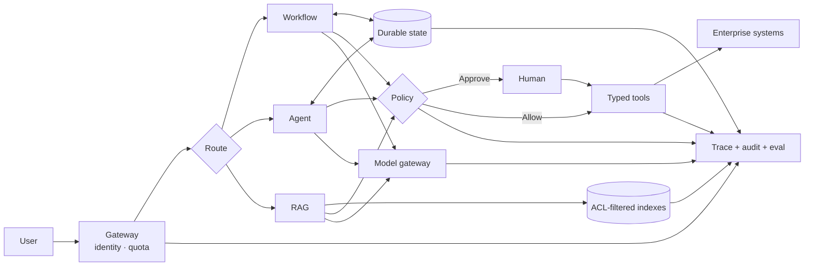

# Knowledge check — Parts A to F

← Previous: [Part F (3 of 3) — Production operations and trends](01k-part-f3-production-operations.md) · Index: [Full Read-Through](01-full-read-through.md) · Next: [Part G (1 of 2) — The Google FDE interview: structure, lens and knowledge](01m-part-g1-fde-interview-knowledge.md) →

## Knowledge check

> **Why this step is here.** This section is the self-test for Parts A to F. It has three parts: the one-board diagram, which is [Step 11 · Complete production LLM platform](01b-part-b-agent-loop-and-control-plane.md#11-study-the-diagram-complete-production-llm-platform-name-every-box-out-loud)'s platform compressed to what fits on a whiteboard in five minutes; a seven-step answer frame that orders any design answer; and ten drills, each exercising one lesson from the preceding seventy-five steps against a realistic customer system. Use it as a gate: draw the board from memory, then pick three drills you would not have chosen because they looked hard, and answer them out loud with a timer. If the board comes out with all its edges and the drills land inside the frame, you are ready for Part G; if not, the drill map tells you which Part to reread.

Draw the compact one-board version from memory. Then answer any three Anthropic design drills out loud using the reusable answer frame. If you can, you know the material.

*Source: production-llm-agent-rag-workflow-mermaid-atlas.md*

### Knowledge check · 23. Compact one-board version

> “Identity and policy remain deterministic. RAG supplies permission-safe evidence. Workflows encode known paths. Agents choose among bounded tools when the next step depends on new evidence. Durable state, idempotency, evaluation and observability make the system operable.”

*Source: anthropic-agent-systems-fde-notes-2025-present.md*

### Knowledge check · 6. Topic-by-topic system-design interview drills

Each drill maps directly to one lesson in §3. Do not memorize the proposed architecture. Practice driving the answer in sequence, making assumptions explicit, and revising the design when the interviewer changes a constraint.

#### The reusable answer frame

Use this seven-step frame before the topic-specific steps:

1. **Clarify the outcome** — users, job to be done, scale, latency, success metric, and unacceptable failure.
2. **Classify the task** — deterministic vs open-ended; read vs write; synchronous vs long-running.
3. **State assumptions** — choose reasonable numbers so the design can move forward.
4. **Draw the happy path** — request, decision, action, state update, response.
5. **Add production controls** — identity, policy, isolation, retries, budgets, observability, and human review.
6. **Define evaluation and rollout** — offline outcome checks, shadow traffic, narrow launch, and expansion criteria.
7. **Name the main tradeoff** — what the design optimizes, what it sacrifices, and what evidence would change it.

---

#### 6.1 Workflows before agents

**Interview question**

> A global retailer wants an AI system to process product-return requests. It must read the request, check order and policy data, decide eligibility, issue a label or refund, and escalate exceptions. Design the system and decide where agents are actually necessary.

**Steps to address it**

1. **Clarify authority and policy complexity.** Ask whether the system can move money, which returns are irreversible, how frequently policies change, regional differences, request volume, and latency targets.
2. **Decompose the process by uncertainty.** Identity verification, order lookup, eligibility rules, refund limits, and ledger writes are deterministic. Understanding messy customer intent and summarizing exceptions may require a model.
3. **Choose a state-machine backbone.** Model states such as `received → identity_verified → order_found → policy_checked → approved/rejected/escalated → executed → notified`.
4. **Place LLM steps narrowly.** Use the model to classify intent, extract evidence, ask clarifying questions, and prepare escalation summaries. Do not let it invent policy or directly mutate the payment ledger.
5. **Put policy in code.** A versioned rules engine determines eligibility and required approval. The orchestrator validates every transition.
6. **Make writes safe.** Use idempotency keys for labels and refunds, transaction records, bounded retries, and compensation or reconciliation jobs.
7. **Evaluate component and end-to-end behavior.** Measure extraction accuracy, policy-decision agreement, correct final ledger state, escalation precision/recall, latency, and cost.
8. **Roll out by risk.** Begin with recommendation-only mode, then automate policy-clear labels, and only later automate bounded refunds.

**Likely follow-ups**

- What change would justify a fully agentic loop? Open-ended investigation across inconsistent evidence where the next data source cannot be predetermined.
- Why not put the whole policy in the prompt? It is difficult to validate, version, and guarantee; use prompts to explain policy, not enforce it.
- What is the strongest design signal? Knowing where **not** to use an agent.

**Core tradeoff:** flexibility vs predictability and auditability.

---

#### 6.2 Context engineering

**Interview question**

> Design an enterprise assistant that answers questions across 40,000 documents, CRM records, support tickets, and a conversation that may continue for months. The customer says the model has a huge context window, so they want to load everything.

**Steps to address it**

1. **Clarify freshness and access.** Ask which systems are authoritative, document update rates, tenant and row-level permissions, retention rules, citation requirements, and the acceptable staleness window.
2. **Separate durable stores.** Keep raw documents in source systems, indexed chunks in retrieval storage, conversation events in a durable session store, and compact user-approved memory in a separate store.
3. **Create a just-in-time context pipeline.** Authenticate first, apply ACL and metadata filters, use hybrid retrieval, rerank candidates, deduplicate, then fit the highest-signal evidence into a token budget.
4. **Give different context different lifetimes.** Stable system rules are cached; current-task evidence is retrieved; tool results are trimmed after use; durable facts require explicit write criteria and provenance.
5. **Preserve recoverability.** Treat the prompt as a temporary projection. Store the full trace and source references outside the context window so compaction can be audited or reconstructed.
6. **Defend the boundary.** Mark retrieved text as untrusted data, separate instructions from evidence, and never let retrieved content expand tool authority.
7. **Evaluate retrieval and answer separately.** Measure recall@k, permission leakage, freshness, citation correctness, groundedness, answer quality, token use, and latency.
8. **Add degradation paths.** Ask a clarifying question on ambiguous identity or topic; say evidence is insufficient rather than answering from stale memory.

**Likely follow-ups**

- When do you use long context instead of RAG? For a bounded, permission-safe corpus that benefits from holistic reading and fits the cost/latency target.
- How do you correct bad memory? Keep provenance and versioning; tombstone or supersede facts and invalidate derived summaries.
- How do you prevent cross-tenant leakage? Enforce identity and ACL filters before retrieval, not after generation.

**Core tradeoff:** completeness vs attention quality, latency, cost, and privacy.

---

#### 6.3 Tools as agent-facing contracts

**Interview question**

> A support agent can access CRM, billing, orders, inventory, and messaging APIs. In testing it picks the wrong tools, makes redundant calls, and invents parameters. Redesign the tool layer.

**Steps to address it**

1. **Collect failing traces.** Categorize wrong selection, ambiguous names, invalid arguments, missing data, poor error recovery, excessive calls, and unsafe actions.
2. **Map tools to user-level tasks.** Replace overlapping primitives with coherent operations where useful—for example, `get_customer_context` or `prepare_refund_quote`—while keeping irreversible execution separate.
3. **Define explicit semantics.** Give every tool a distinct verb, namespace, purpose, “use when / do not use when” description, typed schema, constraints, and examples.
4. **Design useful responses.** Return stable IDs, provenance, timestamps, next-action hints, and typed error categories. Support pagination, field selection, and concise/detail modes.
5. **Keep validation deterministic.** Reject invalid enums, unknown fields, stale versions, unauthorized resources, and impossible state transitions before reaching downstream systems.
6. **Separate propose from commit.** A read or quote tool may be broadly usable; a write tool receives an idempotency key and policy authorization and may require approval.
7. **Build a realistic tool eval.** Use real multi-step tasks, multiple trials, held-out cases, and measurements for selection, arguments, call count, errors, tokens, latency, and final outcome.
8. **Version and canary changes.** A tool-description edit can alter behavior as much as a code change; test it against regression suites before rollout.

**Likely follow-ups**

- Why not expose every backend endpoint? Backend APIs reflect service ownership, not the mental model an agent needs to solve tasks.
- Should one tool do everything? No; consolidate natural context gathering, but keep distinct risk and transaction boundaries visible.
- What should an error return? Machine-readable category, human-readable recovery guidance, retryability, and a correlation ID—never a silent empty result.

**Core tradeoff:** broad composability vs clear selection and controlled blast radius.

---

#### 6.4 Progressive tool and knowledge discovery

**Interview question**

> Design an internal operations agent that can use 2,000 tools from dozens of teams and follow hundreds of company procedures without placing all definitions and manuals in every prompt.

**Steps to address it**

1. **Create a capability catalog.** Store short names, namespaces, descriptions, owners, versions, risk class, required scopes, and health status.
2. **Use hierarchical discovery.** Route to a domain, search within that domain, load a compact summary, then fetch the full schema or procedural skill only for selected capabilities.
3. **Separate capability, procedure, and permission.** Tools describe what can be done; skills explain how to do a business process; a policy engine independently determines whether the session may do it.
4. **Rank with more than semantic similarity.** Include tenant, user role, task intent, tool health, locality, version compatibility, cost, and risk.
5. **Control loaded context.** Limit the number of candidates and full definitions; evict unused schemas and retain only compact results after execution.
6. **Handle collisions and drift.** Namespace tools, define ownership, pin compatible versions per workflow, and provide migration or deprecation metadata.
7. **Secure discovery.** Do not reveal the names or descriptions of capabilities the user cannot know about. Recheck authorization at execution time.
8. **Evaluate the funnel.** Measure domain-routing recall, top-k tool recall, final selection, parameter correctness, unauthorized discovery, context tokens, and task success.

**Likely follow-ups**

- What if the search misses the right tool? Allow bounded query reformulation or escalation to a broader catalog, then log misses for catalog improvement.
- Can the agent install new tools itself? Discovery and installation are different privileges; installation should be reviewed, scanned, pinned, and isolated.
- How do skills stay current? Assign owners, versions, tests, dependencies, and review dates; run their scenarios when underlying tools change.

**Core tradeoff:** discovery breadth vs context load, latency, and attack surface.

---

#### 6.5 Code execution as the deterministic data plane

**Interview question**

> A finance agent must retrieve a 100,000-row spreadsheet, join it with ERP invoices, identify discrepancies, create a summary, and open remediation tickets. Design it without sending all raw data through the model.

**Steps to address it**

1. **Clarify data sensitivity and locality.** Ask whether records can leave the customer VPC, which fields contain PII, expected size, runtime, and reconciliation precision.
2. **Assign responsibilities.** The model plans the analysis and explains anomalies; sandboxed code performs reads, joins, filters, arithmetic, batching, and schema validation.
3. **Keep raw data on the data plane.** Let code call governed MCP/API clients and return aggregates, samples, and exception IDs—not the full dataset—to model context.
4. **Design an isolated runtime.** Use ephemeral containers, no embedded credentials, read-only inputs by default, bounded scratch storage, CPU/memory/time limits, restricted egress, and dependency allowlists.
5. **Broker credentials outside the sandbox.** A proxy applies tenant, row, field, destination, and operation policy and records an audit event for each call.
6. **Make ticket creation transactional.** Produce a reviewable discrepancy artifact first; after approval, create tickets with idempotency keys and checkpoint batch progress.
7. **Verify deterministically.** Recalculate totals independently, reconcile source counts, validate invariants, and retain code plus input snapshot identifiers for replay.
8. **Evaluate economics and failure.** Compare direct tool calling with code execution on accuracy, context tokens, runtime, infrastructure cost, and recovery behavior.

**Likely follow-ups**

- How can PII move between systems without entering model context? Tokenize or proxy fields so real values flow only through governed deterministic components.
- What if generated code loops forever? Enforce wall-clock, CPU, memory, process, output, and tool-call budgets outside the model.
- Why not use a fixed ETL job? Use one when the transformation is stable; retain agent planning only if schemas and investigation paths vary materially.

**Core tradeoff:** token efficiency and flexible composition vs sandbox cost and operational complexity.

---

#### 6.6 Multi-agent orchestration

**Interview question**

> Design an agent that investigates a global production incident across application logs, cloud metrics, recent deployments, support tickets, and several regional environments.

**Steps to address it**

1. **Clarify the incident objective.** Is the system diagnosing only, proposing remediation, or executing changes? Establish severity, time budget, data access, and command authority.
2. **Test whether parallelism is real.** Logs, deployment diffs, metrics, and regional symptoms can be investigated independently; correlated state changes and remediation should remain centrally coordinated.
3. **Use an orchestrator-worker topology.** A lead agent creates a bounded plan and delegates evidence-gathering tasks in parallel. Workers are specialized by source or hypothesis, not given identical vague prompts.
4. **Define the delegation contract.** Include objective, time window, environment, allowed tools, evidence format, citations/IDs, confidence, budget, and explicit exclusions.
5. **Centralize state and writes.** Workers return compact findings to the lead. Only the lead can propose a remediation, and a policy gate or incident commander authorizes production changes.
6. **Control coordination cost.** Cap fan-out, depth, tool calls, tokens, and wall time. Deduplicate assignments and stop workers when evidence is sufficient.
7. **Resolve disagreement with evidence.** Preserve source links and timestamps; use deterministic correlation where possible and request targeted follow-up rather than agent voting alone.
8. **Evaluate incident outcomes.** Measure time to useful hypothesis, evidence coverage, false leads, duplicate work, token cost, correct root cause, unsafe proposals, and recovery time.
9. **Degrade gracefully.** If orchestration fails, return partial findings and a human-ready trace rather than restarting an expensive investigation blindly.

**Likely follow-ups**

- When would a single agent be better? When all reasoning depends on one shared context or tasks are sequential and tightly coupled.
- How do you prevent 50 useless workers? Hard fan-out budgets plus an expected-value rule: each delegation must name a distinct information gain.
- Can workers write to production? Prefer read-only workers; route all state-changing proposals through one serialized authority boundary.

**Core tradeoff:** breadth and latency reduction vs token cost, coordination, and debuggability.

---

#### 6.7 Long-running and resumable agents

**Interview question**

> Design an agent that migrates a customer's legacy document system over several days, pauses for human review, survives crashes and credential expiry, and proves that nothing was lost or duplicated.

**Steps to address it**

1. **Define the durable unit of work.** Represent each document or bounded batch with a stable ID, source version, target state, attempt count, and terminal status.
2. **Create an explicit state machine.** Use states such as `discovered → validated → transformed → awaiting_approval → written → verified`, with failure and compensation paths.
3. **Separate orchestration from execution.** A durable workflow service schedules jobs; stateless agent workers handle ambiguous mapping; deterministic workers perform transfers and verification.
4. **Make every side effect idempotent.** Derive idempotency keys from source/version/operation; use upserts, compare-and-set transitions, and a reconciliation ledger.
5. **Persist structured handoff artifacts.** Store decisions, mapping rationale, unresolved exceptions, source evidence, and the next action. Do not rely on conversation summaries alone.
6. **Resume from verified state.** On restart, load the last committed event, revalidate external state, reacquire scoped credentials, and continue only incomplete units.
7. **Design human approval as an asynchronous event.** Include proposed change, evidence, impact, edit/reject options, expiry, and a safe timeout. Never hold a process open waiting.
8. **Prove completion independently.** Compare source and destination manifests, checksums, counts, permissions, and sampled semantic quality; require all completion invariants.
9. **Operate it.** Add progress dashboards, dead-letter queues, pause/cancel controls, per-tenant budgets, runbooks, and a customer-owned handover plan.

**Likely follow-ups**

- What if the source changes mid-migration? Capture versions or change-data events and run a final delta reconciliation before cutover.
- How do you avoid premature “done”? Completion comes from the manifest and verification checks, never the model's statement.
- What lives in model context after a reset? The current unit, relevant procedure, compact decision history, and pointers to recoverable evidence.

**Core tradeoff:** throughput vs consistency, recoverability, and review capacity.

---

#### 6.8 Brain, session, and hands

**Interview question**

> Build a managed agent platform whose control plane runs in your cloud, while tools and code execution may run in customer VPCs across regions. Sessions last hours and must survive any individual process failure.

**Steps to address it**

1. **Clarify tenancy and topology.** Ask about data residency, supported clouds, concurrent sessions, tool locality, maximum task duration, availability, and recovery objectives.
2. **Define stable interfaces.** Model three resources: a durable session/event API, a stateless harness API, and an execution/tool API such as `execute(target, request)`.
3. **Keep the harness stateless.** Workers claim pending session events, acquire a lease, call the model, emit new events, and can be replaced after failure.
4. **Make the session authoritative.** Store append-only events with sequence numbers, idempotency keys, tenant encryption, retention, snapshots, and audit access. Model context is derived from this log.
5. **Place hands near the data.** Run sandbox/tool gateways in the customer VPC; establish authenticated outbound or mutually authenticated channels without exposing inbound customer networks unnecessarily.
6. **Remove reusable secrets from both brain and sandbox.** A credential broker exchanges session-scoped capability tokens for real credentials and enforces destination and operation policy.
7. **Provision execution lazily.** Start sandboxes only when required; pool safe base images where appropriate and destroy task state according to retention policy.
8. **Handle distributed failure.** Use leases, heartbeats, deduplicated events, bounded retries, circuit breakers, and deterministic replay. Assume messages can be delivered twice.
9. **Observe by boundary.** Trace model, harness, session, proxy, sandbox, and external tool separately with correlated IDs and tenant-safe logs.
10. **Version for change.** Pin model, harness, context policy, tool contracts, and sandbox image independently so any combination can be canaried or rolled back.

**Likely follow-ups**

- What if the event log is unavailable? Stop new side effects, buffer only safe local telemetry if permitted, and resume from the last committed sequence.
- How do you avoid two harnesses acting at once? Lease or compare-and-set the next sequence; still make downstream actions idempotent.
- Why separate session from context? Context management is lossy and model-specific; the durable session must remain complete and recoverable.

**Core tradeoff:** clean failure isolation and deployment flexibility vs distributed-system complexity.

---

#### 6.9 Structural security and useful human control

**Interview question**

> Design a procurement agent that reads email and supplier documents, searches internal catalogs, negotiates draft terms, and can place orders up to a limit. Defend it against prompt injection, credential theft, and overeager actions without requiring approval for every step.

**Steps to address it**

1. **Write the threat model first.** Cover malicious external content, compromised suppliers, accidental ambiguity, model mistakes, scope escalation, data exfiltration, unsafe subprocesses, and insider misuse.
2. **Classify actions by impact.** Reads and drafts may be low risk; sending external messages, changing supplier records, and placing orders require progressively stronger controls.
3. **Create bounded autonomy zones.** Allow read-only and reversible actions inside explicit tenant, directory, domain, supplier, and monetary limits. Default-deny anything outside them.
4. **Treat all retrieved content as untrusted.** Screen and label email, PDFs, web pages, and tool results. Never derive identity, permissions, or policy from retrieved instructions.
5. **Gate proposed actions independently.** Evaluate the executable payload and its real effect against the user's explicit authority, current policy, resource ownership, and blast radius.
6. **Isolate execution.** Combine filesystem and network restrictions, block arbitrary credential access, constrain subprocesses, and proxy approved destinations.
7. **Broker scoped credentials.** Keep OAuth and signing material in a vault; issue short-lived, action-specific capability tokens and verify them at the tool boundary.
8. **Spend human attention on high stakes.** Present the order, price, supplier, evidence, policy result, and alternatives. Support approve, edit, reject, and timeout-to-deny.
9. **Use defense in depth.** A learned injection detector or action classifier supplements deterministic policy and sandboxing; it never replaces them.
10. **Test adversarially.** Measure blocked attacks, dangerous false negatives, benign false positives, cross-tenant leakage, unauthorized action attempts, and reviewer override patterns.

**Likely follow-ups**

- The user said “handle procurement”—does that authorize a $50,000 order? No. Goal relevance is not explicit authority for a particular blast radius.
- Why not rely on a policy prompt? The same model reading hostile content cannot be the sole enforcement boundary.
- How do you reduce approval fatigue? Auto-allow structurally safe actions, aggregate related approvals, remember only narrow explicit grants, and audit the remaining prompts.

**Core tradeoff:** autonomy and operator throughput vs residual risk and control friction.

---

#### 6.10 Outcome-based agent evaluation

**Interview question**

> A deployed travel-support agent books and changes flights using several tools. Product says it “usually works,” while customers report inconsistent outcomes. Design the evaluation and release system.

**Steps to address it**

1. **Define success with domain experts.** For each scenario specify database end state, policy compliance, required confirmations, acceptable dialogue quality, time/turn limits, and forbidden actions.
2. **Build representative task strata.** Include common happy paths, policy edges, ambiguous users, tool failures, adversarial injection, different customer tiers, languages, and high-impact rare events.
3. **Use a controlled environment.** Seed deterministic reservations, inventory, clocks, APIs, and failure injection. Pin model, prompt, harness, tools, data, sandbox image, and resource budgets.
4. **Run repeated trials.** Report success distributions and pass^k-style consistency where every attempt matters; do not publish only a best run.
5. **Grade the outcome first.** Check actual reservations, charges, cancellations, identity verification, and notifications. The agent's final text cannot prove success.
6. **Grade the trajectory second.** Inspect tool choice and arguments, confirmation timing, policy violations, recovery, turns, tokens, latency, and cost.
7. **Combine graders deliberately.** Use code/state checks for invariants, calibrated model rubrics for communication, and sampled SME review as the reference standard.
8. **Separate suites.** Capability evals contain hard unsolved tasks; regression suites protect known behavior and should approach 100% reliability.
9. **Diagnose by component.** Attribute failure to routing, retrieval, reasoning, tool contract, external service, policy gate, or infrastructure instead of one aggregate score.
10. **Create a release gate.** Compare candidate vs baseline with confidence intervals, safety floors, segment checks, and cost/latency constraints; then shadow, canary, monitor, and roll back automatically.
11. **Feed production back safely.** Convert privacy-scrubbed incidents and low-confidence samples into reviewed regression cases without training on unverified outcomes.

**Likely follow-ups**

- How many eval cases are enough? Begin with the smallest set covering major risk and volume strata; use failure discovery and production sampling to grow it. Coverage matters more than a vanity count.
- Can an LLM judge another LLM? Yes for nuanced dimensions if the rubric is specific and regularly calibrated against expert humans; not as the only grader for verifiable state.
- Why might two teams get different benchmark scores? Harness, CPU, memory, timeouts, dependencies, and sandbox reliability can change both failures and strategies.

**Core tradeoff:** evaluation coverage and confidence vs execution cost, maintenance, and release speed.

---

#### Drill map

| Anthropic topic | Interview system | Primary skill being tested |
|---|---|---|
| Workflow vs agent | Retail returns | Architecture judgment |
| Context engineering | Enterprise knowledge assistant | Retrieval, memory, and privacy |
| Agent-facing tools | Support operations | Interface and failure design |
| Progressive discovery | Company-wide operations agent | Scale and governance |
| Code execution | Finance reconciliation | Data plane and sandboxing |
| Multi-agent systems | Incident investigation | Parallelism and coordination |
| Long-running harnesses | Legacy migration | Durability and correctness |
| Brain/session/hands | Managed agent platform | Distributed systems and tenancy |
| Structural security | Procurement agent | Threat modeling and human control |
| Agent evals | Travel support | Measurement and safe rollout |

*Source: anthropic-agent-systems-fde-notes-2025-present.md*

### Knowledge check · The reusable answer frame

Use this seven-step frame before the topic-specific steps:

1. **Clarify the outcome** — users, job to be done, scale, latency, success metric, and unacceptable failure.
2. **Classify the task** — deterministic vs open-ended; read vs write; synchronous vs long-running.
3. **State assumptions** — choose reasonable numbers so the design can move forward.
4. **Draw the happy path** — request, decision, action, state update, response.
5. **Add production controls** — identity, policy, isolation, retries, budgets, observability, and human review.
6. **Define evaluation and rollout** — offline outcome checks, shadow traffic, narrow launch, and expansion criteria.
7. **Name the main tradeoff** — what the design optimizes, what it sacrifices, and what evidence would change it.

#### Going deeper (Knowledge check)

**Walk the one-board diagram.** Read it as four bands. *Entry:* user → gateway with identity and quota. Identity is established once, deterministically, before anything else — the theme of Steps [34](01f-part-d2-rag-pipelines.md#34-study-the-diagram-permission-aware-rag-query-path) and [59](01i-part-f1-security.md#59-study-the-diagram-multi-tenant-data-isolation). *Route:* the diamond Steps [3](01a-part-a-what-an-agent-is.md#3-read-choose-workflows-before-agents) and [4](01a-part-a-what-an-agent-is.md#4-study-the-diagram-workflow-single-agent-or-multi-agent-decision-redraw-it-from-memory) spent two steps on, with three exits — workflow for known paths, agent for evidence-dependent paths, RAG for questions — where RAG reads only ACL-filtered indexes ([Step 34 · Permission-aware RAG query path](01f-part-d2-rag-pipelines.md#34-study-the-diagram-permission-aware-rag-query-path)) and workflow and agent share durable state (Steps [10](01b-part-b-agent-loop-and-control-plane.md#10-read-separate-brain-session-and-hands), [49](01h-part-e2-long-running-agents.md#49-study-the-diagram-durable-llm-workflow)). *Act:* all three feed a policy diamond, which is [Step 7 · What belongs in the orchestrator vs the LLM](01b-part-b-agent-loop-and-control-plane.md#7-read-what-belongs-in-the-orchestrator-vs-the-llm)'s "orchestrator decides" and [Step 50 · Human approval for consequential actions](01h-part-e2-long-running-agents.md#50-study-the-diagram-human-approval-for-consequential-actions)'s approval gate; policy either allows a typed tool directly or routes through a human first, and only typed tools (Steps [15](01c-part-c1-tool-design.md#15-read-tool-schemas-that-reduce-hallucinated-actions), [24](01d-part-c2-tool-failures-sandboxing-cost.md#24-code-tool-registry-with-schema-validation)) touch enterprise systems. *Support:* a model gateway ([Step 71 · Model gateway and cost-aware routing](01k-part-f3-production-operations.md#71-study-the-diagram-model-gateway-and-cost-aware-routing)) called by all three paths, and a single trace/audit/eval sink (Steps [65](01j-part-f2-evaluation-and-observability.md#65-study-the-diagram-offline-and-online-evaluation-loop), [66](01j-part-f2-evaluation-and-observability.md#66-study-the-diagram-end-to-end-observability)) that every band feeds. The quoted paragraph beneath is the narration you give while drawing; each clause names one band's job. This is the compression of Parts A to F because every box is a Part: A is the route diamond, B is durable state and policy, C is typed tools, D is the ACL-filtered index, E is the workflow/agent split over shared state, F is the gateway and the observability sink.

**The seven-step frame, and what strong sounds like.**

1. *Clarify the outcome.* Strong: "Who is the user, what decision does this make for them, what volume, and what is the one failure that gets us fired?" — four questions in one breath before any drawing.
2. *Classify the task.* Strong: "Mostly deterministic with two open-ended steps; reads are safe, the refund is a write; the happy path is synchronous but exceptions are long-running."
3. *State assumptions.* Strong: "I will assume 10k requests a day, p95 of 8 seconds, 5% exceptions — correct me if those are off," and then actually using those numbers later.
4. *Draw the happy path.* Strong: five boxes from request to response with the state update named — not the full platform yet.
5. *Add production controls.* Strong: a second pass that attaches identity, policy, isolation, retries, budgets, observability and review each to a specific edge of the happy path.
6. *Define evaluation and rollout.* Strong: "Offline on 200 labeled cases, then shadow for two weeks, then recommend-only in one region, expanding when agreement exceeds a threshold we set with the customer."
7. *Name the main tradeoff.* Strong: one sentence with three parts — what this optimizes, what it gives up, what evidence would make you change it.

**How to run a drill alone.** Set a timer for 15 minutes. Read the interview question aloud once. Speak the whole answer out loud, not in your head — silent thinking hides the gaps in your sentences. Move through the seven frame steps in order, then the drill's own numbered steps, writing only box names and numbers on paper. At minute 10, change one constraint yourself — data may not leave the customer's VPC, the latency budget halves, approvals must drop by 80% — and revise the design in the remaining five minutes. The revision is where the learning is, because it tests whether your design has joints or is a memorized picture. Afterward, compare against the "likely follow-ups" and grade yourself on whether you named the core tradeoff unprompted.

**Common misreading.** Treating the ten drills as ten architectures to memorize. The section says not to, and an interviewer will change a constraint precisely to detect memorization. What transfers is the frame and the habit of saying where the model does *not* get authority. A second misreading is skipping the board because "I know [Step 11 · Complete production LLM platform](01b-part-b-agent-loop-and-control-plane.md#11-study-the-diagram-complete-production-llm-platform-name-every-box-out-loud)" — the board is a different skill: choosing what to leave out under time pressure.

**Connects to.** [Step 11 · Complete production LLM platform](01b-part-b-agent-loop-and-control-plane.md#11-study-the-diagram-complete-production-llm-platform-name-every-box-out-loud) is the full platform this board compresses; [Step 79 · Architecture from memory](01m-part-g1-fde-interview-knowledge.md#79-draw-architecture-from-memory-you-already-know-every-box-from-parts-b-to-f) asks you to draw it again in the FDE context; Steps [84](01n-part-g2-fde-mocks-and-final-prep.md#84-practice-scenario-71-marketing-agent-15-min-discovery-and-mvp-out-loud) to [87](01n-part-g2-fde-mocks-and-final-prep.md#87-full-60-min-rrk-mock-on-72-fraud-score-with-the-rrk-scorecard-target-30-or-more) are the timed scenarios that use the same frame; [Step 78 · Time budget and Discovery questions that earn signal](01m-part-g1-fde-interview-knowledge.md#78-read-time-budget-and-discovery-questions-that-earn-signal)'s discovery questions are frame step 1 expanded.

**Check yourself.**
1. Which box on the board carries authority over side effects, and why is it a diamond? *Policy — a deterministic decision point, not a model call, and the only path to typed tools.*
2. The interviewer says "the customer's approvers can only review 50 items a day." Which frame step and which drills does that pull on? *Steps [5](01a-part-a-what-an-agent-is.md#5-read-essential-components-of-an-agent-beyond-an-llm) and [7](01b-part-b-agent-loop-and-control-plane.md#7-read-what-belongs-in-the-orchestrator-vs-the-llm) of the frame; Drills 6.1 and 6.9 on tiering actions so only irreversible ones need review.*
3. Why answer out loud with a timer rather than writing notes? *The interview is spoken and time-boxed; the gaps you need to find are in your sentences and pacing, not your understanding.*

---

← Previous: [Part F (3 of 3) — Production operations and trends](01k-part-f3-production-operations.md) · Index: [Full Read-Through](01-full-read-through.md) · Next: [Part G (1 of 2) — The Google FDE interview: structure, lens and knowledge](01m-part-g1-fde-interview-knowledge.md) →
